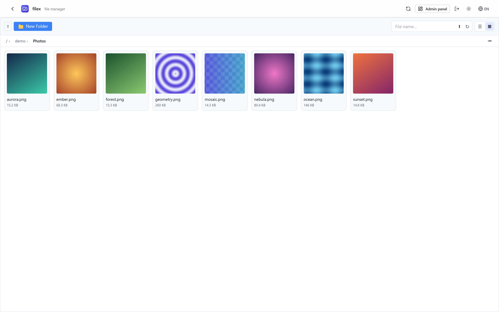
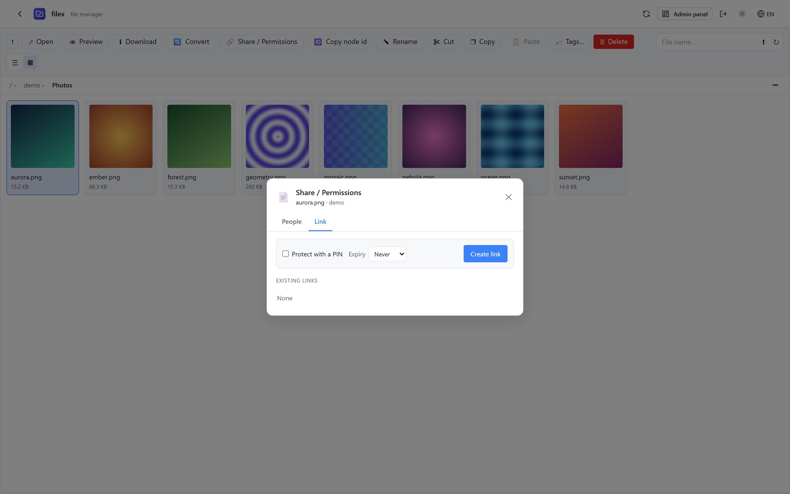
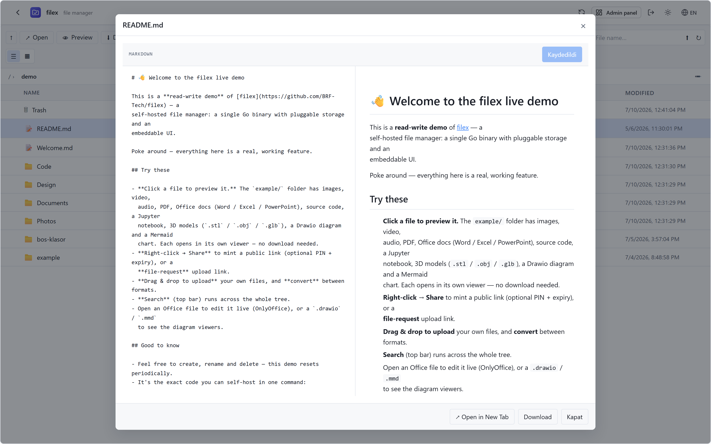
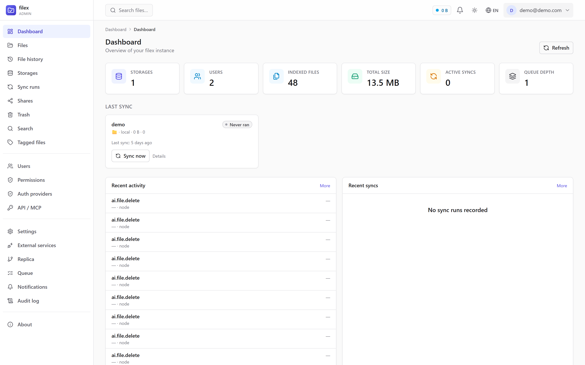
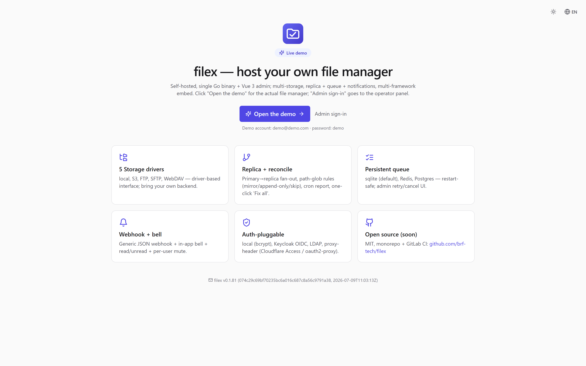

<div align="center">

# filex — self-hosted file manager that embeds anywhere

[](https://github.com/BRF-Tech/filex/releases)
[](https://github.com/BRF-Tech/filex/actions)
[](LICENSE)
[](https://github.com/BRF-Tech/filex/pkgs/container/filex)
[](https://demo.filex.sh)

A single Go binary with a full-featured web UI, pluggable storage/auth/DB drivers,
**real-time collaboration**, **an embeddable web component**, and a **built-in MCP server**
so AI agents can drive it natively.

<picture>
  <source media="(prefers-color-scheme: dark)" srcset="docs/screenshots/explorer-grid-dark.png">
  
</picture>

</div>

## Try it now

**Live demo:** [demo.filex.sh](https://demo.filex.sh) — sign in with `demo@demo.com` / `demo`
(admin role, sandbox resets nightly). Or run your own in one line:

```bash
docker run -p 5212:5212 -v $(pwd)/data:/data ghcr.io/brf-tech/filex:latest
```

Open http://localhost:5212/admin — the first run prints admin credentials and embed
instructions to the console.

## Why filex

Most self-hosted file managers are either **too small** (a directory listing with uploads)
or **too big** (a groupware suite you deploy for the file tab). filex aims at the gap:

- **Embeds anywhere** — the same UI ships as a Vue 3 component, a React component and a
  framework-agnostic `<filex-explorer>` web component. Put a real file manager inside
  *your* product, backed by your own filex server and locked to a per-tenant folder.
- **AI-agent-native** — a token-scoped REST surface (`/api/ai`) plus a native
  **MCP server** (`/api/ai/mcp`). Hand an agent a token confined to one folder and it can
  list, read, write, share and zip — nothing else.
- **Real-time** — presence avatars and live file updates over WebSocket, in the native UI
  *and* in embedded contexts (short-lived ticket auth, API-polling fallback).
- **Multi-tenant by design** — storage-per-tenant with native tenancy mode, RBAC roles +
  per-item grants, confined API tokens, per-token identities for audit trails.
- **Boringly deployable** — one binary or one container; SQLite by default, Postgres/MySQL
  when you want them; every driver switched by env vars.

```
┌─────────────────────────────────────────────────────────────┐
│  filex (Go binary, ~40 MB slim / 250 MB w/ thumbnails)      │
├─────────────────────────────────────────────────────────────┤
│  HTTP API (chi)  │  Admin UI (Vue 3, embedded)              │
│  Auth Drivers:   │  local · oidc · ldap · proxy-header      │
│  Storage Drivers:│  local · s3 · ftp · sftp · webdav        │
│  DB Drivers:     │  sqlite (default) · mysql · postgres     │
│  Queue Drivers:  │  sqlite (default) · redis · postgres     │
│  Realtime:       │  WebSocket presence + live updates       │
│  RBAC:           │  roles + per-item grants + share invites │
│  AI / MCP:       │  /api/ai REST + native MCP server        │
│  Sync Worker:    │  ETag diff + tombstone guard             │
│  Replica Layer:  │  primary→replica + rules + reconcile     │
│  Notifications:  │  webhook + in-app bell + read/unread     │
│  Search:         │  Bleve (full-text, embedded)             │
│  Thumbnails:     │  image · video · pdf · office            │
│  Plug & Play:    │  OnlyOffice · Drawio · Mermaid           │
└─────────────────────────────────────────────────────────────┘
                          ▲
                          │ HTTP API
       ┌──────────────────┼──────────────────┐
       │                  │                  │
   @brftech/         @brftech/          @brftech/
   filex-core        filex             filex-react
   (Vue 3 SFC)       (Web Component)   (React adapter)
       │                  │                  │
       ▼                  ▼                  ▼
   Vue 3 apps       Any framework      React apps
                    (vanilla, Angular,
                    Svelte, Solid, …)
```

## Screenshots

| Sharing (PIN + expiry links) | Markdown editor + preview |
|---|---|
|  |  |

| Admin panel | Demo landing |
|---|---|
|  |  |

## Quick start — binary

```bash
# Download from https://github.com/BRF-Tech/filex/releases
./filex serve
```

```
═══════════════════════════════════════════════════════════════
  filex · self-hosted file manager
═══════════════════════════════════════════════════════════════
  Listening on:   http://0.0.0.0:5212
  Admin UI:       http://0.0.0.0:5212/admin
  Embed JS:       http://0.0.0.0:5212/embed.js

  First run detected. Initial admin user created:
    Email:    admin@local
    Password: kT9_x4Pq2Nm-BvLs
  Saved to:  ~/.filex/.first-run.txt (mode 0600, shown ONCE)
  Change at: /admin/profile
═══════════════════════════════════════════════════════════════
```

## Self-host with Compose or Helm

The bare `docker run` above is enough to try filex out. For a real deployment,
ready-made stacks live in [`deploy/`](deploy/):

- **[`deploy/compose/`](deploy/compose/)** — Docker Compose:
  - **minimal** — filex + SQLite + local disk (one service, zero dependencies).
  - **full** — filex + PostgreSQL + Redis + Caddy (auto-HTTPS), plus toggleable
    add-ons: **OnlyOffice**, **Drawio**, universal **converter**, **MinIO** (S3).
    Turn each on/off with a Compose profile in `.env`.
- **[`deploy/helm/filex/`](deploy/helm/filex/)** — a Helm chart for Kubernetes
  (Deployment + PVC + optional Ingress). Every add-on above is an `enabled`
  toggle in `values.yaml` — bundle PostgreSQL / Redis / MinIO, or wire external
  OnlyOffice / Drawio / converter.

Step-by-step instructions for each tier are in
[docs/INSTALLATION.md](docs/INSTALLATION.md).

## Embed in your app

### Vue 3
```bash
pnpm add @brftech/filex-core
```
```vue
<script setup>
import { FileExplorer } from '@brftech/filex-core';
import '@brftech/filex-core/style.css';
</script>
<template>
  <FileExplorer :config="{ apiBase: 'http://localhost:5212', auth: { kind: 'bearer', token: '…' } }" />
</template>
```

### React
```bash
pnpm add @brftech/filex-react
```
```jsx
import { FileManager } from '@brftech/filex-react';
<FileManager config={{ apiBase: 'http://localhost:5212' }} onError={(e) => console.error(e)} />
```

### Vanilla JS / any framework
```html
<script type="module" src="https://cdn.jsdelivr.net/npm/@brftech/filex/dist/filex.js"></script>
<filex-explorer api-base="http://localhost:5212"></filex-explorer>
```

Multi-tenant hosts typically proxy the API server-side, inject a **confined token**
(`root: tenant-folder`) per request, and strip client headers — the sandbox is enforced by
the backend, not the widget. See [docs/INTEGRATION.md](docs/INTEGRATION.md).

## AI agents / MCP

filex ships a token-authenticated automation surface at `/api/ai` (list, read, write,
move, delete, search, share, zip) and speaks **Model Context Protocol** at `/api/ai/mcp`:

```bash
claude mcp add filex --transport http https://files.example.com/api/ai/mcp \
  --header "Authorization: Bearer <api-token>"
```

Tokens are scoped by verb (`read,write,delete,share`), optionally **confined to a single
folder**, gated by the same RBAC grants as the UI, and stamped with per-token identities
so audit logs, shares and presence show *who* (which integration) did what.
Details: [docs/MCP.md](docs/MCP.md).

## Features

- **Multi-storage** — mount many storages at once (local, S3, FTP, SFTP, WebDAV); each appears as a top-level folder.
- **Real-time collaboration** — presence bar with live avatars + focus, instant file-change updates over WebSocket, polling fallback.
- **RBAC + item permissions** — roles, per-file/folder grants with inheritance, share invites by e-mail (SMTP), grant-aware search and listings.
- **Sharing** — public links with PIN, expiry and max-downloads; folder links stream as ZIP (cached + pre-warmed); **file-request** upload links for inbound drops; ShareX-compatible upload endpoint.
- **Native multi-tenancy** — provider/tenant mode with per-tenant isolation on one instance ([docs/MULTI-TENANCY.md](docs/MULTI-TENANCY.md)).
- **Driver-pluggable everything** — storage / auth / DB / queue drivers opt-in via env (`FILEX_AUTH_DRIVERS=local,oidc`, `FILEX_QUEUE_DRIVER=postgres`, …).
- **OIDC SSO-first** — optional auto-redirect to your IdP with break-glass local login (`?local=1`).
- **Replica + reconciliation** — primary→replica fan-out (mirror / append-only / skip per path-glob rule), read fallback, scheduled status report, one-click "Fix all".
- **Persistent op queue** — restart-safe queue (SQLite / Redis / Postgres), worker pool with retries + cancel + admin dashboard.
- **DB-backed file tree** — listings come from the DB cache (1-5 ms), not the storage backend (~100 ms); periodic ETag-diff sync catches out-of-band changes.
- **Viewers & editors** — image/video/audio, PDF, Markdown (split editor + preview), CSV, code (Monaco), Office via OnlyOffice, Drawio + Mermaid diagrams, 3D models.
- **Universal converter** — optional side-car converts between document/image formats from the UI.
- **Notifications** — generic JSON webhook (Slack/Discord-agnostic) + in-app bell with read/unread + per-user mute matrix.
- **Search** — Bleve embedded, full-text + metadata, permission-aware.
- **Thumbnails** — image, video (ffmpeg), PDF (ghostscript), Office (libreoffice); capability-aware.
- **Deep links** — the address bar tracks the open folder; paste a link, land in that folder.
- **Audit log** — every mutation recorded with actor, integration identity and metadata.
- **Single binary** — goreleaser matrix: linux/macOS/Windows × amd64/arm64. CGO=0, modernc.org/sqlite.
- **i18n** — English + Turkish out of the box.

## Architecture

See [docs/ARCHITECTURE.md](docs/ARCHITECTURE.md).

## Documentation

- [Installation](docs/INSTALLATION.md)
- [Configuration](docs/CONFIGURATION.md)
- [Integration / embedding](docs/INTEGRATION.md)
- [AI & MCP](docs/MCP.md)
- [RBAC & permissions](docs/RBAC.md)
- [Multi-tenancy](docs/MULTI-TENANCY.md)
- [Replication](docs/REPLICATION.md)
- [Backend API spec](docs/BACKEND.md)
- [Component API](docs/API.md)
- [Docker](docs/DOCKER.md)
- [Full documentation index](docs/README.md)

## Development

```bash
git clone https://github.com/BRF-Tech/filex.git
cd filex
pnpm install
pnpm run build:all    # builds packages, web, then Go binary
./bin/filex serve
```

Subdirectories:
- `backend/` — Go HTTP service (cmd/filex, internal/*, db/queries, db/migrations)
- `packages/core` — `@brftech/filex-core` (Vue 3 SFC, source of truth)
- `packages/webcomponent` — `@brftech/filex` (Web Component wrapper)
- `packages/react` — `@brftech/filex-react` (React adapter via @lit/react)
- `web/` — Vue 3 admin UI (embedded into Go binary via `go:embed`)
- `demo/` — Standalone HTML demos for each framework
- `docker/` — Dockerfiles + compose
- `deploy/` — ready-made Compose stacks + Helm chart (see [`deploy/`](deploy/))
- `docs/` — Markdown documentation

Contributions welcome — see [docs/CONTRIBUTING.md](docs/CONTRIBUTING.md).

## License

MIT — see [LICENSE](LICENSE).
