<div align="center">


# filex

**Self-hosted file manager & sharing with a web UI, in one Go binary - open-source alternative to Nextcloud, Dropbox and Google Drive.**<br>
Web-based file browser for local, S3, SFTP, WebDAV, FTP and SMB storage: private cloud served as S3, SFTP, NFS, WebDAV.<br>
SSO/LDAP, multi-tenant, encrypted folders, embeddable web component, desktop app, MCP server.

[](https://demo.filex.sh)
[](#quick-start)
[](https://docs.filex.sh)

[](https://github.com/BRF-Tech/filex/releases)
[](LICENSE)

**English** · [Türkçe](README.tr.md) · [Deutsch](README.de.md) · [Español](README.es.md) · [Français](README.fr.md) · [简体中文](README.zh-CN.md)

<picture>
  <source media="(prefers-color-scheme: dark)" srcset="docs/screenshots/v0.52.0/explorer-grid-dark.png">
  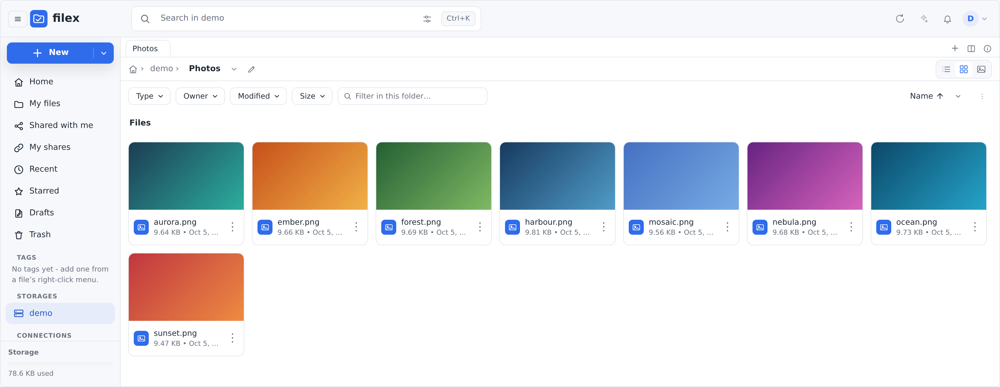
</picture>

</div>

<table>
<tr>
<td width="50%" valign="top">

**🗂️ Every storage, one tree**

Mount what you already have side by side, and copy or cut in one storage and paste in another. Point `rclone`, `restic`, WinSCP or FileZilla at the same tree.

[Storage and protocols →](#storage-and-protocols)

</td>
<td width="50%" valign="top">

**🔗 Share and protect**

Links with a PIN, an expiry and a download limit. Trash, version history and end-to-end encrypted folders.

[Sharing and protection →](#sharing-and-protection)

</td>
</tr>
<tr>
<td width="50%" valign="top">

**🔑 Your accounts, your roles**

OIDC, LDAP / Active Directory or the Windows and Linux accounts of the server. Roles, groups, multi-tenant.

[People and access →](#people-and-access)

</td>
<td width="50%" valign="top">

**💻 A desktop app with live folder sync**

Windows, Linux and macOS (Apple Silicon): an edit on either side arrives in about a second.

[Desktop app & CLI →](#desktop-app--cli)

</td>
</tr>
<tr>
<td width="50%" valign="top">

**🧩 Embeds in your product**

The same UI as a Vue 3 component, a React component and a `<filex-explorer>` web component.

[Embed in your app →](#embed-in-your-app)

</td>
<td width="50%" valign="top">

**🤖 Apps and AI agents**

Sandboxed apps - e-Signature, Convert, draw.io - and a built-in MCP server an agent can drive.

[Apps →](#apps) · [AI agents / MCP →](#ai-agents--mcp)

</td>
</tr>
</table>

<p align="center"><a href="#why-filex">Why filex</a> · <a href="#coming-from-nextcloud-dropbox-or-google-drive">Coming from another tool</a> · <a href="#self-host-with-compose-or-helm">Self-host</a> · <a href="#features">Features</a></p>

<br>

# Quick start

> [!TIP]
> **Look before you install:** [demo.filex.sh](https://demo.filex.sh) - sign in with
> `demo@demo.com` / `demo` (admin role, sandbox resets nightly).

Run your own, from the folder you want to serve:

```bash
docker run -p 5212:5212 \
  -e FILEX_DEFAULT_STORAGE_DRIVER=local -e FILEX_DEFAULT_STORAGE_PATH=/srv/files \
  -v filex-data:/data -v "$PWD:/srv/files" \
  ghcr.io/brf-tech/filex:latest
```

Open http://localhost:5212/admin - the first run prints admin credentials and embed
instructions to the console. That URL is the operator's; the people you give accounts to
get **http://localhost:5212/drive**, the same file manager without the panel around it.

<details>
<summary><b>What that command mounts, and which user it runs as</b></summary>

That serves **the folder you ran it in** - open the UI and your files are already
there. `/data` is filex's own directory (SQLite database, search index, thumbnail cache),
which is why it is a named volume and not the folder you drop files into; the two are
separate on purpose. Point `$PWD` somewhere else, or add more storages from the admin
panel later - a bucket with several top-level folders can be mounted as one storage
per folder in one go (*Storages → Add storage → Mount several folders at once*).

The container runs as **root** by default, so what it writes into `/data` is root-owned;
set `PUID`/`PGID` to run it as yourself
([docs/DOCKER.md](docs/DOCKER.md#which-user-the-container-runs-as)).

</details>

<details>
<summary><b>No Docker? Run the binary</b></summary>

Download the archive for your platform from the
[latest release](https://github.com/BRF-Tech/filex/releases/latest), extract it and run the
binary ([docs/INSTALLATION.md](docs/INSTALLATION.md#binary)):

```bash
# Download from https://github.com/BRF-Tech/filex/releases
./filex serve
```

```
═══════════════════════════════════════════════════════════════
  filex · self-hosted file manager
═══════════════════════════════════════════════════════════════
  Listening on:   http://0.0.0.0:5212
  Admin UI:       http://0.0.0.0:5212/admin
  Files UI:       http://0.0.0.0:5212/drive
  Embed JS:       http://0.0.0.0:5212/embed.js

  First run detected. Initial admin user created:
    Email:    admin@local
    Password: <printed once>
  Saved to:  ~/.filex/.first-run.txt (mode 0600, shown ONCE)
  Change at: /admin/dashboard?settings=1
═══════════════════════════════════════════════════════════════
```

</details>

For a real deployment there are Compose stacks and a Helm chart:
[Self-host with Compose or Helm](#self-host-with-compose-or-helm). The image is on
[GitHub Packages](https://github.com/BRF-Tech/filex/pkgs/container/filex).

<br>

# Why filex

Most self-hosted file managers are either **too small** (a directory listing with uploads)
or **too big** (a groupware suite you deploy for the file tab). filex aims at the gap. The
tour below has eight parts: each opens with the short version, and the long one is folded
under it.

<br>

## The explorer

**A file manager people already know how to use.**

- A navigation panel with **Home · My files · Shared with me · My shares · Recent · Starred ·
  Drafts · Trash**; list, grid and gallery views; tabs, tags and a ⌘K palette.
- Presence avatars and file changes arrive live, over WebSocket.
- Compose a theme in your own colours and make it the default: the sign-in page and every
  public link use it too.
- English and Turkish are built in, other languages install as packs, and the interface turns
  right to left for the languages that read that way.

<p align="center">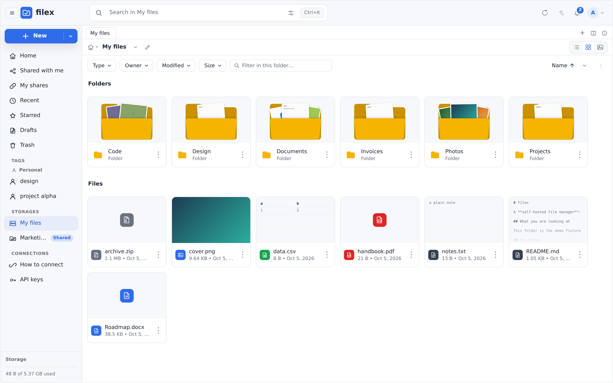</p>

<details>
<summary><b>More about the explorer</b> - the shell, navigation, real-time, languages, your brand, and screenshots</summary>

- **A browser client for your users, not just for you** - hand someone a `user` or
  `viewer` account and `…/drive` and they get the file manager itself: their storages,
  uploads, sharing, search, the editor. No admin panel to walk through, no separate
  frontend to deploy. `…/admin` is the operator's door to the same app.
- **Navigation people already know** - a left panel with a prominent **+ New** menu and
  **Home · My files · Shared with me · My shares · Recent · Starred · Drafts · Trash**, plus the
  storages you can reach; a storage someone shared with you simply appears there, one click, no mount
  instructions. Anyone can collapse it to an icon rail from the top bar. **Home** is a
  view *in* the app, not a page beside it - your drives, what you opened last and what
  you starred, under the same sidebar and the same header as the files. This is the
  shell everybody gets: a single search field across the header with its ⌘K palette
  hint, a Type / Owner / Modified / Size filter row, Folders and Files as labelled
  sections, Details and Activity in the info panel, and a storage line. For people who
  want a file drive rather than a file manager, `uiProfile: 'simple'` presets the rest
  of the chrome off - one pane, one folder, list or grid. One explorer in every case:
  there is no second UI to keep in step.
- **Real-time** - presence avatars (a profile picture set once on the account, shown for
  every client signed in as you) and live file updates over WebSocket, in the native UI
  *and* in embedded contexts (short-lived ticket auth, API-polling fallback). A batch job
  is coalesced on the way out, so extracting a five-thousand-file archive costs an open
  explorer a bounded trickle of frames rather than five thousand
  ([docs/REALTIME.md](docs/REALTIME.md)).
- **In your language, and in your direction** - English and Turkish ship in the
  binary, and anything else is a **language pack**: an app with nothing that runs,
  installed from a repository like any other, which translates the explorer, the
  admin panel, the public pages a stranger opens *and the text filex's server
  writes* - mail, notifications, the no-JavaScript pages behind a link. A pack says
  how much of this version it covers, and whatever it lacks shows in English; plural
  forms follow CLDR, so a language gets the forms it actually has. For Arabic,
  Hebrew, Persian and Urdu the interface **turns right to left** - and stops where
  mirroring would be wrong, in document space and in machine text
  ([docs/RTL.md](docs/RTL.md), [write a pack](docs/PLUGIN-KIT.md#writing-a-language-pack)).
- **It wears your brand, not ours** - compose a theme in your own colours on the
  **Appearance** screen and make it the default: the sign-in page and every public
  link wear it too, and a signature request from your instance carries your name,
  not filex's.

<table>
<tr>
<td width="50%" valign="top">


<sub>The shell - what everybody lands on</sub>

</td>
<td width="50%" valign="top">

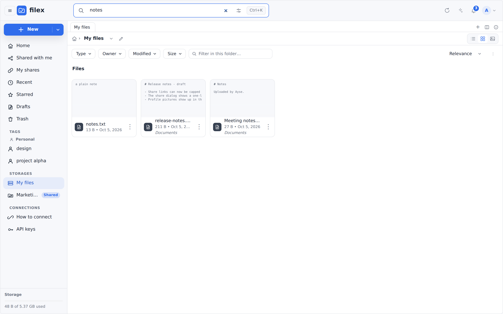

<sub>Searching this folder; `⌘K` / `Ctrl K` hands the query to the palette</sub>

</td>
</tr>
<tr>
<td width="50%" valign="top">

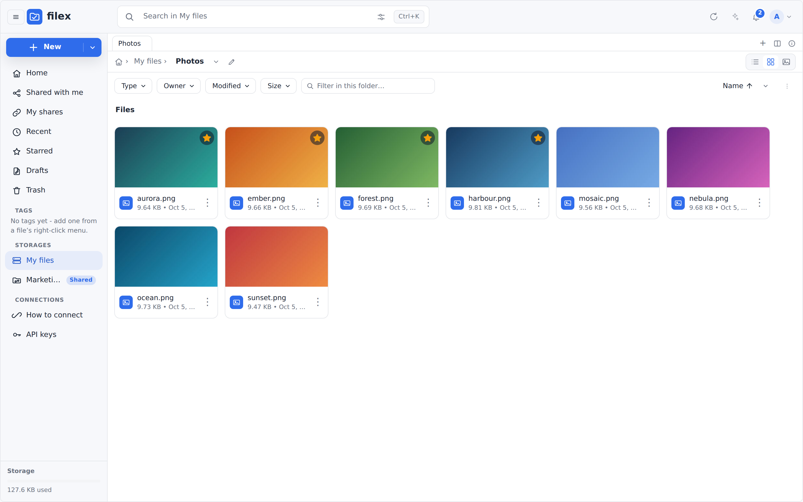

<sub>Navigation panel - Home, Shared with me, My shares, Recent, Starred, Trash, and the storages you can reach</sub>

</td>
<td width="50%" valign="top">

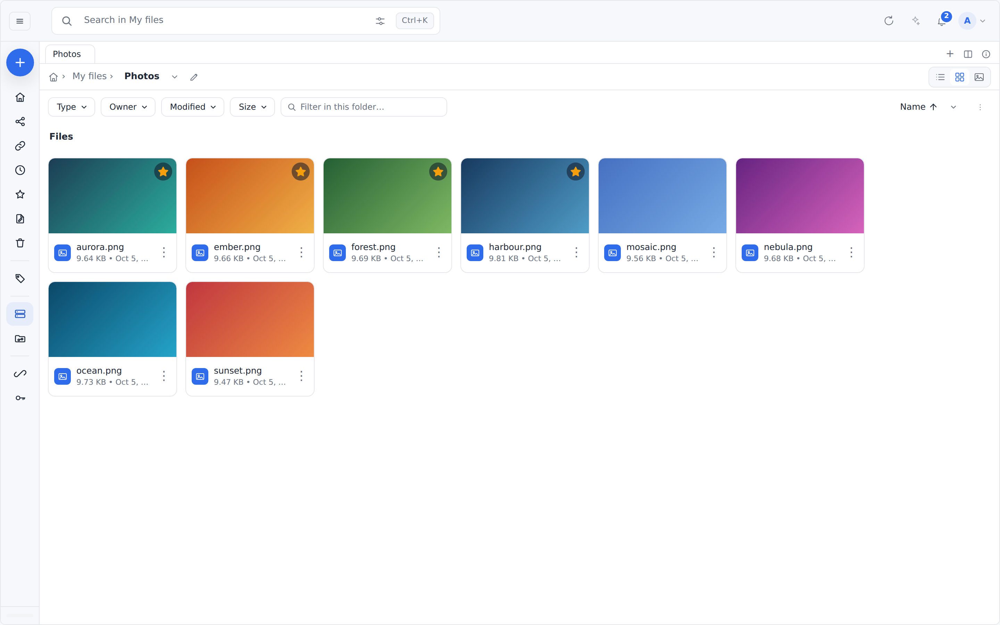

<sub>Collapsed to the icon rail</sub>

</td>
</tr>
<tr>
<td width="50%" valign="top">

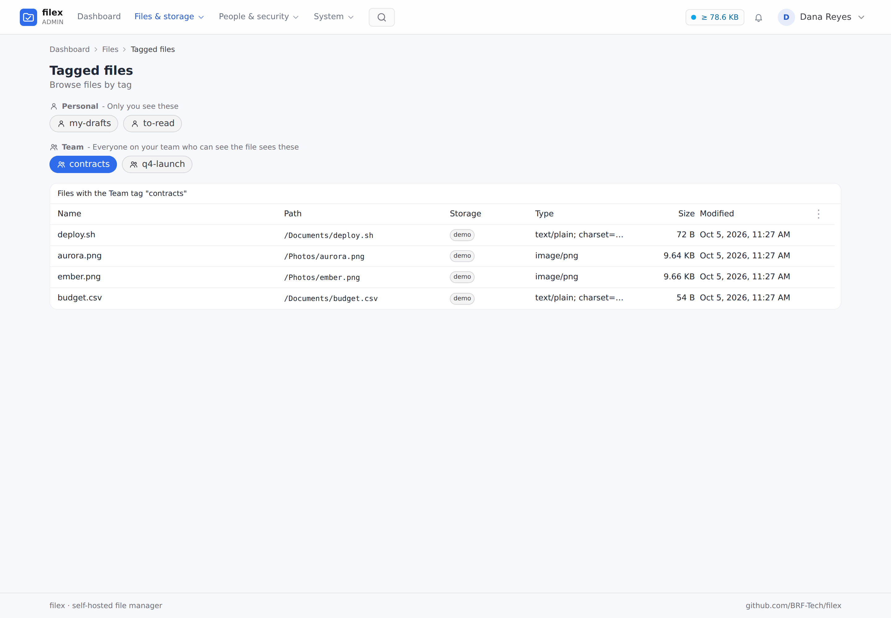

<sub>Tags - your own, or your team's; a tag opens every file carrying it, from every folder they live in</sub>

</td>
<td width="50%" valign="top">

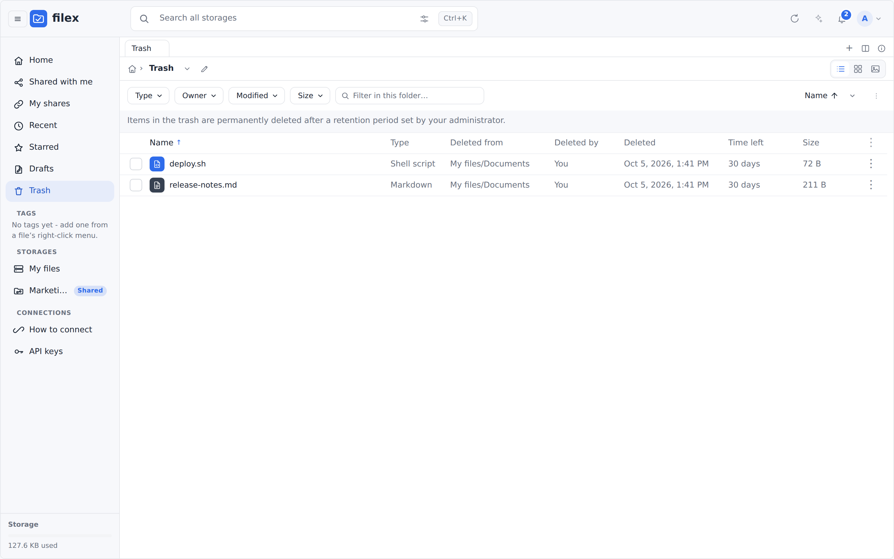

<sub>Trash - what was deleted, where it came from, and how long is left before it goes</sub>

</td>
</tr>
<tr>
<td width="50%" valign="top">

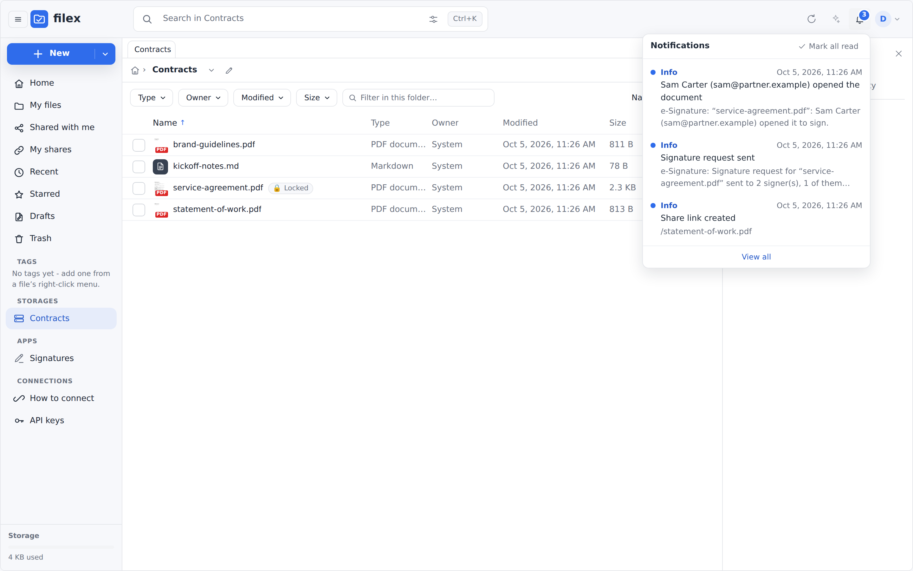

<sub>The bell - the unread count on it, every row going where it says</sub>

</td>
<td width="50%" valign="top">

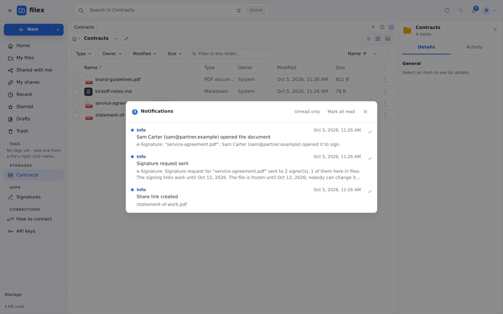

<sub>All of your notifications, inside the explorer - for everybody, not only administrators</sub>

</td>
</tr>
<tr>
<td width="50%" valign="top">

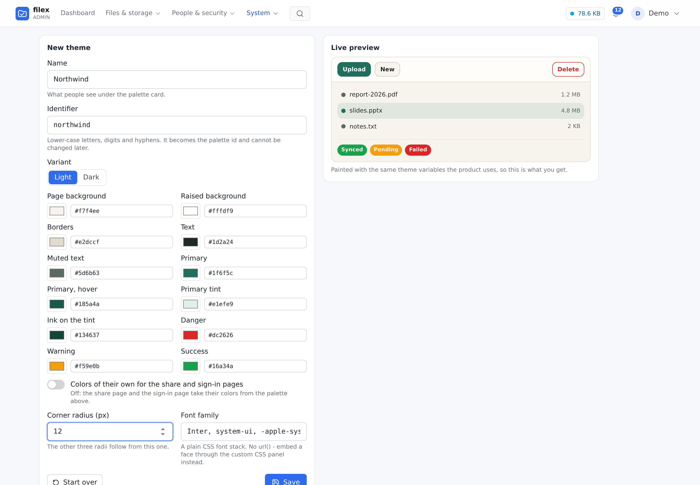

<sub>Appearance - compose a theme in your own colours, previewed as you type</sub>

</td>
<td width="50%" valign="top">

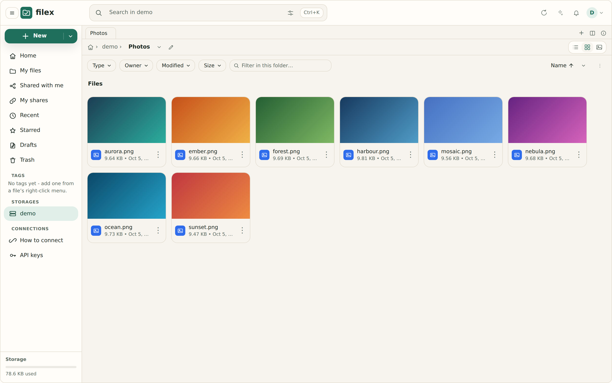

<sub>Made the default, it is what everybody's explorer wears…</sub>

</td>
</tr>
<tr>
<td width="50%" valign="top">

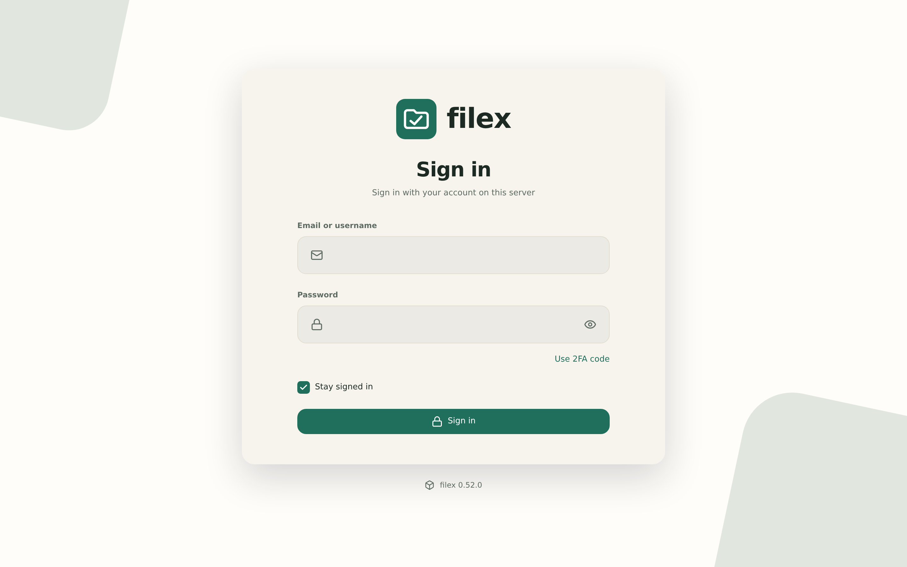

<sub>…and the sign-in page, before anybody has signed in</sub>

</td>
<td width="50%" valign="top">

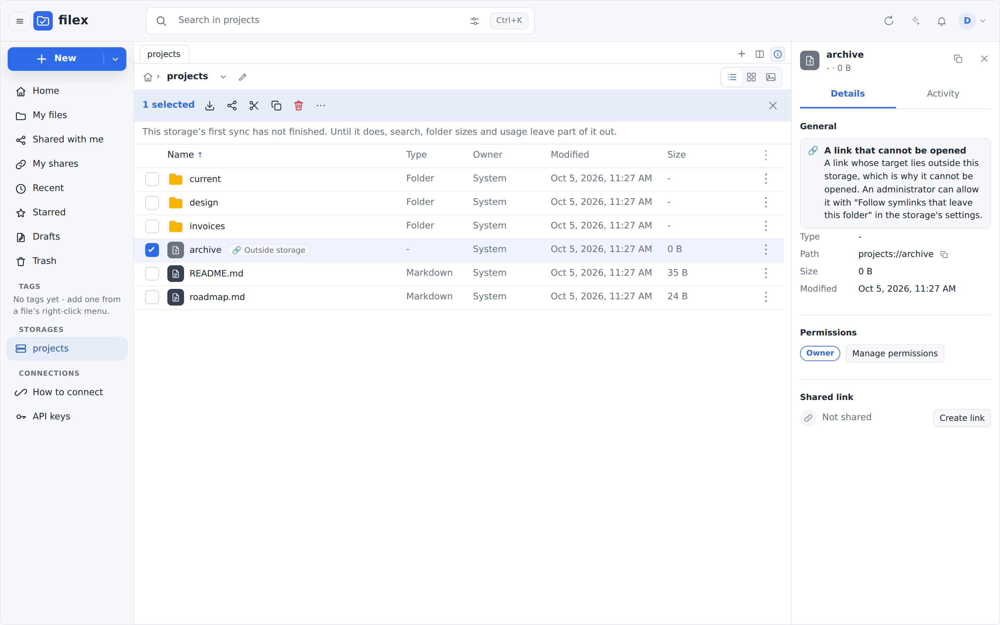

<sub>A symlink filex will not follow says so - in the listing, and in words in its details</sub>

</td>
</tr>
<tr>
<td width="50%" valign="top">

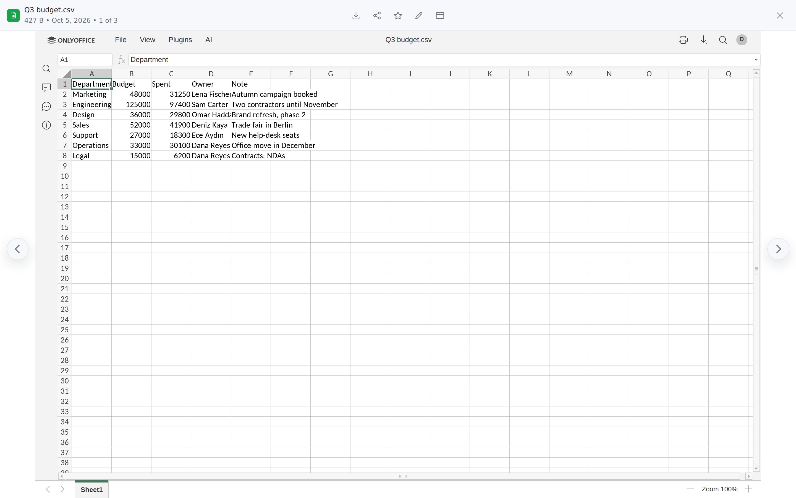

<sub>A `.csv` opens in ONLYOFFICE's spreadsheet when one is connected - a look first, and no delimiter dialog: the file's own separator is passed along ([CSV files](docs/ONLYOFFICE.md#csv-files))</sub>

</td>
<td width="50%" valign="top">

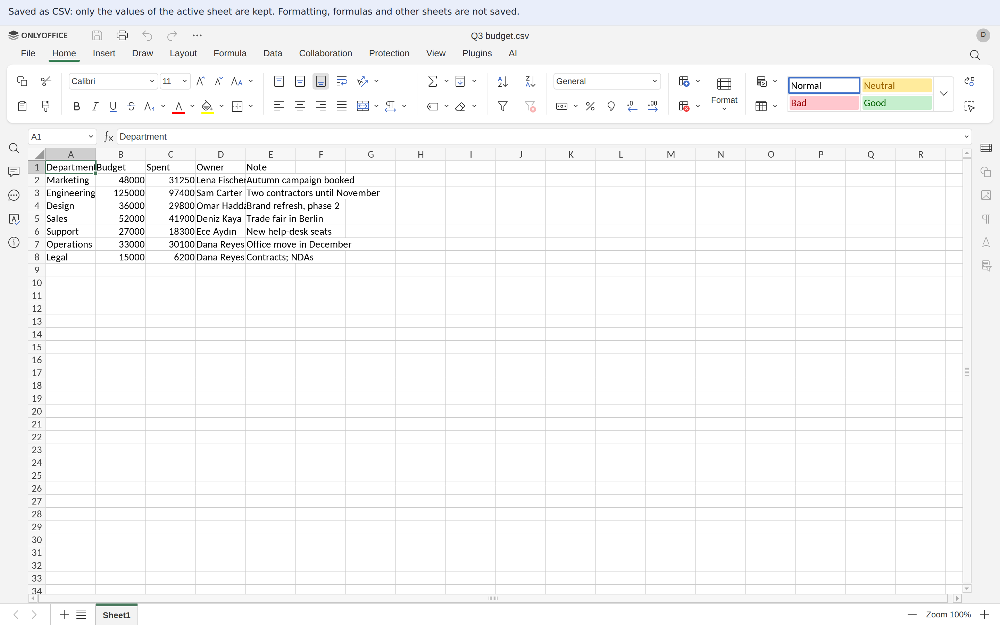

<sub>…and its editor, which says what a save as CSV keeps; the file goes back as the same kind of CSV, and the cells nobody changed keep their text - `007` stays `007` ([cells nobody changed](docs/ONLYOFFICE.md#cells-nobody-changed-keep-their-text))</sub>

</td>
</tr>
</table>

</details>

<br>

## Storage and protocols

**Every storage in one tree, and that tree reachable from anything.**

- Mount local disks, S3, FTP, SFTP, WebDAV and SMB/NAS shares side by side, and copy or cut
  in one and paste in another.
- Reach the same tree as **S3**, **SFTP**, **FTPS**, **NFSv3** and **WebDAV**: point `rclone`,
  `restic`, `aws s3`, WinSCP or FileZilla at it. The permissions, the trash and the quota are
  the web UI's.
- `filex mount` attaches a remote server over ordinary HTTPS: a folder on Linux, a drive
  letter on Windows (macOS is not supported).
- For a storage filex does not ship, install a plugin from the admin panel.

<p align="center">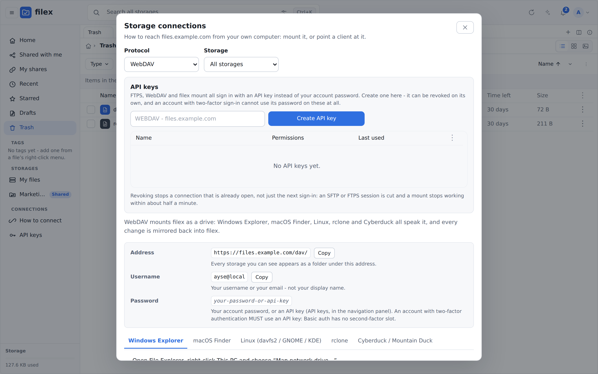</p>

<details>
<summary><b>More about storage and protocols</b> - the protocols both ways, and screenshots of the connection guides, API keys and a storage plugin</summary>

- **Speaks the protocols both ways** - filex can *connect to* local disks, S3, FTP, SFTP,
  WebDAV and SMB/NAS shares, and it can *be reached as* **S3**, **SFTP**, **FTPS**,
  **NFSv3** and **WebDAV**. Point `rclone`, `restic`, `aws s3`, WinSCP, FileZilla, a
  scanner that only learned FTP or a media player that only learned NFS at filex, and
  they land in the same tree, with the same permissions, the same trash and the same
  quota as the web UI. Off-LAN there is also **`filex mount`**, which attaches a remote
  server over ordinary HTTPS - a folder on Linux, a drive letter on Windows
  ([docs/PROTOCOLS.md](docs/PROTOCOLS.md)).

<table>
<tr>
<td width="50%" valign="top">


<sub>How to connect - the guides, built from *your* deployment</sub>

</td>
<td width="50%" valign="top">

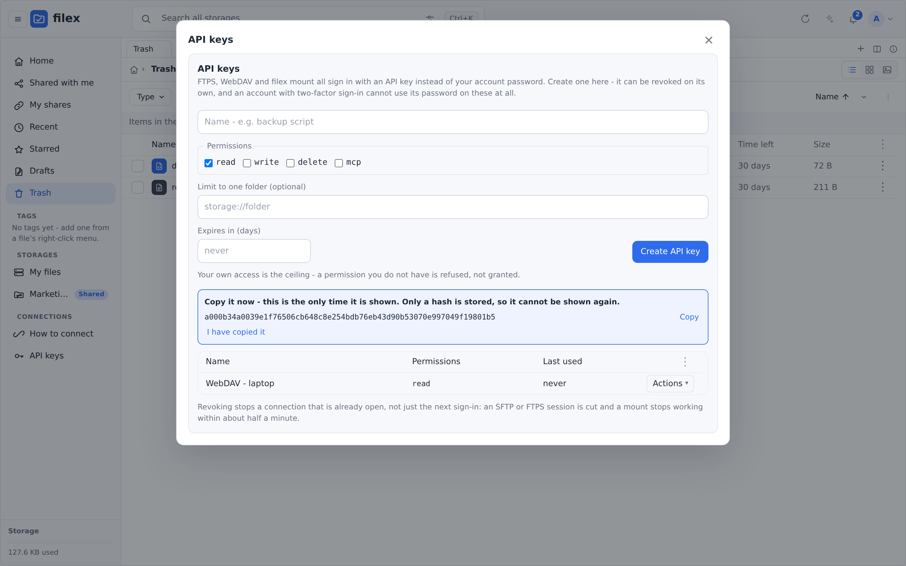

<sub>API keys - mint your own, in the explorer or in an embed (a person's session or token; an embed proxied with one shared *app* token does not get this entry)</sub>

</td>
</tr>
<tr>
<td width="50%" valign="top">

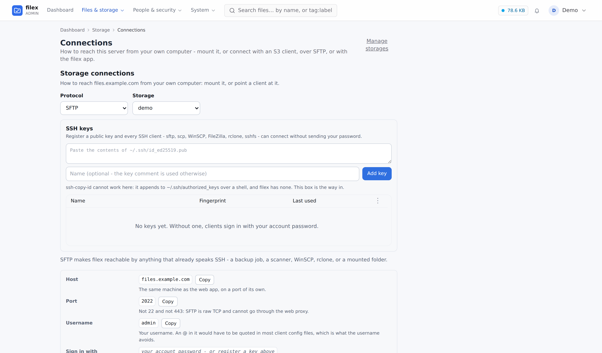

<sub>Reaching filex from anything - S3, SFTP, FTPS, NFS, WebDAV. Every command is built from *your* deployment</sub>

</td>
<td width="50%" valign="top">

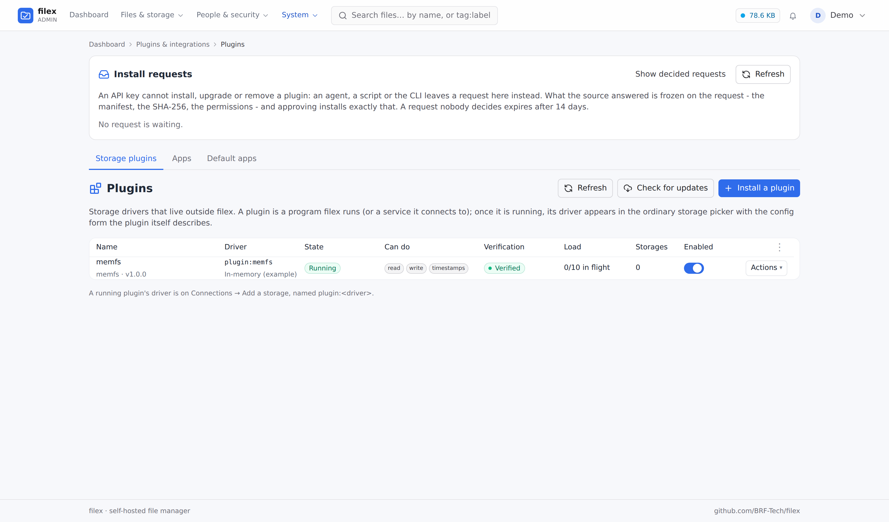

<sub>A storage filex does not ship - installed as a plugin on **Plugins → Storage plugins**, describing its own config form</sub>

</td>
</tr>
</table>

</details>

<br>

## Sharing and protection

**Share with a link you can limit and revoke. Take back a wrong delete or a wrong overwrite.**

- Public links with a PIN, an expiry and a download limit, and file requests for what should
  come in. **My shares** lists every link you created, to copy or to revoke.
- Share a folder with a person or a group and it appears under their **Shared with me**. The
  storage needs **Per-item access control (RBAC)** switched on, which it is not by default.
- Deletes are reversible within a retention window and writes keep snapshots, both inside the
  storage you already mounted.
- End-to-end encrypted folders: encrypted in the browser, and the server never receives a
  key. Optional ClamAV scanning of every file written.

<p align="center">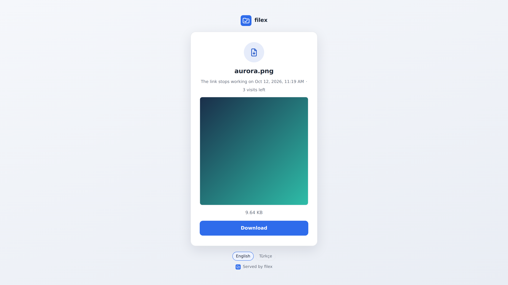</p>

<details>
<summary><b>Screenshots of sharing and protection</b> - the Share dialog, what the recipient sees, My shares, who may encrypt</summary>

<table>
<tr>
<td width="50%" valign="top">

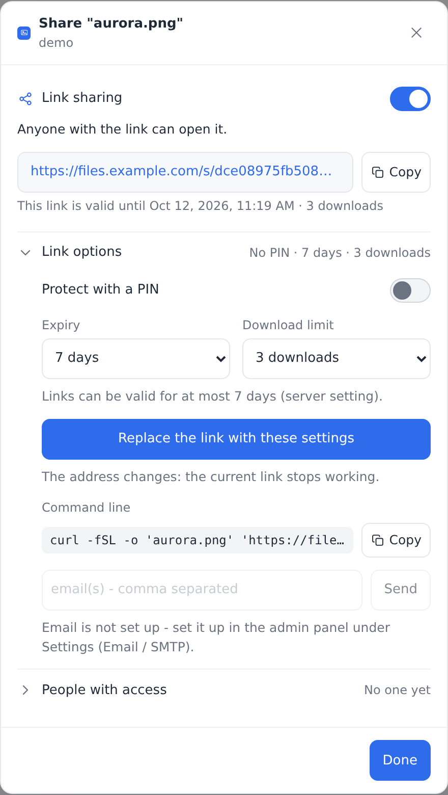

<sub>Sharing - PIN, expiry, download limit, one-line `curl`</sub>

</td>
<td width="50%" valign="top">

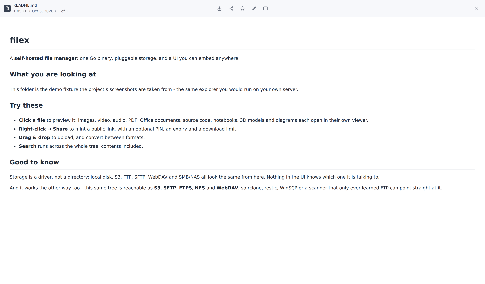

<sub>Markdown viewer</sub>

</td>
</tr>
<tr>
<td width="50%" valign="top">


<sub>…and what the person at the other end opens. filex has ONE outward-facing screen - a shared file, a folder, a file request, an app's signing page and the PIN in front of any of them are all this page, in your instance's name</sub>

</td>
<td width="50%" valign="top">

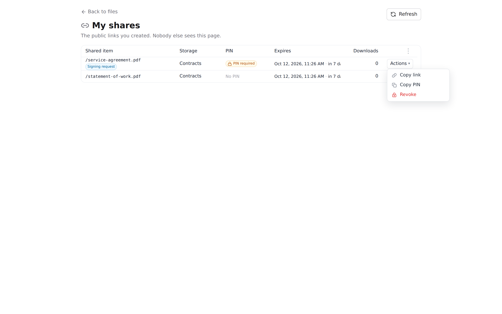

<sub>My shares - the links you created, and their PINs when you need to pass one on</sub>

</td>
</tr>
<tr>
<td width="50%" valign="top">

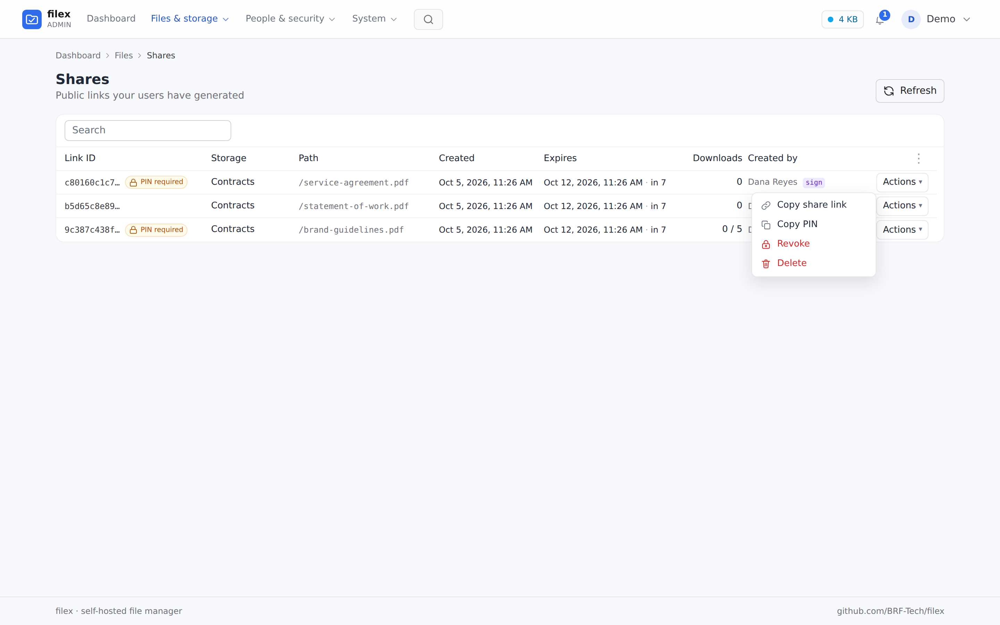

<sub>Every admin table - one pinned **Actions** menu per row, the same menu the explorer's ⋮ opens</sub>

</td>
<td width="50%" valign="top">


<sub>Who may encrypt - off, administrators only, everyone whose role allows it, or after an administrator's approval; the requests waiting, with who asked and why ([who may encrypt](docs/E2E-ENCRYPTION.md#who-may-encrypt))</sub>

</td>
</tr>
<tr>
<td width="50%" valign="top">


<sub>…and the person's side: the New folder dialog asks an administrator for one encrypted folder, with a reason</sub>

</td>
</tr>
</table>

</details>

<br>

## People and access

**The accounts people already have, and one role each.**

- Sign in with a local password, OIDC, LDAP / Active Directory, an authenticating proxy, or
  the Windows or Linux account of the machine filex runs on.
- Everyone has one role - Administrator, User, Viewer or one of your own - built from named
  permissions. Groups carry folder access and a role, can follow your directory's groups,
  and per-person exceptions beat the role.
- Guessing a password is slow: wrong passwords are counted per account and per address, on
  the web form, WebDAV, FTPS and SFTP alike.
- Multi-tenant by design: each tenant has its own sign-in providers, its own domain and
  certificate, and runs itself.

<p align="center">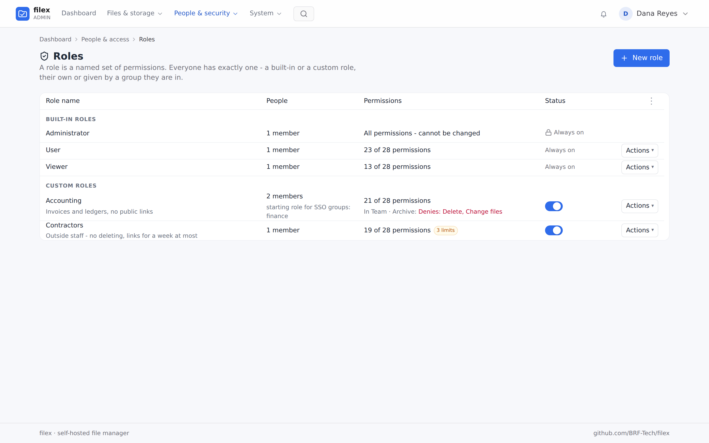</p>

<details>
<summary><b>More about people and access</b> - permissions, groups, sign-in, attempt limits, multi-tenancy, the admin panel</summary>

- **Roles and per-user permissions** - 29 named permissions (each file action, each kind of
  sharing, each protocol, API keys, the desktop app, five admin areas), and everyone has one
  role: Administrator, User, Viewer or a custom role, which can differ in some folders ("no
  delete, except in Scratch") and carry limits (link lifetime and password, blocked file types,
  largest file, required two-factor). Per-person exceptions beat the role, a delegated
  administrator can manage users without ever holding more than they hand out, and the same
  answer holds on every door - the web app, the agent API, WebDAV, SFTP, FTPS, S3, NFS and API
  keys. An installed app can add permissions of its own ("Request signatures"), handed out
  the same way, and a public link stays open only while its creator may still make it
  ([docs/PERMISSIONS.md](docs/PERMISSIONS.md)). A permission a later version stored survives
  every save, and a role an older version's page may have saved without *Encrypt* is pointed
  out on **Admin → Roles**, with one click to give it back
  ([Things to know](docs/PERMISSIONS.md#things-to-know)).
- **Groups** - named sets of people, per tenant: share a folder with a group as with a
  person, and give a group a role that everyone in it without a role of their own holds
  (a role priority decides between groups). People join by hand, or through the groups
  their sign-in carries - an OIDC claim, LDAP `memberOf`, the operating system's groups or
  a proxy header - and leave when the identity provider says so
  ([docs/GROUPS.md](docs/GROUPS.md)). A group linked to a directory group by its full DN can
  make its members administrators - the directory then decides who runs filex, and the last
  administrator is never removed ([Administrators](docs/GROUPS.md#administrators)).
- **Sign in with the account people already have** - a local password, OIDC, LDAP /
  Active Directory, an authenticating proxy, or the **Windows or Linux account** of the
  machine filex runs on: the operating system judges the password, filex never stores
  it, and the provider is switched on only after a real account has signed in with it.
  Every provider follows one rule for who gets an account at a first sign-in
  ([docs/OS-LOGIN.md](docs/OS-LOGIN.md)).
- **Guessing a password is slow** - wrong passwords are counted per account and per
  address on the web form, WebDAV, FTPS and SFTP alike; a lock doubles up to 15
  minutes, an IP allow-list is the way back in, and a forwarded client address is
  believed only from a trusted proxy - by default this machine and the containers
  beside filex, anything else you name
  ([sign-in attempt limits](docs/CONFIGURATION.md#sign-in-attempt-limits)). A change
  another site sends with a visitor's session is refused
  ([requests from other origins](docs/CONFIGURATION.md#requests-from-other-origins)).
- **Multi-tenant by design** - storage-per-tenant with native tenancy mode, RBAC roles +
  per-item grants, confined API tokens, per-token identities for audit trails, and
  app-vs-user token kinds so a shared embed credential cannot manage anybody's keys.
  A token names the permissions it holds - an empty list is refused rather than read
  as "everything" - and **no credential it issues is ever wider than itself**: an API
  key, an S3 key, an NFS export or an SSH key minted through a narrow token cannot
  exceed its verbs, leave its folder or outlive its expiry (`403 token_ceiling`).
  The tenant boundary is enforced on every route that names a row, not only on the
  ones that list them, and instance-wide settings are reserved to the supertenant.
  Each tenant has a **realm**, its sign-in name: two tenants' `alex` are two people,
  whether they sign in on the tenant's own address, type the realm on the platform's
  page or write `realm/alex` over SFTP
  ([realms](docs/MULTI-TENANCY.md#realms-which-tenant-a-sign-in-is-for)). And a tenant
  runs itself: its administrator adds the tenant's own OIDC or LDAP, the operator binds
  shared sign-in providers to one tenant or several, and a tenant's own domain is
  proven by a CNAME and served with a certificate from your proxy, from filex itself
  (ACME) or its own ([docs/TENANT-ADMIN.md](docs/TENANT-ADMIN.md)).

<table>
<tr>
<td width="50%" valign="top">


<sub>Roles - Administrator, User, Viewer and roles of your own: who holds each, what it allows, where it differs by folder, its limits ([docs/PERMISSIONS.md](docs/PERMISSIONS.md))</sub>

</td>
<td width="50%" valign="top">

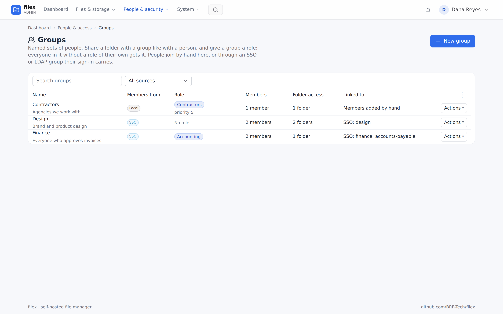

<sub>Groups - named sets of people with folder access and a role; members by hand or kept in step with the groups a sign-in carries ([docs/GROUPS.md](docs/GROUPS.md))</sub>

</td>
</tr>
<tr>
<td width="50%" valign="top">

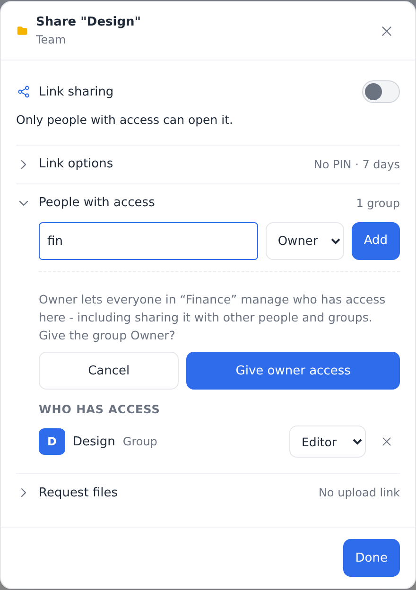

<sub>Sharing a folder with a group, beside people - Owner is asked for in the dialog, not granted by a click</sub>

</td>
<td width="50%" valign="top">

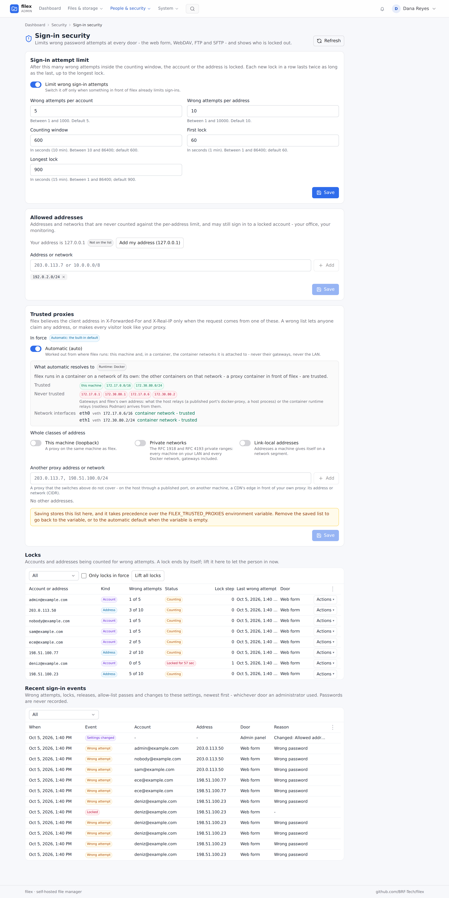

<sub>Sign-in security - the attempt limit, allowed addresses, trusted proxies, the locks and the sign-in trail ([sign-in attempt limits](docs/CONFIGURATION.md#sign-in-attempt-limits))</sub>

</td>
</tr>
<tr>
<td width="50%" valign="top">

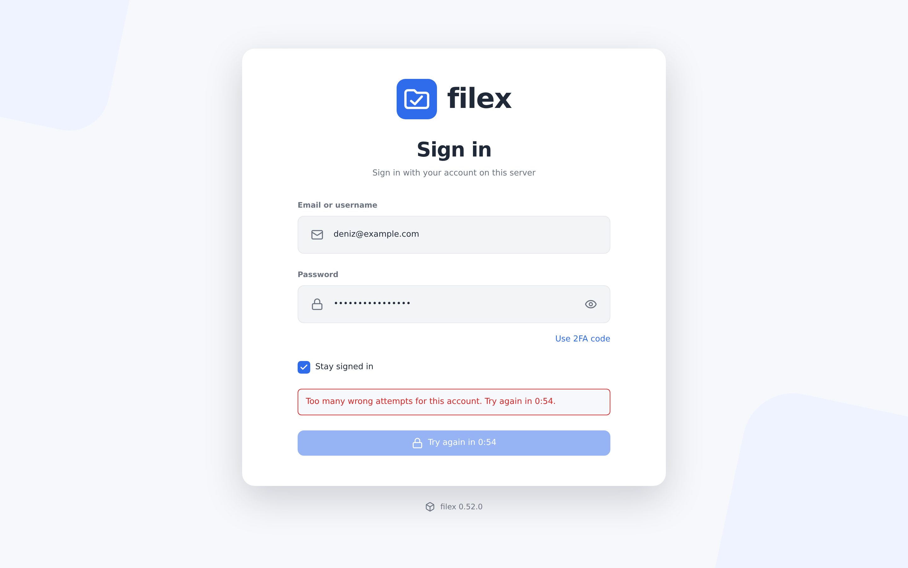

<sub>…and what a locked account's sign-in form says, counting the lock down on its button</sub>

</td>
<td width="50%" valign="top">

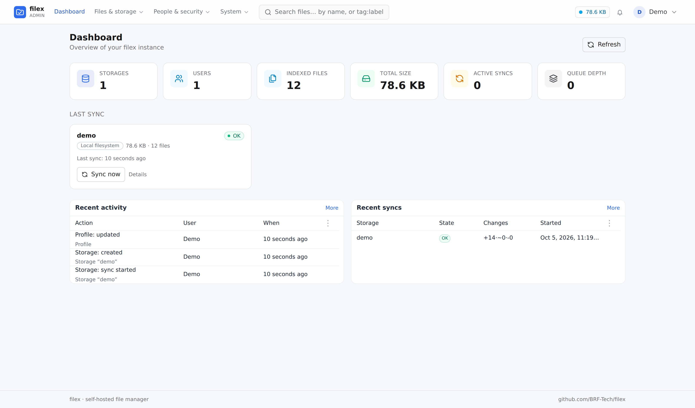

<sub>Admin panel</sub>

</td>
</tr>
<tr>
<td width="50%" valign="top">

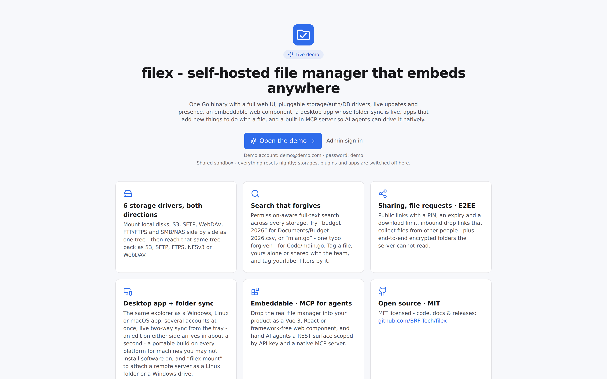

<sub>Demo landing</sub>

</td>
<td width="50%" valign="top">

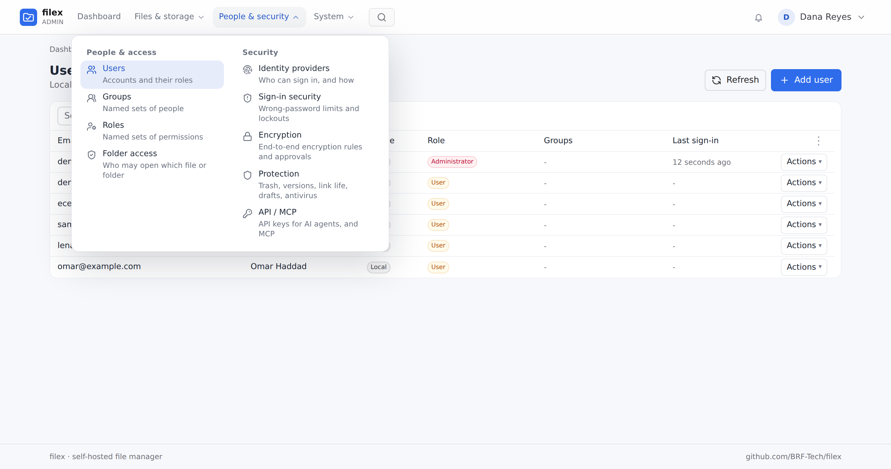

<sub>The admin menu - every page in three panels, **Files & storage**, **People & security** and **System**, with a short line under each; a phone gets the same pages in a drawer ([docs/ADMIN-PANEL.md](docs/ADMIN-PANEL.md))</sub>

</td>
</tr>
</table>

</details>

<br>

## Desktop app & CLI

**Folders on your computer stay in step with the server, live.**

- A Windows, Linux and macOS (Apple Silicon) app: the same explorer in a window, with several
  accounts or tenants side by side.
- Right-click a folder → **Keep on this computer** and it stays in step with the server in
  both directions, in about a second. Everything else stays online-only in the window.
- It signs in through your browser, so SSO and MFA behave as they do on the web, and it opens
  Office documents from your own disk in the editor your server runs.
- Headless machines get the same engine: `filex sync` and `filex client`.

**Install it** from the Microsoft Store (Windows 10/11) or the Snap Store (Ubuntu and
other Linux with snapd):

<p>
<a href="https://apps.microsoft.com/detail/9PKXDJLVZWXW"><picture><source media="(prefers-color-scheme: dark)" srcset="docs/badges/ms-store-light.svg"></picture></a>&nbsp;&nbsp;&nbsp;
<a href="https://snapcraft.io/filex-app"><picture><source media="(prefers-color-scheme: dark)" srcset="docs/badges/snap-store-white.svg"></picture></a>
</p>

or with a package manager:

```bash
brew install brf-tech/filex/filex-app       # macOS 13+ (Apple Silicon), Homebrew tap BRF-Tech/homebrew-filex
sudo snap install filex-app                 # the same snap as the badge above
```

<details>
<summary><b>More about the desktop app and the CLI</b> - sync, drag out, mount as a drive, portable builds, ARM, the client commands</summary>

- **On your desktop too** - the same explorer ships as a Windows/Linux/macOS app that keeps
  local folders in step with the server from the tray - **live**, in about a second,
  in both directions - updates itself, and holds several
  accounts (or tenants) side by side. Right-click a folder → **Keep on this computer** and
  it mirrors under one filex folder; everything else stays online-only in the window.
  Headless machines get the same engine as `filex sync` / `filex client`.

Prefer a window over a browser tab? The **desktop app** (Windows / Linux / macOS) signs in
to any filex server and syncs folders in the background - and on every platform there is a
copy that runs **without being installed** (a portable `.exe`, an AppImage, a `.zip`).
Get it from the [Microsoft Store](https://apps.microsoft.com/detail/9PKXDJLVZWXW), the
[Snap Store](https://snapcraft.io/filex-app) or the
[latest release](https://github.com/BRF-Tech/filex/releases/latest) -
[docs/DESKTOP.md](docs/DESKTOP.md).

The explorer also ships as a **Windows / Linux / macOS desktop app** - the same component
the web UI and the embeds render, not a separate half-copy:

- **Several accounts at once** - a rail of servers/tenants, each showing its own branding.
- **Drag files out** - drag a selection onto the desktop or into another app: folders and
  multi-selections arrive as separate real files and folders. Anything already kept on
  this computer drags instantly; the rest is fetched once and cached
  ([docs/DESKTOP.md](docs/DESKTOP.md#dragging-files-out)).
- **Keep on this computer** - right-click any folder, file or whole storage to mirror it
  under one filex folder on the machine (movable from Settings); everything else stays
  online-only, and every row says which it is (✓ ◐ ⟳ ☁). "Keep online only" hands the
  local copy back to the Trash, or leaves it
  ([docs/DESKTOP.md](docs/DESKTOP.md#keeping-folders-on-this-computer)).
- **Folder sync** - pair a local folder with a server folder and they stay in step both
  ways while the app sits in the tray, **live**: a save in the browser is on disk in about
  a second and a local save on the server just as fast (the engine follows the server's
  change stream and the file system, with a full check every 30 s as the safety net),
  both versions kept when both sides change at once, parallel transfers and listings, a
  first run that resumes where it was interrupted, 30-day local trash, and an engine that
  refuses to turn a missing folder into a mass delete ([docs/SYNC.md](docs/SYNC.md)).
- **Opens Office documents off your own disk** - double-click a `.docx`/`.xlsx`/`.pptx`
  (or any of the ten Office types) and it opens in the editor your server runs, on a
  machine with no Office installed. A document inside a folder you keep on this computer
  opens as itself; anything else is copied up, edited, and written back over the original
  ([docs/DESKTOP.md](docs/DESKTOP.md#opening-documents-from-your-computer)).
- **Mount as a drive** - one button in Settings attaches the server as a drive of the
  operating system over WebDAV, and one detaches it; the account's own token is the
  credential and never appears on a command line. Measured on Windows; the macOS and
  Linux paths are there but not yet verified ([docs/DESKTOP.md](docs/DESKTOP.md#mounting-the-server-as-a-drive)).
- **⌘K searches every account** on the rail, grouped under one badge per account, each
  searched, downloaded and dragged out with its own sign-in ([docs/SEARCH.md](docs/SEARCH.md)).
- **Your notifications and your account in the window** - the top bar ends as the web
  app's does: the **bell** (unread count, the newest rows, *Mark all read*, the full list)
  and the **avatar** with *User settings* - the web app's own settings dialog, opened
  **inside the window** - and *Admin panel* for an administrator. A click on a
  notification lands in the window, the folder with the file selected. Signing out stays
  in the app's own *Settings → Accounts*
  ([docs/DESKTOP.md](docs/DESKTOP.md#notifications-and-your-account)).
- **Signs in through your browser**, so SSO and MFA behave exactly as they do on the web.
- **Updates itself** - downloads quietly, installs on quit; `FILEX_NO_UPDATE=1` opts out.
- **Runs without being installed**, if that is what you need: the Windows **portable**
  `.exe`, the Linux AppImage and the macOS `.zip` all run from wherever you put them. The
  portable Windows copy keeps everything it has in one `filex-data` folder beside itself,
  so deleting that folder leaves nothing of yours on a machine that is not yours - the
  trade is that it does not update itself.

The Store build (*filex File Manager*) is the one Windows copy that is code-signed -
Microsoft signs it - and the Store keeps it up to date. winget (`BRFTech.filex-app`) is
submitted with every release and is waiting for its first review by the winget
moderators, so `winget install` does not find it yet. Installer, portable `.exe`, AppImage,
`.deb`, `.rpm` and `.dmg` are attached to the
[latest release](https://github.com/BRF-Tech/filex/releases/latest) - not code-signed yet,
so expect a SmartScreen prompt from the Windows installer. Details:
[docs/DESKTOP.md](docs/DESKTOP.md). The CLI alone: `brew install brf-tech/filex/filex`
([docs/CLI.md](docs/CLI.md); its winget package, `BRFTech.filex`, is in the same review).

On Linux the `.deb`, `.rpm` and AppImage never run without Chromium's sandbox. The
`.deb` and `.rpm` need nothing; on Ubuntu 23.10 and later an AppImage needs a one-time
AppArmor profile, and the app says so and shows the step
([docs/DESKTOP.md](docs/DESKTOP.md#appimage-on-recent-ubuntu)). The Snap runs without
Chromium's sandbox, inside the snap's strict confinement, and needs nothing either
([docs/DESKTOP.md](docs/DESKTOP.md#the-snap-and-the-sandbox)).

**ARM (arm64)** - what ships for it (every release builds these and runs them on
arm64 machines before publishing):

| | arm64 |
|---|---|
| Server + CLI binary | Linux, macOS and Windows: `filex-<os>-arm64` and the `.tar.gz` / `.zip` archives |
| Docker images (`ghcr.io/brf-tech/filex`, full and slim) | multi-arch - `docker pull` picks arm64 by itself |
| Desktop app - Linux | `filex-desktop-arm64.AppImage`, `filex-desktop-arm64.deb`, `filex-desktop-aarch64.rpm`, and the Snap Store (`sudo snap install filex-app` picks arm64) - since 0.48.1 |
| Desktop app - Windows on Arm | `filex-desktop-arm64.exe` (installer) and `filex-desktop-portable-arm64.exe` - since 0.48.1; the app updates itself to the arm64 build |
| Desktop app - macOS | Apple Silicon only (no Intel build) |
| Homebrew | the CLI (`filex`) on Apple Silicon and on Linux on Arm; the desktop app (`filex-app`) on Apple Silicon |

On an Arm machine the app's *Get the desktop app* offer (and its copy in
Settings) leads with the arm64 file and the download list on
[filex.sh](https://filex.sh/#downloads) highlights it, from what the browser
reports (Chromium's client hints, Firefox's `aarch64`). A browser that does not
say (Safari, Firefox on Windows) is offered the x64 file with the arm64 one
beside it.

The same binary is also a client for servers, scripts and headless machines:

```bash
filex client login --url https://files.example.com
filex client upload build/report.pdf docs://ci-artifacts/
filex client mv docs://ci-artifacts/report.pdf archive://2026/   # across storages, waits for the job
filex client run convert convert docs://data/table.csv --param target=xlsx

filex sync add ~/Documents/work docs://work   # the engine the desktop app uses
filex sync run --watch 30s
```

See [docs/CLI.md](docs/CLI.md) and [docs/SYNC.md](docs/SYNC.md).

</details>

<br>

## Embed in your app

**A real file manager inside your own product.**

The same UI ships as a Vue 3 component, a React component and a framework-agnostic
`<filex-explorer>` web component, backed by your own filex server. A confined token locks it
to a per-tenant folder, and the backend enforces that, not the widget. The web component
takes two lines:

```html
<script type="module" src="https://cdn.jsdelivr.net/npm/@brftech/filex/dist/filex.js"></script>
<filex-explorer api-base="http://localhost:5212" sidenav connections ui-profile="simple"></filex-explorer>
```

<p align="center">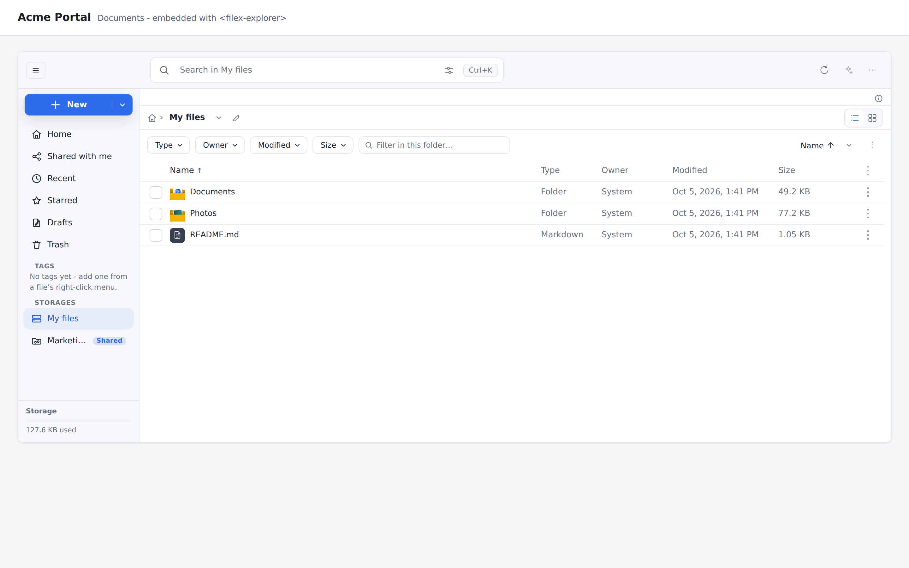</p>

<details>
<summary><b>More about embedding</b> - Vue 3, React, any framework, confined tokens, other origins</summary>

- **Embeds anywhere** - the same UI ships as a Vue 3 component, a React component and a
  framework-agnostic `<filex-explorer>` web component. Put a real file manager inside
  *your* product, backed by your own filex server and locked to a per-tenant folder.
  The navigation panel comes with it - `<filex-explorer sidenav ui-profile="simple">`
  is the whole opt-in for a host page that never touches JavaScript.

### Vue 3
```bash
pnpm add @brftech/filex-core
```
```vue
<script setup>
import { FileExplorer } from '@brftech/filex-core';
import '@brftech/filex-core/style.css';
</script>
<template>
  <FileExplorer :config="{ apiBase: 'http://localhost:5212', auth: { kind: 'bearer', token: '…' } }" />
</template>
```

### React
```bash
pnpm add @brftech/filex-react
```
```jsx
import { FileManager } from '@brftech/filex-react';
<FileManager config={{ apiBase: 'http://localhost:5212' }} onError={(e) => console.error(e)} />
```

There is **no stylesheet to import** - the look travels inside the bundle and is
injected on mount, so nothing is missing from that snippet. ⚠ A bundler will need the
optional viewer packages externalized (`monaco-editor` and friends), which
[docs/INTEGRATION.md](docs/INTEGRATION.md) shows in one `rollupOptions.external`
line; every one of those imports is guarded, so the viewers degrade rather than break.

### Vanilla JS / any framework
```html
<script type="module" src="https://cdn.jsdelivr.net/npm/@brftech/filex/dist/filex.js"></script>
<filex-explorer api-base="http://localhost:5212" sidenav connections ui-profile="simple"></filex-explorer>
```

`sidenav` turns the navigation panel on (it is on by default; the attribute is
there so a host page can state it either way), `connections` adds its "How to
connect" and "API keys" entries, and `ui-profile="simple"` presets the
power-user chrome off. All three are ordinary `config` keys, so the Vue and
React wrappers set them the same way - see
[docs/INTEGRATION.md](docs/INTEGRATION.md).

Multi-tenant hosts typically proxy the API server-side, inject a **confined token**
(`root: tenant-folder`) per request, and strip client headers - the sandbox is enforced by
the backend, not the widget. Such a token is `kind: "app"`, so the panel hides the
surfaces that belong to one person - API keys, Recent, Starred, Shared with me -
while Upload, the storages, Trash and "How to connect" stay. See
[docs/INTEGRATION.md](docs/INTEGRATION.md) and
[docs/MCP.md](docs/MCP.md#token-kinds---user-vs-app).

⚠ An embed that rides on the visitor's own filex **session cookie** (no token) from a
page on another origin - a sibling subdomain included - reads as before, but every
change it sends is refused (`403 cross_origin_refused`) until that origin is in
`FILEX_CORS_ALLOWED_ORIGINS`; the default `*` does not grant it. A bearer token, a host
that proxies with a key, the desktop app and the installed web app need nothing
([docs/CONFIGURATION.md](docs/CONFIGURATION.md#requests-from-other-origins)).

<table>
<tr>
<td width="50%" valign="top">

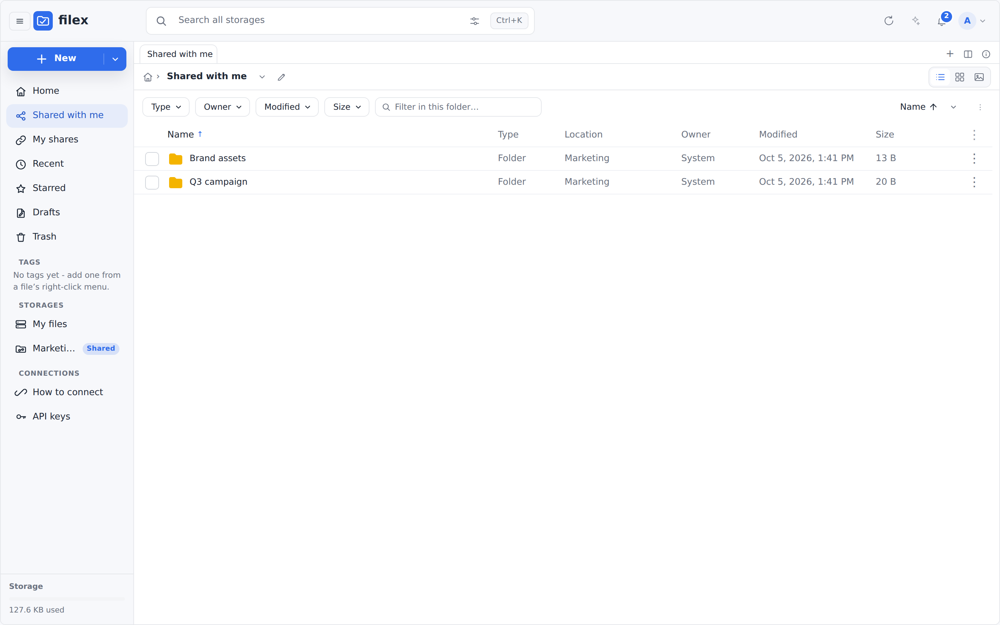

<sub>Shared with me - folders other people granted you, no mount instructions</sub>

</td>
<td width="50%" valign="top">


<sub>Embedded in another product's page</sub>

</td>
</tr>
</table>

</details>

<br>

## Apps

**New things to do with files, with exactly the permissions you approved.**

An app is a WebAssembly module that runs inside filex in a sandbox, an interface of its own
in a sandboxed frame, or both. You install it from a store link or its GitHub address, read
every permission it asks for, and nothing updates itself. Four ship as public repositories:

| App | What it adds |
|---|---|
| [e-Signature](https://github.com/BRF-Tech/filex-sign) | Sign a PDF, or ask others to: people on this filex sign inside it, anybody else by a private link, behind a PIN by default |
| [Convert](https://github.com/BRF-Tech/filex-convert) | **Convert…** on any file or selection: images, video, audio, documents, e-books, archives, data, subtitles and fonts |
| [filextext](https://github.com/BRF-Tech/filextext-app) | An end-to-end encrypted text workspace in a single `.fxtxt` file |
| [draw.io](https://github.com/BRF-Tech/filex-drawio) | The draw.io diagram editor, on `.drawio` and `.dio` files |

A language pack is an app too: Spanish, German and French ship as examples.

<p align="center">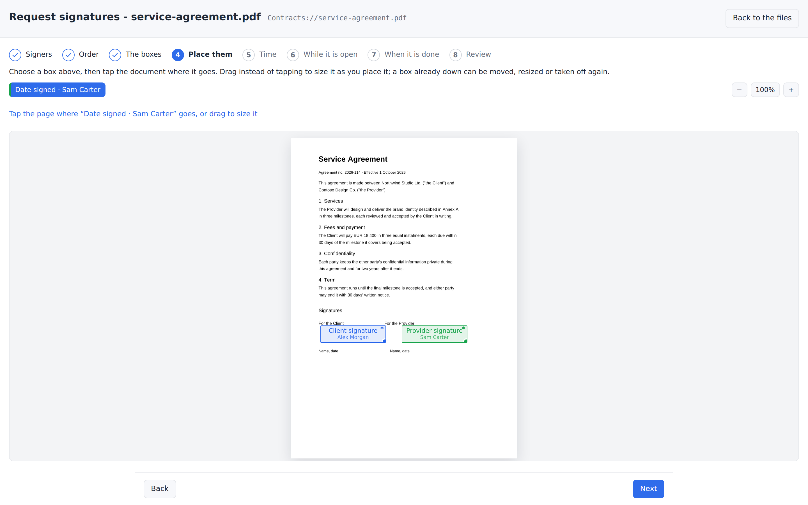</p>

<details>
<summary><b>More about apps</b> - the sandbox, installing from GitHub or a store, paid apps, permissions, updates, and a signature request in pictures</summary>

- **Apps that can only do what you approved** - signing a contract with a partner who
  has no account, converting a video, anything a manifest describes, added as an
  **app**: a WebAssembly module that runs inside filex, an interface of its own that
  filex serves in a sandboxed frame, or both - with exactly the permissions you read
  and granted at install. The module gets no filesystem, no network, no program on
  your server; the interface cannot read filex's session and is cut off from the
  network by filex's own policy. Nothing updates itself: a new version waits for an
  administrator, and the previous one is a click away. Four ship as public
  repositories - **e-Signature**, **Convert**, **filextext** (an end-to-end encrypted
  text workspace) and **draw.io** - and you install one from its GitHub address.

A **storage plugin** teaches filex a backend it has never heard of. An **app**
teaches it a *thing to do with files* - sign them, convert them, send them to
somebody outside - and it is a different kind of plugin on purpose: a
**WebAssembly module that runs inside filex, in a sandbox** that hands it nothing
it was not granted. No filesystem, no network, no environment, no program on your
server: only the host functions its manifest asks for, each shown to the
administrator in plain words before anything is installed, and only the files
the person who ran it actually selected. The heavy engines an app may want
(ffmpeg, ImageMagick, Ghostscript, poppler, rsvg) are the server's own, offered
one permission per engine; office documents go through the ONLYOFFICE Document
Server you connect, as the office engine - filex runs no LibreOffice.

An app may also bring - or be nothing but - **an interface of its own**: HTML,
CSS and JavaScript its author wrote, an editor or a viewer for a format. filex
serves it from the package you approved (pinned by its SHA-256) in a **sandboxed
frame**: an opaque origin that cannot read filex's session, cookies or pages, a
content policy filex writes from the app's grant (no connection, no storage, no
forms, no pop-ups), and one checked message channel through which filex hands it
only the files it was opened with and saves over them - a new version, or a
draft. It can add its own kind of file to **New document**, open in the editor
tab, and hand you a file to keep - each time you allow it. ⚠ Browsers cannot
entirely stop a page from sending data out (WebRTC ignores a content policy;
Chrome lets filex close it, in Firefox filex can only take it out of the page -
a seat belt, not a wall), so the install review says so plainly: **trust an
app with an interface as far as you trust its author with the files you open
in it.**

What an app adds lives where everything else does: rows in the file menu, screens
filex draws for it or its own interface, jobs in the same
queue as a copy - with progress, **Cancel** and a result that is versioned,
scanned and indexed like any other write - a section in a file's details, a home
screen under **Apps** in the navigation, and, when it needs somebody without an
account, a link that is an ordinary **share**: in the same list, under the same
PIN lock-out and expiry policy, revocable by you like every other link. An app
that asks for it is also woken once an hour to do its own scheduled work - a
signature request that closes itself at its deadline and sends the reminders you
asked for.

Not every app runs code. A **language pack** is a manifest of strings and nothing
else: it installs from the manifest alone - no module, no Go, no release - never
starts a runtime, and adds its language to the explorer, the admin panel, the
public pages and the text the server writes. **Plugins → Apps** lists it as a
*Language pack* with its coverage of the running version, and anything it lacks
shows in English. Spanish, German and French ship as examples, and
`BRF-Tech/filex-lang-template` walks a translator from export to install.

Four apps ship alongside filex, as public repositories you can install, read and
fork. The first two are modules; the last two are only an interface, with nothing
that runs on the server:

| App | What it adds |
|---|---|
| **[e-Signature](https://github.com/BRF-Tech/filex-sign)** - `BRF-Tech/filex-sign` | **Sign…**, **Request signatures…**, **Sign / Fill** and **Verify** on a PDF, and only on a PDF (an office document is turned into one with **Convert** first). A request is a short wizard: who signs - people on this filex, who sign inside it, and anybody else by name or email, who gets a **private link**, behind a PIN unless you say otherwise - in what order, the boxes named and given to each signer, then placed on the page; how long it stays open, whether the file is **frozen** meanwhile, and whether an **audit trail PDF** is written at the end. The result is a PAdES-signed PDF that is **certified and sealed**: the first signature certifies the document so later ones may only fill in and sign, and when the last one lands **filex itself seals the whole file** with the installation's own seal, locked so that any change after it is reported as not permitted. The **SHA-256 of exactly those sealed bytes**, the seal's fingerprint and how to check them go to the requester and to every signer, inside and outside, and into the audit trail. Optionally the signed file stays **locked in filex** until an administrator lifts it. **Signing keys never leave the server**: the instance's own certificate authority (or one you import) issues a certificate per signer, and the key that made a signature is destroyed seconds later - the seal's key is the one exception, held by the host and never handed out. |
| **[Convert](https://github.com/BRF-Tech/filex-convert)** - `BRF-Tech/filex-convert` | **Convert…** on any file: images, video, audio, documents, e-books, archives, data, subtitles and fonts. The target is picked from buttons grouped under their category, then only the settings that matter for it, then a review. Most conversions run in pure Go inside the sandbox; the rest use the server's engines when they are installed, and a target that needs a missing one says so instead of being silently absent. |
| **[filextext](https://github.com/BRF-Tech/filextext-app)** - `BRF-Tech/filextext-app` | An **end-to-end encrypted text workspace** in a single `.fxtxt` file: pages and folders on the left, tabs on top, AFFiNE's BlockSuite editor in the middle (headings, lists, to-dos, code, tables, images, links between pages, Markdown in and out). It is encrypted **in your browser** with the same keys and recovery key as filex's [encrypted folders](docs/E2E-ENCRYPTION.md); filex stores ciphertext and never sees the password or a word of the text. A `.fxtxt` opens in it in place of the preview, and **New document** gets *Encrypted workspace (.fxtxt)*. |
| **[draw.io](https://github.com/BRF-Tech/filex-drawio)** - `BRF-Tech/filex-drawio` | The **draw.io** diagram editor, inside filex: `.drawio` and `.dio` files open in it in place of the preview, **Save** writes a new version, and **New document** gets *draw.io diagram*. draw.io's own files are served from the app's package (pinned by its SHA-256); it reaches nothing outside it. |

**Install one from GitHub** - *Admin → Plugins → **Apps** → **Install an app** →
GitHub repository*: type `BRF-Tech/filex-sign` and the release tag. filex reads the
repository's `filex-app.json`, downloads the module (or the interface's
package) it names and refuses it unless its SHA-256 matches, then stops at the
**permission review**. Nothing is
installed until you have read every permission and ticked *I understand*; the
grant is exactly that list, and an upgrade that asks for more stops at the review
again. `FILEX_PLUGIN_TRUSTED_KEYS` makes signed modules mandatory (a GitHub
install carries no signature, so on such an instance upload the module with its
signature instead). Every download - an app, its update check, a storage plugin - goes
to public addresses only, judged after DNS and on every redirect: to install from a
server on your own network, upload the files. Apps are off in demo mode. An API key - an agent, a script,
the CLI - cannot install one: it **leaves a request**, filex freezes the bytes
and permissions it would install, and an administrator approves it under
**Plugins → Install requests**.

**Install one from a store** - an app store such as [filex Apps](https://apps.filex.sh)
sends you to this filex with an **install link**
(`/admin/store-install#store=…&intent=…`). The link only opens the same review: filex
reads the app from its GitHub repository at the commit the store approved, holds it to
the store's pins - the manifest's, the module's and the interface's SHA-256, the name,
the version, the permissions - and installs nothing until you press **Install**. The
first link from a store asks you to **trust** it and shows the fingerprints of the keys
it signs with; compare them with what the store publishes. A link is made for one filex
and works once, and the store is told how it ended. `FILEX_APP_STORE_URLS` /
`FILEX_APP_STORE_KEYS` trust stores by configuration instead, and then no other
([Installing from a store](docs/APP-PLUGINS.md#installing-from-a-store)).

filex Apps signs with these keys (also at `https://apps.filex.sh/v1/keys.json`; the trust
question shows the first 32 characters of each fingerprint, in groups of four):

| Key | Signs | Fingerprint (SHA-256 of the key) |
|---|---|---|
| `index-2026-10` | install links | `205cd1302b9a5025776636b189b6ef80c5a72f4128acb802b917434380bc4c88` |
| `license-2026-10` | license answers | `2807b0749a94944285c293ee82ae46600877925a0815cbc0484a93789e0371b4` |
| `artifact-2026-10` | app modules (not asked about on the trust question; `FILEX_PLUGIN_TRUSTED_KEYS` checks a module's signature) | `94974dbae4cc3106406cbf812a4f33b530030ac244b57b73a8989bb23d4df62e` |

**Paid apps.** A store may sell an app, and its license is the store's: filex keeps the
key encrypted and shows only its first characters, asks the store at install and every
day after, and when the store says a license is revoked, expired or out of seats the app
is **held** - installed, with its settings and records, running nothing - until the
license holds again, with a band on every admin page that names it. Nothing is removed by
a license. An app reads its own status with `fx.license.get()`, never the key
([Paid apps](docs/APP-PLUGINS.md#paid-apps)).

**Who may use it.** An app can declare **permissions of its own** - a signing
app puts *Request signatures* behind one, while signing what you were sent
needs none - and you hand them out per role and per person like filex's own;
an action somebody does not hold is not in their menu and is refused if asked
for ([App permissions](docs/APP-PLUGINS.md#app-permissions)).

**Nothing updates itself.** Once a day (and on **Check for updates**) filex
asks where each app came from - its GitHub releases, a language pack's branch,
or the manifest address it was installed from - for a newer version this filex
can run, and tells you: it waits under *Update available* (or *Needs approval*,
when it asks for more) until an administrator has reviewed what it changes -
permissions, module, interface files, notes - and approved it, and everybody
then uses that version. **Back to *version*** puts the one it replaced back.
Storage plugins can follow a source the same way. An app says which filex
versions it works with (`"filex": ">=0.47.0"` in its manifest), and filex will
not install it outside that range.

**Operator's guide:** [docs/APP-PLUGINS.md](docs/APP-PLUGINS.md) - installing and
controlling apps, the signing round end to end, the converter, scheduled
wake-ups, and what guards an app's public links. **Writing one** (stock Go,
`GOOS=wasip1`, with a test kit): start from the template repository
[BRF-Tech/filex-app-template](https://github.com/BRF-Tech/filex-app-template) and
[docs/PLUGIN-KIT.md](docs/PLUGIN-KIT.md); the
wire contract: [docs/APP-PLUGINS-API.md](docs/APP-PLUGINS-API.md). The other kind
of plugin, a storage backend: [docs/PLUGINS.md](docs/PLUGINS.md).

Dana asks a colleague on the same filex and a partner outside it to sign an
agreement. The app is [e-Signature](https://github.com/BRF-Tech/filex-sign); every
screen is drawn by filex, and the link the partner gets is an ordinary share.

<table>
<tr>
<td width="50%" valign="top">

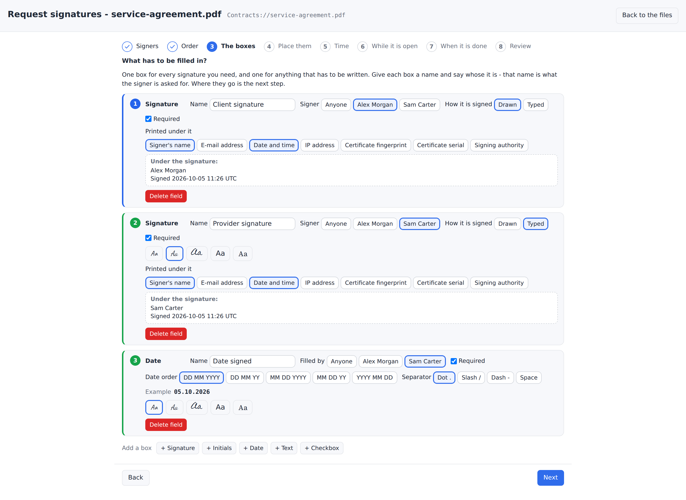

<sub>Define the boxes - name each one and say whose it is; the document comes next</sub>

</td>
<td width="50%" valign="top">


<sub>Place them - choose a box, tap the page where it goes</sub>

</td>
</tr>
<tr>
<td width="50%" valign="top">

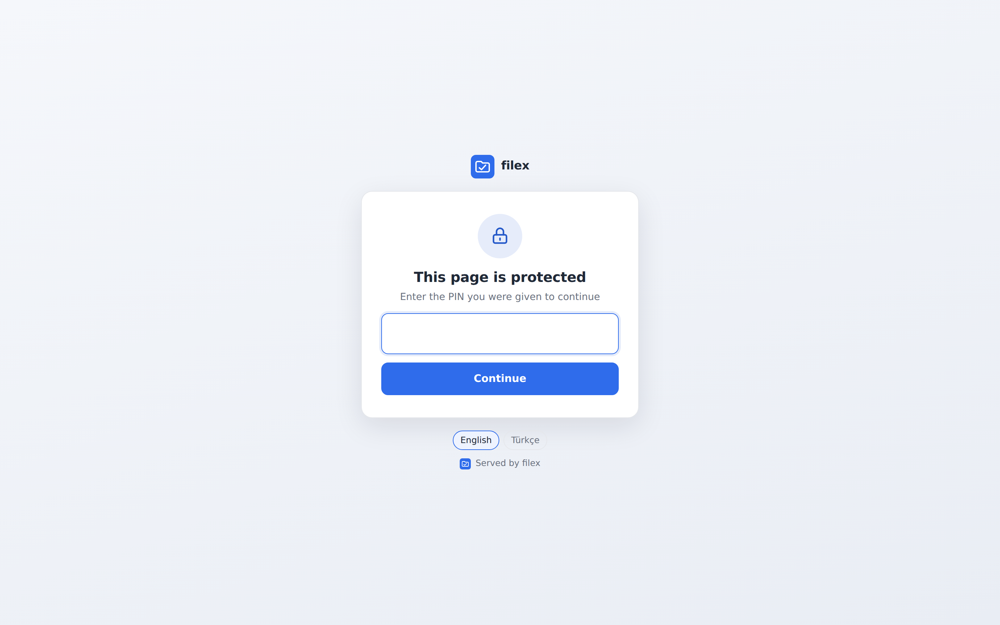

<sub>The partner's link - filex's one public screen, in your instance's name, behind a PIN</sub>

</td>
<td width="50%" valign="top">

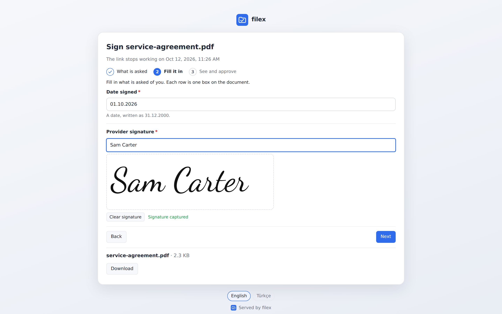

<sub>…and what it opens: only their own boxes - here a name typed in the face the requester chose (drawn and uploaded are the other two)</sub>

</td>
</tr>
<tr>
<td width="50%" valign="top">

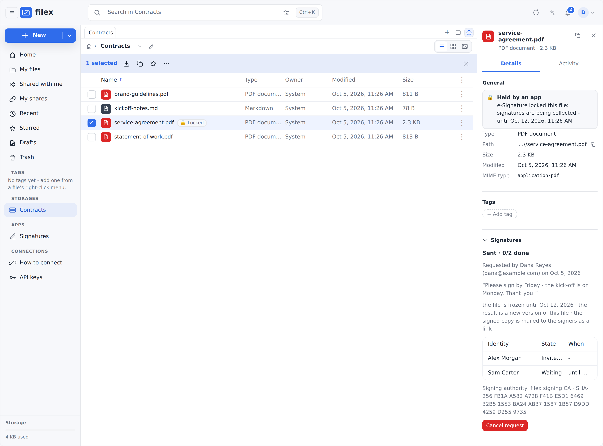

<sub>While it is out - the document frozen for everybody, who has signed in its details</sub>

</td>
<td width="50%" valign="top">

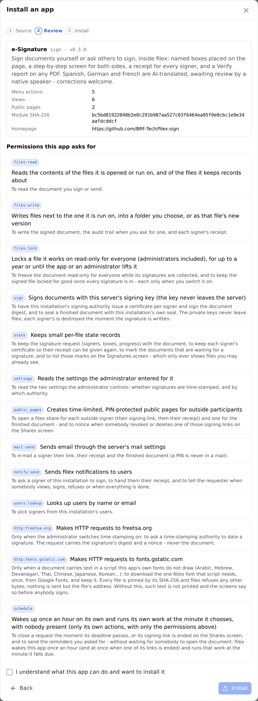

<sub>Installing an app - every permission it asks for, in plain words, before anything runs</sub>

</td>
</tr>
<tr>
<td width="50%" valign="top">

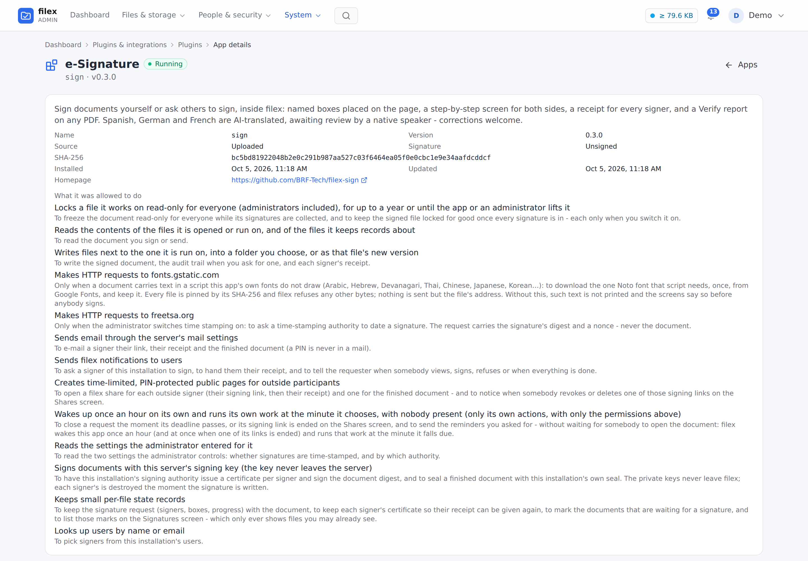

<sub>An installed app - where it came from, its fingerprint, and every permission it holds in plain words (its settings and its actions follow, further down the page)</sub>

</td>
<td width="50%" valign="top">

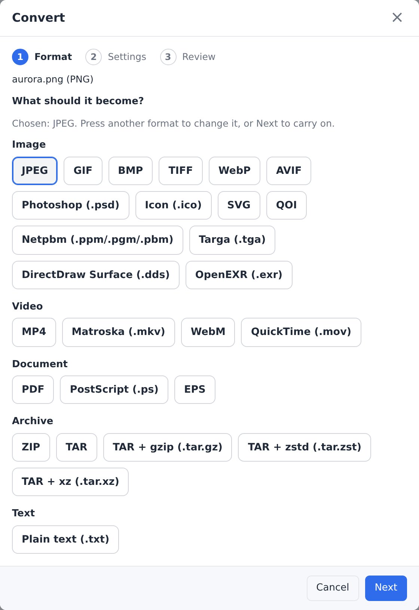

<sub>The converter, another app - every target under its category, three steps</sub>

</td>
</tr>
<tr>
<td width="50%" valign="top">

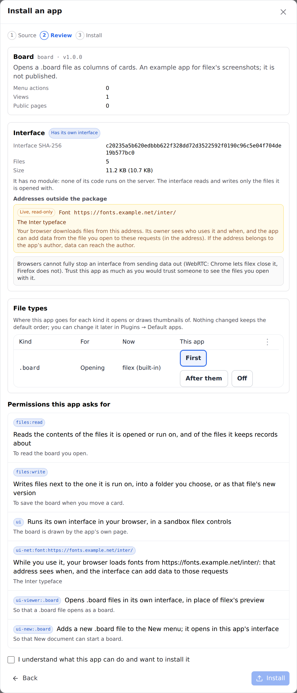

<sub>An app that brings its own interface - the review shows the package's fingerprint, every address outside it (a live one is a permission, in yellow) and what a browser cannot promise</sub>

</td>
<td width="50%" valign="top">

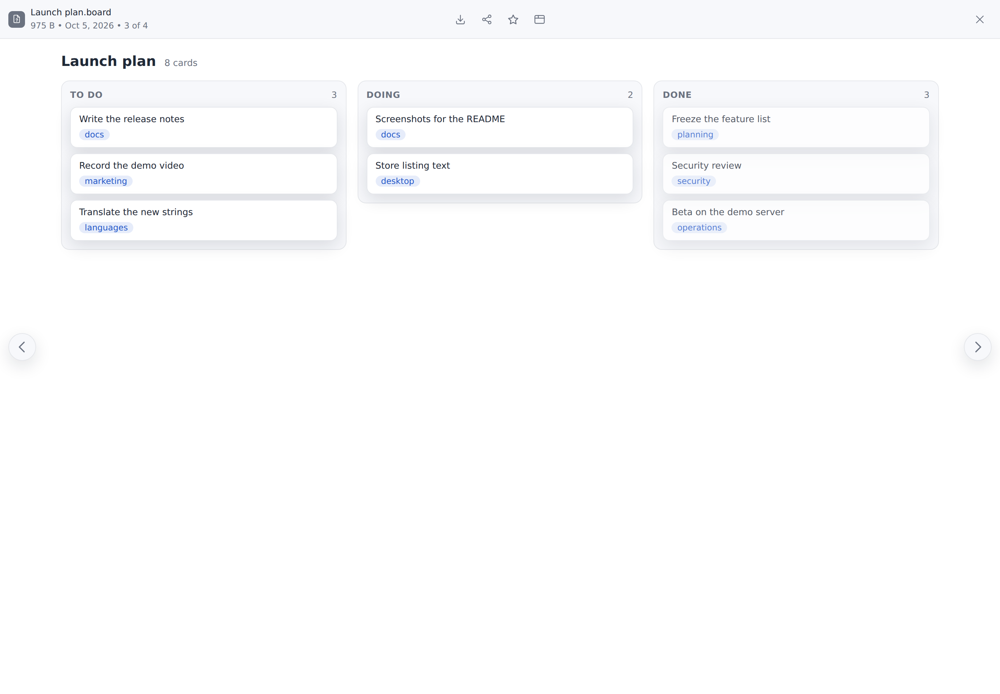

<sub>…and that interface open on its own file type, where filex's preview would be. It reads and saves the file through filex, in a sandboxed frame (a small example app, written for these pictures)</sub>

</td>
</tr>
<tr>
<td width="50%" valign="top">

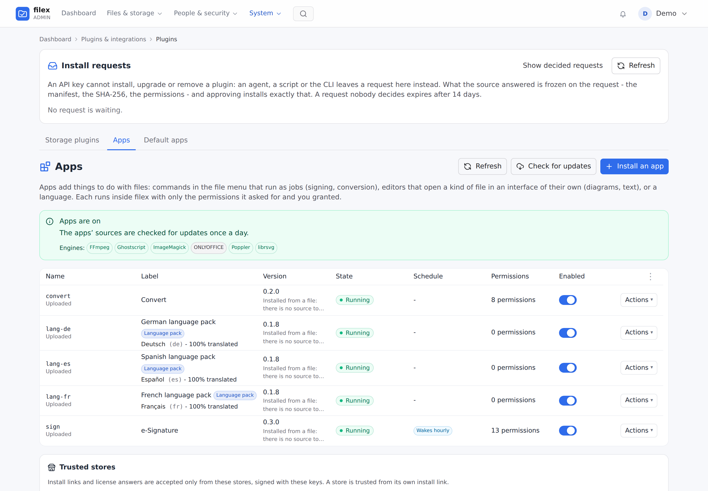

<sub>Every app on the instance, and a **language pack** among them - a manifest with nothing that runs, which says how much of this filex it translates and leaves with it</sub>

</td>
<td width="50%" valign="top">

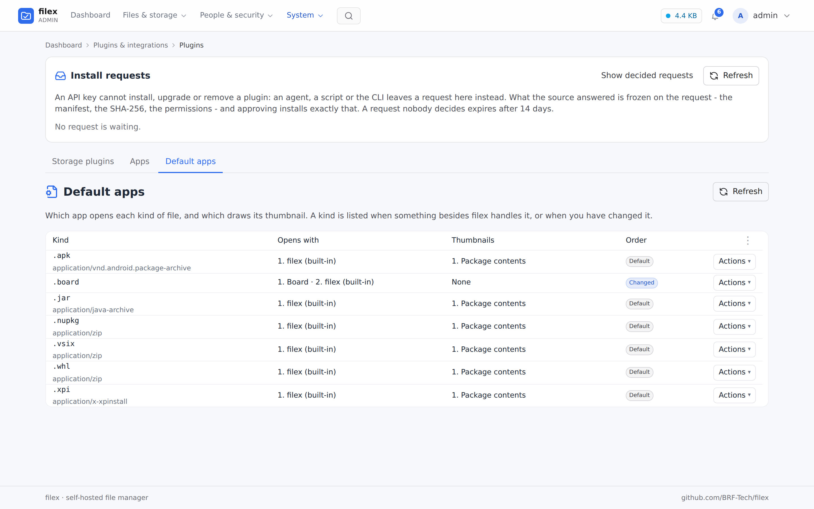

<sub>Default apps - every kind of file something besides filex handles: who opens it and who draws its thumbnail, in the order you set ([Default apps](docs/APP-PLUGINS.md#default-apps-which-app-opens-a-file-and-which-draws-its-thumbnail))</sub>

</td>
</tr>
<tr>
<td width="50%" valign="top">

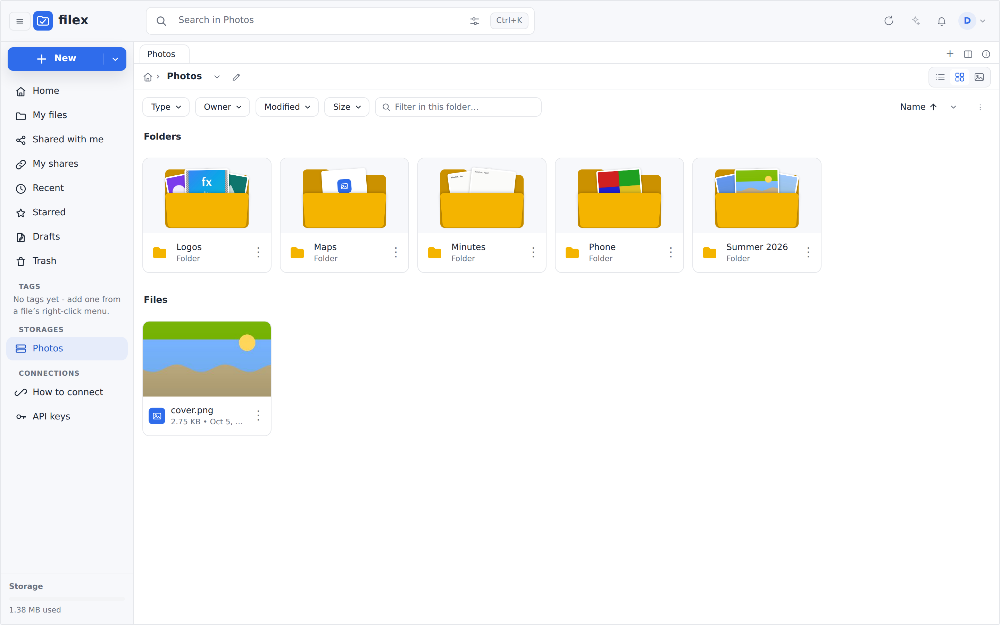

<sub>Folder previews - each folder drawn with the three files that came into it last; the SVGs are drawn by filex's built-in engine ([docs/thumbnails.md](docs/thumbnails.md#folder-previews))</sub>

</td>
<td width="50%" valign="top">

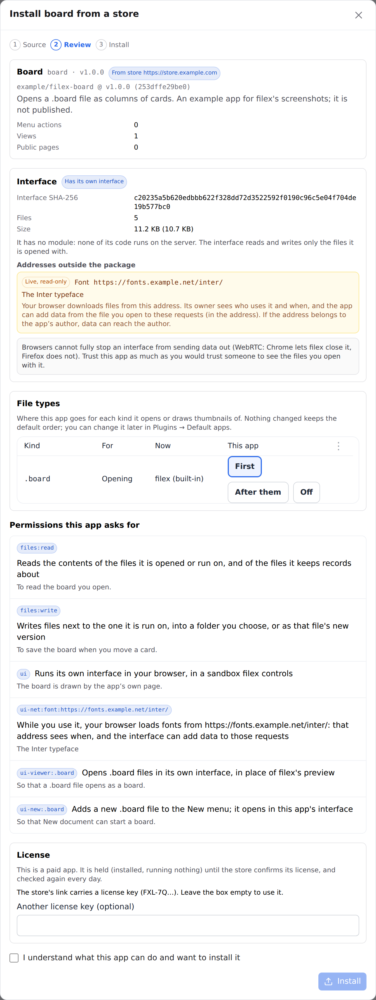

<sub>Installing from a store - the same review, marked **From store**, the paid app's license key shown by its first characters ([Installing from a store](docs/APP-PLUGINS.md#installing-from-a-store))</sub>

</td>
</tr>
<tr>
<td width="50%" valign="top">

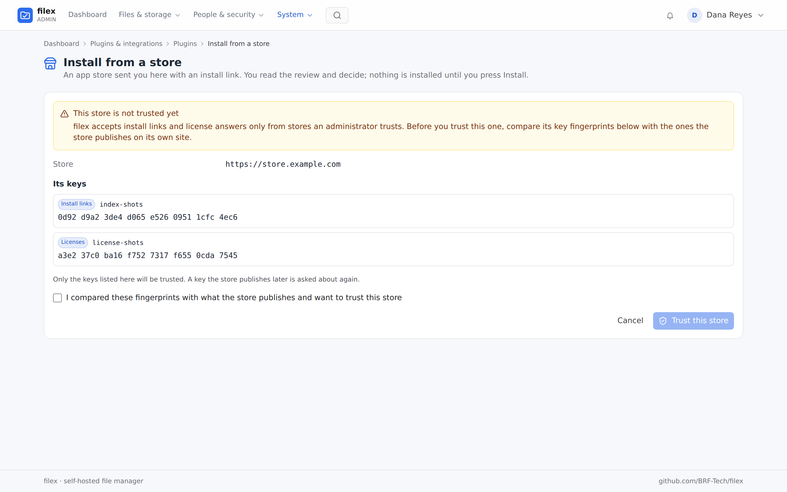

<sub>The first link from a store - its address and the fingerprints of its keys, to compare before you trust it ([Trusted stores](docs/APP-PLUGINS.md#trusted-stores))</sub>

</td>
<td width="50%" valign="top">

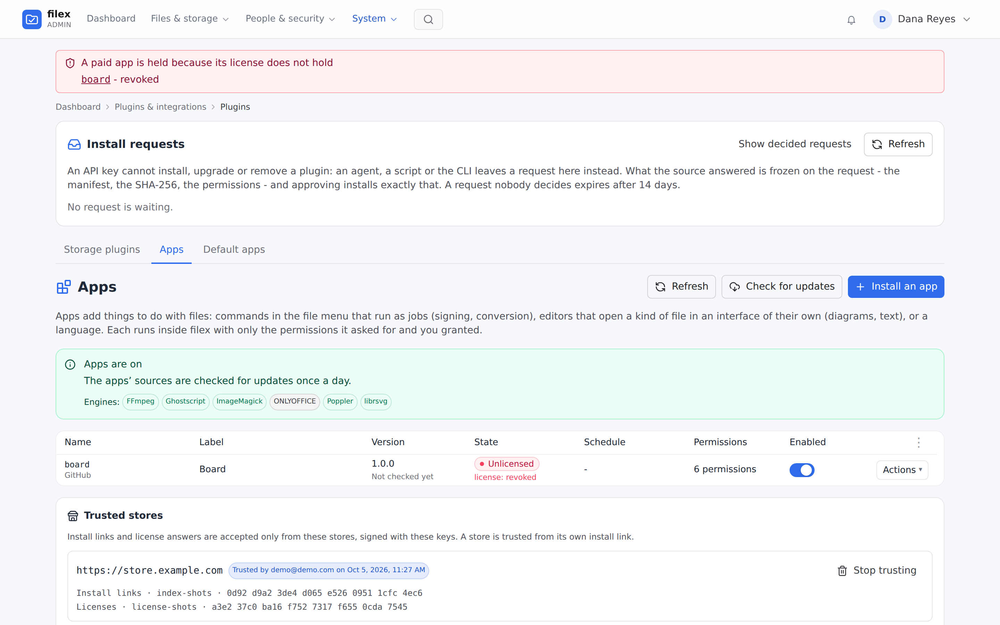

<sub>A license the store revoked - the app held, *Unlicensed*, nothing removed, and a band on every admin page ([Paid apps](docs/APP-PLUGINS.md#paid-apps))</sub>

</td>
</tr>
</table>

</details>

<br>

## AI agents / MCP

**An agent works in the folder you gave it, and nowhere else.**

- A native **MCP server** at `/api/ai/mcp`, and a REST surface at `/api/ai` described in an
  OpenAPI 3.1 file.
- An API key carries permissions by verb and can be confined to a single folder, and nothing
  it hands out can be wider than the key itself.
- A large file goes through an **upload ticket**: a short-lived, single-use URL, so its bytes
  never travel through the model's context.

```bash
claude mcp add filex --transport http https://files.example.com/api/ai/mcp \
  --header "Authorization: Bearer <api-token>"
```

<details>
<summary><b>More about AI agents and MCP</b> - what an agent can do, what a key can never hand out, encrypted folders, upload tickets</summary>

- **AI-agent-native** - a REST surface (`/api/ai`) bounded by an API key's permissions, plus a native
  **MCP server** (`/api/ai/mcp`); `/api/ai` and `/api/files` are described in an
  [OpenAPI 3.1 file](backend/internal/api/openapi.json) a test holds to the router. Hand an
  agent a token confined to one folder and it works there with the explorer's own
  operations - list, read, write, copy, convert, share, the trash, versions, archives -
  and nothing outside it.

filex ships a token-authenticated automation surface at `/api/ai` (list, read, write,
move, copy, delete, search, share, zip) and speaks **Model Context Protocol** at `/api/ai/mcp`.
An agent also runs the explorer's own operations - copy across storages, app actions such
as **convert**, the operations queue, trash and version history, 7z/TAR archives, its
links and file requests, the bell, stars, comments and the permissions on an item it
owns - through the explorer's own handlers, so the rules are the explorer's. An admin
key reaches what the panel does (tenants, identity providers, sign-in security, Default
apps, webhooks, storages) through the panel's own handlers. `/api/ai` and `/api/files`
are described in an [OpenAPI 3.1 file](backend/internal/api/openapi.json):

```bash
claude mcp add filex --transport http https://files.example.com/api/ai/mcp \
  --header "Authorization: Bearer <api-token>"
```

An API key carries permissions by verb (`read`, `write`, `delete`, plus `mcp` and `admin`),
optionally **confined to a single folder**, gated by the same RBAC grants and roles as the UI,
and stamped with per-key identities so audit logs, shares and presence show *who* (which
integration) did what. The verbs hold on **every surface the key reaches** - `/api/ai`, the
MCP tools, the explorer's own routes (and so `filex client` and an embed), WebDAV, SFTP, FTPS,
and the S3 keys and NFS exports minted from it. Some acts are never a key's: installing a
plugin - an agent **leaves an install request** an administrator approves in the panel - and
making someone an administrator. A key must name
at least one permission - an empty list is refused, never read as "all of them" - and
**what it hands out can never be wider than the key itself**: asking through a read-only or
folder-confined key for an API token, an S3 access key, an NFS export or an SSH key with more
verbs, a root outside its own, or a longer life is refused with `403 token_ceiling` naming what
was too wide. An
agent's **move never overwrites**: an item headed for a name that is taken lands
beside it under a free one (`report-copy.txt`), exactly as a move in the UI does,
and the answer names the path it really landed on. And it knows
**encrypted folders**: every row says whether it is encrypted, ciphertext is never
handed out as if it were the file (`409 E2E_ENCRYPTED`), and plaintext written into an
encrypted folder is refused unless the caller says it means it (`allow_plaintext`)
([docs/MCP.md](docs/MCP.md#encrypted-folders-and-fxe)).

A large file already on the agent's disk never fits through a tool call - its bytes would
have to travel through the model's context. **Upload tickets** fix that: one authorized
call pins the destination and returns a short-lived, single-use URL that needs **no
credentials**, so even an agent with no filex token can finish the transfer with
`curl -T bigfile <url>`. Details: [docs/MCP.md](docs/MCP.md).

</details>

<br>

# Coming from Nextcloud, Dropbox or Google Drive

filex is a file manager, not a groupware suite. What that means next to four things you may
be coming from (File Browser among them):

| Coming from | With filex |
|---|---|
| **Nextcloud**<br>A collaboration platform you host yourself or get from a provider: files, and around them calendar, contacts, mail, chat, video calls and an online office. A PHP application behind a web server, with a database. | The files part on its own.<br>One Go binary with SQLite inside (PostgreSQL or MySQL when you want them).<br>A desktop app with live folder sync, share links, SSO and LDAP.<br>Office documents in the ONLYOFFICE you connect.<br>No calendar, contacts, mail, chat or video calls. |
| **Dropbox**, **Google Drive**<br>Hosted services: your files live on the provider's servers, under its quota and its terms. | Your own server and the storage you already have: a disk, a NAS share, an S3 bucket.<br>The everyday things in place: a web UI, share links with a PIN and an expiry, file requests, trash and version history.<br>A desktop app that keeps the folders you choose in step. |
| **File Browser**<br>One binary that puts a web UI over one directory you point it at, with user accounts (each with its own scope and permission switches), allow and deny rules per path, and share links with a password and an expiry. Its repository is archived, and its [README](https://github.com/filebrowser/filebrowser) says there will be no further releases, bug fixes or security fixes. | The same one-command start.<br>Several storages side by side.<br>Roles and groups on top of per-folder access; OIDC single sign-on and LDAP built in.<br>Trash and versions, full-text search.<br>The same tree reachable as S3, SFTP, FTPS, NFSv3 and WebDAV. |

**What filex does not have**, whichever of these you come from:

- **An Android or iOS app.** On a phone filex is the web app, which can be installed like one
  but needs a connection to show files.
- **Placeholder files in Finder or Explorer.** The desktop app copies the folders you keep on
  the computer, and everything else stays online in its own window
  ([docs/DESKTOP.md](docs/DESKTOP.md#keeping-folders-on-this-computer)).
- **An office editor of its own.** Office documents are edited and co-authored in an
  ONLYOFFICE Document Server you run beside filex, and open in a read-only preview without
  one ([docs/ONLYOFFICE.md](docs/ONLYOFFICE.md)).

<details>
<summary><b>Moving in</b> - what comes with you, and what does not</summary>

- Where the files already sit somewhere filex can mount - a folder on a disk or a NAS share,
  a prefix in an S3 bucket, an SFTP, FTP or WebDAV server - moving in is a mount, not a
  migration. filex does not store files itself: point a storage at that folder and they are
  there, as they are.
- Files held in Dropbox or Google Drive have to be copied out to such a place first: filex
  ships no storage driver for either.
- Only the files move: the links, permissions and version history the old system kept are not
  imported.
- What filex adds - the trash, version history, drafts - sits in hidden folders at the
  storage's root, and a folder you encrypt end to end holds ciphertext from then on
  ([docs/STORAGE.md](docs/STORAGE.md), [docs/TRASH-VERSIONING.md](docs/TRASH-VERSIONING.md)).

</details>

<br>

# Self-host with Compose or Helm

The `docker run` above is enough to try filex out. For a real deployment,
ready-made stacks live in [`deploy/`](deploy/):

- **[`deploy/compose/`](deploy/compose/)** - Docker Compose:
  - **minimal** - filex + SQLite + local disk (one service, zero dependencies).
  - **full** - filex + PostgreSQL + Redis + Caddy (auto-HTTPS), plus toggleable
    add-ons: **OnlyOffice**, **Drawio** and an **S3 server** (Versity S3 Gateway). Turn each on/off with
    a Compose profile in `.env`. Conversion is the [Convert app](#apps), not a
    side-car.
- **[`deploy/helm/filex/`](deploy/helm/filex/)** - a Helm chart for Kubernetes
  (Deployment + PVC + optional Ingress). Every add-on above is an `enabled`
  toggle in `values.yaml` - bundle PostgreSQL / Redis / an S3 server, or wire external
  OnlyOffice / Drawio.

Step-by-step instructions for each tier are in
[docs/INSTALLATION.md](docs/INSTALLATION.md).

filex runs at the root of a host of its own or under a path of one it shares
(`https://example.com/filex/`): one setting, `FILEX_BASE_PATH`, and a proxy
that passes the full path - Caddy, nginx and Helm examples in
[docs/DEPLOYMENT.md → Serving filex under a sub-path](docs/DEPLOYMENT.md#serving-filex-under-a-sub-path).

- **Boringly deployable** - one binary or one container, on a host of its own or under a
  sub-path of one you share; SQLite by default, Postgres/MySQL
  when you want them; every driver switched by env vars. All three engines are
  migrated, compared against each other and written to by CI on every change,
  because "supported" used to mean "compiles" ([docs/DATABASES.md](docs/DATABASES.md)).

<br>

# Documentation

The guides are published as a site at [docs.filex.sh](https://docs.filex.sh), and the
[full documentation index](docs/README.md) lists every page.

<details>
<summary><b>All guides by topic</b> - getting started, clients, protocols, apps, languages, storage and access, data and features, operating and extending</summary>

**Getting started** - [Installation](docs/INSTALLATION.md) ·
[Configuration](docs/CONFIGURATION.md) · [Admin panel](docs/ADMIN-PANEL.md) ·
[Databases](docs/DATABASES.md) · [Releases](docs/RELEASES.md) · [Updates](docs/UPDATES.md) ·
[Demo mode](docs/DEMO.md)

**Clients** - [Desktop app](docs/DESKTOP.md) · [Folder sync](docs/SYNC.md) ·
[CLI](docs/CLI.md) · [Integration / embedding](docs/INTEGRATION.md) ·
[AI & MCP](docs/MCP.md)

**Without a browser** - [Protocols (S3 · SFTP · FTPS · NFS · WebDAV ·
`filex mount`)](docs/PROTOCOLS.md) · [WebDAV](docs/WEBDAV.md)

**Apps** - [Apps: install, control, sign, convert](docs/APP-PLUGINS.md) ·
[Installing from a store](docs/APP-PLUGINS.md#installing-from-a-store) ·
[Paid apps](docs/APP-PLUGINS.md#paid-apps) ·
[Install requests](docs/APP-PLUGINS.md#install-requests) ·
[App permissions](docs/APP-PLUGINS.md#app-permissions) ·
[Default apps](docs/APP-PLUGINS.md#default-apps-which-app-opens-a-file-and-which-draws-its-thumbnail) ·
[Write an app](docs/PLUGIN-KIT.md) · [App wire contract](docs/APP-PLUGINS-API.md)

**Language & layout** -
[Write a language pack](docs/PLUGIN-KIT.md#writing-a-language-pack) ·
[Right-to-left languages](docs/RTL.md)

**Storage & access** - [Storage](docs/STORAGE.md) · [Storage plugins](docs/PLUGINS.md) ·
[Usage & cost](docs/USAGE.md) · [Uploads & resume](docs/UPLOADS.md) ·
[Quotas](docs/QUOTAS.md) · [SSO (OIDC)](docs/SSO.md) ·
[LDAP & proxy auth](docs/LDAP.md) · [Directory sync](docs/LDAP.md#directory-sync) ·
[Windows & Linux accounts](docs/OS-LOGIN.md) ·
[Sign-in attempt limits & trusted proxies](docs/CONFIGURATION.md#sign-in-attempt-limits) ·
[RBAC, folder access & API tokens](docs/RBAC.md) ·
[Roles & per-user permissions](docs/PERMISSIONS.md) · [Groups](docs/GROUPS.md) ·
[Multi-tenancy & realms](docs/MULTI-TENANCY.md) · [Tenant self-service](docs/TENANT-ADMIN.md)

**Data & features** - [Sharing & file requests](docs/SHARING.md) ·
[ShareX](docs/SHAREX.md) ·
[Trash & versioning](docs/TRASH-VERSIONING.md) · [Protection](docs/PROTECTION.md) ·
[Archives](docs/ARCHIVES.md) ·
[E2E encryption](docs/E2E-ENCRYPTION.md) ·
[Who may encrypt](docs/E2E-ENCRYPTION.md#who-may-encrypt) · [Search](docs/SEARCH.md) ·
[Realtime & presence](docs/REALTIME.md) ·
[Notifications](docs/NOTIFICATIONS.md) · [Thumbnails](docs/thumbnails.md) ·
[Replication](docs/REPLICATION.md) · [Themes & appearance](docs/INTEGRATION.md#themes)

**Operate & extend** - [Deployment](docs/DEPLOYMENT.md) · [Docker](docs/DOCKER.md) ·
[Metrics](docs/METRICS.md) · [Architecture](docs/ARCHITECTURE.md) ·
[Backend API spec](docs/BACKEND.md) ·
[OpenAPI 3.1 (`/api/files`, `/api/ai`)](backend/internal/api/openapi.json) ·
[Component API](docs/API.md) · [OnlyOffice](docs/ONLYOFFICE.md) ·
[CSV in ONLYOFFICE](docs/ONLYOFFICE.md#csv-files) ·
[Requests from other origins](docs/CONFIGURATION.md#requests-from-other-origins)

</details>

<br>

# Features

| Area | What you get |
|---|---|
| **The explorer** | One layout in the admin app, the desktop app and every embed: a navigation panel, list, grid and gallery views, tabs, personal and team tags, a ⌘K command palette, remappable keyboard shortcuts, new documents from the **+ New** menu and themes an operator composes ([Integration](docs/INTEGRATION.md), [Themes](docs/INTEGRATION.md#themes)) |
| **Storage** | Local disks, S3, FTP, SFTP, WebDAV and SMB/NAS mounted side by side, copy and move across them, and a plugin for anything else ([Storage](docs/STORAGE.md), [Storage plugins](docs/PLUGINS.md)) |
| **Without a browser** | The same tree served as S3, SFTP, FTPS, NFSv3 and WebDAV, plus `filex mount` over HTTPS ([Protocols](docs/PROTOCOLS.md)) |
| **Sign-in** | OIDC, LDAP / Active Directory, Windows and Linux accounts, and sign-in attempt limits ([SSO](docs/SSO.md), [LDAP](docs/LDAP.md), [OS accounts](docs/OS-LOGIN.md)) |
| **People and access** | Roles and per-person permissions, groups, per-folder access and native multi-tenancy ([Permissions](docs/PERMISSIONS.md), [Groups](docs/GROUPS.md), [Multi-tenancy](docs/MULTI-TENANCY.md)) |
| **Sharing** | Public links with a PIN, an expiry and a download limit, file requests and share invites by email ([Sharing](docs/SHARING.md)) |
| **Protection** | Trash and version history, optional ClamAV scanning, end-to-end encrypted folders, replication to a second storage and an audit log ([Trash & versioning](docs/TRASH-VERSIONING.md), [Protection](docs/PROTECTION.md), [E2E encryption](docs/E2E-ENCRYPTION.md), [Replication](docs/REPLICATION.md), [Audit log](docs/BACKEND.md#admin-audit-log)) |
| **Viewers and editors** | Images, video, audio, PDF, Markdown, code (Monaco), Office documents through ONLYOFFICE, draw.io and Mermaid diagrams, 3D models, and archives in ZIP, 7z and TAR ([ONLYOFFICE](docs/ONLYOFFICE.md), [Archives](docs/ARCHIVES.md)) |
| **Search and thumbnails** | Embedded full-text search that respects permissions, and thumbnails for images, video, PDF, folders and, with ONLYOFFICE connected, Office documents ([Search](docs/SEARCH.md), [Thumbnails](docs/thumbnails.md)) |
| **Real-time** | Presence and live file updates over WebSocket ([Realtime](docs/REALTIME.md)) |
| **Clients** | A desktop app with folder sync, a CLI, Vue / React / web component embeds, a REST API and an MCP server ([Desktop](docs/DESKTOP.md), [Sync](docs/SYNC.md), [CLI](docs/CLI.md), [Integration](docs/INTEGRATION.md), [MCP](docs/MCP.md)) |
| **Apps and languages** | Sandboxed apps (e-Signature, Convert, filextext, draw.io), language packs and a right-to-left layout ([Apps](docs/APP-PLUGINS.md), [RTL](docs/RTL.md)) |
| **Running it** | One binary or one container; SQLite, PostgreSQL or MySQL; webhooks and an in-app bell; a usage and cost view (Backblaze B2 today); update checks, with patch releases that install themselves once you allow it ([Databases](docs/DATABASES.md), [Notifications](docs/NOTIFICATIONS.md), [Usage](docs/USAGE.md), [Updates](docs/UPDATES.md)) |

<details>
<summary><b>The full feature list</b> - every feature as its own entry: how it behaves, its limits and the page that documents it</summary>

- **Multi-storage** - mount many storages at once (local, S3, FTP, SFTP, WebDAV, SMB/NAS); each appears as a top-level folder. Each also carries an address that never moves: the storage's name is the first path segment on WebDAV, SFTP, NFS and the S3 API, so renaming one would re-address it - a mount written against its **uid** survives every rename. **Copy or cut in one and paste in another**: filex streams the tree between the two drivers, keeps each file's timestamp, and only removes the original once the copy is verified. A store that is down is reported within seconds, and only silence is timed out, never a transfer that keeps moving (S3, WebDAV, FTP, SFTP and SMB: [docs/STORAGE.md](docs/STORAGE.md#when-the-store-is-down)). An entry the storage could not answer for (neither "here" nor "not found") is kept, marked with a **!** and the storage's own answer, and nothing is done with it - in the explorer, the REST and agent APIs, sharing and the editors (the file protocols do not read the mark) - until the storage answers again ([PLUGINS.md](docs/PLUGINS.md#an-entry-your-stat-cannot-answer-for)).
- **Drag files out to your desktop** - in the desktop app, drag a selection into Explorer/Finder or another program and it lands as separate real files and folders, not an archive; in a browser, a single file drags out the same way - in the admin app too, through a one-file link that lasts a minute and works once ([docs/DESKTOP.md](docs/DESKTOP.md#dragging-files-out)).
- **Storage plugins** - a storage filex has never heard of is a **separate program** you install from the admin panel: it describes its own config form, filex speaks a small HTTP/JSON protocol to it, and its driver then behaves like any built-in one. Any language; a Go SDK makes it three methods. filex **probes every capability a plugin claims** - at install, and again against the configuration you type when you save a storage on it - and refuses one that cannot do what it says, because a half-working driver produces failures that look like filex being broken. Upgrades replace the binary in place and roll back if the new one does not come up; every start checks the binary's hash and signature again, and each plugin keeps a **log** of its starts, failures and the entries it could not answer for (*Actions → Log*) ([docs/PLUGINS.md](docs/PLUGINS.md)).
- **Apps** - a second kind of plugin: a **sandboxed WebAssembly** module, an **interface of its own in a sandboxed frame** (no connection, no access to filex's session; see [Apps](#apps) for what a browser cannot promise), or both - adding actions to the file menu (*Request signatures…*, *Convert…*), screens filex draws for it, a section in a file's details, a home screen under **Apps** in the navigation, and links an outside participant opens without an account. Installed from a GitHub repository, or from a store's install link held to the store's pins ([Installing from a store](docs/APP-PLUGINS.md#installing-from-a-store); a paid app's license is the store's, and an app whose license does not hold is held, not removed - [Paid apps](docs/APP-PLUGINS.md#paid-apps)), through a **permission review** - the app gets exactly what you approved and nothing else: no filesystem, no network, no program on your server; the heavy engines (ffmpeg, ImageMagick, …) are the server's own and office documents go through the ONLYOFFICE you connect, offered one permission at a time. The screens filex draws obey filex's rules whoever wrote them - every choice visible rather than hidden in a dropdown, nothing folded behind "advanced", one question per step. The link an app sends to an outside signer is an ordinary **share**, so you see and revoke it in the same list as everything else, and it is never worth more than its creator: a job started from it passes the same checks as one started inside filex (an action you switched off stays off, the creator's access to the document is read again), and it stops working when the creator's account is switched off - until it is switched back on. An app may also bring **its own interface** - HTML and JavaScript filex serves from the app's approved package into a sandboxed frame whose policy allows no connection, no storage and no cookie, talking to filex over one checked channel; an editor that needs nothing on the server (draw.io, filextext) is an app with no module at all ([an app's own interface](docs/APP-PLUGINS.md#an-apps-own-interface), SDK `@brftech/filex-app-ui`). An app you grant `schedule` is woken once an hour to do its own work at the minute it chose, as an ordinary job in the queue. Nothing updates itself: filex checks each app's source daily and says when a newer version is there, an administrator reviews what it changes and approves it, everybody uses the version approved - and **Back to *version*** undoes an approval. Apps say which filex versions they work with. An API key never installs one - it leaves an **install request** an administrator approves - and an app can declare **permissions of its own** that you hand out per role and per person ([App permissions](docs/APP-PLUGINS.md#app-permissions)). An app can **draw thumbnails** of kinds filex does not (handed one file's bytes and nothing else), and **Default apps** decides, per kind of file, which app opens it and which draws its thumbnail, in which order; each person picks among the openers left on, with *Always use this app* kept on their account - one choice for the browser, the desktop app and an embed ([Default apps](docs/APP-PLUGINS.md#default-apps-which-app-opens-a-file-and-which-draws-its-thumbnail)). Four ship as public repositories: **e-Signature**, **Convert**, **filextext** and **draw.io** ([Apps](#apps), [docs/APP-PLUGINS.md](docs/APP-PLUGINS.md#the-apps-that-ship-alongside-filex), [write one](docs/PLUGIN-KIT.md)).
- **e-Signature** ([`BRF-Tech/filex-sign`](https://github.com/BRF-Tech/filex-sign), an app) - sign a PDF yourself, or ask others to: people on this filex sign inside it, from a notification that opens the right screen; anybody else gets a private link, behind a PIN by default - one filex keeps for you (see *Sharing*). The boxes are **defined first** - a name, whose it is, required or not, a date's layout - and **placed on the page after**, two questions on two screens. The document can be **frozen** for everybody, administrators included, while it is out; reminders and the deadline run on their own; the requester follows every signer in the file's details and on the app's home screen; and the result is a PAdES-signed PDF that is **certified** by its first signature and **sealed by filex** after its last, so a reader reports any change made afterwards as not permitted - with the **SHA-256 of the sealed bytes** and the seal's fingerprint sent to the requester and every signer, an **audit trail PDF** when you ask for one, a receipt for every signer, and an option to keep the finished file locked until an administrator lifts it. **Verify** reports any signed PDF: every signature, the certification, the seal, and whether this is the file whose hash was sent. Signing keys never leave the server: the instance's own certificate authority, or one you import, issues each signer a certificate, and the key that made a signature is destroyed seconds later ([docs/APP-PLUGINS.md](docs/APP-PLUGINS.md#signing-documents-end-to-end)).
- **Convert, as an app** ([`BRF-Tech/filex-convert`](https://github.com/BRF-Tech/filex-convert)) - *Convert…* on any file or selection: images, video, audio, documents, e-books, archives, data, subtitles and fonts. The target is a button under its category, then only the settings that matter for it, then a review; most routes run in pure Go inside the sandbox, the rest through the server's engines, and a target that needs a missing engine is listed as such rather than silently absent ([docs/APP-PLUGINS.md](docs/APP-PLUGINS.md#converting-files)). (The older iframe converter side-car was removed in 0.48.)
- **Protocol gateway** - the same tree is reachable as **S3** (SigV4; aws-cli, rclone, restic, mc, s3fs), **SFTP** (OpenSSH, WinSCP, FileZilla, sshfs), **FTPS** (explicit TLS, for the equipment that only learned FTP; hand it your reverse proxy's auto-renewing certificate - it is re-read on change), **NFSv3** (LAN NAS clients, media players) and **WebDAV** - each with its own credential you can revoke on its own, and all of them behind the same permissions, trash and quota as the UI ([docs/PROTOCOLS.md](docs/PROTOCOLS.md)).
- **`filex mount`** - attach a remote filex server to a folder over ordinary HTTPS: a folder on Linux, a **drive letter on Windows** (`filex mount Z:`, needs the free [WinFsp](https://winfsp.dev)). Not a sync: nothing is copied but a bounded read cache, so it opens one file out of a hundred thousand without downloading the rest.
- **Real-time collaboration** - presence bar with live avatars + focus, instant file-change updates over WebSocket, polling fallback. One write is announced the moment it lands; a burst (a zip extraction, a folder upload, an NFS client writing chunk after chunk) is merged into one frame per window so the folder stays live without flooding the page ([docs/REALTIME.md](docs/REALTIME.md)).
- **A listing that behaves like a table** - resize a column, hide one, drag one to a new place; the table scrolls sideways rather than dropping a column when it runs out of room, and the actions column stays pinned to the right. Sort by name, type, date or size, in either direction, and **the grid and the list obey the same sort** - until this release "sorted by size" was a fact about one view, and switching views reordered the rows under you. Sorted by date, all three views group the rows under **Today · Yesterday · This week · This month** and then month by month, in **your** time zone rather than the browser's.
- **A folder remembers how you left it** - optional, from user settings: the view mode and the sort of each folder you actually set up, kept **per person on the server** so they follow you to another machine and to the desktop app, and never leak to anyone else looking at the same folder. Off by default, in which case your last choice simply applies everywhere ([docs/INTEGRATION.md](docs/INTEGRATION.md)).
- **Who owns a file** - every node carries its owner, the listing has an **Owner** column and the filter row an **Owner** entry, and quota counts against the owner rather than whoever last touched the file.
- **Archives in every common format** - make, open and extract ZIP, 7z, TAR and its
  gzip/bzip2/xz forms (RAR where the server's 7-Zip has it), with a password for ZIP and
  7z, as a background job with progress. Links and devices inside an archive are refused
  before anything is written, and size and entry limits stop an archive bomb at the
  limit ([docs/ARCHIVES.md](docs/ARCHIVES.md)). Contributed by Alex (@ahjephson).
- **Take a selection with you** - pick several files and folders and **Download** streams them as one archive, built on the fly: no temporary file is written into your storage, nothing is buffered in the tab, and a 700 MB archive costs the server under a megabyte of memory. **Move to** and **Copy to** open a folder chooser that spans every storage and refuses a destination you cannot write to - server-side, not just in the dialog.
- **New document** - create a Word, Excel, PowerPoint or OpenDocument file, or any text or code format, from the **+ New** menu: name it - any name, `LICENSE`, `Makefile` or `test.conf` included - choose where it goes, and it opens in the editor that handles it. The templates are real, minimal, valid documents compiled into the binary, so this works on an install with no office suite at all; a type this deployment could not then open is not offered in the first place, and the dialog says why. A new document is a **draft** until its first save: nothing appears in the folder until you press Save (a name taken in the meantime is asked about - `report (2).txt`? - never replaced), closing it asks *Save to disk / Keep in Drafts / Discard*, and **Drafts** in the navigation panel keeps the ones you are not done with, visible to nobody else - 50 per person by default, set on the admin Protection page ([docs/ONLYOFFICE.md](docs/ONLYOFFICE.md#drafts-nothing-is-in-the-folder-until-you-save)).
- **RBAC + item permissions** - roles (Administrator, User, Viewer and custom roles, each a list of permissions - [docs/PERMISSIONS.md](docs/PERMISSIONS.md)), per-file/folder grants with inheritance under **Admin → Folder access**, **groups** that hold folder access and a role for everyone in them - members added by hand or kept in step with the groups a sign-in carries ([docs/GROUPS.md](docs/GROUPS.md)) - share invites by email (SMTP), grant-aware search and listings. A role that may have lost a permission to an older version's page is pointed out on **Admin → Roles**, with one click to give it back ([docs/PERMISSIONS.md](docs/PERMISSIONS.md#things-to-know)). **Shared with me** answers the reverse question from the recipient's side - what other people granted you, and which storages you reach only through a grant.
- **The shell** - one layout, for the operator and the end user alike, in the admin app, the desktop app and every embed: a top bar spanning the full width with the collapse control and the product mark at its left edge, one **search field** whose ⌘K / Ctrl+K chip hands the query to the command palette (the field searches this folder; the palette is where "everywhere", saved searches and commands live), a primary **+ New** menu (upload files · new folder · **new document** · request files), a **Type · Owner · Modified · Size** filter row under the breadcrumb, **Folders** and **Files** as labelled sections in grid view, an info panel split into **Details** (with "People with access" and a share-link row) and **Activity** (version history and comments), and a **storage line** under the navigation. Theme, palette, language, density, the time zone, the start page and the notification switches all live in **user settings**, reached from the avatar - and the web app keeps your theme, palette, density and language on your **account**, not in the browser, so they are waiting for you in the next one; the keyboard editor and *Restart the tour* are in the same menu. Nothing is removed from the build - an embed, which has no settings dialog, keeps a "⋯" menu that still holds them ([docs/INTEGRATION.md](docs/INTEGRATION.md)).
- **Home, inside the shell** - the landing view for everybody, admins included: your storages, what you opened last and what you starred, as cards in the content area with the same navigation panel and the same header as the files. Moving between Home and a folder changes the content and nothing else. An operator who would rather land on the admin dashboard chooses it in their profile settings.
- **Navigation panel** - the **+ New** menu as the primary action, the destinations Home / My files / Shared with me / **My shares** / Recent / Starred / **Drafts** / Trash, the storages you can see - **in your own order** (drag a row, or Move up / Move down / Sort by name from its menu; kept on your account), else in the order the administrator set on the Storages page ([docs/STORAGE.md](docs/STORAGE.md#ordering-storages)) - an **Apps** section when an installed app has a home screen, and **How to connect** + **API keys**: the per-protocol guides and the self-service token manager, opened from inside the explorer so an embedded copy's users can mint the credential WebDAV/FTPS/`filex mount` ask for instead of asking an administrator. Collapsible to an icon rail (remembered per browser) from the top bar, a drawer instead of a column under 560px. On by default in the web app, the desktop app and every embed; `uiProfile: 'simple'` additionally turns off the tab strip, the split pane, the gallery view mode and the "How to connect" surface without removing any of them from the build ([docs/INTEGRATION.md](docs/INTEGRATION.md)).
- **Sharing** - public links with PIN, expiry and max-downloads, under an admin-set **maximum link life** (default 7 days - the dialog only offers what the server will keep); folder links stream as ZIP (cached, pre-warmed up to a size ceiling, swept after a week); **file-request** upload links for inbound drops; ShareX-compatible upload endpoint. **My shares** lists the links you created - for everybody, not only administrators - with *Copy link*, *Copy PIN* and *Revoke*: a link's PIN is kept sealed beside the hash that guards it, so its creator or an administrator can read it back when somebody needs it again, and every read is written to the audit log. Five wrong PINs shut any public link for ten minutes. A download link, a file request and an app's page are **one branded public screen** - your instance's name, logo and colours, one PIN gate, one expiry story and a language picker ([docs/SHARING.md](docs/SHARING.md)).
- **Desktop app + folder sync** - Windows/Linux/macOS app: tray-resident two-way sync, **selective sync** (right-click → *Keep on this computer*, one root folder per account, the rest online-only), several accounts at once, **opens Office documents from your own disk** in the server's editor, self-updating (macOS: unsigned build, updates by re-download until it is signed). Each document opens in **its own window** (titled with the file's name), the windows are **frameless** with the app's own controls (native traffic lights on macOS), and **Settings → Open files with** chooses single- or double-click to open ([docs/DESKTOP.md](docs/DESKTOP.md), [docs/SYNC.md](docs/SYNC.md)).
- **Trash & version history** - deletes are reversible within a retention window, writes keep snapshots; both live in the storage you already mounted ([docs/TRASH-VERSIONING.md](docs/TRASH-VERSIONING.md)).
- **Write protection** - optional ClamAV scanning of every file written - the built-in editor included, and files the storage sync finds on the backend rather than through filex - reached through a local binary or a clamd container over the network; plus trash/version retention behind one admin surface. The switch, the scanner mode and address, the size ceiling and the editor save-scan window live on **Settings → Protection**; the `FILEX_CLAMAV*` variables seed them on a first boot and then step aside (the scanner's binary path stays environment-only, deliberately - it is a command this server executes) ([docs/PROTECTION.md](docs/PROTECTION.md)).
- **E2E encrypted folders** - client-side WebCrypto; the server stores ciphertext and never receives a key. A folder has a **level**: contents only (the default - WebDAV, the CLI and desktop sync keep working with its names) or **contents and names** (AES-SIV, so the server keeps no readable name), and it can be raised later, resumably, from its **Encryption settings**, where its password is changed too. A folder you already have is **encrypted in place**, files over 200 MB included; **any single file can be encrypted on its own** (a self-contained `.fxe` with its own password and recovery key); files of any size are encrypted as a stream; an unlocked folder downloads as a **decrypted zip** made in the browser; `filex decrypt` opens a downloaded folder or `.fxe` on your own machine, and **`filex encrypt`** makes an encrypted folder from one on disk, or encrypts a folder on the server where it is - for folders too large for a tab, resumable, the keys made on your machine ([docs/CLI.md](docs/CLI.md#filex-encrypt---make-a-folder-an-encrypted-folder)). Each folder gets a **recovery key**, shown once, so a forgotten password is not automatically lost data; an operator can optionally enable **key escrow** - at install, or adopted later on a running installation; it never reaches existing folders on its own, but their owners are offered the choice at unlock - and its use notifies the folder's owner ([docs/E2E-ENCRYPTION.md](docs/E2E-ENCRYPTION.md)). **Who may encrypt** is the organisation's call: a platform operator's switch per tenant, a tenant policy (off, administrators only, everyone whose role allows it, or **after an administrator's approval** - a request with a reason, approved for one person, one folder and one kind of encryption, once), and the `files.encrypt` permission, asked at every door that could make something new encrypted, copies included ([docs/E2E-ENCRYPTION.md](docs/E2E-ENCRYPTION.md#who-may-encrypt)).
- **Native multi-tenancy** - provider/tenant mode with per-tenant isolation on one instance. Each tenant has a **realm** - its sign-in name, given at creation and never changed - so a sign-in names its tenant by the tenant's own address (the web page, the WebDAV `Host`, the FTPS certificate name) or by the realm: a **Realm** field on the sign-in form, `realm/name` over SFTP. The account lookup never leaves the tenant, and a realm typed on the platform's page for a tenant with an address of its own is **handed over** there with a one-use, 60-second ticket ([docs/MULTI-TENANCY.md](docs/MULTI-TENANCY.md), [realms](docs/MULTI-TENANCY.md#realms-which-tenant-a-sign-in-is-for)). Tenants run themselves on **Admin → Tenants** and **My tenant**: sign-in providers bound to one tenant or several, a tenant's own OIDC and LDAP, a platform subdomain for every tenant and own domains proven by a CNAME, certified by the proxy, by filex itself (ACME) or with the tenant's own certificate ([docs/TENANT-ADMIN.md](docs/TENANT-ADMIN.md)).
- **Driver-pluggable everything** - storage / auth / DB / queue drivers opt-in via env (`FILEX_AUTH_DRIVERS=local,oidc`, `FILEX_QUEUE_DRIVER=postgres`, …); the operating-system sign-in (`windows`, `pam`) is the exception, switched on from the admin panel once its test has passed.
- **OIDC SSO-first** - optional auto-redirect to your IdP with break-glass local login (`?local=1`), and the admin role follows an IdP group at every sign-in.
- **LDAP / Active Directory** - **directory sync** (*Sync now*, or on a schedule) opens an account for everyone in the directory before their first sign-in, keeps group memberships in step, brings the directory's groups in as filex groups, and disables in filex whoever the directory disables (sessions, API keys and SSH keys with them); people are known by their permanent directory id, so a changed e-mail keeps its account and a reused one does not inherit it; several directories each manage only their own people and groups ([directory sync](docs/LDAP.md#directory-sync), [several directories](docs/LDAP.md#several-directories)). Directory accounts sign in on the same password form as local ones, and with the same password on WebDAV, SFTP and FTPS (S3 and NFS take the keys and exports they mint); private-CA support, and `local` stays first so `admin@local` works while the directory is down. An account's e-mail is always an address: the entry's mail attribute, else a name typed as `name@domain`, else `name@local` (`name@<realm>.local` in a tenant's realm; the one rule the operating-system providers use too); an account an older filex opened under the bare name is **adopted** at its next sign-in, files, shares and role unchanged ([docs/LDAP.md](docs/LDAP.md)).
- **Replica + reconciliation** - primary→replica fan-out (mirror / append-only / skip per path-glob rule), read fallback, scheduled status report, one-click "Fix all".
- **Persistent op queue** - restart-safe queue in your own database (SQLite / Postgres / MySQL) or in Redis, worker pool with retries + cancel + admin dashboard. Every driver orders by priority, so the antivirus scan for a file somebody just uploaded is served ahead of the twenty thousand a first import queued. Unset, the driver follows the database rather than defaulting to SQLite - pointing SQLite statements at a Postgres server is a syntax error on every poll and no job ever runs.
- **DB-backed file tree** - listings come from the DB cache (1-5 ms), not the storage backend (~100 ms); a periodic sync catches out-of-band changes, by etag where the backend reports one and by size + modification time where it does not. A storage's **Paths to exclude from scanning** (`.*`, `downloads/incomplete/**`, `*.tmp`) keeps the parts of an existing tree filex has no use for out of the walk, the catalogue, the search index and the virus scanner - a cost control, not an access control ([docs/STORAGE.md](docs/STORAGE.md#scan-exclusions)).
- **Lazy catalogue for big local trees** - `sync_mode: lazy` skips the walk up front: the folder you open is listed straight from disk at once and catalogued first, and the rest is catalogued by a slow background pass that yields to people (or only as folders are opened). Opened folders are watched within a budget, a folder nobody visited is never treated as deleted, and search, folder sizes and usage say plainly when they do not cover everything yet ([docs/STORAGE.md](docs/STORAGE.md#lazy-catalogue), [design](docs/LAZY-CATALOGUE.md)). Idea by Alex ([#45](https://github.com/BRF-Tech/filex/issues/45)).
- **Viewers & editors** - image/video/audio, PDF, Markdown (split editor + preview), CSV (ONLYOFFICE's spreadsheet when it is configured, where a save keeps the cells nobody changed as they were written ([docs/ONLYOFFICE.md](docs/ONLYOFFICE.md#cells-nobody-changed-keep-their-text)); a read-only table otherwise), code (Monaco), Office via OnlyOffice, Drawio + Mermaid diagrams, 3D models. A document ONLYOFFICE can only save in a newer format (a `.doc` edited, saved as DOCX) is kept **beside** the original under the right extension, never written over it, and the people who edited it are told ([docs/ONLYOFFICE.md](docs/ONLYOFFICE.md#a-save-in-another-format)). OnlyOffice's **Test now** fetches through the same door a document uses and warns when the document server does not enforce JWT, and after *Download failed* the editor says which of the two failures behind that message it was ([docs/ONLYOFFICE.md](docs/ONLYOFFICE.md#failure-editor-shows-download-failed)). With more than one app or viewer for a kind of file, **Open with** and **Choose an app…** pick one, and *Always use this app* is kept on your account.
- **Notifications** - generic JSON webhooks (Slack/Discord-agnostic): any number of targets, each with its own signing secret and its own per-event subscription, plus an in-app bell with read/unread and a per-user mute matrix. The unread count is a **badge on the bell** - exact to 99, `99+` above, and on the desktop app's dock icon where the system has one - a row is clickable exactly when it has somewhere to go (a signature request opens the signing screen, not a notifications page), and **View all** opens every one of your notifications over the explorer, for everybody rather than only administrators. A write that **creates** a file and a write that **replaces** one are different events (`file.uploaded` / `file.updated`), and the ones an operator most wants on their own - an infected upload quarantined, a failed upload, an encrypted folder opened with its recovery key - are subscribable individually ([docs/NOTIFICATIONS.md](docs/NOTIFICATIONS.md)).
- **Search** - Bleve embedded, full-text + metadata, permission-aware. VS Code-style filename scoring: folders count and word order does not (`main code` finds `Code/main.go`), separators and typos forgiven (`invoice 2026` finds `invoice_2026.pdf`, `mian.go` finds `main.go`) while numbers are matched literally (`2026` never means `2025`), `tag:` filters, exact matches ranked first. A ⌘K result can be downloaded (a folder as one zip) or dragged out where it stands ([docs/SEARCH.md](docs/SEARCH.md)).
- **Thumbnails you can read**: a PDF shows its **first page**, top-anchored so the title is in the card; a video its first frame that is not black (opening on a fade used to produce a black square, and a clip shorter than a second produced nothing at all while the row still said "ready"); an Office document its rendered first page; and a text, code or CSV file **fills the card with its own first lines** rather than repeating the extension the row already prints. image, video (ffmpeg), PDF (ghostscript), Office (the connected OnlyOffice); capability-aware, and a server missing one of those binaries now says so in its log at boot instead of silently drawing coloured rectangles. A cached thumbnail is released when the file it belongs to is deleted for good, and a periodic reconciler reclaims the orphans an older install accumulated. A thumbnail **follows its file**: one changed outside filex, or one that never had a picture, is drawn again when a listing or the sync sees it; **SVG** is drawn by a built-in engine on every install (with size and time limits an administrator sets), and **HEIC/AVIF** photos through ImageMagick; transparent pictures sit on a checkerboard; a **folder shows the files that came into it last**, drawn with the folder in the grid, the gallery and the list, and what it holds on hover (an administrator can turn that off); text files show their first lines and archives what is in them; a file whose tool is missing is named, not papered over; and **Admin → Tools → Thumbnail repair** redraws a file, a folder or a storage on demand ([docs/thumbnails.md](docs/thumbnails.md)).
- **Tabs, themes & deep links** - several folders open side by side, light/dark/auto theme, and an address bar that tracks the open folder so a pasted link lands there. Eight palettes ship in the theme gallery, each one a map of the `--fe-*` tokens rather than a second stylesheet, so a host page or an embed can pick one - or set its own values - without forking any CSS; an operator can add their own (see *Appearance*).
- **Appearance: your colours, everywhere** - the admin panel's **Appearance** screen composes named themes - twelve colours for light and for dark, a corner radius, a font stack - previewed as you type, and makes one the **instance default**. The text on a coloured button is chosen by contrast rather than assumed to be white, the rest of the palette is derived on the server, and the theme reaches the sign-in page and every public link - in its own tones, or in colours you give those two pages of their own - because branding that stops at the login is not branding: a signed-out page wears the instance default, never the palette of whoever last used that browser, and a signed-in person's own pick wins. Themes export and import as one JSON file. A **custom stylesheet** is the dangerous tool beside it, and it is now off until you switch it on, never served to anyone who is not signed in, cannot fetch anything, and cannot reach the screen that turns it off ([docs/INTEGRATION.md](docs/INTEGRATION.md#themes)).
- **One table, everywhere** - there is one table left in filex, the explorer's, and every other list is it: the admin panel's menus, **My shares**, an app's own screens. Each freezes its first column on the left and its actions on the right, resizes, reorders and sorts the same way, and ends each row in **one pinned Actions menu** holding everything that row can do - the same menu the explorer's ⋮ opens, so a second table cannot drift away from the first. An installed app with a home screen gets its own row under **Apps** in the panel's navigation.
- **An admin panel you can find your way in** - the administrator's pages sit in a mega menu in the top bar: the dashboard, then **Files & storage**, **People & security** and **System**, each a panel of named sections with a short line under every page. Every page is two clicks away at the address it always had, a delegated administrator is offered only the pages their permissions open, the keyboard and screen readers are covered, and a phone gets the same pages as a list in a drawer ([Admin panel](docs/ADMIN-PANEL.md)).
- **Symlinks, at the storage boundary** - a link inside a `local` storage that points inside it is followed and opens as what it points at; one that leaves the storage is **listed with a badge and the reason**, and refused for reading, writing and deleting - unless you switch on *Follow symlinks that leave this folder* for that storage ([docs/STORAGE.md](docs/STORAGE.md#symlinks)).
- **Open the way each device expects** - with a **mouse**, a single click selects and a **double click opens** (Enter opens the selection) - the classic file-manager gesture, and a per-viewer preference (`ExplorerConfig.openTrigger`, default `'double'`; the desktop app exposes it as **Settings → Open files with**, and `'single'` restores one-click open). On a **touchscreen** a tap always opens - there is no hover-to-select. On every device the **checkbox** is the one click or tap that selects (Shift extends the range) and a right click or long press opens the menu; list rows, grid cards and gallery tiles all carry it.
- **Keyboard, and it says so** - every verb in the right-click menu and the toolbar prints the key that runs it, read from the registry so it follows a remap. Thirty-two actions are remappable from *Shortcut settings* (stored per browser); the handful of combinations a browser takes for itself, like `Ctrl+W`, are refused with a reason instead of stored as a key that would never fire.
- **Usage & cost** - filex does not meter your provider's bill; it reads the report the provider already writes, normalises it and prices it with a table you can edit. Backblaze B2's daily CSVs are read over the same S3 API filex already speaks, so no new dependency and no new credential type. Free allowances are their own fields rather than constants in a formula, and the page keeps the provider's account-level row apart from its per-bucket rows - summing them counts the same transactions twice, by exactly the amount nobody notices ([docs/USAGE.md](docs/USAGE.md)).
- **Audit log** - every mutation recorded with actor, integration identity and metadata.
- **CLI client** - the same binary reaches a remote server (`filex client`, `filex sync`) with no server-side plugin: copy and move across storages, the trash, versions, tags, app actions, archives and your links, each server job followed to its end; `filex client login --realm` signs in to a tenant, `filex encrypt` makes encrypted folders, and a saved session is only ever sent to the address it was saved with ([docs/CLI.md](docs/CLI.md)).
- **Self-updating** - minor releases are announced for one-click upgrade, and patch releases install themselves once you allow it (`AUTO_UPGRADE=true`; out of the box filex only checks and tells you); an install a package manager owns (Homebrew, winget, Snap, a distribution package) or a container is told about new releases and the command to take them, and the admin page says it will only announce ([docs/UPDATES.md](docs/UPDATES.md)).
- **Single binary** - goreleaser matrix: linux/macOS/Windows × amd64/arm64. CGO=0, modernc.org/sqlite.
- **i18n** - English + Turkish out of the box, **public links included**: a
  share link, a PIN gate, a file-request page or an app's signing screen
  renders in the visitor's language, and the public shell **offers a picker**,
  because a stranger's browser language is a guess and the person reading a
  contract should be able to correct it. The plain no-JS pages resolve
  `?lang=`, then `Accept-Language`, then the server default. **The text the
  server writes comes from the same catalogue** - mail, the notification
  phrases, the no-JavaScript pages and an install's permission review - each
  addressed to the reader it has always had, falling back to English per key,
  and a translation whose placeholders do not match the English is not used at
  run time, so a mail never loses its link or PIN.
- **Language packs** - any other language is an **app with nothing that runs**:
  a manifest of strings, installed from a GitHub repository, an upload or a URL
  like any other app, listed under **Plugins → Apps** with its coverage of the
  running version (*Español - 97% translated · the rest shows in English*). Its
  language joins every picker - the settings dialog, the admin header, public
  share pages - and translates the explorer, the admin panel and the public
  pages alike. Plural forms follow **CLDR categories**, so a pack writes `zero`,
  `one`, `two`, `few`, `many` and `other` where its language has them. Spanish,
  German and French ship as examples, and a template repository plus
  `scripts/i18n-export.mjs` / `i18n-validate.mjs` walk a translator from export
  to install - the validator holds a pack to the rules the built-in languages
  keep, a plain hyphen where a text would reach for a long dash among them
  ([write one](docs/PLUGIN-KIT.md#writing-a-language-pack)).
- **Right-to-left layout** - Arabic, Hebrew, Persian, Urdu and any other
  right-to-left language lay the whole interface out right to left: the
  navigation panel, the tables, the drag-and-drop and column-resize geometry,
  the menus and the direction icons. What must **not** mirror does not - a PDF
  field editor works in document space, and a path, a command or any other
  machine text is isolated so it reads left to right inside a right-to-left
  sentence, including sentences the server wrote. The rule is enforced by a
  guard test: layout is written in logical CSS properties only
  ([docs/RTL.md](docs/RTL.md)).
- **Tags, personal or your team's** - a tag is either **personal** - yours
  alone, never named to anybody else - or a **team** tag shared inside the
  tenant, which takes edit permission on the file to add or remove. A tag opens
  every file carrying it, from every folder they live in, and `tag:` narrows a
  search. Capitals are kept as typed.
- **Identity providers, managed from the panel** - **Admin → Identity
  providers** now drives sign-in rather than storing settings nothing read:
  OIDC, LDAP, the header proxy, the local password form and the operating
  system's own accounts - **Windows** (local or domain, `LogonUserW`, nothing to
  install) and **Linux PAM** - each with a **Test now** that really probes it and
  says which leg it verified. An operating-system provider is switched on only
  by a test that signed a real account in, and that account becomes a super
  administrator; it cannot be switched on from the environment. Every provider
  follows **one first-sign-in rule** - whether it may open an account
  (`auto_create`, off by default for Windows and PAM) and for which groups
  (`allowed_groups`). What is set in the environment or in `config.yaml` **wins,
  visibly**; a client secret or bind password is write-only and sealed at rest
  with `FILEX_SECRET_KEY`, never sent back; and the last way in cannot be
  switched off from the page ([docs/SSO.md](docs/SSO.md),
  [docs/LDAP.md](docs/LDAP.md), [docs/OS-LOGIN.md](docs/OS-LOGIN.md)).
- **Sign-in security** - wrong passwords are counted per account identifier
  (whether or not the account exists, so the count gives nothing away) and per
  client address, on the web form, WebDAV, FTPS and SFTP alike: 5 per account
  and 10 per address within 10 minutes shut the door for a minute, doubling up
  to 15, and a lock refuses even the right password. The sign-in form says how
  many tries are left, in the reader's language. An **IP allow-list** is the
  way back in - no account is privileged, the first administrator included
  (only a public demo's shared account is counted per address alone,
  [docs/DEMO.md](docs/DEMO.md)) - and **Admin → Sign-in security** holds the
  limits, the list, the locks with *Lift the lock*, and the sign-in trail: every wrong
  attempt, lock, release and settings change, once each, whichever door an
  administrator used (the panel, an API key, MCP). The address counted is the
  socket's peer unless that peer is a proxy you trust (`FILEX_TRUSTED_PROXIES`,
  by default `auto`: this machine and, in a container, the other containers on
  its network - never the gateway, never the LAN; the page names a peer that
  sends forwarded addresses without being trusted and offers to add it), so a
  client cannot pick its own address by writing `X-Forwarded-For`
  ([docs/CONFIGURATION.md](docs/CONFIGURATION.md#sign-in-attempt-limits)).
- **Changes from another site are refused** - a request that changes something and
  carries only the visitor's session (the cookie, or a trusted proxy's sign-in header)
  must come from filex's own pages, its own address or an origin listed in
  `FILEX_CORS_ALLOWED_ORIGINS`; anything else is answered `403 cross_origin_refused`
  before a route runs. Keys, share and drop links, upload tickets, S3 and scripts are
  unaffected ([docs/CONFIGURATION.md](docs/CONFIGURATION.md#requests-from-other-origins)).

</details>

<br>

# Architecture

See [docs/ARCHITECTURE.md](docs/ARCHITECTURE.md).

<details>
<summary><b>The pieces at a glance</b> - drivers, protocols and packages in one diagram</summary>

```
┌─────────────────────────────────────────────────────────────┐
│  filex (Go binary; image ~43 MB slim / ~225 MB full)        │
├─────────────────────────────────────────────────────────────┤
│  HTTP API (chi)  │  Admin UI (Vue 3, embedded)              │
│  Auth Drivers:   │  local · oidc · ldap · proxy-header      │
│                  │  pam · windows (OS accounts)             │
│  Sign-in guard:  │  attempt limits · IP allow-list · realms │
│  Storage Drivers:│  local · s3 · ftp · sftp · webdav · smb  │
│  Served as:      │  s3 · sftp · ftps · nfs · webdav         │
│  DB Drivers:     │  sqlite (default) · mysql · postgres     │
│  Queue Drivers:  │  follows the DB · redis                  │
│  Realtime:       │  WebSocket presence + live updates       │
│  RBAC:           │  roles + groups + grants + share invites │
│  AI / MCP:       │  /api/ai REST + native MCP server        │
│  Sync Worker:    │  etag / size+mtime diff + tombstone      │
│  Replica Layer:  │  primary→replica + rules + reconcile     │
│  Protection:     │  trash + versions + ClamAV (bin/clamd)   │
│  E2E folders:    │  client-side WebCrypto (server blind)    │
│  Notifications:  │  webhook + in-app bell + read/unread     │
│  Search:         │  Bleve (full-text, embedded)             │
│  Thumbnails:     │  image · svg · video · pdf · office      │
│                  │  heic · text · zip · folders · apps      │
│  Plug & Play:    │  OnlyOffice · Drawio · Mermaid           │
│  Apps (wasm):    │  sandboxed · e-Signature · Convert       │
│  Languages:      │  en · tr + language packs · RTL layout   │
│  Appearance:     │  operator themes · instance default      │
└─────────────────────────────────────────────────────────────┘
                          ▲
                          │ HTTP API
       ┌──────────────────┼──────────────────┐
       │                  │                  │
   @brftech/         @brftech/          @brftech/
   filex-core        filex             filex-react
   (Vue 3 SFC)       (Web Component)   (React adapter)
       │                  │                  │
       ▼                  ▼                  ▼
   Vue 3 apps       Any framework      React apps
                    (vanilla, Angular,
                    Svelte, Solid, …)

   Same API, no server plugins:  desktop app (Electron, Windows/Linux/macOS)
                                 CLI client (filex client · filex sync)
```

</details>

<br>

# Contributing

[](https://github.com/BRF-Tech/filex/actions)

Issues and pull requests are welcome; before a sizeable pull request, open an issue that
says what you are about to do. [docs/CONTRIBUTING.md](docs/CONTRIBUTING.md) has the
workflow, the tests a change has to pass and the documentation rules, and the project follows
the [Contributor Covenant](CODE_OF_CONDUCT.md). A security problem is reported privately, as
[SECURITY.md](SECURITY.md) describes. What changed in each release is in
[CHANGELOG.md](CHANGELOG.md).

<details>
<summary><b>Development</b> - build from source, and what lives where</summary>

```bash
git clone https://github.com/BRF-Tech/filex.git
cd filex
pnpm install
pnpm run build:all    # builds packages, web, then Go binary
./bin/filex serve
```

Subdirectories:
- `backend/` - Go HTTP service (cmd/filex, internal/*, db/queries, db/migrations)
- `packages/core` - `@brftech/filex-core` (Vue 3 SFC, source of truth)
- `packages/webcomponent` - `@brftech/filex` (Web Component wrapper)
- `packages/react` - `@brftech/filex-react` (React adapter via @lit/react)
- `web/` - Vue 3 admin UI (embedded into Go binary via `go:embed`)
- `desktop/` - Electron app (bundled main process, tray sync, auto-update)
- `demo/` - Standalone HTML demos for each framework
- `e2e/` - Playwright suites (web, embeds, packaged desktop app) + `shots/`, the
  scripts `pnpm shots` runs to retake every screenshot above
- `docker/` - Dockerfiles + compose
- `deploy/` - ready-made Compose stacks + Helm chart (see [`deploy/`](deploy/))
- `docs/` - Markdown documentation
- `docs-site/` - VitePress site published at [docs.filex.sh](https://docs.filex.sh)

</details>

<br>

# License

MIT - see [LICENSE](LICENSE).

The store badges in [`docs/badges/`](docs/badges/) are the stores' own artwork, used
unmodified and not covered by that licence: Microsoft and the Microsoft Store badge are
trademarks of the Microsoft group of companies; the Snap Store badge is © Canonical Ltd.,
licensed [CC BY-ND 2.0 UK](https://creativecommons.org/licenses/by-nd/2.0/uk/).

Nextcloud, Dropbox, Google Drive, File Browser and ONLYOFFICE are the names of other
parties' products, used here only to describe them. filex is not affiliated with, sponsored
by or endorsed by any of them.
