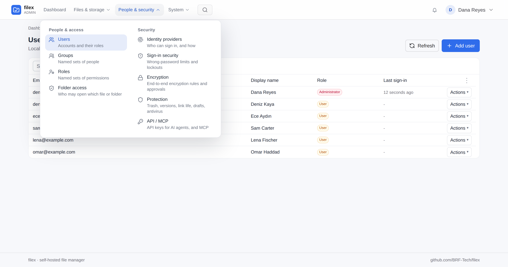
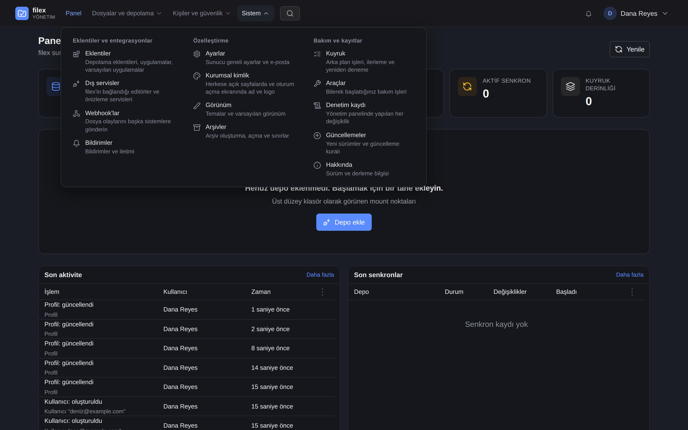
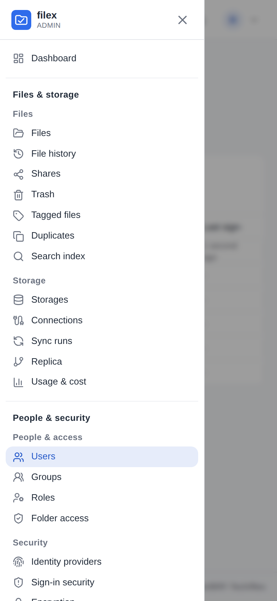

# Admin panel

The admin panel is where an administrator runs a filex instance: storages,
people, sign-in, plugins, settings and upkeep. It is served at `/admin/`
(the people who use the files have their own door, `/drive/`).

This page is the map: where every page of the panel lives in its menu, who
is offered which page, and how the menu works with a keyboard, a screen
reader and on a phone. What each page does is in the page's own guide,
linked from the table below.

## The menu

Since 0.51 the panel's navigation is a **mega menu** in the top bar. The
**Dashboard** is a plain link at its start; every other page sits in one of
three panels, each opened by its button and laid out in columns, with a short
line under every page saying what it is for:

| Panel | Section | Pages |
|---|---|---|
| **Files & storage** | Files | Files (the file manager), File history, Shares, Trash, Tagged files, Duplicates, Search index - see [Sharing](SHARING.md), [Trash & versioning](TRASH-VERSIONING.md), [Search](SEARCH.md) |
| | Apps | One row per installed app that has a screen of its own - see [Apps](APP-PLUGINS.md). The section is not shown when no app has one. |
| | Storage | Storages, Connections, Sync runs, Replica, Usage & cost - see [Storage](STORAGE.md), [Protocols](PROTOCOLS.md), [Replication](REPLICATION.md), [Usage & cost](USAGE.md) |
| **People & security** | People & access | Users, Groups, Roles, Folder access, Tenants or My tenant - see [Roles & permissions](PERMISSIONS.md), [Groups](GROUPS.md), [RBAC & folder access](RBAC.md), [Tenant self-service](TENANT-ADMIN.md) |
| | Security | Identity providers, Sign-in security, Encryption, Protection, API / MCP - see [SSO](SSO.md), [LDAP](LDAP.md), [End-to-end encryption](E2E-ENCRYPTION.md), [Protection](PROTECTION.md), [MCP](MCP.md) |
| **System** | Plugins & integrations | Plugins, External services, Webhooks, Notifications - see [Storage plugins](PLUGINS.md), [Apps](APP-PLUGINS.md), [OnlyOffice](ONLYOFFICE.md), [Notifications & webhooks](NOTIFICATIONS.md) |
| | Customization | Settings, Branding, Appearance, Archives - see [Configuration](CONFIGURATION.md), [Archives](ARCHIVES.md) |
| | Maintenance & records | Queue, Tools, Audit log, Updates, About - see [Updates](UPDATES.md) |

| | |
|---|---|
|  |  |
| *People & security* open over *Users*: two sections, a line under every page, the page you are on marked. | The same menu in Turkish and in the dark theme: *System*, three sections. |

Every page is two clicks away: the panel's button, then the page. The
page's own sub-pages (a storage's settings, a person's page, a file's
versions) are reached from the page, as before.

**Addresses did not change.** The menu groups the pages; it did not move
them. `/admin/users`, `/admin/login-security`, `/admin/plugins?tab=defaults`
and every other link or bookmark from an earlier release opens the same page.
The other guides still name a page as *Admin → Page* (for example
*Admin → Sign-in security*); that page is in the table above.

Under the top bar, the trail names the section a page lives in, between the
dashboard and the page: *Dashboard › People & access › Users*. The section is
words, not a link - it is a heading in the menu, not a page.

## Who sees which page

The menu offers a person exactly the pages the panel would open for them -
the same rule the server applies to each page's API:

- An **administrator** sees every page.
- A **delegated administrator** - an account given an `admin.*` permission
  without the administrator role ([Roles & permissions](PERMISSIONS.md)) - sees
  the pages that permission opens, and the file manager:

  | Permission | Pages |
  |---|---|
  | `admin.monitor` | Dashboard, Sync runs, Usage & cost, Queue |
  | `admin.users` | Users, Groups |
  | `admin.grants` | Folder access |
  | `admin.shares` | Shares |
  | `admin.audit` | Audit log |

- On a **multi-tenant** install, *Tenants* is the platform operator's and *My
  tenant* is a tenant administrator's; a single-tenant install shows neither
  ([Multi-tenancy](MULTI-TENANCY.md)).
- An app's screen (the *Apps* section) is an administrator's.

A section with nothing left in it is not drawn, and neither is a panel with
no section left: a delegated administrator holding only `admin.users` sees no
Dashboard link, *Files & storage* with Files alone, *People & security* with
Users and Groups, and no *System* at all.

## Keyboard and screen readers

The menu is a navigation landmark named *Admin menu*. Each panel button says
whether its panel is open (`aria-expanded`) and which panel it opens; each
section's list is labelled by its heading; the page being looked at is
marked as the current page. The pages are ordinary links, so a middle click
or *Open in new tab* works on every one of them.

| Key | On a panel button | Inside a panel |
|---|---|---|
| Enter / Space | opens or closes the panel | opens the page |
| ↓ | opens the panel and moves to its first page | the next page |
| ↑ | opens the panel and moves to its last page | the previous page; from the first page, back to the button |
| ← / → | the previous / next button (mirrored in right-to-left languages) | - |
| Home / End | the first / last button | the first / last page |
| Esc | closes the panel | closes the panel and returns to its button |

A panel opens on a click (or a key), never when the pointer passes over it.
It closes when a page is chosen, on a click anywhere outside it, and when
focus moves out of the menu.

## On a phone

Below 1024 pixels wide the top bar has a **Menu** button instead. It opens a
drawer with the same pages as a list - a heading per panel, a smaller heading
per section, and every section open - so a page is two taps away: *Menu*,
then the page. The drawer opens scrolled to the page you are on, and closes
when you choose one, tap outside it or press its close button.

