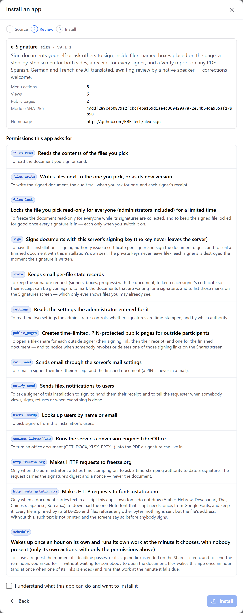
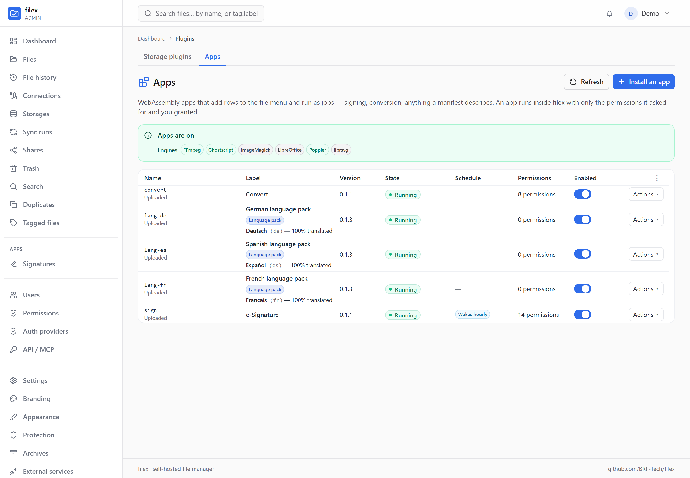
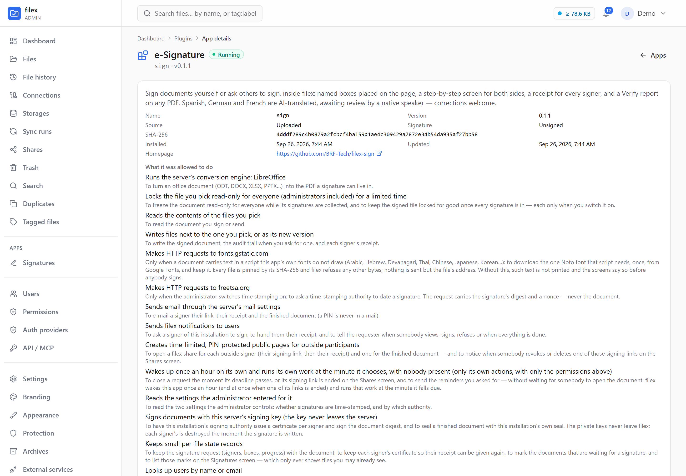
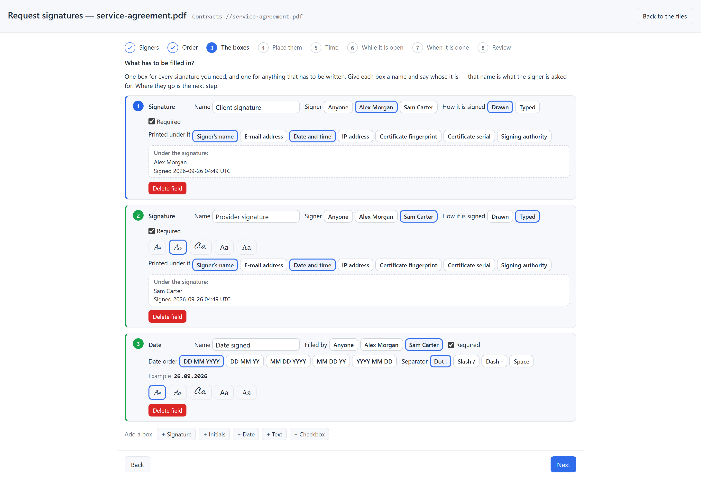
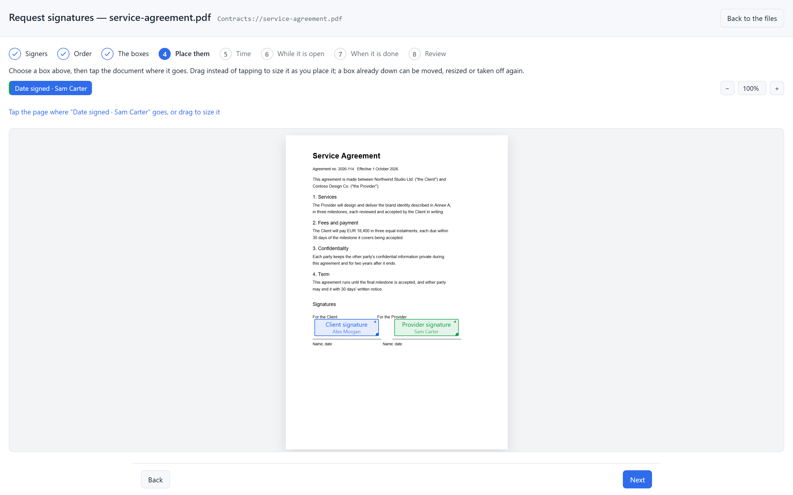
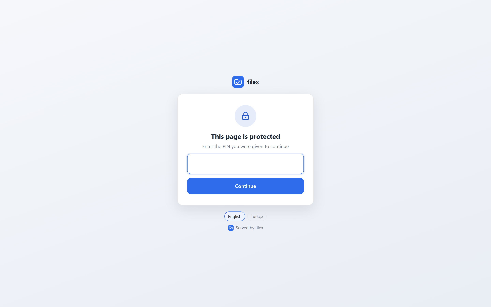
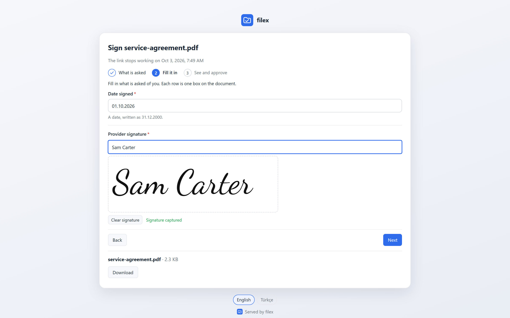
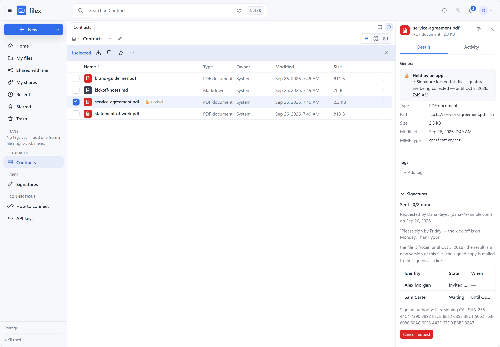
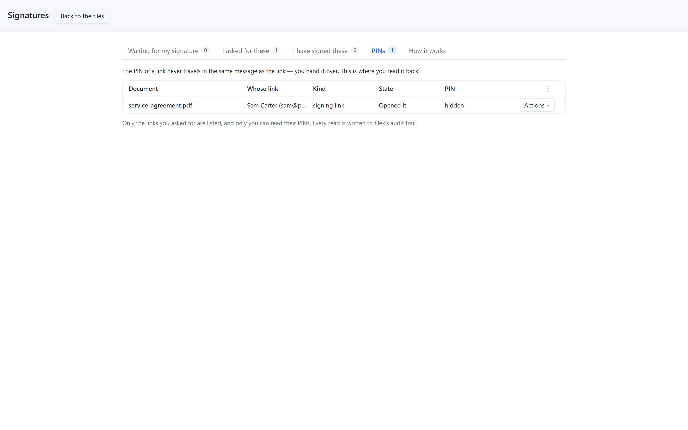

# Apps (app plugins)

A [storage plugin](PLUGINS.md) teaches filex a backend. An **app** teaches it a
*thing to do with files*: sign them, convert them, send them somewhere, ask an
outside person to act on them. Apps appear as rows in the file menu, as
screens filex draws for them, as a section in a file's details, as a home
screen under **Apps** in the navigation, and — when they say so — as a link an
outside participant opens without an account.

An app is a **WebAssembly module** that runs *inside* the filex process, in a
sandbox that hands it nothing it was not granted: no filesystem, no network,
no environment, no database — only the host functions filex exposes, each
gated by a permission the administrator approved at install, and only the
files the person who ran the action actually selected. That is the whole
point of the design: an app installed from a stranger's repository cannot
read your storages, cannot call home, and cannot run a program on your
server, because the sandbox never offers those things. The heavy engines an
app may need (ffmpeg, ImageMagick, LibreOffice, Ghostscript, poppler, rsvg)
are the server's own binaries, offered through one host function under one
permission each, with the arguments checked so they can only name the files
the app was handed.

```
Admin → Plugins → Apps → Install an app      Explorer: right-click a file
   ┌─────────────────────────┐                ┌────────────────────────────────┐
   │ filex-app.json + .wasm  │──sha256──▶     │ Request signatures… / Convert… │──▶ ops job ──▶ output file
   │ (GitHub / upload / URL) │  + review      │ (from the app's manifest)      │
   └─────────────────────────┘                └────────────────────────────────┘
```

Apps are distinct from storage plugins in every way that matters: a storage
plugin is a separate *program* started by filex with the same filesystem and
environment; an app is a sandboxed module. The admin panel's **Plugins** page
has one tab for each — **Storage plugins** and **Apps** — and they are managed
through different APIs. The page opens on **Apps** once the runtime is on and
at least one app is installed.

This page is for the person who runs filex. Writing an app is
[PLUGIN-KIT.md](PLUGIN-KIT.md); the wire contract, route by route, is
[APP-PLUGINS-API.md](APP-PLUGINS-API.md).

---

## The two apps that ship alongside filex

Both are public repositories — read them before you install them, fork them,
or use them as the starting point for your own.

| App | Repository | What it adds |
|---|---|---|
| **e-Signature** | [`BRF-Tech/filex-sign`](https://github.com/BRF-Tech/filex-sign) | **Sign…**, **Request signatures…**, **Sign / Fill** and **Verify** on PDFs (and office documents, converted first); a **Signatures** home screen; a **Signatures** section in a document's details. In English, Turkish, Spanish, German and French. The worked example on this page: [Signing documents, end to end](#signing-documents-end-to-end). |
| **Convert** | [`BRF-Tech/filex-convert`](https://github.com/BRF-Tech/filex-convert) | **Convert…** on any file or selection: images, video, audio, documents, e-books, archives, data, subtitles and fonts. See [Converting files](#converting-files). |

The Convert app is not the older, optional [converter side-car](CONVERT-INTEGRATION.md),
which is a separate service filex calls over HTTP; the two can be used side by
side.

## Install one

**Admin → Plugins → Apps → Install an app.** The wizard has three steps —
*Source*, *Review*, *Install* — and three sources:

| Source | What you give | What filex does |
|---|---|---|
| **GitHub repository** | `owner/name` (a pasted `https://github.com/…` address is trimmed) and the **tag** of the release you want | Fetches `filex-app.json` from the repository at that ref, reads `wasm.url` (where `{tag}` stands for the ref you gave) and `wasm.sha256`, downloads the module and refuses it unless the hash matches |
| **Upload files** | the `.wasm` module and its `filex-app.json`, plus a detached signature when the instance requires one | Installs what you uploaded; the hash is recorded |
| **From a URL** | the module's URL, the manifest's URL and the module's SHA-256 | The GitHub path with the two addresses spelled out |

There is no marketplace. An app is a public repository whose root holds
`filex-app.json`; that address is how it is found, shared and updated.

### From GitHub, step by step

1. **Admin → Plugins → Apps → Install an app → GitHub repository.**
2. **Repository:** `BRF-Tech/filex-sign` (or `BRF-Tech/filex-convert`).
   **Ref:** the tag of a release — the repository's *Releases* page lists them.
   ⚠ Give the tag. Left empty, filex reads the manifest from `main` (then
   `master`) and puts that branch name where the manifest's download address
   says `{tag}`, and a release asset does not live under a branch name — the
   download fails with `fetch_failed`.
3. **Review permissions.** filex has already fetched the module and checked
   its SHA-256 at this point; nothing is installed yet.
4. Read the review (below), tick **I understand what this app can do and want
   to install it**, press **Install**.
5. The wizard ends on *"The app is installed and running."* The app's rows are
   in the file menu from the next time it is opened.



### The permission review

The wizard always stops here before anything is installed: a summary of the
app (its label, name and version, description, how many menu actions, views
and public pages it has, the module's SHA-256, its homepage), then **every
permission the manifest asks for** — the permission's id, what it allows in
plain words, and the reason the author gave for asking. Installing means
granting *exactly* that list — no more (an app cannot use a permission it did
not declare) and no less (the install is refused with the missing ones named).
An **upgrade** whose new manifest asks for a permission the installed one did
not have stops at the same review; until you approve, the old version keeps
running.

For e-Signature the list is long, and each line is worth reading:

| Permission | What it allows | Why e-Signature asks |
|---|---|---|
| `files:read` / `files:write` | read the file you pick; write next to it or as a new version | read the document; write the signed copy, the audit trail and receipts |
| `files:lock` | freeze the file read-only for everyone, administrators included — for a limited time, or until an administrator lifts it | the *Freeze the file while signatures are collected* option, and *Lock the signed file when every signature is in* |
| `sign` | have this server's signing key sign a digest (the key never leaves the server) | one certificate per signer, issued by the instance's authority, and the installation's seal that closes a completed request |
| `state` | keep small per-file records | the request itself — signers, boxes, progress — and the list on its home screen |
| `settings` | read the settings you enter for it | whether signatures are time-stamped, and by which authority |
| `public_pages` | open time-limited, PIN-protected links for people without an account | one signing link per outside signer, their receipt, the finished document |
| `mail:send` | send email through the server's mail settings | invitations, reminders, receipts (a PIN is never mailed) |
| `notify:send` | send filex notifications | "please sign", and telling the requester what moved |
| `users:lookup` | look up this instance's users by name or email | picking signers who have an account |
| `engines:libreoffice` | run the server's LibreOffice | turning an office document into the PDF a signature lives in |
| `http:freetsa.org` | make HTTP requests to that host only | a time stamp, when you switch time stamping on — a digest and a nonce, never the document |
| `http:fonts.gstatic.com` | make HTTP requests to that host only | one Noto face, downloaded once and kept, when a name or a box is written in a script the app does not carry (Arabic, Hebrew, Devanagari, Thai, Chinese, Japanese, Korean…); the file is pinned by its SHA-256 and nothing but its address is sent |
| `schedule` | be woken once an hour to run its own actions, with nobody present | closing a request at its deadline and sending reminders ([below](#apps-that-wake-up-on-their-own)) |

After **Install**, filex compiles the module and calls its `describe` export.
A module whose answer does not match the manifest you approved — a different
name, version or manifest version, or a permission the manifest did not
declare — is refused and removed: the file on disk is the operator's intent,
the module's own answer is the proof it is the same program. An app granted
`schedule` whose module has no `tick` export is refused too.

**Signed modules.** Set [`FILEX_PLUGIN_TRUSTED_KEYS`](CONFIGURATION.md#storage-plugins)
and an unsigned or badly signed module is refused at install and at upgrade.
⚠ A GitHub or URL install made through the wizard carries no detached
signature, so on such an instance install with **Upload files** and paste the
signature beside the module.

## What the administrator controls after install

The **Apps** tab lists every installed app: its name (with the source, and
*Signed* when it is), label, version, state (*Running*, *Off*, *Refused* or
*Failed*, with the reason), a **Wakes hourly** badge for an app granted
`schedule`, how many permissions it holds, an **Enabled** switch, and the
row's one **Actions** menu: **Details**, **Upgrade**, **Remove**. A banner above
the table says whether apps are on here, which engines this host has, and
whether signatures are required.



A **language pack** (below) sits in the same list and is read the same way —
its row says what it is, and, per language, how much of THIS filex it
translates.

- **Enabled.** Switching an app off removes it from every menu at once; its
  data (settings, per-file state, the links it opened) stays — **including any
  file locks it holds**, which is deliberate (a document out for signature does
  not become editable because the app was switched off) but means you lift them
  yourself, from the app's details, if the flow is never coming back. Its
  public links answer *not available* while it is off.
- **Upgrade** takes the same three sources as an install, and stops at the
  review when the new version asks for more.
- **Remove** deletes the module, its settings, its action overrides, **its
  per-file state (every request it had open), its locks (so every lock it held
  is lifted), its queued work and its schedule**. The links it opened stay in
  **Shares** but answer *not available* from that moment. The instance's
  signing authority is not the app's and stays.

**Details** opens the app's own page — `/admin/plugins/apps/<name>`, one
section per card, **Back** returns to the Apps tab:



- **The facts** — name, version, source (for a GitHub install,
  `https://github.com/<repo>@<tag>`), signed or unsigned, SHA-256, when it was
  installed and updated, and what it was allowed to do — in the sentences the
  install review showed, the permission's key only as a tooltip.
- **Settings** — the form the manifest declares (`settings[]`, the same field
  shapes storage drivers use; a choice is a row of buttons, never a dropdown).
  A field marked secret is sealed at rest with the instance key and is only
  ever opened inside the app's own `settings_get` call; the page shows `***`,
  and saving `***` keeps it.
- **Menu actions** — one row per action in the file menu: turn it off,
  restrict it to administrators, or change the *applies* rule (which kinds,
  extensions and MIME types it is offered for, and whether several files may
  be selected). The manifest's rule is the default the author chose; your
  changes win. ⚠ Switching an action off is checked again at the moment
  anything would run it — a scheduled piece of work and a job asked for from a
  public link included. To stop new e-Signature requests, switch off
  **Request signatures…**; to stop the app altogether, switch the app off.
  - ⚠ An app's **hidden** actions (e-Signature's *Apply a signer's
    submission*, a scheduled *expire*) are its machinery, not menu rows: they
    are not listed, an override sent for one is not stored, and one already in
    the table is not honoured. Switching one off used to half-break the app
    in a way no menu showed.
  - ⚠ What you change is stored as a **change against the manifest** — the
    extensions and MIME types you added and removed, and what you set
    differently — and applied to the rule the app declares *now*, with the
    engines present *now*. Extensions offered only while an engine is on the
    server (an office file while LibreOffice is there to turn it into a PDF)
    are listed in the editor with the rest and marked; they appear when the
    engine is installed and go when it is removed, unless you took them out.
    An upgrade that adds an extension reaches a customised action too, and the
    manifest's own conditions (e-Signature's "only on a file with a request
    open") are never lost by customising. Keeping only extensions whose engine
    is missing offers the action on nothing, not on every file; clearing every
    extension and MIME type is how you say "any file". Overrides saved by an
    earlier version are converted once, at start, keeping what they said.
- **Schedule** — for an app granted `schedule` only: when it wakes next, what
  its last wake-up decided, and the work it asked for, each piece with its due
  time, its state and the queue job it became. Read-only.
- **File locks** — the files this app has frozen, with the reason and until
  when. **Lift the lock** is the way out for a flow that was abandoned; it is
  audited (`app_plugin.unlock`), and the app is not told.
- **Log** — the last 500 lines the app logged, plus the host's own warnings
  about it (a refused host call, a load failure, each wake-up's decision),
  refreshed every two seconds while the page is open. The ring is in memory:
  a restart empties it.

## Apps that wake up on their own

Most apps run because somebody clicked. An app that asks for the **schedule**
permission also runs when nobody did: filex wakes it once an hour, it answers
with the work it wants done and *when*, and filex runs each piece at the
minute it named. That is how a signature request closes itself at its deadline
and tells both sides, and how the reminders a requester asked for go out,
instead of waiting for the next person to open the status screen.

What that means for you:

- It is a **permission**, in the install review like every other, with the
  plainest label there is: *"Wakes up once an hour on its own and runs its
  own work at the minute it chooses, with nobody present."* An app you never
  granted it is never woken. The app list marks the ones you did.
- It runs **the app's own actions**, with only the permissions you already
  granted — it cannot reach further asleep than it can awake. But there is no
  person behind it, so no one's file permissions narrow it: on a
  multi-tenant instance this is an instance-wide grant. Give it to apps you
  would let run unattended.
- You see every run where you already look: each scheduled piece of work is
  an ordinary job in the queue tray (`plugin-action`, with the app, the
  action and its message, and no person as its actor), and every wake-up
  writes a line to the app's log (`wake-up: <what the app said> — N scheduled`).
- Your switches still win. Switch the app off and its pending work is
  dropped with the reason recorded, while the wake-up survives so turning it
  back on costs an hour at most. Switch one **action** off and nothing
  scheduled can run it — checked again at the moment it would run, not only
  when it was scheduled. Remove the app and its schedule goes with it.
- It is off where it must be: `FILEX_APP_PLUGINS_DISABLED=1` means nothing is
  ever woken, and **demo mode** stops the schedule even if the runtime is on.
- If it misbehaves it costs itself an hour, not the server: a wake-up that
  crashes or hangs is torn down at its budget (30 seconds at most), recorded,
  and asked again next hour. Nothing retries in between.

The contract — what a wake-up may touch, the bounds, two servers on one
database — is [APP-PLUGINS-API.md → The scheduled wake-up](APP-PLUGINS-API.md#the-scheduled-wake-up-tick--v3).

## What a person sees

- **Menu rows.** Right-click a file (or several) and the actions whose rule
  accepts the selection appear under the built-in ones. An action that
  writes needs *editor* on the file; a storage that is read-only refuses
  writing actions; files inside an encrypted folder are never offered — the
  server has no key to hand the app. The menu's filter is a convenience; the
  server checks all of this again when the action runs. Rows can follow the
  file's state: e-Signature offers *Request signatures…* on a document with
  nothing pending and *Sign / Fill* on one with a request open — the built-in
  actions stay beside them.
- **Locks.** An app may lock a file while its flow runs (a document out for
  signature): the file turns read-only for *everyone*, administrators
  included — no saves, no new versions, no rename, move or delete of the
  file or of the folders above it, and no upload over it — until the app
  lifts the lock or its time limit passes (at most a year; the app picks, 30
  days by default), or, where the app asked for a lock with **no end**, until
  an administrator lifts it. The row shows a **Locked** badge, and the details say
  which app holds it, why and until when; siblings and uploads into the same
  folder are unaffected; the locking app itself still writes its result into
  the file.
- **Jobs.** Running an action queues a job in the same tray as copies and
  moves: progress, a message the app chose, **Cancel**, and **Open** on the
  output once it landed. Outputs are written next to the input under the name
  the app or its manifest chose (a taken name gets a suffix, nothing is
  overwritten), or as a new version of the input when the action says so —
  through the same path every other write takes, so versioning, antivirus,
  search and the activity feed all see them.
- **Screens.** Some actions open a screen first (a conversion's options, a
  signing wizard). The app describes the screen as data — fields, steps, a
  list, a people picker, a PDF with boxes to name or to place, a signature
  pad — and filex draws it with its own components, as a dialog or, for the
  wizards that want the whole window (a document beside the form), as a full
  page in a new tab. No app ever ships HTML or script into your browser;
  anything not in filex's catalogue of screen parts is dropped before it is
  drawn. A screen may also let you choose where the result goes — a new
  version of the same file, a new file beside it, or a name of your own.

  Three rules filex enforces on every screen, whichever app drew it, because
  a form that hides what it is asking is the same bug in every app: **every
  choice is visible** (a choice renders as a row of buttons, never a dropdown
  whose options you have to click to read), **nothing is hidden behind
  "advanced"**, and **one step asks one thing** — at most one primary button
  beside Back. A field may appear or become required depending on another
  field's answer, so a step cannot show you a contradiction; a field that is
  not showing does not quietly send a value either — the server drops it.
- **A screen can take you to a file.** An app's home screen is a list of
  *documents*, not of names: click the row and you land on the file with the
  right screen already open. filex checks the destination against **your**
  permissions, not the app's, so a screen can never send you somewhere you
  could not have gone yourself — the link simply is not offered.
- **Details panel and navigation.** An app can add a section to a file's
  details (e-Signature's **Signatures**: who has signed, who is still to), and
  a home screen that appears under **Apps** in the explorer's navigation panel
  — and, for administrators, under **Apps** in the admin panel's navigation.
- **Its own language, and maybe yours.** An app declares the languages it
  speaks, and filex refuses to install one whose own screens are missing a
  language it promised — a half-translated screen is the author's bug, and
  they should meet it before you do. An app may also ship a language for
  **filex itself**: a language the interface did not have appears in every
  picker (the settings dialog, public links) while the app is installed, and
  leaves with it.
- **Language packs.** An app that ONLY adds languages is a *language pack*:
  it is a manifest with no module, so it installs from the manifest alone
  (Files → the manifest, or a GitHub repository holding `filex-app.json`) and
  never runs anything. It translates the interface and the text the server
  writes — emails, notifications, the no-JavaScript pages behind a link, the
  install review — each in the language of whoever reads it. Its row in
  **Plugins → Apps** says *Language pack* and, for each language, how much of
  this filex it translates — *Español — 97% translated · the rest shows in
  English*. A right-to-left language (Arabic, Hebrew, Persian, Urdu…) lays
  the whole interface out right to left ([RTL.md](RTL.md)). Writing one: [PLUGIN-KIT.md → Writing a language
  pack](PLUGIN-KIT.md#writing-a-language-pack) and the
  [template repository](https://github.com/BRF-Tech/filex-lang-template).
- **Notifications and mail.** An app may notify people through the bell
  (`plugin.notice`, subscribable like any other event — see
  [NOTIFICATIONS.md](NOTIFICATIONS.md)) — the whole instance or one person,
  and with a link that opens the file and the app's screen on it (a "please
  sign" lands you in the signing screen, not on the notifications page). It
  may also send plain-text mail through the server's SMTP — following each
  person's own notification settings, at most 60 an hour, always signed off
  with the app's name.

---

## Signing documents, end to end

This section walks through the e-Signature app
([`BRF-Tech/filex-sign`](https://github.com/BRF-Tech/filex-sign)) the way it is
used: a person on your filex asks a colleague and an outside partner to sign
an agreement. It is also the clearest picture of what the platform gives any
app — screens, a lock, a scheduled deadline, a public link that is a share,
and signatures made with a key the app never sees.

### Before you start

- **`FILEX_SECRET_KEY` must be set.** It seals the signing authority's key;
  without it the app's screens say signing is not available on this
  installation.
- **Mail must be configured and verified** (Admin → Settings → **Email
  (SMTP)**) for invitations, reminders and receipts to reach anybody by email.
  People with an account are told through the bell either way.
- **LibreOffice** on the server lets the app sign office documents: it turns
  one into a PDF first. Without it, only PDFs can be signed. Engines are found
  on the server's `PATH` once, at boot — install one, then restart filex.
- **The instance's maximum link life applies to an app's links too.** Admin →
  **Protection** → *Share links* → **Maximum link life (days)** (default **7**)
  caps every public link, a signing link included. The app is told the
  ceiling, so on a default install its **Time** step offers links of at most
  7 days and says why, and the review, the requester's notice and the mail
  the signer receives all name the real date. Raise the ceiling if your
  requests need longer.
- **A signing link revoked or deleted under My shares or Shares closes its
  request** within seconds: that signer can no longer sign, so the request is
  cancelled, its details panel says whose link was ended, the document is
  released, and the requester and the other waiting signers are told.
- The app installs with the `schedule` permission, so a request's deadline and
  its reminders run on their own.

### Signing it yourself

**Sign…** on a PDF opens a page with three steps: place the boxes on the
document (at least one signature box, each box named), fill them in — a
signature is drawn, typed in one of the offered faces, or uploaded as a
picture — and choose where the signed document goes: **a new file beside it**
(the default, named `{stem}-signed{ext}`) or a new version of this file, with
an optional reason. On an office document the first screen offers to
**Convert to PDF** first; the converted file is written beside the original.

### Asking others to sign

**Request signatures…** opens a page wizard, one question per step:

1. **Signers** — *Who has to sign?* People on this filex are picked by name
   or email and sign **inside** filex; anybody else is typed one per line —
   a name, an email address, or both — and signs through a **private link**.
   Somebody with no address still gets a link, which the requester hands over.
   At most 20 signers.
2. **Order** — *Everybody at once*, or *One after another* in the order
   listed, where the next person only hears from filex when the one before has
   signed. (Asked only when there is more than one signer.)
3. **The boxes** — *What has to be filled in?* The boxes are **defined, not
   placed**: one card per box — a signature, initials, text, a date or a
   tick box — with its **name** (what the signer is asked for), **whose** it
   is (a signer, or *Anyone*), whether it is **required**, **how a signature
   is made** (drawn, or typed — and only a typed one is asked for a face),
   **what is printed under it** (the signer's name, the date and time, the
   e-mail address, the IP address, the certificate's fingerprint or serial,
   the signing authority), a text box's rule (any text, numbers only, an
   email address; a length) and a date box's layout (`31.12.2000`,
   `12/31/2000` or `2000-12-31`). There is no document on this screen on
   purpose: what is being asked of whom is one decision, where it goes is
   the next. Every signer needs at least one signature box.

   

4. **Place them** — the document, and the boxes that still need a place.
   Choose one, then tap the page where it goes, or drag to size it as you
   place it; a box already down can be moved, resized, taken off the page
   again, copied to another page or deleted. The step cannot be left while a
   box has nowhere to go.

   

5. **Time** — *How long do they have?* How many days the links are valid
   (14 by default, at most 90 — both pulled down to the instance's maximum
   link life, which the step names: at most 7 on a default install), an
   optional **Sign by** date (the request closes when that day ends, and the
   links and the lock end with it), and how often a signer who has not signed
   is reminded (0 = never).
6. **While it is open** — whether outside signers' links are protected by a
   **PIN** (yes by default: one per signer), whether a signer may **refuse**
   (yes by default),
   whether to **freeze the file** while signatures are collected (nobody — not
   even an administrator — can change it until the request ends; only the app's
   own signing writes into it), whether to **lock the signed file when every
   signature is in** (see *When it is done*), and an optional message to the
   signers.
7. **When it is done** — whether the signed document becomes **a new version
   of this file** (the default) or **a new file beside it**, whether it is sent
   to the signers as a filex link by email (and whether that link has a PIN),
   and whether an **audit trail PDF** is written (yes by default).
8. **Review** — who signs, in which turn, how each is reached (*in filex*, *a
   link by email*, *a link you hand over*), which boxes are theirs and how
   long the links will really live, then **Send**.

A document carries **one request at a time**. On a document whose request is
still open, the wizard says so on its first screen — who asked whom, how far
it got — and offers the document's **Signatures** panel instead, where the
open request can be followed or cancelled. Once a request has ended, a new
one is the next round on the same document, and its first step says it
replaces the old record.

What **Send** does, as one queued job:

- the request is refused if the document already has one open (the wizard
  said so first; this is the check for a job queued some other way);
- the lock is taken, when you asked for it (reason: *signatures are being
  collected*);
- **one link per outside signer is opened — an ordinary share** of the
  document, PIN-protected unless you said otherwise (six digits, generated by
  filex);
- the menu switches over: the document now offers **Sign / Fill** instead of
  **Request signatures…**;
- invitations go out — to everybody, or only to the first in line;
- the requester is told *Signature request sent*, and that message carries
  each outside signer's **PIN**, and the link itself for a signer with no
  address.

⚠ **A PIN is never mailed.** The invitation says the PIN comes separately; the
requester passes it on by another channel. It is not lost if they miss it: a
link's PIN is kept sealed beside the hash that guards the gate, and **My
shares** (the requester) or **Admin → Shares** (an administrator) copies it
again — each read is written to the audit log. See
[Outside participants](#outside-participants-an-apps-public-page-is-a-share).

### What the signers see

**A signer with an account** gets a notification — *"Dana Reyes asks you to
sign a document"* — whose click opens **Sign / Fill** on the document. In a
sequential request that is not yet their turn, the screen says whose turn it
is. **Sign / Fill** appears on a pending document for everybody who may edit
it; somebody who is not one of its signers is told so, and the requester is
pointed at the document's **Signatures** panel instead.

**A signer from outside** opens `/s/<token>` — filex's one public screen, in
your instance's name, logo and colours (from **Branding**, and the default
theme picked under **Appearance**), with a language picker. A PIN gate comes
first when the request used PINs: five wrong answers shut it for ten minutes,
during which even the right PIN is refused.

| The partner's link, behind its PIN | …and what it opens: only their own boxes |
|---|---|
|  |  |

Both kinds of signer then walk the same three steps:

1. **What is asked** — who asks, the message, a table of their boxes (what,
   what kind, on which page), the deadline, and the identity the certificate
   will carry. **Start**, and — when refusing is allowed — **I will not sign**,
   with an optional reason.
2. **Fill it in** — a plain form of their named boxes; a signature box is
   drawn, typed or uploaded. Each box's rule is checked here.
3. **See and approve** — the document with their values in place, and
   **Sign**.

Afterwards the outside signer's screen says their answer was recorded, and
the signing link stops working. A **receipt** follows — a page of its own (and
a mail, when they have an address) with the signature's identity, time,
certificate serial and fingerprint, the signing authority and its
fingerprint, and the certificate files to keep.

### Following a request

- **The document's details → Signatures** (open the section in the details
  panel): the request's state and how many of how many have signed, who asked
  and when, and one row per signer — *Waiting*, *Invited*, *Opened it*,
  *Signed*, *Refused* — each row ending in its **Actions** menu, which holds
  **Remind** and **Show link**. From here the
  request can be **cancelled**, an expired one **closed** (which releases the
  file), and the audit trail saved. These controls are offered to anybody who
  may edit the document, not only to the requester.

  

- **The Signatures home screen**, under **Apps** in the navigation: what is
  *waiting for my signature*, what *I asked for*, what *I have signed* — and,
  for an administrator, every request on the instance that they may see. Its
  **PINs** section is where the requester reads back the PIN of a link they
  have to hand over, because the PIN never travels in the same message as the
  link: one row per link the request opened, each PIN hidden until it is
  asked for, only the requester's own links listed, and every read written to
  filex's audit trail.

  
- **The bell** tells the requester when an outside signer opened the
  document, when somebody signed or refused, and when everything is done.

### When it is done

When the last signer signs, every open link is revoked, the freeze is lifted
and the document is **closed** — the owner's answer (2026-09-22) to "after a
document is fully signed and someone changes it, does the signature say so,
or do we lock the file?" was *both, plus a seal*:

- **The first signature certified the document** (DocMDP P=2): from then on
  only filling in the form and signing were permitted. Every later signer only
  filled their fields and signed their field — the signature fields, the seal's
  included, were created before anything was signed — so none of them trips
  it.
- **filex seals it.** The moment the last signature lands, filex adds one more
  signature over the whole document with the installation's own **seal** — a
  certificate *filex document seal* from the tenant's authority, whose key the
  host keeps — into a field **locked** with P=1 (Acrobat's *lock document after
  signing*). After the seal, a PDF reader reports **any** change as *changes not
  permitted*, not merely "modified after signing".
- **The SHA-256 of the sealed file goes to everyone** — the requester and the
  inside signers in filex, the outside signers by mail (with the delivery link
  when the request sends the document; without it, the mail says the requester
  will hand it over) — together with the seal's fingerprint and how to check:
  **Verify** in filex, or `sha256sum` / `Get-FileHash` on any computer. The
  hash is of exactly the bytes written and delivered.
- **Lock the signed file**, when the request asked for it: the signed file
  stays under the app's lock **with no end** — nobody, not even an
  administrator, can change, move or delete it until an administrator lifts
  the lock on the app's page under **Apps** (recorded in the audit log).
  Without it the signed file is an ordinary file afterwards — the
  certification, the seal and the hash every party holds still show any
  change.

The signed document is a PDF with a PAdES signature per signer and filex's
seal — a new version of the file, or `{stem}-signed{ext}` beside it, as the
request said — and, when the request asked for delivery, one link to it goes
to every signer. Signing a document yourself ends the same way: your signature
certifies (when the document carried none), filex seals, and the job's answer
carries the SHA-256. With the signed
document written beside the original and **audit trail** on,
`{stem}-audit.pdf` is written too: the document, the request and its options,
every signer's invitations, reminders, views, signature or refusal with times
and certificate details, what was filled in where, the event log and the
signing authority (written in the requester's language, whoever's signature
completed the request). With the signed document kept
as a new version, the **Signatures** panel offers *Save the audit trail*
instead.

A request also ends when:

- **its deadline passes** — the hourly wake-up closes it at the minute it is
  due: links revoked, lock lifted, the requester and the signers still owed a
  signature told;
- **a signer refuses** (when refusing was allowed) — the request closes for
  everybody;
- **somebody cancels it** from the Signatures panel;
- **a signing link is revoked or deleted** under **My shares** or **Admin →
  Shares** — that signer can no longer sign, so the request is cancelled
  within seconds, its Signatures panel names the link that was ended, the lock
  is lifted and the requester and the other waiting signers are told.

### Verifying a signature

**Verify** on any PDF answers four questions before the details: is **every
signature valid**, is the document **certified** (and what it permits), did
**filex seal** it, and is **this the file whose SHA-256 every party was sent**
(it finds the request that sealed exactly these bytes, wherever this copy
lives). A change the certification or the seal does not permit is said first,
in red, and named — *page 1 draws something different*, *the form field “…”
was changed*. Then, per signature: whether it checks out,
whether the document changed after it, who signed, when (proven by a
time-stamping authority, or only declared by the signer's own clock), and
which authority issued the certificate — *valid, from an authority this filex
trusts*, or *intact — the authority behind it is not one this filex knows*,
which is **validity unknown, not invalid**. Every authority the instance has
ever used counts as trusted, retired ones included.

**Time stamping** is off by default. Switch it on in the app's **Settings**
(*Add a time stamp to every signature*); it asks `freetsa.org` for a stamp
over the signature's digest and a nonce, never the document. If the
authority cannot be reached, the signature is made without a stamp, and a
request's job message says so.

### The signing authority

Apps that sign documents never hold a key. The host keeps a **certificate
authority per tenant** (created on first use, sealed with the instance key),
issues a certificate to the app for each signer, signs the digests the app
hands it, and destroys the key seconds later — so the file a signer is given
proves *that signature is mine* and can never make another one. The one thing
a reader needs in order to trust every signature made on this instance is the
authority's certificate: an administrator downloads it from
`GET /api/admin/app-plugins/signing/ca.pem` (there is no button for it in the
panel yet), and every receipt and every **Verify** report names its
fingerprint.

**Bring your own authority.** An instance that already has one — an in-house
PKI, or a certificate its people trust everywhere else — imports it instead of
using the one filex generated: the signing certificate (with its issuers, if
it is an intermediate) and its private key, in PEM, at
`POST /api/admin/app-plugins/signing/ca/import`. An encrypted `.p12`/`.pfx` is
converted first (`openssl pkcs12 -in ca.p12 -nodes -out ca.pem`) — the
encrypted containers in the wild are more varied than any one library reads,
and a half-supported import is worse than an honest instruction. The imported
key is sealed at rest exactly like a generated one, and an RSA authority is
accepted (the certificates it issues to signers are still ECDSA P-256, which
is what the host signs with).

⚠ **Authorities are never deleted.** Importing one, or rotating
(`POST /api/admin/app-plugins/signing/ca/rotate`), *retires* the current
authority rather than removing it — a signature made two authorities ago must
still verify. `GET …/signing/cas` lists every one the tenant has: subject,
issuer, fingerprint, validity window, imported or generated, live or retired.
The bundle an app is handed for verification contains all of them, so a
verify screen does not call last year's signatures untrusted.

⚠ **What this authority is, and is not.** It is a per-tenant root this
installation generated, or the one you imported. Adobe's AATL and the EU trust
list are not reachable from there and are not a goal — they require running an
audited public certificate authority. The honest sentence, and the one
e-Signature repeats: *the signature comes from this installation's own signing
authority; a reader who imports the CA once sees "valid", a reader who does
not sees "validity unknown" — not "invalid"; for legally qualified signatures
use a qualified provider.*

**The seal.** Beside the per-signer certificates, the host keeps one **seal**
per tenant and app — CN *filex document seal*, OU the app's name, issued by the
live authority, its key sealed like the authority's and never handed out or
destroyed (`cert_issue` with `purpose: "platform"`). It is what closes a
completed request. When the authority is rotated, the next seal is issued by
the new one; the old seal's certificate stays inside every document it sealed.

⚠ **Certificates are issued for ten years, and that is deliberate.** A
verifier asks "is this certificate valid *now*", so the 30-day certificates
this started with would have made every signature read "certificate expired"
on its 31st day. The private key is destroyed seconds after the signature
either way, so a long-lived certificate carries no key risk — it only keeps
old signatures readable.

---

## Converting files

The Convert app ([`BRF-Tech/filex-convert`](https://github.com/BRF-Tech/filex-convert))
adds **Convert…** to every file, and to a selection of several. It opens a
short wizard in a dialog, with only the steps that have something to ask:

1. **Format** — *What should it become?* The selection is summarised, then
   every target it can reach, as buttons under their category: **Image**,
   **Video**, **Audio**, **Document**, **Archive**, **Data**, **Text**,
   **Subtitle**, **Font**. With several files selected, only the targets every
   one of them can reach are offered.
2. **Combine** — only when several files can become one (images into a PDF or
   an animation, clips into one video, anything into one archive): *one file
   for all of them*, or *one file for each*.
3. **Settings** — only the knobs that conversion honours: quality, a video's
   CRF, preset and maximum height, an audio bitrate, a resolution in dpi, which
   pages, PDF/A, a frame's time, and so on.
4. **Review** — what will happen, including the route the conversion takes,
   then **Convert**.


The result lands **beside the input**, as `<name>.<new extension>` (pages and
frames as `<name>-1.png`, `<name>-2.png`, …); a taken name gets a suffix, and
the original is never replaced.

**Which engines the host needs.** Most conversions — documents, images, data,
archives, subtitles, fonts — run in pure Go inside the sandbox and need
nothing. The rest use the server's own engines, each granted at install as
its own permission:

| Engine | What it adds |
|---|---|
| ffmpeg | video, audio, animated images, frames, waveform and spectrogram pictures |
| ImageMagick | HEIC, PSD, XCF, DDS, EXR and AVIF, in or out |
| LibreOffice | office documents with their layout kept |
| Ghostscript | PDF compression, PDF/A, PostScript/EPS |
| poppler | PDF to images, text or SVG |
| rsvg | SVG to PNG, PDF, PS or EPS |

A target that needs an engine this host does not have is **listed, not
hidden**: the Format step names the missing engines and lists what they would
add (*Image · AVIF — needs imagemagick*), so a person can tell "this server
cannot" from "this app has never heard of it". An engine installed on the
server is seen after filex restarts. Jobs are bounded like every app's (below)
and by the app's own limits — its README lists them.

---

## Outside participants: an app's public page is a share

An app that needs somebody without an account (the person asked to sign a
document) opens a link for them. That link is a **share** — the same kind of
public link the explorer's *Share* dialog makes — so it lives at
`/s/<token>` and appears in **Shares** beside the downloads, and in its
creator's own **My shares**.

That is the whole point of the arrangement: one revoke list, one expiry
policy (the instance's **maximum link life** caps an app's links like any
other), one PIN implementation to get right, one visit counter and one set of
audit rows, for a signature request exactly as for a file somebody downloads.
The PIN lock-out — five wrong answers shut the link for ten minutes — guards
every public link.

What the visitor reaches is still deliberately small:

- only the files the app *copied out* for the link when it created it — no
  storage driver is ever opened for an anonymous request, and the file the
  link is *about* is an anchor the visitor cannot read;
- the app's own screen, drawn by the same components as every other screen;
- a PIN, when the app or the manifest asks for one — handed to the app once
  so it can show it to the requester, and kept **sealed** beside its hash, so
  the link's creator (**My shares → Copy PIN**) or an administrator
  (**Shares → Copy PIN**) can read it again, audited every time;
- an expiry and, optionally, a visit ceiling; the app can revoke the link, and
  so can you.

**One screen for every public link.** A share, a file request and an app's
page are one screen: your instance's name and logo (from **Branding**) and its
default theme (from **Appearance**), the PIN gate, the expiry, the visit
counter, the language picker and the "this link is not available" wording, all
the same whichever kind of link somebody was sent. A signature request from a
renamed instance does not say "filex". Behind it the plain server-rendered
pages are kept for a browser with no JavaScript, and `curl -O` on a share link
still downloads the file rather than collecting an HTML page.

### What guards an app's link

When the visitor's screen needs something done on the original file (the
signature applied), the app asks for a job, and filex runs it **as the person
who created the link** — the visitor never gains a user of their own. That job
passes **the same gate as one started inside filex**:

- the action is looked up the way the menu looks it up, so an action you
  **switched off**, one you **reserved to administrators** (judged by the
  link's creator, never by the visitor), or an app that is **stopped** runs
  nothing;
- the creator's **access to the document is read again** at that moment —
  viewer, editor when the job writes, higher when the action asks for more;
- a document in an **encrypted folder** is refused;
- what the screen sends is capped at 64 KiB, and a field the screen was not
  showing is dropped before the job runs.

Consequences worth knowing:

- **A link does not outlive its creator's access.** When the person who opened
  it loses their grant on the document, the next thing the visitor submits is
  refused with one sentence asking them to get a new link from the person who
  sent it — and nothing about your instance.
- **Switching an account off pauses every link it opened.** The links answer
  *not available*: every event is refused with `410` before the app is even
  called, and the exposed copies and the no-JS page stop serving the document
  too — somebody who has left leaves no open door behind. It is a pause, not a
  demolition: switch the account back on and the same links work again. A link
  an app's scheduled wake-up opened has no account behind it and is not
  affected.
- **Revoking a signer's link in Shares** stops the link at once **and reaches
  the app**: filex brings that app's hourly wake-up forward to a few seconds
  from now, the app asks after its links and closes the request — the
  **Signatures** panel names the link that ended, the lock is lifted, and the
  requester and the other waiting signers are told.

Dead links are swept, exposed copies and all, a week after they end. The
routes, the states and every refusal are in
[APP-PLUGINS-API.md → The visitor's routes](APP-PLUGINS-API.md#the-visitors-routes).

⚠ **Old `/p/<token>` links.** The prefix is retired and redirects to
`/s/<token>`, so a link already sent keeps working. Pages created by a
pre-release build cannot be carried over at all: that table stored only the
hash of each token, and a share needs the token itself. It shipped in no
release, so this is a development-instance matter.

## Limits, and what they protect

| Limit | Default | Why |
|---|---|---|
| Module size | 64 MiB | a Go module is 3–25 MB; larger is a mistake |
| Memory per call | 64 MiB, at most 256 MiB (manifest `limits.memory_pages`) | the sandbox's ceiling; a runaway app is torn down, filex is not |
| Screen call | 15 s, at most 60 s | a screen must answer while a person waits |
| Action job | 5 min, at most 15 min | conversions and signatures; longer is a job that should be smaller |
| Input file | 256 MiB (`FILEX_APP_PLUGIN_MAX_INPUT_MB`) | what one job may read per file |
| Output file | 512 MiB (`FILEX_APP_PLUGIN_MAX_OUTPUT_MB`) | what one job may produce per file |
| Jobs per app | 2 at a time | the ops queue is shared with everybody's copies |
| Wake-up (`schedule`) | once an hour, 30 s per call, 64 pieces of work each with at most 16 files | unattended work must not be able to fill the queue or hold up another app's schedule |
| Mail | 60 per hour per app | the server's SMTP reputation is yours, not the app's |
| Outbound HTTP | hosts named in the grant; 8 MiB each way, 30 s, 5 redirects | private, loopback and link-local addresses are refused *after* DNS, so a granted name that resolves inward is refused too |
| Pinned downloads (`asset_fetch`) | 32 MiB a file, 256 MiB an app (least recently used first), on the hosts named in the grant | a font or a dictionary an app fetches once instead of shipping it; every file is pinned by its SHA-256, and a mismatch keeps nothing |
| Engines | arguments are bare tokens: no path separators, no `..`, no `@lists`, no `file:`/`http:` schemes | the only files an engine can name are the ones placed in its private run directory |
| An app's public link | 16 files, 64 MiB each, 128 MiB total; PIN 5 strikes / 10 min; 12 h unlock cookie; the instance's maximum link life | a public link is a door; keep it small. A document larger than 64 MiB cannot be sent to an outside signer |

## ⚠⚠ A public demo must not offer this

A demo hands an admin account to strangers, and an admin can install apps. The
sandbox makes that far less dangerous than a storage plugin (nothing runs
outside it), but an app can still send mail from your server, notify every
user, reach the hosts you granted — and, with `schedule`, do all of that on a
timer with nobody watching. So `FILEX_DEMO_MODE` turns apps **off**
unless `FILEX_APP_PLUGINS_DISABLED=0` says otherwise, and the demo's read-only
admin surface refuses installs regardless.

## Configuration

| Variable | Default | Meaning |
|---|---|---|
| `FILEX_APP_PLUGINS_DISABLED` | `0`, **`1` in demo mode** | Turns the runtime off: nothing under `<data-dir>/app-plugins` is loaded, the file menu shows no app rows, no app is woken, the admin tab explains why |
| `FILEX_APP_PLUGIN_MAX_INPUT_MB` | `256` | Per-file input ceiling for a job |
| `FILEX_APP_PLUGIN_MAX_OUTPUT_MB` | `512` | Per-file output ceiling for a job |
| `FILEX_APP_PLUGIN_MAX_WASM_MB` | `64` | Largest module an install accepts |
| `FILEX_PLUGIN_TRUSTED_KEYS` | — | Shared with storage plugins: set it and every module must carry a detached ed25519 signature over its sha256 |
| `FILEX_SECRET_KEY` | — | Seals secret settings, the signing authority's key and share PINs; without it secret settings and signing answer *unavailable*, and a PIN cannot be read back later. The public-link unlock cookie falls back to a per-process key: it works, but a restart signs visitors out and two instances behind one address do not share it |

Apps need an **amd64 or arm64** host: the WebAssembly compiler has no
interpreter fallback here, on purpose (an interpreter would take every core
for minutes). On another architecture the admin tab says so and nothing else
changes.

## Where things live

```
<data-dir>/app-plugins/
  <name>/plugin.wasm       the module, sha256-checked at every load
  <name>/filex-app.json    the manifest as installed (the approved grant is in the database)
  cache/                   compiled modules (safe to delete; rebuilt on next load)
  spool/                   per-call working files (emptied on boot)
  public/<share id>/       the copies an app's public link exposes
  assets/<app>/            files an app pinned and fetched once (`asset_fetch`),
                           kept across upgrades, removed with the app
```

Tables: `app_plugins`, `app_plugin_settings`, `app_plugin_overrides`,
`app_plugin_state` (per-file state an app keeps, with the file's path beside
its hash so an app can find its own documents again), `app_plugin_jobs`,
`app_plugin_schedule` (what a woken app asked for), `app_plugin_signing_keys`
(every authority, retired ones included). An app's public links are rows in
**`shares`**, carrying `plugin_id`, `page_id`, `subject` and the app's own
record — there is no separate page table any more. Audit entries:
`app_plugin.action_run`, `app_plugin.page_job`, `app_plugin.unlock`,
`app_plugin.signing_ca_import`, `share.pin_revealed` for every PIN read back,
and `share.pin_locked` for a PIN gate that shut (the row carries the token's
hash, never the token).

## Admin API

All under `/api/admin/app-plugins` (supertenant administrator; `503` when the
runtime is off, with the reason; the list itself still answers `200` so the
panel can explain):

| Route | Purpose |
|---|---|
| `GET /` | `{runtime: {enabled, arch_ok, disabled_reason, requires_signature, engines}, plugins: [...]}` |
| `POST /` | install — multipart `wasm` + `manifest` (+ `signature`, `grant` JSON), or JSON `{github_repo, ref, permissions}`, or JSON `{url, manifest_url, sha256, permissions}`; `?dry_run=1` answers the permission review without installing |
| `GET /{id}` | row + manifest + granted permissions + settings (secrets masked) + overrides + the schedule |
| `PATCH /{id}` | `{enabled}` |
| `POST /{id}/upgrade` | same bodies as install; `409 permissions_changed` with the missing list until granted |
| `DELETE /{id}` | remove everything |
| `GET/PUT /{id}/settings` | `{values}`; `***` on PUT keeps a secret |
| `GET/PUT /{id}/overrides` | `{actions: [{id, enabled, admin_only, applies}]}` — menu actions only (hidden ones are neither listed nor stored); `applies: null` = manifest; `applies` is the whole rule both ways (engine-gated extensions included), stored as the change against the manifest |
| `GET /{id}/logs?after=N` | the ring buffer |
| `GET /signing/ca.pem` | the live signing certificate, the one readers import |
| `GET /signing/cas` | every authority the tenant has, live and retired: subject, issuer, fingerprint, validity, imported or generated |
| `POST /signing/ca/rotate` | retire the current authority, start a fresh one |
| `POST /signing/ca/import` | multipart `cert` + `key` (PEM), or JSON `{cert_pem, key_pem}`: sign with an authority you already have. The current one is retired, never deleted |
| `GET /shares[?plugin=&active=&limit=&offset=]` | the public links apps opened — the same rows, envelope and tenant filter as `GET /api/admin/shares` |
| `GET /locks[?storage_id=]` · `DELETE /locks {storage_id, path}` | live file locks apps hold; the DELETE lifts one by force (audited `app_plugin.unlock`) |

Errors carry a code the wizard switches on: `manifest_invalid`,
`sha256_mismatch`, `sha256_required`, `signature_required`, `signature_invalid`,
`permissions_incomplete` (with `missing`), `name_taken`, `describe_mismatch`,
`permissions_changed`, `too_large`, `fetch_failed`, `demo_refused` — see
[APP-PLUGINS-API.md → Errors](APP-PLUGINS-API.md#errors).

The user-side routes (`/api/files/plugins/*`, `/api/files/ops/{id}/cancel`)
are what the explorer calls, and `/api/public/*` is what a visitor's browser
talks to; a script that wants either has [BACKEND.md](BACKEND.md#app-plugins)
and [The public surface](BACKEND.md#the-public-surface) for the shapes.

## Writing one

[PLUGIN-KIT.md](PLUGIN-KIT.md) — [the manifest](PLUGIN-KIT.md#the-manifest-filex-appjson),
[the six exports](PLUGIN-KIT.md#the-six-exports), every host function with its
permission, the screen catalogue, [public links end to end](PLUGIN-KIT.md#public-links-end-to-end),
and [a test kit](PLUGIN-KIT.md#testing-with-plugintest) that runs before
`plugin.wasm` exists — all in stock Go. The two apps above are complete,
readable examples; to start your own, copy the template repository
[BRF-Tech/filex-app-template](https://github.com/BRF-Tech/filex-app-template).

## Troubleshooting

| Symptom | Where to look |
|---|---|
| The tab says *disabled* | `FILEX_APP_PLUGINS_DISABLED`, or demo mode; on an unsupported CPU the banner says which |
| A GitHub install answers `fetch_failed` | the ref is empty or wrong: give the release's tag, not a branch (the module's address in the manifest names a release) |
| Install answers `sha256_mismatch` | the module at the manifest's address is not the one the manifest describes — the release asset and the manifest at that tag disagree |
| Install answers `signature_required` | the instance sets `FILEX_PLUGIN_TRUSTED_KEYS`; install with **Upload files** and the detached signature |
| Install answers `describe_mismatch` | the module was built from a different manifest than the one installed — rebuild, or fix `name`/`version`/`permissions`; a `schedule` grant also needs a `tick` export |
| A menu row never appears | the action's *applies* rule (extension, MIME, multi) — check the override; the action may be switched off or reserved to administrators; a read-only storage hides writing actions; encrypted folders hide everything |
| *Request signatures…* is missing on a document | a request is already open on it — the document offers **Sign / Fill** until that one ends |
| A job fails with *the plugin ran out of memory / time* | raise `limits.memory_pages` / `limits.timeout_s` in the manifest (up to the ceilings above), or make the job smaller |
| Mail from an app never arrives | SMTP must be configured **and verified** (Admin → Settings → **Email (SMTP)**); the app is told *unavailable* until then; then the 60/hour window |
| `http_request` refused | the host is not in the grant, or the name resolves to a private address |
| Signing *unavailable* | `FILEX_SECRET_KEY` is not set |
| A signing link expires sooner than the request said | an app too old to read `share_max_ttl_days`: the instance's **Maximum link life** (Admin → Protection, default 7 days) caps every link. A current app is told the ceiling and names the real date |
| A CA import answers `ca_invalid` | the key is encrypted (`openssl pkcs12 -in ca.p12 -nodes -out ca.pem` first), the key does not match the certificate, or the certificate is not one that may sign |
| An app's public link says it is not available | it **expired** (the clock ran out — an administrator's Revoke lands here too, by moving the expiry to now), or it is **revoked**: the visit ceiling is spent, the file is gone, the app was switched off or removed, or the account that created the link was switched off or deleted (switching it back on brings the link back). A shut PIN gate is neither — it lifts itself after ten minutes |
| An outside signer is told the link "can no longer be used" | the link's creator lost access to the document, or the action it needs was switched off; the creator sends a new link |
| A signature reads *certificate expired* | a certificate issued by a pre-v3 build, which used 30-day leaves; re-sign, or verify against the authority that issued it |
