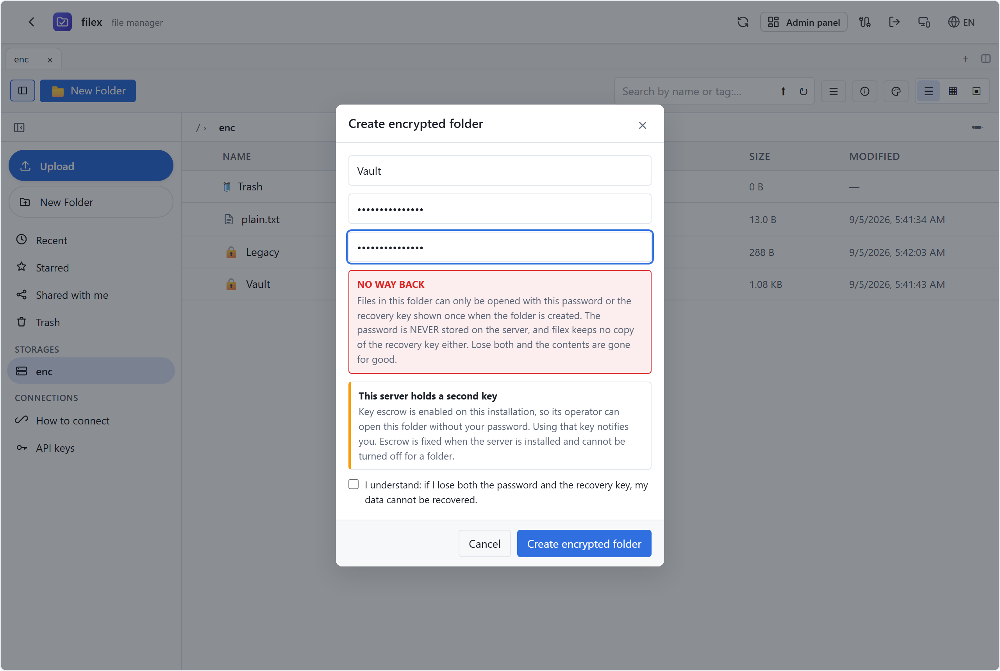
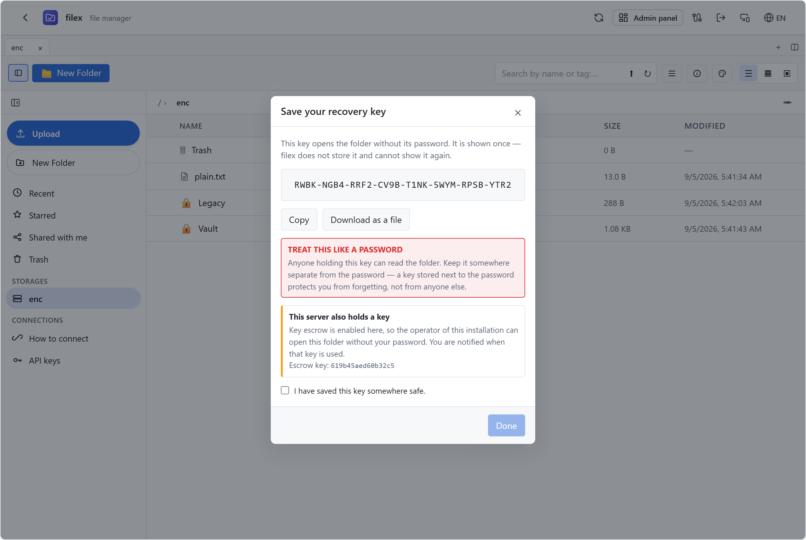
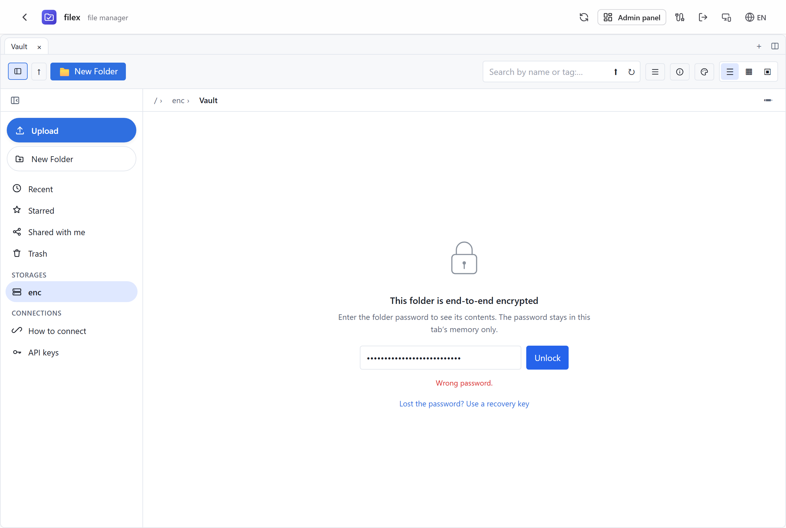
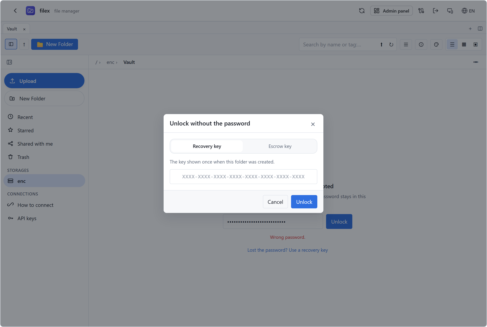
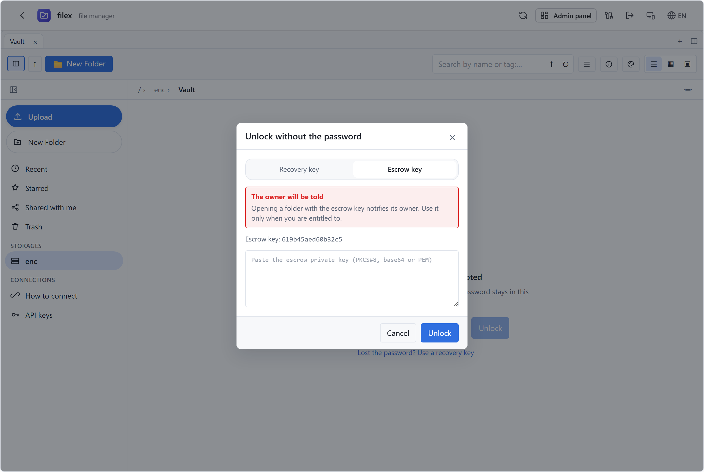
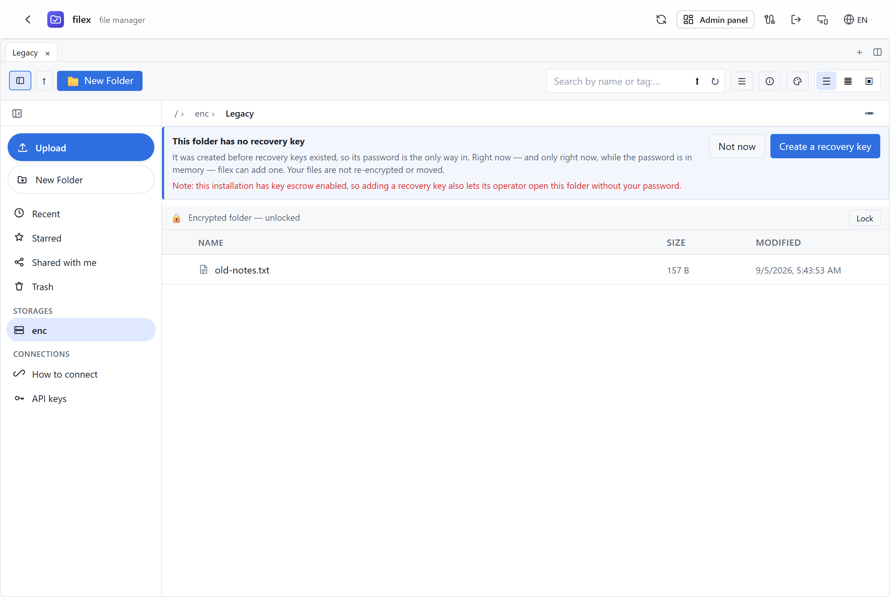

# End-to-end encrypted folders

A folder in filex can be made **end-to-end encrypted**: its files are encrypted
and decrypted in the browser with WebCrypto, and **no password or key is ever
sent to the server**. The server stores opaque blobs it cannot read and does not
participate in the crypto at all.

This page is the reference for that feature — the threat model, the key
hierarchy, the on-disk formats, which parts of filex stop working inside such a
folder, and the ways you can still end up with plaintext on the server.

> ⚠ **Recovery is limited and deliberate.** A folder created from v0.31 on has
> a **user recovery key**, shown once at creation and never stored by filex.
> Lose *both* the password and that key and the files are gone — nobody can
> restore them. Folders created before v0.31 have no recovery key until you
> add one; see [Folders created before v0.31](#folders-created-before-v031).

- [Threat model](#threat-model) — [what it protects](#what-it-protects) · [what it does not hide](#what-it-does-not-hide)
- [Key management](#key-management) — [folder marker](#folder-marker--filex-e2ejson) · [file format](#file-format--filexe2e-magic)
- [Recovery](#recovery) — [user recovery key](#the-user-recovery-key) · [key escrow](#key-escrow-optional-operator-recovery) · [adopting escrow later](#adopting-escrow-on-an-installation-that-already-exists) · [offering an existing folder a slot](#offering-an-existing-folder-an-escrow-slot) · [what escrow cannot do](#what-escrow-can-and-cannot-do) · [before v0.31](#folders-created-before-v031)
- [Feature trade-offs](#feature-trade-offs)
- [Ways plaintext still reaches the server](#ways-plaintext-still-reaches-the-server)
- [Using it](#using-it)
- [What the server knows](#what-the-server-knows)
- [Not implemented](#not-implemented)
- [See also](#see-also)

---

## Threat model

### What it protects

The **contents** of the files inside the folder. An attacker holding the server
disk, the S3 bucket, a database backup, a stolen host, or a legal seizure order
gets ciphertext. So does filex itself. Encryption and decryption happen only in
the browser; the server sees a blob that starts with the `filexe2e` magic and
nothing else.

⚠ **The server operator is in that list only while [key escrow](#key-escrow-optional-operator-recovery)
is off** — which is the default. When escrow *is* on, the operator holds a key
to every folder created since, and a stolen server still yields nothing because
the escrow private key is not on it.

⚠ Escrow can be turned on **later**, on an installation that already has
folders — see [adopting escrow](#adopting-escrow-on-an-installation-that-already-exists).
It takes a deliberate act by the operator, it is recorded with a timestamp, and
it reaches **only folders created after it**. A folder you created while escrow
was off stays outside the operator's reach; no configuration change, admin
action or future version of filex takes it.

⚠ **You can hand it over, and only you can.** The next time you unlock such a
folder, filex offers to seal it to the escrow key and says in plain words what
that means. Doing nothing leaves the folder as it is; saying no is recorded so
you are not asked again. See
[offering an existing folder a slot](#offering-an-existing-folder-an-escrow-slot).

### What it does not hide

These are deliberate, and they are all still true today:

| Leak | Why | Status |
|------|-----|--------|
| **File and folder names** | Names are not encrypted | The server, listings and name search all see them |
| File sizes (approximate) | Ciphertext ≈ plaintext + 97-byte header + 16-byte tag | Visible |
| Folder structure / file count | The tree is not encrypted | Visible |
| Access times / audit trail | Normal audit logging continues | Visible |
| Keys in the memory of an open tab | The key lives in RAM for the session | XSS and malicious extensions are the host's problem |
| The JavaScript the server serves you | A hostile server can serve hostile JS | Inherent to browser-based E2E |

**Trust assumption.** The client (your browser plus the filex frontend bundle)
is trusted. The server is *honest-but-curious* — it follows the protocol but may
read whatever it can. This is the same class of model as the Proton and
Bitwarden web clients.

---

## Key management

```
folder password ─PBKDF2-SHA256(600,000 iter, 16B salt)──▶ KEK  ─┐
user recovery key ─HKDF-SHA256(16B salt)────────────────▶ RKEK ─┼─▶ unwrap the FMK
escrow private key ─RSA-OAEP-256────────────────────────────────┘   (folder master key)
                                                                    │
per-file random 32B DEK (AES-256-GCM) encrypts the content one-shot │
DEK ◀── wrapped with the FMK via AES-GCM, stored in the file header ┘
```

Every file's key (its **DEK**) is wrapped by one key, the **folder master key**
(FMK). The marker then holds the FMK wrapped once per way of reaching it. That
is the whole trick: adding a recovery path costs one more wrapped copy of 32
bytes, not a re-encrypt of anything, and the file format below is byte-for-byte
what it was in v1.

- **KEK (folder key)** — `PBKDF2(password, salt, iter=600000, SHA-256)`,
  imported as an AES-256-GCM key with `extractable: false`. It lives **only in
  memory** (an in-component key ring) and is **never** written to
  `localStorage`, `sessionStorage` or IndexedDB. It is gone when you close the
  tab, reload the page, or press **Lock**.
- **FMK (folder master key)** — a random 32 bytes, minted when the folder is
  created. It is what wraps every file's DEK, and the only thing the marker's
  key slots hand back. Never derived from anything, never leaves memory.
- **DEK (file key)** — a fresh `crypto.getRandomValues(32)` per file. The
  content is encrypted one-shot under the DEK; the DEK is then wrapped with the
  **FMK** and embedded in that file's own header.
- **Password verification** — the marker's `verify` field is a fixed string
  (`filex-e2e-verify-v1`) encrypted under the KEK. A wrong password fails the
  GCM tag check and produces a "wrong password" error locally. **No verification
  request goes to the server**, so a wrong password is not something the server
  can count, rate-limit, or learn about.

Implementation: `packages/core/src/lib/e2ecrypto.ts`.

### Folder marker — `.filex-e2e.json`

Written at the root of the encrypted folder. It is **hidden from every listing
and from search results**, but is readable by path through the preview endpoint
— the client needs its contents to unlock:

```json
{
  "v": 2,
  "salt": "<base64 16B>",
  "iter": 600000,
  "verify": "<base64: 12B IV || AES-GCM('filex-e2e-verify-v1')>",
  "fmk": "wrapped",
  "fmk_pw": "<base64: 12B IV || AES-GCM(KEK, FMK)>",
  "rk":  { "salt": "<base64 16B>", "blob": "<base64: 12B IV || AES-GCM(RKEK, FMK)>" },
  "esc": { "kid": "<hex>", "alg": "RSA-OAEP-256", "blob": "<base64: RSA-OAEP(escrow public key, FMK)>" },
  "esc_declined": "<ISO 8601 — the owner was offered a slot and said no>"
}
```

| Field | Meaning |
|---|---|
| `v` | Marker schema. `1` = pre-v0.31, no slots. `2` = the shape above. **Both are read; only `2` is written.** The *file header* version is unrelated and still `1`. |
| `salt` / `iter` / `verify` | The password slot, unchanged since v1. `verify` is still what a wrong password fails against. |
| `fmk` | `"wrapped"` — the FMK is random and lives in `fmk_pw`. `"kek"` — the FMK *is* the password-derived KEK, which is how a v1 folder is upgraded in place without rewriting files. |
| `fmk_pw` | Present only when `fmk` is `"wrapped"`. |
| `rk` | The user recovery key slot. Absent means the folder has no recovery key. |
| `esc` | The escrow slot, and the only authority on which escrow key opens this folder. **Absent means no escrow key opens it**, and no configuration change adds one — including [adopting escrow](#adopting-escrow-on-an-installation-that-already-exists) afterwards. The folder's **owner** can add one with the password ([offering an existing folder a slot](#offering-an-existing-folder-an-escrow-slot)); nobody else can. `kid` names *which* escrow key: a folder restored from another installation carries that installation's `kid` and does not open with yours. |
| `esc_declined` | The owner was offered an escrow slot and declined, at this timestamp. Purely a record of an answer: it holds no key material, changes nothing about the folder, and its only effect is that filex stops asking. Cleared if they later accept. |

Nothing in the marker is secret: every slot is the same 32 bytes sealed under a
key filex does not have. The salt and the verify blob are public by design, and
useless without a password or key. New folders are always created with at least
600,000 iterations (`E2E_MIN_ITERATIONS`); the unlock path derives with whatever
`iter` the marker states.

⚠ An older filex (≤ v0.30.1) does not understand a `v: 2` marker and will report
the key file as unreadable. The **files** are unaffected — see
[before v0.31](#folders-created-before-v031).

### File format — `filexe2e` magic

Each encrypted file keeps its original name. The content is a fixed 97-byte
header followed by the ciphertext:

| Offset | Length | Field |
|--------|--------|-------|
| 0 | 8 | Magic: ASCII `filexe2e` |
| 8 | 1 | Version: `0x01` |
| 9 | 12 | `wrapIV` — GCM IV of the DEK wrap |
| 21 | 48 | `wrappedDEK` — `AES-GCM(FMK, wrapIV, rawDEK)` (32B key + 16B tag) |
| 69 | 12 | `dataIV` — GCM IV of the content |
| 81 | 16 | Reserved (zeros; kept free for future chunked encryption) |
| 97 | n+16 | Ciphertext — `AES-GCM(DEK, dataIV, content)` (+16B tag) |

The server **only recognises the magic prefix** — that is enough to skip
thumbnailing, content indexing and document conversion. It can never decrypt.

⚠ **This layout did not change when recovery was added, and that is the point.**
In v1 the DEK was wrapped by the password KEK; now it is wrapped by the FMK, and
for a v1 folder the FMK *is* that KEK. Not a byte of any existing file was
touched, and a file written by v0.31 into a v1 folder is still readable by
v0.30.1. Both directions are covered by the round-trip tests in
`web/tests/lib/e2ecrypto.test.ts`, which encrypt with a frozen copy of the
v0.30.1 module and decrypt with the current one.

---

## Recovery

There are up to three ways into an encrypted folder, and the folder decides
which exist **when it is created**. Nothing added later can change that,
because the wrapped copies live in the marker and each one needs the FMK to
make — which needs a key the server never has.

| Way in | Who holds it | Notified? | Exists when |
|---|---|---|---|
| Folder password | The user | — | Always |
| User recovery key | The user | — | The folder was created (or upgraded) from v0.31 on |
| Escrow key | The operator | The folder's owner is notified | Escrow is enabled (at install, or [adopted](#adopting-escrow-on-an-installation-that-already-exists) later) **and** the folder was created after that, **or** its owner [granted it a slot](#offering-an-existing-folder-an-escrow-slot) |

### The user recovery key

Minted when the folder is created, **shown exactly once**, and never stored by
filex — not in the database, not in the marker, not in browser storage. It
opens the folder without the password.

- **160 bits**, rendered as 32 Crockford base32 characters in eight groups of
  four: `XKPT-9M4A-...`. Crockford drops `I`, `L`, `O` and `U`, and the parser
  maps the look-alikes back (`O`→`0`, `I`/`L`→`1`), so a key read aloud or
  retyped by hand survives.
- It is a **password equivalent**, not a lesser credential. Anyone holding it
  reads the folder. Store it somewhere other than the password: a recovery key
  filed next to the password protects you from forgetting, and from nothing
  else.
- Losing it is not fatal on its own — the password still works. Losing **both**
  is fatal, and filex cannot help.
- There is currently no way to rotate or revoke one. See
  [Not implemented](#not-implemented).

### Key escrow (optional operator recovery)

Escrow gives the operator of an installation a second way into the encrypted
folders created on it. It is **off by default**, and turning it on is a
decision the operator makes once — either before the first boot, or later by
[adopting](#adopting-escrow-on-an-installation-that-already-exists) it. Either
way it applies only to folders created from that moment on.

The shape is deliberately lopsided:

1. The operator runs `filex e2e-escrow keygen`, **anywhere** — a laptop is fine.
   It prints an RSA-3072 keypair and exits. It writes nothing and touches no
   database.
2. The **public** half goes into `FILEX_INSTALLATION_E2E_ESCROW_KEY` on the
   server. It is enough to *seal* a new folder's FMK to the escrow identity and
   useless for opening anything.
3. The **private** half is the operator's, kept wherever they keep a root
   password. filex never receives it, never stores it, and cannot recover it.

So a stolen filex database, disk or backup decrypts nothing, escrow or not.
When the operator needs the key they paste it into the unlock dialog, in their
own browser, where it is used and discarded.

```bash
filex e2e-escrow keygen                    # prints both halves, once
filex e2e-escrow keygen --quiet            # public, then private, one per line
```

Configuration, and why it cannot be changed later:
[CONFIGURATION.md → Install-time settings](CONFIGURATION.md#install-time-settings-filex_installation_).

**Using it notifies the folder's owner.** The client asks the server for a
nonce sealed to the escrow public key, decrypts it with the private half and
returns it; only then does the server record the event and notify. That makes
the notification evidence rather than a claim — a `e2e.escrow_used` warning
that anyone could POST would be worth nothing. A wrong answer is refused with
`403` and notifies nobody.

⚠ From v0.34.0 `e2e.escrow_used` is also **subscribable on its own** — tick it
on a webhook target in *Admin → Webhooks* and every escrow unlock reaches
whatever you route security events to. It was emitted before, but as an inline
event id nothing that reads the catalogue could see, so it could not be
selected: a target either took the whole feed or never saw it. Of everything
filex emits this is the one most worth its own destination
([NOTIFICATIONS.md](NOTIFICATIONS.md)).

### What escrow can and cannot do

**Can:**

- Open any encrypted folder created (or given a recovery key) while that escrow
  key was configured, without the folder password and without the user's
  involvement.
- Do so at any time the operator chooses. There is no approval step, no
  time-lock, and no way for a user to opt their folder out.

**Cannot:**

- Open a folder created while escrow was **off**, or under a **different**
  escrow key, **on the operator's own initiative**. Those markers have no
  usable `esc` slot, and one cannot be added without the folder password. This
  is arithmetic, not policy — no configuration change, no admin flag and no
  future filex version can undo it, and in particular
  **[adopting escrow](#adopting-escrow-on-an-installation-that-already-exists)
  does not reach backwards**: it seals folders created after it and nothing
  else.

  ⚠ The door that *does* exist opens from the inside only: the folder's
  **owner** can grant a slot, with the folder password, from their browser
  ([offering an existing folder a slot](#offering-an-existing-folder-an-escrow-slot)).
  That is a decision by the person who holds the key, not a capability of the
  operator — the operator can ask, and cannot take.
- Be recovered if the operator loses the private key. filex has no copy.

⚠⚠ **The honest limits, stated plainly:**

- **The notification is an announcement, not a control.** An operator holding
  the escrow private key can copy the marker and the ciphertext off the disk
  and decrypt them offline with a short script — no filex, no request, no
  notification, no audit row. filex cannot detect this and does not claim to.
  What the notification guarantees is that the *supported* path is honest: the
  escrow unlock in the filex UI will not proceed unless the announcement
  succeeds.
- **An admin can already read anything not end-to-end encrypted.** Escrow does
  not extend their reach outside encrypted folders; it extends it into them.
- **Escrow is visible to users before they rely on it.** `/api/capabilities`
  publishes whether escrow is on and which key id, and the create-folder dialog
  and the recovery-key dialog both say so in words. That is deliberate: someone
  deciding whether to put a file in an encrypted folder is entitled to know who
  else holds a key, and a hidden escrow would make the whole feature a lie.
- **A user cannot remove the escrow slot from their folder.** That is the point
  of escrow, and it is why it belongs to the installation rather than to a
  user preference.

### Adopting escrow on an installation that already exists

Escrow used to be choosable only in the first second of an installation's life:
any later change to `FILEX_INSTALLATION_E2E_ESCROW_KEY`, including *unset →
set*, stopped the server. That was safe and useless. Nobody decides key-escrow
policy before they have a single file, so in practice the switch was one nobody
could ever throw — the only way to act on the decision was to throw the data
directory away.

An existing installation can now adopt escrow. It takes two variables, not
one:

```bash
FILEX_INSTALLATION_E2E_ESCROW_KEY=MIIBoj...      # the public half
FILEX_INSTALLATION_E2E_ESCROW_ADOPT=1            # "yes, I mean it"
```

filex starts, logs the adoption at **WARN** with the sentence below in it, and
records it. `_ADOPT` is read only while the pinned record has no escrow key, so
you can leave it or drop it; it does nothing afterwards.

⚠⚠ **Adoption is not retroactive. It cannot be, and no future version will
change that.**

A folder's master key is wrapped to the escrow identity **when the folder is
created**. A folder that already exists has no such wrapped copy, and writing
one needs the folder's master key — which needs the folder password, which the
server has never had and cannot obtain. So the day you adopt escrow, your
encrypted folders split into two groups:

| Created | Escrow private key opens it? |
|---|---|
| **Before** the adoption | **No**, and nothing you do as operator changes that. Its owner can grant it — see below. |
| **After** the adoption | Yes, and the owner is notified when it is used. |

⚠ "Not retroactive" is a statement about the **operator**, and it is absolute.
It is not a statement about the folder: the person who can open it can hand
over a key, which is
[what filex offers them at unlock](#offering-an-existing-folder-an-escrow-slot).
Read `e2e_escrow_adopted_at` below as the boundary of **automatic** coverage.
A folder whose owner granted a slot is simply no longer described by that
boundary — the marker's `esc` slot is, and always was, the only authority on
which key opens which folder.

**The record.** After an adoption, `<data-dir>/installation.json` (and the
`installation.pinned` settings row) separates the installation's birthday from
the day it gained a second key holder:

```json
{
  "e2e_escrow_kid": "9f2c1a55b4e07d38",
  "e2e_escrow_alg": "RSA-OAEP-256",
  "pinned_at": "2026-09-05T12:02:24Z",
  "pinned_by": "first-boot",
  "e2e_escrow_adopted_at": "2026-11-20T08:30:00Z",
  "e2e_escrow_adopted_by": "env:FILEX_INSTALLATION_E2E_ESCROW_ADOPT",
  "e2e_escrow_adoption_note": "escrow was turned on after this installation already existed; folders created BEFORE e2e_escrow_adopted_at have no escrow-wrapped key, so the escrow key does not open them and no operator action can change that. Each folder's OWNER can grant it from the browser with the folder password"
}
```

`e2e_escrow_adopted_at` is the boundary date, and it is the reason the field
exists: six months later, "which folders can I open with this key?" has an
answer in the data rather than in somebody's memory. No such fields means
escrow was there from the first boot, or is off.

**What is still refused.** `_ADOPT` is consent to *add* a key to an
installation that has none. It is not an override:

- pointing `..._ESCROW_KEY` at a **different** key still stops the server —
  old folders would open only with the old private key, new ones only with the
  new, and nothing on either says which;
- **removing** the key still stops the server — it un-escrows nothing, it only
  hides the door in the UI while the old private key keeps working.

**What a user sees.** On a folder created before the adoption, the
unlock-without-the-password dialog does **not** show an Escrow tab, and says
why: *"This installation has an escrow key, but this folder does not… The
escrow key will not open it. Nothing the operator can do changes that… The
folder's owner can grant it."* A missing tab on its own is not enough: an admin
who knows escrow is enabled here reads the absence as a bug, tries the key
anyway, and learns the real answer from a failure. The same dialog also names
the case where a folder was restored from a **different** installation and
carries that installation's `kid`.

### Offering an existing folder an escrow slot

Adoption covers folders created after it. On an installation that has been
running for a while that is nobody's folders — the ones that matter already
exist. An escrow key that reaches none of them is a key to an empty room.

So when the installation has escrow and a folder does not, filex **asks the
folder's owner**, at the one moment the folder password exists in a browser:
immediately after a successful unlock.

```
┌─ Give the operator a key to this folder? ──────────────────────────┐
│ This folder was created before key escrow was turned on here, so   │
│ the operator of this installation cannot open it. Right now — while│
│ your password is in memory — filex can seal this folder to the     │
│ escrow key. Your files are not re-encrypted or moved; only the key │
│ file changes.                                                      │
│                                                                    │
│ What this means: the operator gains a second, permanent way into   │
│ this folder, without your password. You are notified when that key │
│ is used, but that notification is an announcement rather than a    │
│ control.  [What escrow can and cannot do]                          │
│                                                                    │
│ Escrow key: a1b2c3d4e5f60718                                       │
│                      [ No, keep it to myself ] [ Give a key ]      │
└────────────────────────────────────────────────────────────────────┘
```

**Nothing happens unless you choose it.** Closing the page, navigating away or
locking the folder all leave it exactly as it was.

**Accepting** unwraps the folder master key with the password you just typed
and wraps one more copy of it to the escrow public key, in the browser. Only
`.filex-e2e.json` is written; **no file is re-encrypted, moved or rewritten**,
and the password and recovery key keep working unchanged. The key id written
into the slot is the installation's current escrow key, read from
`/api/capabilities` — a slot never carries a `kid` that does not open it.

**Declining** is a decision, not a delay. It is recorded in the folder's marker
as `esc_declined` and filex stops asking. That record lives in the marker
rather than in browser storage on purpose: the unit of the decision is the
*folder*, so the same person opening it from their phone is not asked again,
and an answer that vanished when somebody cleared their site data would be no
answer at all. It travels with the folder through a move, a backup and a
restore, exactly as the key slots do. It holds no key material and hides
nothing — its only effect is that filex stops asking.

**The way back.** Somebody who declines today and changes their mind next month
finds **Escrow key…** in the strip above an unlocked folder. It asks for the
folder password again, because by then it is long gone from memory — and
because handing the operator a key deserves the same proof of ownership the
offer at unlock had.

**Where the offer does not appear**, ever:

| Situation | Why |
|---|---|
| The installation has no escrow key | There is nothing to offer. |
| The folder already has an `esc` slot | It is already covered. |
| The unlock failed | Accepting needs the password, and somebody who cannot open the folder is the wrong person to ask about its keys. |
| A **v1** (pre-v0.31) marker | Those have no slots at all. Their path is the [recovery upgrade](#folders-created-before-v031), which seals an escrow slot in the same step and discloses it in the same prompt. Two offers on one unlock would be two chances to get the disclosure wrong. |
| The owner already declined | Recorded per folder. The **Escrow key…** button is the way back. |

⚠ This is the *only* way a `v: 2` folder gains an escrow slot after creation,
and it requires the folder password, so only its owner can do it. An operator
can enable escrow, adopt escrow, and ask — and cannot take.

### Folders created before v0.31

Every folder made by an earlier filex uses the v1 marker: no slots, no recovery,
the password wraps the DEKs directly.

**They keep working, unchanged, with nothing but their password. Forever.** The
v1 read path is a first-class path in the code, not a migration shim, and the
test suite measures it against a frozen copy of the v0.30.1 module rather than a
re-creation of it.

They **cannot** be given recovery retroactively by the server, because that
needs the folder password and filex does not have it. There is exactly one
moment when it does: **the next time you unlock the folder.** So that is when
filex asks — visibly, in a strip above the listing, with the consequences
spelled out:

- Accepting rewrites only `.filex-e2e.json`. **No file is re-encrypted, moved or
  rewritten.** The new marker keeps the original salt, iterations and verify
  blob, and records `fmk: "kek"` — the FMK stays defined as the
  password-derived key, which is why the existing files still open.
- You get a recovery key, shown once, exactly like a new folder.
- ⚠ **If the installation has escrow enabled, accepting also gives the operator
  a key to this folder.** The prompt says so before you accept. This is the only
  way a folder gains an escrow slot after creation, and it requires the folder
  password, so only the user can do it.
- Declining changes nothing at all. The folder behaves exactly as it did, and
  the offer returns next time — because the risk has not changed.

⚠ After an upgrade the marker is `v: 2`, which a filex ≤ v0.30.1 cannot parse:
it would report the key file as unreadable. The **files** are untouched and
still decrypt with the same password, so a rolled-back deployment loses the
recovery UI, not the data.

---

## Feature trade-offs

The server cannot read the content, so every server-side feature that needs to
read content is **off or limited** inside an encrypted folder:

| Feature | Behaviour in an encrypted folder |
|---------|----------------------------------|
| **Name search** | **Works** — names are not encrypted (a deliberate leak, see [threat model](#what-it-does-not-hide)). The `.filex-e2e.json` marker is filtered out of results |
| **Content search** | **Does not work** — the indexer skips extraction under a marked subtree and for anything starting with the magic, and indexes empty content instead. Nothing is indexed, so nothing can match |
| **Thumbnails** | **Not generated** — the thumbnail pipeline marks files under a marked subtree `skipped`; grid and gallery views show a generic icon |
| **Preview** (text, images, media, PDF) | **Works while unlocked** — the client downloads the ciphertext, decrypts it in memory and hands a blob URL to the normal viewers |
| **Text editing / saving** | **Off** — preview is read-only. Saving would write plaintext through the server, so the save-text endpoint is not wired up inside an encrypted folder |
| **Open in a new tab** | **Off** — the standalone viewer route fetches raw bytes from the server, which would show ciphertext |
| **OnlyOffice** | **Off** — the document server would have to read the file. The backend's config endpoint sniffs the magic and returns **415 `file is e2e-encrypted`**, and the UI does not offer OnlyOffice at all |
| **Convert** | **Off** — the action is hidden; ciphertext is meaningless to the converter |
| **Share links / file requests** | **Off** — the whole **Share / Permissions** entry is hidden, because a recipient would download ciphertext with no way to decrypt it. Note this also hides per-item permissions for that folder |
| **Password change** | **Off.** The v2 marker makes it cheap in principle (re-wrap `fmk_pw`, touch no file) but no flow exists — and it would not be cheap for a folder upgraded from v1, whose FMK *is* the password-derived key. See [Not implemented](#not-implemented) |
| **Desktop "keep local" / folder sync pinning** | **Off** — not offered for encrypted folders or their contents |
| **Reads over DAV / CLI / ShareX / AI (REST + MCP)** | Return the raw ciphertext (magic and all). Those surfaces have no key and cannot decrypt |
| **Writes over DAV / CLI / AI** ⚠ | **Not encrypted.** See [below](#ways-plaintext-still-reaches-the-server) |
| **Versioning** | **Works** — versions store ciphertext; a restored version decrypts with the same folder password |
| **Trash / restore** | **Works** — the bytes are untouched |
| **ClamAV** | Scans ciphertext, so it finds nothing. Harmless, but do not mistake a clean scan for a scanned file |
| **Copy / move** | **Refused across an encryption boundary** (HTTP 409). Inside one encrypted folder it works normally, and the encrypted folder itself can be moved. See [below](#ways-plaintext-still-reaches-the-server) |
| **Upload size** | The MVP encrypts in one shot in memory: **files over 200 MB are refused** with a warning |

---

## Ways plaintext still reaches the server

Encryption happens in the browser, in the filex web UI. Anything that puts bytes
into the folder without going through that code path stores them **exactly as
they arrive** — and the server cannot fix this, because it has no key.

⚠ **A file written into an encrypted folder over WebDAV, the CLI, ShareX, or the
AI surfaces (REST / MCP) stays plaintext.** It sits in the encrypted folder,
looks like it belongs there, and is readable by anyone with server access.
Nothing warns you.

✅ **Copy, move and paste are no longer one of them.** They used to be the worst
case, because filex's own UI produced it: paste, drag-and-drop and duplicate are
server-side byte copies that never touch the crypto, so the explorer would put a
plaintext file inside an encrypted folder with no warning at all.

Since v0.31 the server refuses any transfer that crosses an encryption boundary,
with `409` and a message naming the file:

| Attempt | Answer |
|---|---|
| Plaintext file **into** an encrypted folder | Refused — the server has no key, so it cannot encrypt on the way in |
| Encrypted file **out of** its folder | Refused — it stays encrypted, and outside the folder nothing knows which password opens it |
| Between **two different** encrypted folders | Refused — each folder has its own key |
| Within **one** encrypted folder | Allowed |
| The encrypted folder **itself**, to a plain destination | Allowed — its marker travels with it |
| An encrypted folder **into** another one | Refused — encrypted folders cannot be nested |

The rule lives in `backend/internal/e2e/guard.go` and is called from every
transfer surface — the async ops queue (web UI paste, drag, duplicate,
cross-storage transfer), the synchronous move, and the AI/MCP `file_move` tool
— so it is not something one client remembers and another forgets.

**Rule: put files into an encrypted folder only by uploading them through the
filex web UI, with the folder unlocked.** WebDAV, the CLI, ShareX and the AI
*write* surfaces are still unguarded (see
[Not implemented](#not-implemented)).

One mitigation is already in place, and it is only a mitigation: a plaintext
file that lands in an encrypted folder by one of these routes is **still not
content-indexed**, because the indexer skips the whole marked subtree rather
than deciding per file. So it will not leak into the search index — but it is
plaintext on disk.

---

## Using it

- **Create** — the New Folder dialog offers **Create encrypted folder…**, which
  opens a dialog asking for a name, the password twice (minimum 8 characters)
  and an acknowledgement of the warning. When the installation has escrow on,
  the dialog says so **before** the folder exists. filex then creates the
  folder, uploads the `.filex-e2e.json` marker, and shows the **recovery key
  once** — in a dialog that will not close on ESC or a backdrop click until you
  tick that you have saved it, because there is no second showing. Encrypted
  folders **cannot be nested** — the option is not offered inside one.
- **Badge** — encrypted folders are drawn with a 🔒 in listings (the backend
  flags the directory row with `e2e: true`).
- **Unlock without the password** — the lock screen carries a *Lost the
  password? Use a recovery key* link. It opens a dialog with the recovery-key
  field, plus an **Escrow key** tab when both the installation and the folder
  have escrow. A folder with neither says so, rather than offering a door that
  is not there.
- **Lock screen** — entering an encrypted folder, or any subfolder of one, shows
  a password prompt instead of the listing. The backend adds `e2e_root` (the
  path of the encrypted root) to the listing response; the client fetches the
  marker from that root and checks the password against it locally. Wrong
  password → an error in the prompt. Right password → the KEK goes into the
  in-memory key ring and the listing opens.
- **While unlocked** — a 🔒 strip appears with a **Lock** button. Locking drops
  the KEK from memory, revokes the decrypted blob URLs, and brings the password
  prompt back.
- **Upload** — transparently encrypted while unlocked (file → ArrayBuffer →
  encrypt → upload under the same name). Files over 200 MB are refused.
- **Download and preview** — transparently decrypted: downloaded bytes are
  decrypted and saved under the original name, and previews are handed to the
  normal viewers as a decrypted blob URL.

---

### What it looks like

| | |
|---|---|
|  |  |
| Creating the folder. The escrow notice appears only when the installation has escrow on. | The recovery key, shown once. The dialog will not close until you tick that you saved it. |
|  |  |
| A wrong password, and the way out underneath it. | The recovery-key dialog. The **Escrow key** tab appears only when both the installation and the folder have escrow. |
|  |  |
| Escrow says up front that the owner will be told. | A folder from before v0.31, just opened by password: the offer is visible, and it discloses the escrow consequence. |

Retake them with
`node e2e/shots/e2e-recovery.mjs --escrow-private <pkcs8-b64>` against an
instance booted with escrow on. The same script is the end-to-end measurement
of this feature: it creates the folder, loses the password, gets back in with
the key, and checks the notification arrived.

---

## What the server knows

There is **no encryption or decryption anywhere in the backend.** The server
only carries *awareness* of the two artifacts the client leaves behind, so that
pipelines stop doing pointless — and potentially leaky — work:

1. **`internal/e2e`** — the marker name, the magic prefix, `HasMagicPrefix()`,
   and the ancestor walk (`FindRoot()` / `UnderEncrypted()`) that answers "is
   this path inside a folder carrying `.filex-e2e.json`?" via a path-hash
   lookup.
2. **Thumbnails** (`internal/thumb/pipeline.go`) — files under a marked subtree
   are recorded as `skipped`.
3. **Content indexing** (`internal/queue/content_index.go`) — the marker itself
   is never eligible; anything under a marked subtree is indexed with empty
   content; and a magic sniff catches encrypted files that escaped the subtree
   walk (moved out, or marker deleted later). Empty content is indexed rather
   than nothing, so the fingerprint records and the node stops re-queueing.
4. **OnlyOffice config** (`internal/api/handlers/onlyoffice.go`) — magic sniff →
   `415 file is e2e-encrypted`.
5. **Listings** (`internal/api/handlers/manager.go`) — the marker row is hidden
   from every listing projection; encrypted directory rows are badged
   `e2e: true`; and a listing inside an encrypted subtree carries `e2e` and
   `e2e_root` so the client knows to show the lock screen. A cold-cache
   fallback flags a freshly created folder straight from the driver listing,
   before the sync run has cached it.
6. **Search** (`internal/api/handlers/search.go`) — the marker is filtered out
   of tag listings, index hits and the SQL `LIKE` fallback alike.
7. **The transfer guard** (`internal/e2e/guard.go`) — refuses a copy or move
   that would cross an encryption boundary, from any surface. It compares
   ancestor markers; it never opens a file.
8. **Escrow, public half only** (`internal/e2e/escrow.go`,
   `internal/api/handlers/e2e.go`) — the installation's escrow **public** key,
   published in `/api/capabilities` so the browser can seal new folders to it,
   and used to seal a challenge nonce so that "the escrow key was used" is
   provable rather than merely asserted. The server has no private key and
   cannot open anything.
9. **The install pin** (`internal/e2e/installation.go`) — records at first boot
   whether escrow is on and which key, and refuses to start if that later
   disagrees with the environment.

Every one of these is in the category "don't do useless work, and don't open a
leak" — none of them can read a byte of your content.

---

## Not implemented

These are known gaps, not scheduled work. They are listed because each one is a
limitation you can hit today:

- **Encrypted names.** File and folder names are stored in the clear (see the
  [threat model](#what-it-does-not-hide)).
- **Sharing an encrypted folder.** There is no way to hand a recipient a link
  that also carries the key, so sharing is simply off.
- **Files over 200 MB.** Encryption is one-shot in memory. The 16 reserved
  header bytes exist so a chunked format could be added without breaking the
  layout, but no chunked format exists.
- **Changing the folder password.** The v2 marker makes it cheap for a folder
  created since v0.31 — re-wrap `fmk_pw`, touch no file. For a folder upgraded
  from v1 (`fmk: "kek"`) it is not cheap: the FMK *is* the password-derived key,
  so changing the password means re-wrapping every file's DEK. Neither flow
  exists. The only way to change a password today is to create a new encrypted
  folder and re-upload.
- **Rotating or revoking a recovery key.** A recovery key is minted once and
  lives as long as the folder. There is no "show me a new one" and no way to
  invalidate a key you think leaked, short of moving the files into a new
  encrypted folder.
- **Escrow at the folder level.** Escrow is per-installation and per-folder only
  in the sense that it applies to folders created after it was enabled. A user
  cannot opt a folder out, and an operator cannot escrow one folder and not
  another.
- **Detecting offline escrow use.** The notification covers the supported path
  only. See [what escrow can and cannot do](#what-escrow-can-and-cannot-do).
- **Editing files in place.** Preview is read-only inside an encrypted folder.
- **A server-side guard against plaintext writes over DAV / CLI / ShareX / AI.**
  Copy and move are guarded now; a direct *write* through those surfaces is
  not — see [Ways plaintext still reaches the
  server](#ways-plaintext-still-reaches-the-server).
- **Re-encrypting on move.** filex refuses a transfer across an encryption
  boundary rather than re-encrypting or decrypting the bytes, because it holds
  no key to do either with. Move the file by downloading and re-uploading it.

---

## See also

- [SEARCH.md](SEARCH.md) — name vs. content search, and the content index
- [SHARING.md](SHARING.md) — share links and file requests (both off here)
- [thumbnails.md](thumbnails.md) — the thumbnail pipeline and its skip states
- [PROTOCOLS.md](PROTOCOLS.md) / [WEBDAV.md](WEBDAV.md) — the non-web surfaces
  that write plaintext
- [TRASH-VERSIONING.md](TRASH-VERSIONING.md) — both keep working on ciphertext
- [RBAC.md](RBAC.md) — permissions, which are independent of encryption
- [CONFIGURATION.md](CONFIGURATION.md#install-time-settings-filex_installation_) —
  `FILEX_INSTALLATION_E2E_ESCROW_KEY` and why install-time settings are frozen
