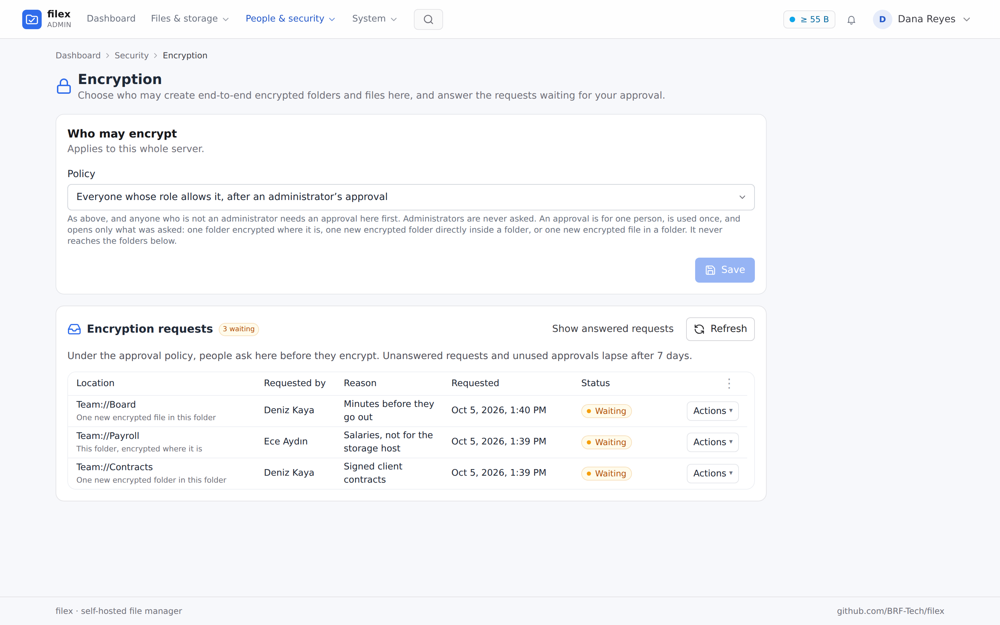
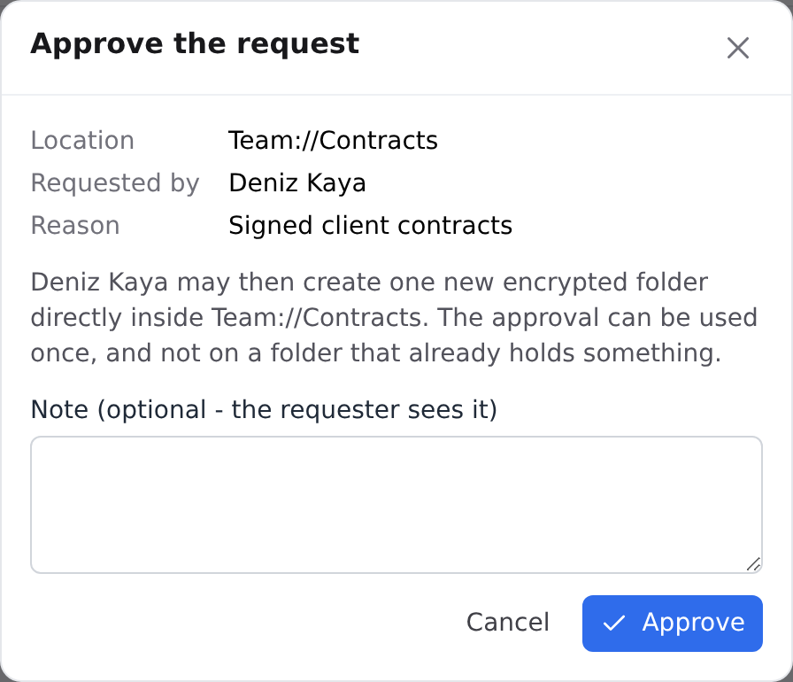
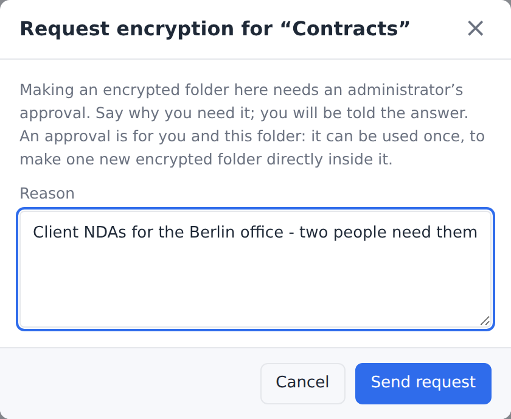
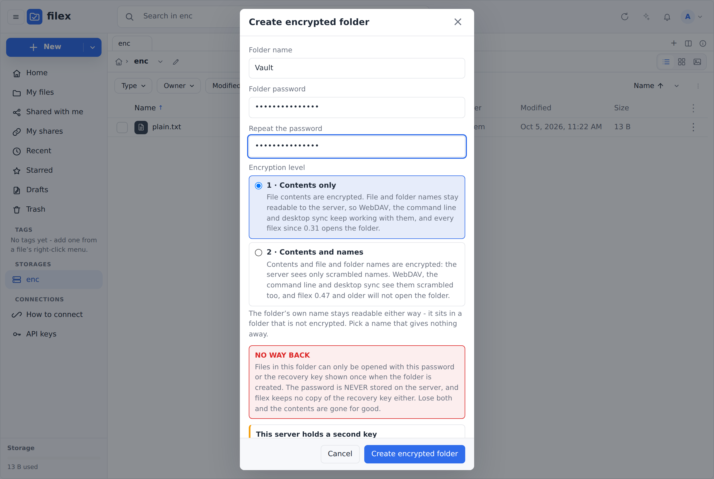
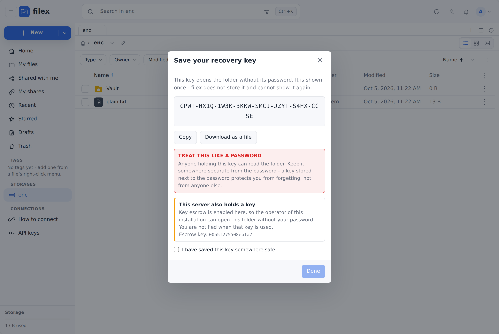
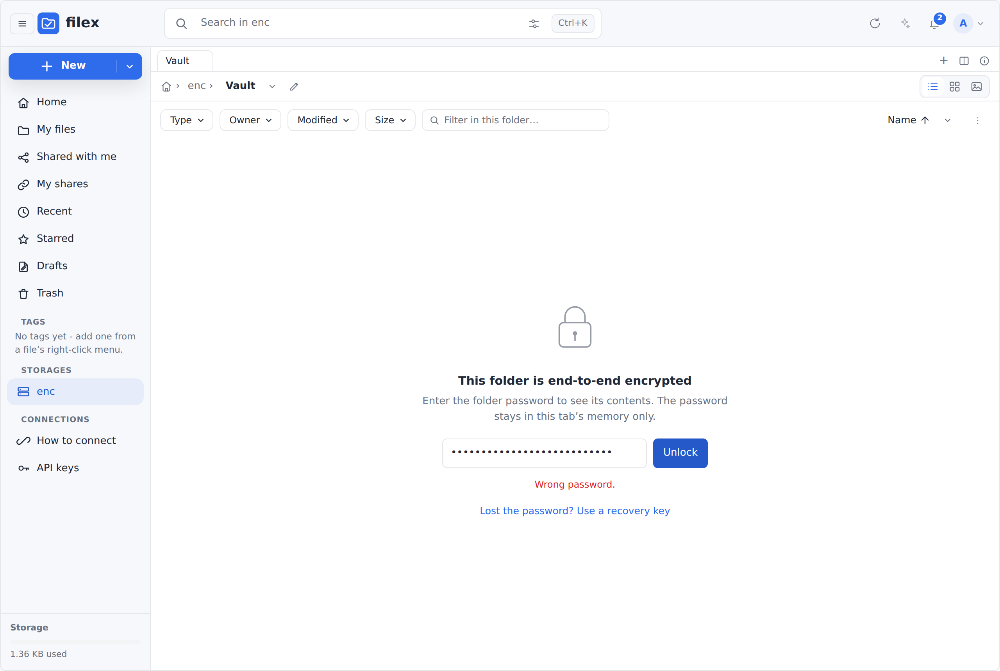
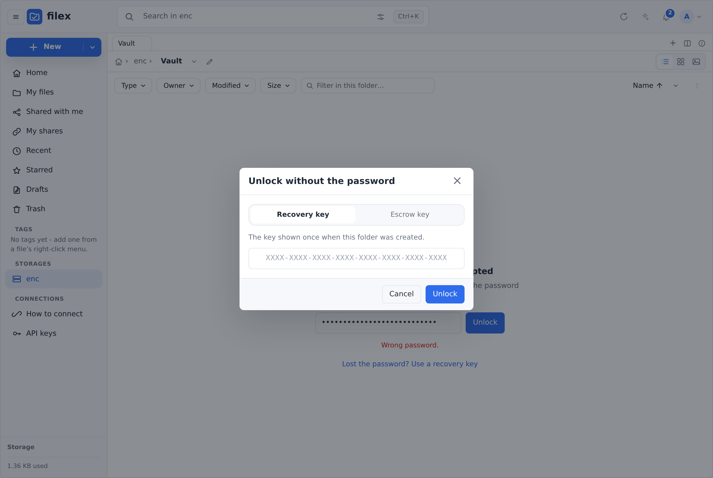
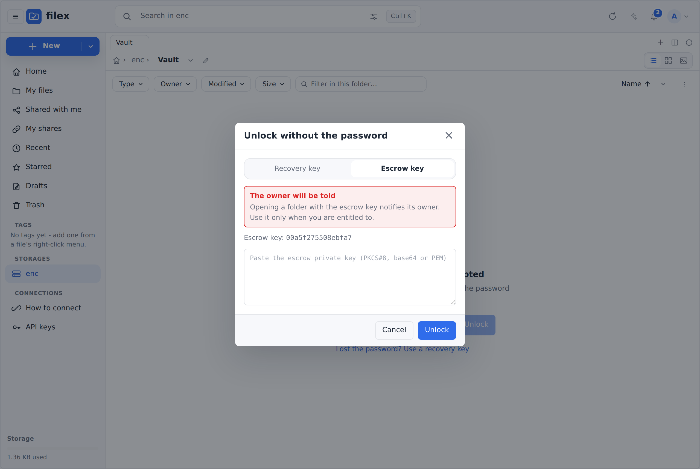
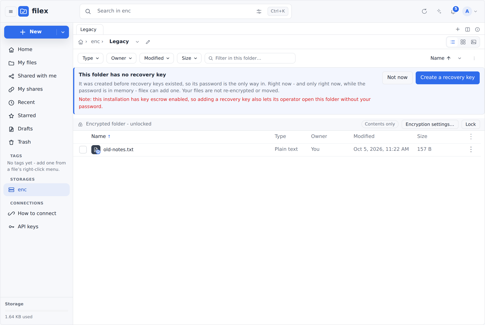

# End-to-end encrypted folders

A folder in filex can be made **end-to-end encrypted**: its files - and, at
[level 2](#encryption-levels), their names - are encrypted and decrypted in the
browser with WebCrypto, and **no password or key is ever sent to the server**.
The server stores opaque blobs it cannot read and does not participate in the
crypto at all.

This page is the reference for that feature - the threat model, the key
hierarchy, the on-disk formats, which parts of filex stop working inside such a
folder, and the ways you can still end up with plaintext on the server.

**Format revision:** folder marker **v2** for level 1 (contents only, the
default) and **v3** for level 2 (contents and names, v0.48); encrypted file
header **v1** for files up to 200 MB, **v2** (a [STREAM](#streaming-content-stream)
body) for larger ones; single encrypted file (`.fxe`) **v1**. See
[format versions](#format-versions).

> ⚠ **Recovery is limited and deliberate.** A folder created from v0.31 on has
> a **user recovery key**, shown once at creation and never stored by filex.
> Lose *both* the password and that key and the files are gone - nobody can
> restore them. Folders created before v0.31 have no recovery key until you
> add one; see [Folders created before v0.31](#folders-created-before-v031).

- [Threat model](#threat-model) - [what it protects](#what-it-protects) · [what it does not hide](#what-it-does-not-hide)
- [Key management](#key-management) - [folder marker](#folder-marker---filex-e2ejson) · [file format](#file-format---filexe2e-magic) · [format versions](#format-versions)
- [Encryption levels and names](#encryption-levels-and-names) - [levels](#encryption-levels) · [scheme](#the-scheme) · [folder ids](#folder-ids) · [why](#why-these-choices) · [long names](#long-names-and-their-sidecar) · [marker v3](#the-marker-v3-and-required-features) · [changing the level](#changing-the-level) · [what the server still sees](#what-the-server-still-sees)
- [Streaming content (STREAM)](#streaming-content-stream) - files over 200 MB, and every `.fxe`
- [Single encrypted files (`.fxe`)](#single-encrypted-files-fxe) - [inside an encrypted folder](#a-fxe-inside-an-encrypted-folder) · [what the server already saw](#what-the-server-already-saw-of-the-original) · [layout](#the-fxe-layout)
- [Downloading a decrypted copy](#downloading-a-decrypted-copy) - [where it is saved](#where-a-decrypted-download-goes)
- [Encrypting a folder you already have](#encrypting-a-folder-you-already-have) - [what the server already saw](#what-the-server-already-saw)
- [Changing the password](#changing-the-password) - [a folder with its own key](#a-folder-with-its-own-key-v031-and-later) · [re-keying](#re-keying-a-folder-from-before-v031-or-on-purpose) · [after a recovery-key unlock](#after-a-recovery-key-unlock) · [who is told](#who-is-told) · [what it does not undo](#what-a-password-change-does-not-undo)
- [Who may encrypt](#who-may-encrypt) - [what counts as encrypting](#what-counts-as-encrypting) · [approvals](#approvals) · [where it is asked](#where-it-is-asked) · [when the rule cannot be decided](#when-the-rule-cannot-be-decided) · [audit and notifications](#audit-and-notifications)
- [Recovery](#recovery) - [user recovery key](#the-user-recovery-key) · [key escrow](#key-escrow-optional-operator-recovery) · [adopting escrow later](#adopting-escrow-on-an-installation-that-already-exists) · [offering an existing folder a slot](#offering-an-existing-folder-an-escrow-slot) · [what escrow cannot do](#what-escrow-can-and-cannot-do) · [before v0.31](#folders-created-before-v031)
- [Feature trade-offs](#feature-trade-offs)
- [Ways plaintext still reaches the server](#ways-plaintext-still-reaches-the-server)
- [Using it](#using-it) - [taking a folder out: `filex decrypt`](#taking-a-folder-out-filex-decrypt)
- [What the server knows](#what-the-server-knows)
- [Not implemented](#not-implemented)
- [Format reference](#format-reference) - every parameter, for anything that reads or writes these folders
- [See also](#see-also)

---

## Threat model

### What it protects

The **contents** of the files inside the folder, and - at
[level 2](#encryption-levels), contents and names - the **names** of its files
and folders. An attacker holding the server disk, the S3 bucket, a
database backup, a stolen host, or a legal seizure order gets ciphertext. So
does filex itself. Encryption and decryption happen only in
the browser; the server sees a blob that starts with the `filexe2e` magic and
nothing else.

⚠ **The server operator is in that list only while [key escrow](#key-escrow-optional-operator-recovery)
is off** - which is the default. When escrow *is* on, the operator holds a key
to every folder created since, and a stolen server still yields nothing because
the escrow private key is not on it.

⚠ Escrow can be turned on **later**, on an installation that already has
folders - see [adopting escrow](#adopting-escrow-on-an-installation-that-already-exists).
It takes a deliberate act by the operator, it is recorded with a timestamp, and
it reaches **only folders created after it**. A folder you created while escrow
was off stays outside the operator's reach; no configuration change, admin
action or future version of filex takes it.

⚠ **You can hand it over, and only you can.** The next time you unlock such a
folder, filex offers to seal it to the escrow key and says in plain words what
that means. Doing nothing leaves the folder as it is; saying no is recorded so
you are not asked again. See
[offering an existing folder a slot](#offering-an-existing-folder-an-escrow-slot).

### What it does not hide

These are deliberate, and they are all still true today:

| Leak | Why | Status |
|------|-----|--------|
| **File and folder names** | Encrypted at [level 2](#encryption-levels) (contents and names). At level 1 (contents only, the default) names stay readable, so WebDAV, the CLI and desktop sync keep working with them | Hidden / visible, per folder. The strip above an unlocked folder says which level it is at |
| The encrypted folder's **own** name | It lives in a folder that is not encrypted | Visible - name it neutrally |
| Name length | A stored name is as long as its name, plus a fixed overhead ([the scheme](#the-scheme)) | Roughly how long each name is. Equal names in **different** folders are two different stored names ([folder ids](#folder-ids)) |
| File sizes (approximate) | Ciphertext ≈ plaintext + 97-byte header + 16-byte tag (+ 16 bytes per MiB for a [STREAM](#streaming-content-stream) file) | Visible |
| Folder structure / file count | The tree is not encrypted | Visible. Hiding it is the vault level - designed, not built ([roadmap](E2E-ROADMAP.md#3-the-vault-level)) |
| Access times / audit trail | Normal audit logging continues | Visible |
| Keys in the memory of an open tab | The key lives in RAM for the session | XSS and malicious extensions are the host's problem |
| The JavaScript the server serves you | A hostile server can serve hostile JS | Inherent to browser-based E2E |

**Trust assumption.** The client (your browser plus the filex frontend bundle)
is trusted. The server is *honest-but-curious* - it follows the protocol but may
read whatever it can. This is the same class of model as the Proton and
Bitwarden web clients.

---

## Key management

```
folder password ─PBKDF2-SHA256(600,000 iter, 16B salt)──▶ KEK  ─┐
user recovery key ─HKDF-SHA256(16B salt)────────────────▶ RKEK ─┼─▶ unwrap the FMK
escrow private key ─RSA-OAEP-256────────────────────────────────┘   (folder master key)
                                                                    │
per-file random 32B DEK (AES-256-GCM) encrypts the content one-shot │
DEK ◀── wrapped with the FMK via AES-GCM, stored in the file header ┤
                                                                    │
64B name key (AES-256-SIV) encrypts every name ◀── wrapped with the ┘
FMK via AES-GCM, stored in the marker (`names.key`, v3 only)
```

Every file's key (its **DEK**) is wrapped by one key, the **folder master key**
(FMK). The marker then holds the FMK wrapped once per way of reaching it. That
is the whole trick: adding a recovery path costs one more wrapped copy of 32
bytes, not a re-encrypt of anything, and the file format below is byte-for-byte
what it was in v1.

- **KEK (folder key)** - `PBKDF2(password, salt, iter=600000, SHA-256)`,
  imported as an AES-256-GCM key with `extractable: false`. It lives **only in
  memory** (an in-component key ring) and is **never** written to
  `localStorage`, `sessionStorage` or IndexedDB. It is gone when you close the
  tab, reload the page, or press **Lock**.
- **FMK (folder master key)** - a random 32 bytes, minted when the folder is
  created. It is what wraps every file's DEK, and the only thing the marker's
  key slots hand back. Never derived from anything, never leaves memory.
- **DEK (file key)** - a fresh `crypto.getRandomValues(32)` per file. The
  content is encrypted under the DEK - one-shot up to 200 MB, as a
  [STREAM](#streaming-content-stream) above that; the DEK is then wrapped with
  the **FMK** and embedded in that file's own header.
- **Password verification** - the marker's `verify` field is a fixed string
  (`filex-e2e-verify-v1`) encrypted under the KEK. A wrong password fails the
  GCM tag check and produces a "wrong password" error locally. **No verification
  request goes to the server**, so a wrong password is not something the server
  can count, rate-limit, or learn about.

Implementation: `packages/core/src/lib/e2ecrypto.ts`.

### Folder marker - `.filex-e2e.json`

Written at the root of the encrypted folder. It is **hidden from every listing
and from search results**, but is readable by path through the preview endpoint -
the client needs its contents to unlock:

```json
{
  "v": 2,
  "salt": "<base64 16B>",
  "iter": 600000,
  "verify": "<base64: 12B IV || AES-GCM('filex-e2e-verify-v1')>",
  "fmk": "wrapped",
  "fmk_pw": "<base64: 12B IV || AES-GCM(KEK, FMK)>",
  "rk":  { "salt": "<base64 16B>", "blob": "<base64: 12B IV || AES-GCM(RKEK, FMK)>" },
  "esc": { "kid": "<hex>", "alg": "RSA-OAEP-256", "blob": "<base64: RSA-OAEP(escrow public key, FMK)>" },
  "esc_declined": "<ISO 8601 - the owner was offered a slot and said no>"
}
```

| Field | Meaning |
|---|---|
| `v` | Marker schema. `1` = pre-v0.31, no slots. `2` = the shape above. `3` = the shape above plus [required features](#the-marker-v3-and-required-features) (`req`, `names`), written for a folder with encrypted names. **All three are read; `2` and `3` are written.** The *file header* version is unrelated and still `1`. |
| `salt` / `iter` / `verify` | The password slot, unchanged since v1. `verify` is still what a wrong password fails against. |
| `fmk` | `"wrapped"` - the FMK is random and lives in `fmk_pw`. `"kek"` - the FMK *is* the password-derived KEK, which is how a v1 folder is upgraded in place without rewriting files. |
| `fmk_pw` | Present only when `fmk` is `"wrapped"`. |
| `rk` | The user recovery key slot. Absent means the folder has no recovery key. |
| `esc` | The escrow slot, and the only authority on which escrow key opens this folder. **Absent means no escrow key opens it**, and no configuration change adds one - including [adopting escrow](#adopting-escrow-on-an-installation-that-already-exists) afterwards. The folder's **owner** can add one with the password ([offering an existing folder a slot](#offering-an-existing-folder-an-escrow-slot)); nobody else can. `kid` names *which* escrow key: a folder restored from another installation carries that installation's `kid` and does not open with yours. |
| `rekey` | v3 with `req: [..., "rekey"]` only: a [re-key](#re-keying-a-folder-from-before-v031-or-on-purpose) in progress. `{from, pending: true}` - `from` is the PREVIOUS folder key sealed under the current one, so the files not re-wrapped yet stay readable. Removed when the re-key finishes. |
| `esc_declined` | The owner was offered an escrow slot and declined, at this timestamp. Purely a record of an answer: it holds no key material, changes nothing about the folder, and its only effect is that filex stops asking. Cleared if they later accept. |

Nothing in the marker is secret: every slot is the same 32 bytes sealed under a
key filex does not have. The salt and the verify blob are public by design, and
useless without a password or key. New folders are always created with at least
600,000 iterations (`E2E_MIN_ITERATIONS`); the unlock path derives with whatever
`iter` the marker states.

⚠ An older filex (≤ v0.30.1) does not understand a `v: 2` marker and will report
the key file as unreadable. The **files** are unaffected - see
[before v0.31](#folders-created-before-v031). filex ≤ v0.47 does not understand
`v: 3` either, and that one is deliberate - see
[marker v3](#the-marker-v3-and-required-features).

### File format - `filexe2e` magic

The content of each encrypted file is a fixed 97-byte header followed by the
ciphertext. (Its name is either the original or, at
[level 2](#encryption-levels), the encrypted one; the content format is the
same in both.)

| Offset | Length | Field |
|--------|--------|-------|
| 0 | 8 | Magic: ASCII `filexe2e` |
| 8 | 1 | Version: `0x01` |
| 9 | 12 | `wrapIV` - GCM IV of the DEK wrap |
| 21 | 48 | `wrappedDEK` - `AES-GCM(FMK, wrapIV, rawDEK)` (32B key + 16B tag) |
| 69 | 12 | `dataIV` - GCM IV of the content |
| 81 | 16 | Reserved (zeros; kept free for future chunked encryption) |
| 97 | n+16 | Ciphertext - `AES-GCM(DEK, dataIV, content)` (+16B tag) |

A file **over 200 MB** is written with header version `0x02` instead: the
same header up to offset 69, then the parameters of a
[STREAM](#streaming-content-stream) body in place of the one-shot IV:

| Offset | Length | Field |
|--------|--------|-------|
| 0 | 8 | Magic: ASCII `filexe2e` |
| 8 | 1 | Version: `0x02` |
| 9 | 12 | `wrapIV` - GCM IV of the DEK wrap |
| 21 | 48 | `wrappedDEK` - `AES-GCM(FMK, wrapIV, rawDEK)`, exactly as in `0x01` |
| 69 | 7 | STREAM nonce prefix |
| 76 | 1 | Chunk size, as log2 - writers use `20` (1 MiB) |
| 77 | 20 | Zeros (readers ignore them) |
| 97 | … | STREAM chunks: each `AES-GCM(DEK, nonce(i), chunk i)` with its tag |

Files up to 200 MB keep `0x01`, so every filex since the feature shipped reads
them. ⚠ **filex 0.47 and older refuse a `0x02` file** ("unsupported version
2"): they open the folder and every smaller file in it, and that one file does
not preview or download there. Because the wrapped DEK sits at the same
offsets, a [re-key](#re-keying-a-folder-from-before-v031-or-on-purpose)
re-wraps both versions the same way - for a large file only its first 97
bytes are rewritten, and the body is re-sent unread.

The server **only recognises the magic prefix** - that is enough to skip
thumbnailing, content indexing and document conversion. It can never decrypt.

⚠ **This layout did not change when recovery was added, and that is the point.**
In v1 the DEK was wrapped by the password KEK; now it is wrapped by the FMK, and
for a v1 folder the FMK *is* that KEK. Not a byte of any existing file was
touched, and a file written by v0.31 into a v1 folder is still readable by
v0.30.1. Both directions are covered by the round-trip tests in
`web/tests/lib/e2ecrypto.test.ts`, which encrypt with a frozen copy of the
v0.30.1 module and decrypt with the current one.

### Format versions

| Written by | Marker | File header | Names | Opens in |
|---|---|---|---|---|
| ≤ v0.30.1 | `v: 1` | `0x01` | plaintext | every version |
| v0.31 - v0.47, and v0.48+ at level 1 (contents only, the default) | `v: 2` | `0x01` | plaintext | v0.31 and later |
| v0.48+ at level 2 (contents and names), created so or raised from level 1 | `v: 3`, `req: ["names"]` | `0x01` | encrypted | v0.48 and later - older versions refuse it |
| v0.48+, while a [re-key](#re-keying-a-folder-from-before-v031-or-on-purpose) is re-wrapping file keys | `v: 3`, `req` includes `"rekey"` | `0x01` | either | v0.48 and later; back to `v: 2` (or `v: 3` with `["names"]`) when it finishes |
| v0.48+, a file over 200 MB | any of the above | `0x02` ([STREAM](#streaming-content-stream)) | either | the folder opens where its marker does; the `0x02` file itself only in v0.48 and later |
| v0.48+, a [single encrypted file](#single-encrypted-files-fxe) | - (its own header) | `.fxe` v1 | its own name, or a hidden one | v0.48 and later |
| v0.48+, while an existing folder is being [encrypted in place](#encrypting-a-folder-you-already-have) | `v: 3`, `req` includes `"conv"` | `0x01`; `0x02` for a file over 200 MB (v0.50+); plaintext not reached yet | either | v0.48 and later; back to `v: 2` (or `v: 3` with `["names"]`) when it finishes |

Each row is measured, not assumed: `web/tests/lib/e2ecrypto.test.ts` and
`web/tests/lib/e2enames.test.ts` create folders with frozen copies of the
v0.30.1 and v0.47.0 modules and open them with the current one, and check that
the v0.47.0 module refuses a v3 folder. `filex decrypt` reads all of them
(`backend/internal/e2edecrypt`, fixtures made by those same frozen modules, a
folder whose password was changed and one stopped half-way through a re-key).

---

## Encryption levels and names

### Encryption levels

An encrypted folder has an **encryption level**. It is a property of the
folder - chosen when the folder is encrypted, shown in the strip above it
while it is unlocked, and changed only in its **Encryption settings…** - never
a separate area or a "vault" tab: an encrypted folder is a folder.

| Level | What is encrypted | Marker | What opens it |
|---|---|---|---|
| **1 · Contents only** - the default | File contents. File and folder names stay readable to the server | v2 | Every filex since 0.31. WebDAV, the CLI and desktop sync see the names |
| **2 · Contents and names** | Contents, and every file and folder name inside | v3, `req: ["names"]` | filex 0.48 and later. WebDAV, the CLI and desktop sync see scrambled names |
| 3 · Vault | Also the shape of the tree: counts, sizes, structure | - | Designed, not built ([roadmap](E2E-ROADMAP.md#3-the-vault-level)). It is not offered anywhere until it works |

Level 1 is the default because it keeps everything that works with names
working and costs nothing; level 2 is a deliberate choice, made in the create
dialog or later in the folder's settings
([changing the level](#changing-the-level)). filex never proposes a level on
its own - nothing pops up when a folder is unlocked.

What the server stores for `Rapor.docx`, `Sözleşmeler/2024/fatura.pdf` and
`Sözleşmeler/2025/fatura.pdf` in a level-2 folder (the names from the test
vectors):

```
Kasa/.filex-e2e.json
Kasa/cnCYVvOrMoH0uQKjxUUeYr9h7KREShFsI3Y                                    Rapor.docx
Kasa/CiGQLHEtou8eDKjFPpDgRJ_zFRPkQ-q1qiCsooM.U1LSU6ksO0TVNYdn3zrSjQ         Sözleşmeler
     …/3CrigLfZFj7AiDYEJc75B0yMh-0.tuHCIFXASs0gVy89UmZ3qw                      2024
       …/fP62qxZKj2mZgO-PRyG2JQxSPFMUsjFKWTg                                   fatura.pdf
     …/uwsuoWoSm-xxHzsW-GAmfYbYotc._Q1qzwokmLrubnICPiPmXQ                      2025
       …/ZePsvzp4GmR0QflV8NqFheAlaSeCd1q7g84                                   fatura.pdf
```

The two `fatura.pdf` are two different stored names: each is sealed for the
folder it is in ([folder ids](#folder-ids)). A folder's stored name ends in
`.` and its id. The folder's own name (`Kasa`) is not encrypted - see
[folder names and depth](#folder-names-and-depth).

### The scheme

| Part | Choice |
|---|---|
| Key | A random 64-byte **name key**, minted when names are turned on and stored in the marker sealed under the FMK (`names.key`) |
| Cipher | **AES-SIV** (RFC 5297) with AES-256: AES-CMAC S2V for the synthetic IV, AES-CTR for the name. Associated data: the **id of the folder the name is in** ([folder ids](#folder-ids)) |
| Input | The name normalised to Unicode **NFC**, as UTF-8, 1-255 bytes; no `/`, `\`, control character, `.` or `..` |
| Encoding | **base64url** without padding - `[A-Za-z0-9_-]`. A file is stored as `S`; a folder as `S.D`, `D` being its 22-character id |
| Long names | When `S` (plus `.D` for a folder) is longer than **220** characters the item is stored as `<H>.fxl` (a file) or `<H>.fxl.<D>` (a folder), `H` = base64url(SHA-256(S)), with `S` in a sibling **sidecar** `<H>.fxl.name` |

Implementation: `packages/core/src/lib/aessiv.ts` and `lib/e2enames.ts` in the
browser, `backend/internal/e2edecrypt` for [`filex decrypt`](CLI.md#filex-decrypt---an-encrypted-folder-offline).
Both are pinned to RFC 5297 appendix A.1 and to test vectors produced by an
independent implementation (Python `cryptography`'s `AESSIV`,
`backend/internal/e2edecrypt/testdata/gen_name_vectors.py`), so a mistake the
two of them share still fails.

### Folder ids

Every folder inside a level-2 folder has a 16-byte **folder id**, and a name
is sealed with the id of the folder it is in as AES-SIV associated data. The
same name in two folders is two different stored names, so the server cannot
tell that `2024/fatura.pdf` and `2025/fatura.pdf` share a name. This is
Cryptomator's rule (the parent directory's id as associated data).

**Where an id lives.**

- The encrypted root's id is random and is kept in the marker
  (`names.root_id`).
- Every other folder carries its id **in its own stored name**: `S.D`. A folder
  made in the browser gets a random id when it is made. A folder
  [`filex encrypt`](CLI.md#filex-encrypt---make-a-folder-an-encrypted-folder)
  writes from a folder on disk gets the id described next - the one a
  converted folder ends up with - so a stopped run finds, on the next run,
  the folders it already made.
- A folder whose name was never encrypted - made over WebDAV, or not reached
  yet by a [level change](#changing-the-level) - has the id it *will* carry:
  `SIV-V(name, AD = [parent id, "filex-e2e-dir-id"])`, the synthetic IV, a
  keyed function of its parent's id and its name. What is inside it can be
  sealed under that id before it is renamed, and an interrupted change
  computes the same ids again.
- From then on the id is whatever the stored name says. Renaming or moving a
  folder re-seals its own name and keeps `D`; **nothing inside it is touched**.

**Why in the name.** Cryptomator keeps a directory's id in a `dir.c9r` file,
gocryptfs its IV in `gocryptfs.diriv`, and a server could keep it as metadata.
filex puts it in the folder's name because then:

- a path still decrypts one segment at a time - each segment's id is in the
  segment before it, the root's in the marker - so a breadcrumb, a Recent,
  Starred or tag row, a search hit and a trash entry are named from their path
  alone, with no request per folder and no walk of the tree;
- a move stays one atomic operation: the id travels with the folder;
- nothing extra is stored, fetched, backed up or can fall out of step - no id
  file to lose, no server table to migrate, and the server still holds no
  crypto state. The id is not a secret (it is associated data; the name key is
  what protects the names).

**What it changes.**

- Moving or copying an item **to another folder** re-seals its name for that
  folder. The explorer does it as one step of the queue: the server moves (or
  copies) the item straight onto its new stored name (`POST /api/files/move`
  or `/copy` with `name`), so nothing can stop between the move and the
  rename.
- An item moved **outside filex** - a WebDAV client, desktop sync - keeps a
  name sealed for the folder it came from. A file then shows its stored name
  as if it were a readable one, a folder "🔒 Unreadable name"; what is inside a
  moved folder still reads, because the folder kept its id. **Encryption
  settings → Fix names** repairs both: it knows every folder id, finds the one
  the name opens under, and re-seals it for where the item is now.
  `filex decrypt` recovers such names the same way, and says so.
- A **copy** of a folder keeps its id, like everything inside it: the server
  made the copy and knows the two are related, and a name later added to both
  under the same spelling is stored the same way in both.

### Why these choices

**A wrapped name key, not one derived from the FMK.** In the browser the FMK
is a non-extractable WebCrypto key - for a folder upgraded from v1 it *is* the
password-derived key - so there are no raw bytes to feed a KDF without
breaking that invariant. A random key sealed under the FMK (AES-GCM, like
every other slot) is reached by whatever reaches the FMK: the password, the
recovery key, the escrow key. There is no new recovery path and no new secret
to lose.

**Deterministic within a folder (AES-SIV), not randomised (AES-GCM with a
random nonce).**

- With a random nonce the same name encrypts differently every time, and the
  server can no longer keep "one name per folder": two uploads of `a.txt`
  become two files, an overwrite no longer replaces (and version history is
  keyed on the path), a rename cannot refuse a taken name, and a resumable
  upload cannot find its session again. Each of those is the server comparing
  names *inside one folder*; with SIV that comparison keeps working on
  ciphertext, and the folder id keeps it from working *across* folders.
- SIV is deterministic *authenticated* encryption: any change to a stored name
  fails the 128-bit tag. That tag is also what makes a name that was *never*
  encrypted recognisable - it passes by chance with probability 2⁻¹²⁸ - which
  is what makes a level change resumable and lets a name written over WebDAV
  be shown for what it is.
- It costs 16 bytes per name; GCM would cost 28 (nonce and tag).

**base64url, not base32.** Measured against the places a stored name has to
live:

- S3 keys and ext4 are case-sensitive. NTFS and APFS are case-*insensitive but
  case-preserving*: a base64url name comes back exactly as written. What they
  do allow is two names that differ only in case colliding. For two SIV
  outputs that is about 0.028 per character, about 10⁻³⁵ for a pair of the
  shortest possible names (23 characters) and less for every longer one.
- Length is the real budget (see the 220-character threshold below): base64url costs
  4/3 characters per byte, base32 8/5. Against the 220-character threshold
  that is the difference between names of up to 149 and up to 121 bytes
  before shortening.
- The alphabet has no `.`, `/`, `\`, space, `:` or any other character Windows
  reserves, and no stored name can be a DOS device name (`CON`, `NUL`, …):
  those are shorter than 23 characters. The one dot a folder's name has is
  never last, and never at the start.
- Cryptomator (vault format 7 and later) and gocryptfs use base64url. rclone
  crypt defaults to base32 because some of its remotes fold case. No filex
  storage folds case; if one ever does, that is what `names.enc` is for.

**220, not 255.** A local file system allows 255 bytes per name. filex's trash
renames an item to `<unix>-<hex6>__<name>`, about 20 more characters, and a
sync client may add a conflict suffix; 220 leaves room for both, and is the
threshold Cryptomator uses. A file name of up to **149 bytes** of UTF-8 is
stored inline - 149 ASCII characters, fewer with `ş`, `ğ` or any other letter
that takes two bytes - and a folder name of up to **131** (its `.D` takes 23
characters). Longer names take a sidecar.

**NFC.** macOS hands names over in NFD, Windows and Linux in NFC. `İzmir`
typed on either has to be one name, not two.

### Long names and their sidecar

A long name's item is stored as `<H>.fxl` (a folder: `<H>.fxl.<D>`, the id
kept), and its sidecar `<H>.fxl.name` sits next to it, holding the full
encoded name. `H` is the SHA-256 of that content, so a sidecar belongs to
exactly one name: a swapped or truncated one is detected, never trusted. The
rules:

- the sidecar is written **before** the item (upload, new folder, rename,
  move, copy), so an item is never listed without it. A move or copy to
  another folder writes the sidecar of the name sealed for the destination;
- a delete leaves the sidecar behind. A sidecar is a pure function of its name -
  writing the same name again writes the same file - and a restored item
  needs it where it was;
- every view hides sidecars. An item whose sidecar is missing is shown as
  "🔒 Unreadable name"; its content still decrypts.

This is gocryptfs's `gocryptfs.longname.*` scheme. Sidecars left behind by
deleted items are hidden and harmless; nothing cleans them up yet.

### Folder names and depth

Folder names are encrypted exactly like file names, followed by the folder's
id, and a subfolder's children are sealed under that id. **The encrypted
folder's own name is not**: it lives in a folder that is not encrypted, and it
is how you find it. Give it a name that says nothing.

Every level of a path costs its stored name plus a separator. On S3 a whole
key is limited to **1024 bytes**: with typical 20-character folder names (48
stored characters plus the 23 of the id) that is about 14 levels, with names
at the inline limit (220) it is four. On Windows, a tool that is not long-path aware stops at 260
characters for a full path, which matters for a ciphertext copy taken out
with desktop sync or a zip. filex does not refuse anything here itself; the
storage's own error is shown.

### The marker: v3 and required features

A folder with encrypted names has a v3 marker - the v2 fields plus:

```json
{
  "v": 3,
  "req": ["names"],
  "names": {
    "alg": "AES-SIV-512",
    "enc": "b64url",
    "long": 220,
    "key": "<base64: 12B IV || AES-GCM(FMK, 64-byte name key)>",
    "root_id": "<base64url, 16 random bytes>",
    "pending": true
  }
}
```

| Field | Meaning |
|---|---|
| `req` | **Required features.** A client must understand every entry or refuse the folder - the rule ext4 uses for incompatible features. Today: `names` (level 2), `rekey` (a re-key under way), `conv` (an in-place conversion under way); the vault level would be the next ([roadmap](E2E-ROADMAP.md#3-the-vault-level)). |
| `names.alg` / `enc` / `long` | The recipe, fixed when names were turned on. |
| `names.key` | The name key, sealed under the FMK. |
| `names.root_id` | The encrypted root's [folder id](#folder-ids) - the associated data of every name directly inside the root. |
| `names.pending` | A change from level 1 to level 2 started and has not finished: some entries may still carry their plaintext names. Absent on a folder that was created at level 2. |

⚠ **An older filex refuses these folders, on purpose.** filex 0.31-0.47 reads
markers v1 and v2 only; to it a v3 marker is an unreadable key file, so it
does not open the folder at all. That refusal is the point: a client that
opened it would show ciphertext as names and upload files under their
*plaintext* names next to them. A folder whose names are not encrypted keeps
its v2 marker, so every filex since 0.31 still opens it.

(A development build of 0.48 wrote level-2 names without folder ids and
without `root_id`. It was never released; its folders do not open.) A later filex that
meets a `req` entry it does not know says which feature it is missing instead
of opening the folder.

### Changing the level

A level-1 folder moves to level 2 from its **Encryption settings…** (in the
strip above the unlocked folder) → **Change level…**. The dialog says what
changes - WebDAV, the command line and desktop sync will see scrambled names,
and filex 0.47 and older will refuse the folder - and goes on only after you
tick that you understand. Nothing offers it otherwise: unlocking a folder
never pops up a proposal.

It then:

1. writes the marker **first** - v3, a fresh name key and root id,
   `pending: true`;
2. walks the folder once to learn every [folder id](#folder-ids), then renames
   every entry whose name does not decrypt where it is to its encrypted name,
   the deepest folders first (a long name's sidecar first). **No file's
   content is touched.** A folder's contents are sealed under its id before
   the folder itself is renamed, and a folder renamed as a job of the queue is
   renamed after everything inside it;
3. clears `pending` when nothing was left over.

It is **resumable** because telling the two kinds of name apart is exact: an
interrupted pass leaves a folder whose marker already says its names are
encrypted, every renamed entry decrypts, every entry it had not reached is
recognisably plaintext, and the ids come out the same. A strip above the
folder says the change has not finished and offers **Continue**, which runs
the same pass again. An entry that cannot be renamed - no permission, or a
name a disk cannot hold - is counted and left as it is; the pass does not
stop for it.

The same pass fixes names later - **Encryption settings → Fix N names**,
shown when there is something to fix: a file written into the folder over
WebDAV or by the CLI (it keeps its plaintext name, and is shown with it), and
an item moved in from another folder outside filex ([folder ids](#folder-ids)).
It renames; it does not encrypt the content of such a file
([below](#ways-plaintext-still-reaches-the-server)).

filex does not offer the way back from level 2 to level 1.

### What the server still sees

In a folder with encrypted names the server, and anyone holding its disk or
its backups, still sees:

- that the folder exists, its own name, and that it is encrypted;
- how many entries each subfolder has, which of them are folders, and the
  shape of the tree;
- each file's size (ciphertext ≈ plaintext + 113 bytes) and its timestamps;
- which entries have long names - they come with a sidecar - and roughly how
  long every name is;
- that a folder and its server-side copy are related (a copy keeps the
  folder's id, above). Equal names in unrelated folders are **not** visible;
- anything written into the folder by a surface that does not encrypt
  ([below](#ways-plaintext-still-reaches-the-server)).

Hiding the count, the sizes and the structure as well is the **vault**
level. It is designed, not built: [roadmap](E2E-ROADMAP.md#3-the-vault-level).

### Prior art

- **Cryptomator**, vault format 8 - AES-SIV names with the parent directory's
  ID as associated data (kept in a `dir.c9r` file; filex keeps it in the
  folder's name), base64url, names longer than 220 characters shortened to a
  `<hash>.c9s` directory holding the full name.
  <https://docs.cryptomator.org/en/latest/security/architecture/>
- **gocryptfs** - EME wide-block names with a per-directory IV
  (`gocryptfs.diriv`), base64url, `gocryptfs.longname.<hash>` plus a `.name`
  sidecar for long names, and `-deterministic-names` to drop the IV.
  <https://nuetzlich.net/gocryptfs/forward_mode_crypto/>
- **rclone crypt** - EME names encrypted segment by segment with no
  per-directory tweak, base32 by default so case-insensitive remotes work.
  <https://rclone.org/crypt/>
- **RFC 5297** - Synthetic Initialization Vector (SIV) Authenticated
  Encryption Using AES. <https://www.rfc-editor.org/rfc/rfc5297>

---

## Streaming content (STREAM)

A browser tab cannot encrypt a 4 GB video as one AES-GCM message: GCM needs the
whole message in memory, on both ends. Every file over 200 MB in an encrypted
folder, and every [single encrypted file](#single-encrypted-files-fxe), is
therefore cut into chunks and encrypted with **STREAM** (Hoang, Reyhanitabar,
Rogaway, Vizár - *Online Authenticated-Encryption and its Nonce-Reuse
Misuse-Resistance*, CRYPTO 2015), the construction Tink's streaming AEAD and
age use:

```
plaintext  = P0 ‖ P1 ‖ … ‖ Pn-1     each 1 MiB, the last 1 byte … 1 MiB
                                      (empty only when the whole file is)
nonce(i)   = prefix (7 random bytes) ‖ i (uint32, big-endian) ‖ last (1 byte)
chunk(i)   = AES-256-GCM(DEK, nonce(i), Pi)   - ciphertext ‖ 16-byte tag
```

`last` is `1` for the final chunk and `0` for every other. The counter binds
each chunk to its place, so **reordered** chunks fail; the flag binds the end,
so a body **cut at a chunk boundary** ends on a chunk sealed as "not last" and
fails, and a chunk **appended** after the real last one turns that one into
"not last" and fails. A flipped bit anywhere fails its chunk's tag.

- **Nothing held.** Encrypting and decrypting are streams in the browser
  (`TransformStream`) and in `filex decrypt`: memory stays at a few chunks
  whatever the file's size. An upload is sent as it is encrypted, in the staged
  protocol's chunks; a download is decrypted as it arrives.
- ⚠ **A streaming reader hands out a chunk before it has seen the next one.**
  So nothing a decryption produces is treated as the file until the last chunk
  verified: `filex decrypt` writes into a temporary file it renames at the end,
  the browser's save stream is aborted (the half-written file discarded) on an
  error, and a zip is never finished around a file that failed.
- The size of a STREAM body follows from the plaintext's:
  `size + 16 × max(1, ⌈size ÷ 1 MiB⌉)`.
- Readers accept chunk sizes from 2¹⁰ to 2²⁴ bytes; writers always use 2²⁰.
  (The test fixtures use 2¹⁰, so a few kilobytes span many chunks - the chunk
  size is recorded in every header, so nothing has to guess it.)

Implementation: `packages/core/src/lib/e2estream.ts`,
`backend/internal/e2edecrypt/stream.go`. Both are pinned to vectors an
independent implementation wrote (Python `cryptography`,
`backend/internal/e2edecrypt/testdata/gen_stream_vectors.py`).

---

## Single encrypted files (`.fxe`)

Any file can be encrypted **on its own**, without an encrypted folder around
it: right-click it and choose **Encrypt with E2EE…**. The result is one
self-contained file, `<name>.fxe`, that carries its own password slot and
recovery key - so it can be moved, shared, backed up or taken off the server
and still opened, in any filex or offline with
[`filex decrypt`](CLI.md#a-single-encrypted-file-fxe).

- **Encrypt** - password twice (at least 8 characters), and an
  acknowledgement. The plaintext is streamed from the server, encrypted in the
  browser and uploaded as it is encrypted; **only once the upload committed**
  is the original moved to the trash. The recovery key is shown once
  afterwards, exactly as for a new folder. When the installation has
  [key escrow](#key-escrow-optional-operator-recovery), the dialog says before
  anything happens that its operator holds a key, and the file gets an escrow
  slot.
- **Delete the original for good** (administrators only, off by default): once
  the encrypted copy is saved, every version the original kept (its row and
  its stored bytes) is deleted, then the original goes to the trash and that
  trash entry is purged - so no plaintext of it stays on this server. Backups
  and copies made before are not reached, and there is no undo. When the file
  is someone else's, or nobody's on record, the dialog names its owner and asks
  for a second, separate confirmation before anything happens.
- **Hide the file name too** (off by default): the file is stored as
  `encrypted-<8 hex digits>.fxe`, which says neither what it is called nor what
  type it is. The real name is sealed inside the header; the explorer shows it
  once the file has been opened in the tab.
- **Open** (double-click, Enter, Preview, Space) asks for the password - or
  the recovery key - checks it **in the browser**, decrypts, and hands the
  normal viewers a blob. The key stays in the tab's memory until the tab
  closes; it is never stored. A decrypted preview offers no save, no
  OnlyOffice, no new tab and no share link: each would send the plaintext back
  to the server. On an installation with key escrow, a file sealed to its
  escrow key also opens with the operator's **escrow key** - the same door, and
  the same rule, as a folder's: the browser proves it holds the private key
  and the server notifies the file's **owner** before anything is decrypted; if
  that announcement fails, the file is not opened.
- **Download** saves the plaintext under its **original** name
  ([where it is saved](#where-a-decrypted-download-goes)); **Download
  encrypted file** gives the `.fxe` as it is.
- **Change password…** - the current password or the recovery key, and a new
  one. Only the header changes: a new salt, verify blob and password slot; the
  recovery key and any escrow slot keep working, and the body is re-sent byte
  for byte. The change is [announced](#who-is-told) like a folder's - the
  audit log and the file's owner are told - and the server records every
  rewrite of a `.fxe` itself, and deletes the versions that hold the file's
  current key under the old password. ⚠ A backup, or a copy someone
  downloaded, still opens with the **old** password.
- **Remove encryption…** - says first that the plaintext goes back to the
  server; then decrypts, uploads the plaintext under the original name (as
  `name (2).ext` if that is taken), and moves the `.fxe` to the trash.

Not offered inside an encrypted folder (the folder encrypts its files
already), and a `.fxe` is never encrypted twice.

### A `.fxe` inside an encrypted folder

A `.fxe` can still be put into an encrypted folder - uploaded, moved or copied
there. It is then **one of the folder's files**, like any other: its bytes are
encrypted again under the folder key on the way in, and at
[level 2](#encryption-levels) its name in the folder is sealed for that folder
([folder ids](#folder-ids)) and re-sealed on a rename or a move, like every
name there. Downloading it, zipping the folder or taking the folder apart with
`filex decrypt` gives back the `.fxe` byte for byte, still under its own
password; its single-file verbs are not offered inside the folder.

⚠ **Decision: the name sealed in a `.fxe` header is bound to no folder.** The
header carries the file's original name encrypted under the file's own key,
with no folder id as associated data - unlike a level-2 folder name, which is
bound to the folder it sits in. A `.fxe` exists to be self-contained: moved,
shared, backed up or taken off the server and still opened, by any filex or by
`filex decrypt`, wherever it lands. Binding its name to a folder would make
every move outside that folder a file whose name no longer opens. What a
folder id buys a folder - two equal names in different folders look different
on the server - the `.fxe`'s name does not need: it is inside a header only
its key opens, never on the server as a name. Inside a level-2 folder the two
layers stack: the folder's sealed name for the entry (bound to the folder),
and the file's own sealed name in its header (bound to nothing).

### What the server already saw of the original

A file that is encrypted *now* was stored in the clear until now, and
encrypting a copy of it cannot reach backwards. The dialog says so before
anything happens:

| What | After "Encrypt" |
|---|---|
| The original | **In the trash**, until the trash's retention period or an administrator empties it. Deleting a trashed item for good is an administrator's action; its owner cannot purge it - an administrator can, in this dialog (**Delete the original for good**) |
| Earlier versions of it | **Still in its version history**; only an administrator can delete versions - and **Delete the original for good** does |
| A thumbnail made from it | **Stays on the server** until the original is deleted for good (a trashed file keeps its thumbnail so a restore is instant) |
| Its search-index entry | **Removed** when it goes to the trash |
| Backups, replicas, copies and downloads made before | **Still hold it** |
| Its name | **Still visible** as `<name>.fxe`, unless the name is hidden |

After that, what the server keeps is ciphertext: the `.fxe` gets no thumbnail
(it is skipped by its name, and any file that starts with either encrypted
magic is skipped whatever it is called), no content indexing, and OnlyOffice
answers it `415`. Convert is not offered.

### The `.fxe` layout

| Offset | Length | Field |
|--------|--------|-------|
| 0 | 8 | Magic: ASCII `filexfxe` |
| 8 | 1 | Version: `0x01` |
| 9 | 4 | Header length `H`, unsigned big-endian (1 … 65 536) |
| 13 | `H` | Header: UTF-8 JSON |
| 13 + `H` | … | [STREAM](#streaming-content-stream) body under the file's DEK |

```json
{
  "salt": "<base64 16B>", "iter": 600000,
  "verify": "<sealed 'filex-e2e-verify-v1' under the KEK>",
  "fmk": "wrapped", "fmk_pw": "<sealed file master key under the KEK>",
  "rk":  { "salt": "<base64 16B>", "blob": "<sealed file master key under the RKEK>" },
  "esc": { "kid": "<hex>", "alg": "RSA-OAEP-256", "blob": "<base64 RSA-OAEP(file master key)>" },
  "dek":   "<sealed 32-byte DEK under the file master key>",
  "name":  "<sealed original name, UTF-8 NFC, under the file master key>",
  "chunk": 20,
  "nonce": "<base64 7-byte STREAM nonce prefix>",
  "size":  12345
}
```

The key slots are **the folder marker's**, field for field: the same
password → KEK derivation and `verify` blob, a random 32-byte master key in
`fmk_pw`, the same recovery key and HKDF slot, the same escrow slot. The code
that unlocks, re-keys and changes the password of a folder does it for a file
(`lib/e2efile.ts` reads the header through a marker-shaped view). A program
that rewrites the header keeps every field it does not understand; an unknown
entry in `req` makes it refuse the file, naming the feature. `size` is checked
against the body: a header that promises more or less than the body holds is
damage. The whole header is not authenticated as one block - every secret in
it is sealed on its own, and swapping, truncating or re-ordering anything else
makes the unlock or the body fail.

---

## Downloading a decrypted copy

Inside an unlocked encrypted folder, **Download** gives the plaintext:

- **one file** - decrypted as it arrives and saved under its real name;
- **a folder, or several items** - a zip made **in this tab**, with the
  plaintext names and the decrypted content: STORE (no compression), ZIP64
  where a size needs it, UTF-8 names, the key file and long-name sidecars left
  out. Each file is decrypted as it is added, so the zip never sits in memory
  where the browser can save a stream;
- **the encrypted folder itself**, from the folder that holds it, while it is
  unlocked in the tab - the same zip, named after the folder.

**Download encrypted copy** is the server's zip of the ciphertext, as before -
with `.filex-e2e.json` when the encrypted folder itself is selected, ready for
[`filex decrypt`](#taking-a-folder-out-filex-decrypt). A file in the folder
that was never encrypted (written over WebDAV) goes into the decrypted zip as
it is, and the notice says how many there were. One damaged file stops the
whole download, and nothing is saved.

### Where a decrypted download goes

The plaintext exists only in the tab, so the browser is handed it one of two
ways:

| Browser | How it is saved | Size |
|---|---|---|
| Chrome, Edge, Opera, the filex desktop app | **File System Access** (`showSaveFilePicker`): you pick where, and the file is written as it is decrypted. The browser writes a temporary file and moves it into place only when the stream ended cleanly | Any |
| Firefox, Safari | **In memory**: the plaintext is gathered into a Blob and handed to the normal download | Up to **1 GiB** (1.07 GB); above that the download is refused, and said |

A streaming service-worker download is not used: the web app's service worker
is scoped to `/admin/`, and the explorer runs at `/drive/`, in the desktop
app, and embedded in other sites' pages, where no worker of ours answers.

Over the limit in Firefox or Safari, a dialog says so - for a `.fxe`, **before**
the password is asked, since its header gives the plaintext size without any
key; for a zip, whose size is not known up front, the moment it outgrows the
limit, and nothing is saved. It hands over the way out: **Download encrypted
file** (the `.fxe` as it is) or **Download encrypted folder (zip)** (the
encrypted folder with its key file, for a file or a zip of an encrypted
folder), and the command that decrypts it on your computer, ready to copy:

```bash
filex decrypt "Yedek arşivi 2027.bin.fxe"
filex decrypt "Kasa.zip"
```

Chrome, Edge and the desktop app never see that dialog: they save as a
stream, whatever the size ([`filex decrypt`](#taking-a-folder-out-filex-decrypt)).

---

## Encrypting a folder you already have

A plain folder can be encrypted where it is: right-click it → **Encrypt with
E2EE…** (offered where [you may encrypt](#who-may-encrypt)). The dialog is the
one that creates an encrypted folder - a password twice, the
[level](#encryption-levels) (level 1 by default), the acknowledgement - plus
what encrypting now cannot reach ([below](#what-the-server-already-saw)). Then,
in the browser:

1. the key file is written **first**, with the conversion under way
   (`req: ["conv"]`, `conv.pending`; at level 2 the names are pending too). From
   that moment the folder is an encrypted folder to the server - the transfer
   guard refuses plaintext moves in, the thumbnailer and the content indexer
   skip it - and its password opens it. filex 0.47 and older refuse it;
2. every file is read, encrypted under the folder key and written back **over
   itself**. The server keeps no version of what such a write replaces - that
   is the plaintext being removed - and only for a write it has checked is
   one: inside an encrypted folder whose key file says a conversion is under
   way, plaintext replaced by ciphertext (`e2e_convert`, anything else keeps
   its version as always). Each write is conditional on the file being the one
   that was listed, so a file edited meanwhile is not overwritten with its
   older self;
3. at level 2 the [names pass](#changing-the-level) renames what is there;
4. `conv` is dropped from the key file (a level-1 folder is back at v2), and
   the server drops what it still holds from before (next section).

It is **resumable** by the magic: a file already converted is left alone, so
an interrupted run - a closed tab, a failed write, **Stop** - continues from
the strip above the folder (**Continue**), and the next unlock shows it too.
An encrypted folder cannot be put inside another, so a folder that holds one
is refused before anything is written.

The same job runs from the command line: `filex encrypt docs://Kasa` follows
these steps with the same key file and the same writes, and continues a
conversion the browser started (or the other way round)
([CLI.md](CLI.md#filex-encrypt---make-a-folder-an-encrypted-folder)).

**Files over 200 MB** (since v0.50) are converted too, as
[STREAM](#streaming-content-stream) files (header `0x02`), the format an
upload of the same file gets. Nothing is held in memory: the file is read
from the server as a stream, encrypted chunk by chunk as it is read, and sent
back in the staged upload's pieces; the strip shows how far that one file
is. The write is still conditional (`expect`) and still a conversion write
(`e2e_convert`), checked when the upload **commits** - the moment the file is
replaced. Until then the server has the whole plaintext, so a large file
stopped half-way (**Stop** ends its upload at once, a closed tab ends it too)
is not half-converted: the next run sends it again from the start. On a
server without staged uploads the file goes up as one request, which the
browser has to gather in memory first: up to 1 GB it does; above that the
file is left as it is, the strip says why, and the conversion stays open
until it is encrypted some other way.

### What the server already saw

Encrypting protects the files from now on; the server has had them in the
clear until now. What filex can reach, it removes when the conversion
finishes (`POST /api/files/e2e/cleanup`, recorded in the audit log as
`e2e.folder_cleanup`):

| Where | Removed? |
|---|---|
| **Thumbnails** of the folder's files | Always - a cache |
| **Extracted text** in the search index | Always - a cache |
| **Older versions** of the folder's files | When chosen in the dialog (on by default) - owner or administrator only |
| **Trash entries** deleted from the folder | When chosen in the dialog (on by default) - owner or administrator only |
| Audit log, notifications, ops history | **No, by design** - they are the record; they name files, not contents |
| Backups, replicas, storage snapshots, S3 object versions | **No** - outside filex |
| Anything anyone already copied | **No** |

The choice is kept in the key file (`conv.cleanup`), so a resumed run honours
it.

## Changing the password

The unlocked strip above an encrypted folder has **Change password…**. Proof is
the current password or, if it is forgotten, the recovery key. What it costs
depends on the folder, and the dialog says which before anything happens.

### A folder with its own key (v0.31 and later)

Every folder created since v0.31 has a random folder key (`fmk: "wrapped"`);
the password only wraps it. A new password therefore changes **one field of the
key file**: a new salt, a new `verify` blob and a new `fmk_pw`, derived exactly
as when the folder was created. Nothing else moves:

- **no file is touched** - every file's key is wrapped by the folder key, which
  did not change;
- the **recovery key** keeps working (its slot wraps the same folder key);
- an **escrow slot**, if the folder has one, keeps working, for the same reason;
- **encrypted names** keep working (the name key is sealed under the folder key);
- a v2 folder stays v2 and keeps opening in every filex since v0.31.

### Re-keying: a folder from before v0.31, or on purpose

A folder from before v0.31 (marker `v: 1`, or `v: 2` with `fmk: "kek"`) has no
key of its own: its folder key **is** the key derived from its password, and
every file's key is wrapped under it. A new password is therefore a new folder
key, and changing it is a **re-key**:

1. a fresh random folder key is made, and the key file is written **first**:
   the new password slot, a recovery slot, the escrow slot and the name key all
   re-sealed to the new key, and `rekey.from` - the PREVIOUS folder key, sealed
   under the new one - with `req` gaining `"rekey"` (so filex ≤ 0.47 refuses the
   folder while it is half-way, instead of failing file by file);
2. every file's key is **re-wrapped**: the 48-byte wrapped key at offset 21 of
   its header, and the IV at offset 9, are replaced, and the file is written
   back under the same name. **The content ciphertext is not touched** - not a
   byte after offset 97 changes;
3. when no file is left, `rekey` is removed and the key file drops back to
   `v: 2` (or `v: 3` with just `["names"]`).

It is **resumable**. Mid-way, any way into the folder - the new password, the
recovery key, escrow - also reaches the previous key through `rekey.from`, so
every file opens whichever key it is under, and **Continue** in the strip runs
the same re-wrap again (a file already under the new key is skipped). A file
that fails is counted and left under the previous key; the folder is not
declared done until none is.

What changes for the person:

- **the recovery key**: if the change was made WITH the recovery key, that key
  keeps working (it is in hand, so it is re-sealed to the new folder key).
  Otherwise the old recovery slot wraps the old folder key and nothing can
  re-seal it without the key itself, so a **new recovery key** is issued and
  shown once, like at creation, and the old one stops working;
- **escrow**: re-sealed to the new folder key when the installation's escrow
  key is the one the slot names. When it is not (a folder restored from another
  installation), the re-key is **refused** rather than quietly losing the slot.
  A password change never adds an escrow slot and never removes one.

A folder with its own key can be re-keyed **on purpose**: tick **Also replace
the folder key**. That is the answer to "the old password may be known to
someone" (next section), and the way to revoke a leaked recovery key.

### After a recovery-key unlock

Opening a folder with its recovery key means its password was lost - or is
known to someone who should not have it. So filex asks for a **new password
straight away**: the dialog has no "current password" field (the recovery key
in hand is the proof), and closing it **locks the folder again**. The recovery
key stays in the tab's memory only until the new password is set. An operator's
escrow unlock does not trigger this; escrow is not the owner's credential.

### Who is told

The change happens in the browser, where the password is; the server never
sees either password and cannot tell a new key file from any other upload. So
the web UI **announces** the change once the key file is written
(`POST /api/files/e2e/password-changed {path, via, rekey}`), and the server
turns that into two records:

- an **audit-log** row, action `e2e.password_change`, naming the folder, who
  changed it, `via` (`password` or `recovery_key`) and whether it re-keyed;
- a **notification** `e2e.password_changed` to the folder's **owner** - who may
  not be the person who changed it - a warning when it was a reset with the
  recovery key, and subscribable on its own by a webhook
  ([NOTIFICATIONS.md](NOTIFICATIONS.md)).

⚠ Like the escrow report, this is an announcement, not a gate: a client that
rewrites the key file some other way is not announced. The announcement needs
write access to the folder, the same right rewriting its key file takes.

What does not depend on the client: the server records **every** rewrite of a
key file itself, whichever surface it came through (web, WebDAV, the CLI, an
AI tool). It cannot read the slots, but it can see which of them changed, and
it writes an audit row `e2e.key_file_rewritten` with the folder, the surface
(`origin`), who wrote it, and `changes` - any of `password`, `recovery_key`,
`escrow`, `level`, `rekey`, `other`. A password change made outside the web UI
still shows up there as `password`.

A **single encrypted file** is announced the same way (the same endpoint with
the `.fxe`'s path): the audit row `e2e.password_change` names the `file`, and
the file's owner gets *Encrypted file password changed*. And because an
announcement is only as good as the client that makes it, the server also
watches for itself: every rewrite of a `.fxe`, on any surface, is compared with
the version the overwrite kept, and recorded as `e2e.fxe_header_rewritten` with
what changed (`password`, `recovery_key`, `escrow`, `content`, `name`,
`other`). When the password or the recovery slot changed, the versions that
hold the file's **current** key under the **old** secret are deleted - each
would open today's contents with the old password. A version of different
content under a different key is history, and stays.

### What a password change does not undo

- **Old copies of the key file - outside the server.** A password change
  rewrites `.filex-e2e.json`, and the server **deletes the key file's earlier
  versions** as it sees the password (or recovery) slot change: each of them
  would still open the folder with the old password for anyone who could
  restore one (the audit row says how many, `versions_deleted`). A backup, a
  replica, a synced or downloaded copy is out of its reach and still has the
  OLD password slot - and, for a folder with its own key, that slot unwraps
  the same folder key that opens every file today. Someone holding the old
  password **and** such a copy can still read the folder. **Re-key** (tick
  **Also replace the folder key**) when that matters: the current files move
  to a new folder key that no old copy reaches.
- **Old versions of files.** A re-key rewrites each file's header, so the
  previous version of each file (and the trash, and backups) keeps the old
  wrapping, which the old password - with an old key file - still opens. Delete
  the folder's versions if that is the risk.
- **Contents.** Nothing is re-encrypted: a DEK that leaked stays leaked. A
  re-key changes which key wraps each DEK, not the DEKs.

---

## Who may encrypt

Encrypting is a decision an organisation may want to keep for itself: a folder
encrypted by one person cannot be read by anyone who does not hold its key, and
an in-place conversion keeps no plaintext version of what it replaces
([Encrypting a folder you already have](#encrypting-a-folder-you-already-have)).
Three layers decide who may **start** encrypting; all three must say yes.

| Layer | Who sets it | Where | Values |
|---|---|---|---|
| Tenant ceiling | the platform operator (supertenant); multi-tenant installs only | Admin → Encryption → Tenants, or `PATCH /api/admin/e2e/tenants/{id}` | `e2e_allowed`: on (default) / off - off stops everyone in that tenant, administrators included |
| Tenant policy | the tenant's administrator (on a single-tenant install: the administrator) | Admin → Encryption, or `PATCH /api/admin/e2e` | `off` (nobody, administrators included) · `admins` · `permitted` (default) · `approval` |
| Permission | roles and exceptions ([PERMISSIONS.md](PERMISSIONS.md)) | Admin → Roles | `files.encrypt` - path-checked, so it can differ by folder, and like every change it needs editor access there. In the Standard and Upload-only presets, so the built-in User role has it until it is edited; never held by a Viewer, and not by the Read-only and Guest presets |

The defaults are what filex always did: the ceiling on, the policy `permitted`.
The first start of a version that has `files.encrypt` also gives it to every
saved role that allows `files.create`, and to every person whose own exceptions
allow it, so an upgrade changes nobody's access
([PERMISSIONS.md](PERMISSIONS.md#things-to-know)).

Administrators hold every permission, so the policy is how an organisation
stops its administrators too (`off`). "Administrator" is the role: a person who
holds an `admin.*` permission without it is an ordinary member here. Under
`approval`, a person who holds `files.encrypt` asks first (an Administrator is
never asked): **Request encryption…** leaves a request with a reason, the
tenant's administrators are told (bell and webhook, `e2e.request_created`) and
answer it under Admin → Encryption, and an approval is good for that person,
that folder and that kind of encryption **once**, for **7 days**
([Approvals](#approvals)).

A single-tenant install keeps its policy in the `e2e.policy` setting. When it
becomes a multi-tenant one (`FILEX_MULTI_TENANT`), the first start copies that
setting to the platform's own tenant (the supertenant), once, so an install
that had switched encryption off does not find it on again; it is logged and
audited as `e2e_policy.update`, the setting itself is left alone, and a later
start copies nothing whatever an administrator has chosen since
([MULTI-TENANCY.md](MULTI-TENANCY.md#12-per-tenant-settings--branding)).

### What counts as encrypting

The server cannot see what a client encrypts, only the names it creates, so the
rule is asked where a name is created:

- Creating a key file (`.filex-e2e.json`) in a folder that has none - a new
  encrypted folder, or the first step of encrypting a folder you already have.
  `files.encrypt` is judged at the folder that would become encrypted.
- Creating a new single encrypted file (`*.fxe`), judged at the file's own path.
- Landing an item on one of those two names by **renaming** or **moving** it:
  upload `rapor.bin`, rename it `rapor.bin.fxe`, and a `.fxe` exists that
  nobody was asked about. Such a rename or move is asked like a create at its
  destination - in the explorer (a rename, and the queue's move under a new
  name or to a literal destination), the agent API (`/api/ai/move`, MCP
  `file_move`), WebDAV `MOVE`, SFTP (rename and posix-rename), FTPS
  (`RNFR`/`RNTO`) and NFS `RENAME` - unless it only carries what is encrypted
  already. That is exactly three cases: the item is a **folder**, whatever its
  name; a **`.fxe` that stays a `.fxe`**; a **key file that stays its own
  folder's** (a change of case). Everything else is asked: a plain file given
  either name, a `.fxe` given the key file's name, a key file given a `.fxe`'s,
  and a key file moved into another folder, which would encrypt that folder.
- **Copying** what is encrypted. A copy makes a second one, where it lands:
  a copied `.fxe` is a new `.fxe`, a copied encrypted folder a new encrypted
  folder (holding the same keys). So a copy is asked like a create at its
  destination whenever it makes a new encrypted item, under any name: a `.fxe`
  or a key file copied anywhere, a plain file copied onto either name, and a
  **folder that holds a key file or a `.fxe` anywhere below it** (what the
  catalogue lists, as the transfer guard reads it), which is asked once, as a
  new encrypted folder at the destination. That is the explorer's paste and
  *Copy to*, the queue's copy (`/api/files/copy`, `/api/files/ops`), the agent
  API's and MCP's `file_copy`, and WebDAV `COPY`; S3 `CopyObject` copies one
  object and is asked by its destination key. A **move** or a **rename** of
  the same item stays free: it makes nothing new.

`files.encrypt` comes on top of the action's own permission (`files.create`,
`files.rename`, `files.move`).

A rename, move or copy that the queue runs later is asked when it is queued;
what a queued copy carries is judged then, not again when it runs. One that
was free because its item was a folder fails when it runs if a file has taken
the folder's place by then, and nothing moves; so does such a job whose source
is a file when it runs after a restart, because what the queue was told is not
kept across one - nor shared between two filex instances on one database
([DEPLOYMENT.md](DEPLOYMENT.md)): a job one instance queued and another runs
is in the same doubt. The person queues it again. A job that its names alone
free, a `.fxe` that stays a `.fxe` or a key file within its own folder, is in
no doubt and runs after a restart, or on another instance, as it would have
before.

On the agent surface - the REST API, MCP, ShareX, upload tickets and the doors
0.50 opened - an encrypted folder's key file is refused before the rule is
asked: `403 RESERVED_NAME` (an MCP tool's error result says it), for a folder
as for a file. That surface holds no key and never writes one. A `.fxe` is the
rule's there, as everywhere.

"Creates" means there is no **file** at the path. Overwriting a key file or a
`.fxe` that is there - a new password, a recovery key, another level - is free,
and a **folder** that happens to have the name does not make a write an
overwrite: writing the file there is still creating one.

⚠ **The honest limit of that.** The server cannot tell a password change from
new key material: both are new bytes over a key file that exists. So a person
who may write to an encrypted folder can rewrite its key file with keys of
their own, and a person who may replace a `.fxe` can replace it with one they
encrypted elsewhere. That makes nothing NEW appear - the folder or the file was
encrypted already, and copying one to get such a target is asked (above) - but
the policy cannot hold back a re-keying of what is encrypted already. Write
permission on an encrypted folder is the line to draw there.

Everything else stays as it was: opening an encrypted folder, adding files to
it, changing its password or level, and removing its encryption. A policy that
is switched off later leaves existing encrypted folders working. Encrypting a
folder you already have is asked once, when its key file is written (the first
step); a new encrypted folder is made in two steps, the folder and then its key
file, so a refusal at the second leaves the empty plain folder, which the
explorer shows.

Not asked, because it carries what is already encrypted or encrypts nothing:
moving or renaming a `.fxe` under a `.fxe`'s name, or a key file within its
own folder; moving or renaming folders, whatever their name (but for the key
file's name on the agent surface, above), and what they hold; a plain item
moved or copied into a folder under its own name (over HTTP that is the
transfer guard's: nothing encrypted leaves its encrypted folder, and nothing
plain enters one. The protocols have no such guard, so over WebDAV, SFTP,
FTPS, NFS and S3 nothing stops either, see
[Ways plaintext still reaches the server](#ways-plaintext-still-reaches-the-server));
restoring from the trash or from a version; and the document server's save
(ONLYOFFICE). Over WebDAV a `COPY` onto a key file or a `.fxe` that is there
replaces it, and is the rewrite above.

### Approvals

Under `approval` the explorer offers **Request encryption…** on a folder or a
file, and **Request an encrypted folder…** in the New folder dialog, where it
would otherwise offer to encrypt. A reason is required (2000 characters are
kept), and the tenant's administrators answer under Admin → Encryption.

| | |
|---|---|
|  |  |
| Admin → Encryption under `approval`: the requests waiting, each with its kind, who asked and why. | The answer to a new-folder request says what it opens: one new encrypted folder there, once. |
|  | |
| The person's side: *Request an encrypted folder…* in the New folder dialog, a reason written. | |

- **Three kinds, each its own.** A request is for one of three things, and its
  approval opens that and nothing else - not another kind, not a folder below
  the one asked about:

  | Kind | Asked from | Opens, once |
  |---|---|---|
  | `folder` | a folder's menu (*Request encryption…*) | that folder, encrypted **where it is**: what it holds is encrypted in place |
  | `new_folder` | the New folder dialog (*Request an encrypted folder…*), from the folder the person is in | **one new** encrypted folder directly inside it - a folder that is not there yet, or one that holds nothing. Never a folder inside it that holds something: that would be encrypting a team's folder in place on an approval for a new one |
  | `file` | a file's menu | **one** new encrypted file in the folder the file is in: the approval is stored under that folder, because the name a `.fxe` is stored under cannot be known when the person asks |

  A copy of an encrypted folder is a new encrypted folder where it lands, so
  it spends a `new_folder` approval of the folder it is pasted into.
- **The explorer says what the server does.** The explorer asks for the kind it
  would use (`POST /api/files/e2e/allowed` with `kind`), and the server answers
  it from the same list of approvals a create door spends, so the menu offers
  exactly what the write then accepts.
- **Whom it covers.** An approval is for the person who asked, and is spent
  **once**, at whichever door creates the name - never by a file request
  ([Where it is asked](#where-it-is-asked)). A write that fails after the
  approval was spent does not give it back; the person asks again.
- **Seven days.** A request nobody answers lapses 7 days after it was made, and
  an approval nobody uses 7 days after it was given. An hourly sweep closes
  both as `expired`, the longest overdue first and in batches, and every list,
  decision and new request closes what is due first - so a request that lapsed
  is never approved by mistake. Answering one that lapsed, or one that was
  answered already, is `409 not_pending`; the person may ask again.
- **One at a time, twenty at most.** Asking again for the same folder and
  kind while a request waits answers the one already waiting. One person has
  at most **20** requests waiting at once; the next is refused
  (`429 too_many_pending`) until an administrator answers one or it lapses, so
  a script cannot bury the administrators in notices. A request is filed only
  where the rule itself says `request` (the `approval` policy, `files.encrypt`
  there, and no approval already waiting), for something that **is there**
  (`404 path_missing` otherwise), of the kind that is there: `folder` or
  `new_folder` for a folder, `file` for a file
  ([BACKEND.md](BACKEND.md#encryption-policy)). Two filex instances on one
  database keep "one waiting" each on their own, so a request asked of both at
  the same moment can be filed twice; the cap still holds per person.
- **Who answers.** The tenant's administrators, and on a single-tenant install
  the administrators. On a multi-tenant install the platform operator sees
  every tenant's requests under Admin → Encryption, and answers only the
  platform's own (the supertenant's): another tenant's is that tenant's to
  decide, and its row says so (`403 not_decidable` from the API).

### Where it is asked

Every door asks the same question: the web and desktop apps (uploads, single
and chunked; the text editor; New document and a draft's save; rename; the
queue's copy and move), the agent API (upload, move, MCP `file_write` and
`file_move`, ShareX, upload tickets, and the doors 0.50 opened: `file_copy`,
`archive_create`, `archive_extract`, and `app_run` through the app's output),
file requests, archives (extraction skips a refused member; creating an
archive, or adding to one, under such a name is refused), apps (an interface's
*save as*, a job's output), WebDAV, SFTP, FTPS, NFS and S3. The explorer asks
ahead (`POST /api/files/e2e/allowed`, naming the kind) so that it offers only
what would be allowed - or, under `approval`, the request - and the server
decides all the same. `filex encrypt` asks the same question for a server
folder before it asks for a password, and says why not in words. The desktop
app's folder sync uploads through these doors too, so a local encrypted folder
synced into a new place is asked like any other.

A file request is judged for the link's creator: the file lands in their
storage as theirs, and the visitor has no account to judge. It never spends
the creator's approval, which is for an encryption of their own: under
`approval` a dropped key file or `.fxe` is refused (`approval_required`), and
the approval stays unused.

A refusal is `403 {"error":"e2e_not_allowed","reason":…,"message":…}` with
`reason` one of `tenant_disabled`, `policy_off`, `admins_only`, `permission`,
`approval_required`; `message` says it in the reader's language. A file request
answers the same `error` and `reason`, and its `message` is the sentence the
page gives any file the link does not take. An MCP tool answers an error
result naming the reason (a door tool such as `file_copy` also carries the 403
body in its `result`). Over a protocol it is that protocol's own refusal, in
the table below.

### When the rule cannot be decided

If a lookup behind the rule fails - the tenant, the policy, the person's
permissions or an approval could not be read - a door does not guess, and does
not call it a refusal: the write fails as a **server failure**. So does a
lookup a door makes in order to ask: the storage's row, the account an app
writes for, a file request's creator (one that is gone is nobody, and is
refused). The rule's own log line, one for each write it could not decide,
carries the storage id, the user id and the error, and never the path or a
member's name - a file's name can say as much as its contents - so an operator
can tell a policy doing its job from a store that is down. That promise covers
the rule's own line only: an app job that fails this way is also reported by
the queue, which names the output. What the door answers is its own server
failure:

| Door | Refused | Could not be decided |
|---|---|---|
| HTTP | `403 e2e_not_allowed` | `500 {"error":"could not check the encryption policy"}` |
| Agent REST API | `403 e2e_not_allowed` (`403 RESERVED_NAME` for a key file) | `500`, in the same words |
| MCP | an error result naming the reason | an error result: "could not check the encryption policy" |
| Upload ticket | `403 e2e_not_allowed` | `503 storage_unavailable`; the ticket stays valid |
| File request | `403 e2e_not_allowed` | `503 storage_unavailable` |
| App *save as* | `403 e2e_not_allowed` | `500 save_failed`; a job's output fails the job |
| Archive extraction | the member is skipped | the member is skipped |
| WebDAV | `403` | `500` |
| S3 | `AccessDenied` | `InternalError` |
| SFTP | `SSH_FX_PERMISSION_DENIED` | `SSH_FX_FAILURE` |
| FTPS | `550` | `550`, saying "could not check the encryption policy" (the library knows no 451 for uploads) |
| NFS | `NFS3ERR_ACCES` | a create: `NFS3ERR_ACCES` too, because the library maps every error of a create to it, and only the log tells them apart; a rename: `NFS3ERR_IO` |

### Audit and notifications

Every step is one audit row: `e2e_request.create`, `.approve`, `.reject`,
`.expire` and `.use`; `e2e_policy.update` when a tenant's policy changes and
`e2e_tenant.update` when its ceiling does, each with the value before and after
(saving the value that is already stored writes nothing, and leaves no row). A
single-tenant install keeps its policy in the `e2e.policy` setting: written
through `/api/admin/settings` it is recorded as the same `e2e_policy.update`,
not as a bare `settings.update`. Every change to who may encrypt, and every
decision on a request, needs an administrator signed in to the admin panel: an
API key gets `403 session_required` - on `/api/admin/e2e` as on the `e2e.policy`
setting, whether it comes by `/api/admin/settings`, `/api/ai/admin/settings` or
the `admin_settings_*` MCP tools. The `e2e_request.use` row keeps the approval
as its target and names, in its `encrypted` field, the folder that was actually
encrypted (for an in-place approval `P` itself, for a new-folder approval of
`P` the new folder inside it, for a file approval the folder the `.fxe` went
into); over a protocol it is the one link between an encryption and the
approval that allowed it.

Whoever decides a waiting request is told of it (`e2e.request_created`), and
the person who asked of the answer (`e2e.request_decided`; a request that
lapses tells nobody): [NOTIFICATIONS.md](NOTIFICATIONS.md#event-types--severities).
A tenant's request reaches its administrators' bells and not the platform
operator's; the platform's own request reaches the supertenant's
administrators. Webhooks are the operator's own subscriptions and get every
tenant's request, once each. In a person's own notification settings the two
switches are offered only where they can reach that person: under the
`approval` policy with the tenant's ceiling on, `e2e.request_created` to an
administrator account and `e2e.request_decided` to everyone. Anywhere else
they are greyed.

⚠ This governs filex's own encryption. It cannot tell a file that was encrypted
elsewhere and uploaded as ordinary bytes; versions and backups are the answer
to that.

---

## Recovery

There are up to three ways into an encrypted folder, and the folder decides
which exist **when it is created**. Nothing added later can change that,
because the wrapped copies live in the marker and each one needs the FMK to
make - which needs a key the server never has.

| Way in | Who holds it | Notified? | Exists when |
|---|---|---|---|
| Folder password | The user | - | Always |
| User recovery key | The user | - | The folder was created (or upgraded) from v0.31 on |
| Escrow key | The operator | The folder's owner is notified | Escrow is enabled (at install, or [adopted](#adopting-escrow-on-an-installation-that-already-exists) later) **and** the folder was created after that, **or** its owner [granted it a slot](#offering-an-existing-folder-an-escrow-slot) |

### The user recovery key

Minted when the folder is created, **shown exactly once**, and never stored by
filex - not in the database, not in the marker, not in browser storage. It
opens the folder without the password.

- **160 bits**, rendered as 32 Crockford base32 characters in eight groups of
  four: `XKPT-9M4A-...`. Crockford drops `I`, `L`, `O` and `U`, and the parser
  maps the look-alikes back (`O`→`0`, `I`/`L`→`1`), so a key read aloud or
  retyped by hand survives.
- It is a **password equivalent**, not a lesser credential. Anyone holding it
  reads the folder. Store it somewhere other than the password: a recovery key
  filed next to the password protects you from forgetting, and from nothing
  else.
- Losing it is not fatal on its own - the password still works. Losing **both**
  is fatal, and filex cannot help.
- A leaked recovery key is revoked by a [re-key](#re-keying-a-folder-from-before-v031-or-on-purpose):
  change the password with **Also replace the folder key** ticked, and you get
  a new recovery key while the old one stops opening the folder. There is no
  cheaper way - the recovery slot wraps the folder key, and only a new folder
  key makes an old slot worthless.

### Key escrow (optional operator recovery)

Escrow gives the operator of an installation a second way into the encrypted
folders created on it. It is **off by default**, and turning it on is a
decision the operator makes once - either before the first boot, or later by
[adopting](#adopting-escrow-on-an-installation-that-already-exists) it. Either
way it applies only to folders created from that moment on.

The shape is deliberately lopsided:

1. The operator runs `filex e2e-escrow keygen`, **anywhere** - a laptop is fine.
   It prints an RSA-3072 keypair and exits. It writes nothing and touches no
   database.
2. The **public** half goes into `FILEX_INSTALLATION_E2E_ESCROW_KEY` on the
   server. It is enough to *seal* a new folder's FMK to the escrow identity and
   useless for opening anything.
3. The **private** half is the operator's, kept wherever they keep a root
   password. filex never receives it, never stores it, and cannot recover it.

So a stolen filex database, disk or backup decrypts nothing, escrow or not.
When the operator needs the key they paste it into the unlock dialog, in their
own browser, where it is used and discarded.

```bash
filex e2e-escrow keygen                    # prints both halves, once
filex e2e-escrow keygen --quiet            # public, then private, one per line
```

Configuration, and why it cannot be changed later:
[CONFIGURATION.md → Install-time settings](CONFIGURATION.md#install-time-settings-filex_installation_).

**Using it notifies the folder's owner** - or the file's, for a
[single encrypted file](#single-encrypted-files-fxe), which carries its own
escrow slot and opens with the same key, through the same two requests. The
client asks the server for a nonce sealed to the escrow public key, decrypts it
with the private half and returns it; only then does the server record the
event and notify. That makes
the notification evidence rather than a claim - a `e2e.escrow_used` warning
that anyone could POST would be worth nothing. A wrong answer is refused with
`403` and notifies nobody.

⚠ From v0.34.0 `e2e.escrow_used` is also **subscribable on its own** - tick it
on a webhook target in *Admin → Webhooks* and every escrow unlock reaches
whatever you route security events to. It was emitted before, but as an inline
event id nothing that reads the catalogue could see, so it could not be
selected: a target either took the whole feed or never saw it. Of everything
filex emits this is the one most worth its own destination
([NOTIFICATIONS.md](NOTIFICATIONS.md)).

### What escrow can and cannot do

**Can:**

- Open any encrypted folder created (or given a recovery key) while that escrow
  key was configured, without the folder password and without the user's
  involvement.
- Do so at any time the operator chooses. There is no approval step, no
  time-lock, and no way for a user to opt their folder out.

**Cannot:**

- Open a folder created while escrow was **off**, or under a **different**
  escrow key, **on the operator's own initiative**. Those markers have no
  usable `esc` slot, and one cannot be added without the folder password. This
  is arithmetic, not policy - no configuration change, no admin flag and no
  future filex version can undo it, and in particular
  **[adopting escrow](#adopting-escrow-on-an-installation-that-already-exists)
  does not reach backwards**: it seals folders created after it and nothing
  else.

  ⚠ The door that *does* exist opens from the inside only: the folder's
  **owner** can grant a slot, with the folder password, from their browser
  ([offering an existing folder a slot](#offering-an-existing-folder-an-escrow-slot)).
  That is a decision by the person who holds the key, not a capability of the
  operator - the operator can ask, and cannot take.
- Be recovered if the operator loses the private key. filex has no copy.

⚠⚠ **The honest limits, stated plainly:**

- **The notification is an announcement, not a control.** An operator holding
  the escrow private key can copy the marker and the ciphertext off the disk
  and decrypt them offline with a short script - no filex, no request, no
  notification, no audit row. filex cannot detect this and does not claim to.
  What the notification guarantees is that the *supported* path is honest: the
  escrow unlock in the filex UI will not proceed unless the announcement
  succeeds.
- **An admin can already read anything not end-to-end encrypted.** Escrow does
  not extend their reach outside encrypted folders; it extends it into them.
- **Escrow is visible to users before they rely on it.** `/api/capabilities`
  publishes whether escrow is on and which key id, and the create-folder dialog
  and the recovery-key dialog both say so in words. That is deliberate: someone
  deciding whether to put a file in an encrypted folder is entitled to know who
  else holds a key, and a hidden escrow would make the whole feature a lie.
- **A user cannot remove the escrow slot from their folder.** That is the point
  of escrow, and it is why it belongs to the installation rather than to a
  user preference.

### Adopting escrow on an installation that already exists

Escrow used to be choosable only in the first second of an installation's life:
any later change to `FILEX_INSTALLATION_E2E_ESCROW_KEY`, including *unset →
set*, stopped the server. That was safe and useless. Nobody decides key-escrow
policy before they have a single file, so in practice the switch was one nobody
could ever throw - the only way to act on the decision was to throw the data
directory away.

An existing installation can now adopt escrow. It takes two variables, not
one:

```bash
FILEX_INSTALLATION_E2E_ESCROW_KEY=MIIBoj...      # the public half
FILEX_INSTALLATION_E2E_ESCROW_ADOPT=1            # "yes, I mean it"
```

filex starts, logs the adoption at **WARN** with the sentence below in it, and
records it. `_ADOPT` is read only while the pinned record has no escrow key, so
you can leave it or drop it; it does nothing afterwards.

⚠⚠ **Adoption is not retroactive. It cannot be, and no future version will
change that.**

A folder's master key is wrapped to the escrow identity **when the folder is
created**. A folder that already exists has no such wrapped copy, and writing
one needs the folder's master key - which needs the folder password, which the
server has never had and cannot obtain. So the day you adopt escrow, your
encrypted folders split into two groups:

| Created | Escrow private key opens it? |
|---|---|
| **Before** the adoption | **No**, and nothing you do as operator changes that. Its owner can grant it - see below. |
| **After** the adoption | Yes, and the owner is notified when it is used. |

⚠ "Not retroactive" is a statement about the **operator**, and it is absolute.
It is not a statement about the folder: the person who can open it can hand
over a key, which is
[what filex offers them at unlock](#offering-an-existing-folder-an-escrow-slot).
Read `e2e_escrow_adopted_at` below as the boundary of **automatic** coverage.
A folder whose owner granted a slot is simply no longer described by that
boundary - the marker's `esc` slot is, and always was, the only authority on
which key opens which folder.

**The record.** After an adoption, `<data-dir>/installation.json` (and the
`installation.pinned` settings row) separates the installation's birthday from
the day it gained a second key holder:

```json
{
  "e2e_escrow_kid": "9f2c1a55b4e07d38",
  "e2e_escrow_alg": "RSA-OAEP-256",
  "pinned_at": "2026-09-05T12:02:24Z",
  "pinned_by": "first-boot",
  "e2e_escrow_adopted_at": "2026-11-20T08:30:00Z",
  "e2e_escrow_adopted_by": "env:FILEX_INSTALLATION_E2E_ESCROW_ADOPT",
  "e2e_escrow_adoption_note": "escrow was turned on after this installation already existed; folders created BEFORE e2e_escrow_adopted_at have no escrow-wrapped key, so the escrow key does not open them and no operator action can change that. Each folder's OWNER can grant it from the browser with the folder password"
}
```

`e2e_escrow_adopted_at` is the boundary date, and it is the reason the field
exists: six months later, "which folders can I open with this key?" has an
answer in the data rather than in somebody's memory. No such fields means
escrow was there from the first boot, or is off.

**What is still refused.** `_ADOPT` is consent to *add* a key to an
installation that has none. It is not an override:

- pointing `..._ESCROW_KEY` at a **different** key still stops the server -
  old folders would open only with the old private key, new ones only with the
  new, and nothing on either says which;
- **removing** the key still stops the server - it un-escrows nothing, it only
  hides the door in the UI while the old private key keeps working.

**What a user sees.** On a folder created before the adoption, the
unlock-without-the-password dialog does **not** show an Escrow tab, and says
why: *"This installation has an escrow key, but this folder does not… The
escrow key will not open it. Nothing the operator can do changes that… The
folder's owner can grant it."* A missing tab on its own is not enough: an admin
who knows escrow is enabled here reads the absence as a bug, tries the key
anyway, and learns the real answer from a failure. The same dialog also names
the case where a folder was restored from a **different** installation and
carries that installation's `kid`.

### Offering an existing folder an escrow slot

Adoption covers folders created after it. On an installation that has been
running for a while that is nobody's folders - the ones that matter already
exist. An escrow key that reaches none of them is a key to an empty room.

So when the installation has escrow and a folder does not, filex **asks the
folder's owner**, at the one moment the folder password exists in a browser:
immediately after a successful unlock.

```
┌─ Give the operator a key to this folder? ──────────────────────────┐
│ This folder was created before key escrow was turned on here, so   │
│ the operator of this installation cannot open it. Right now - while│
│ your password is in memory - filex can seal this folder to the     │
│ escrow key. Your files are not re-encrypted or moved; only the key │
│ file changes.                                                      │
│                                                                    │
│ What this means: the operator gains a second, permanent way into   │
│ this folder, without your password. You are notified when that key │
│ is used, but that notification is an announcement rather than a    │
│ control.  [What escrow can and cannot do]                          │
│                                                                    │
│ Escrow key: a1b2c3d4e5f60718                                       │
│                      [ No, keep it to myself ] [ Give a key ]      │
└────────────────────────────────────────────────────────────────────┘
```

**Nothing happens unless you choose it.** Closing the page, navigating away or
locking the folder all leave it exactly as it was.

**Accepting** unwraps the folder master key with the password you just typed
and wraps one more copy of it to the escrow public key, in the browser. Only
`.filex-e2e.json` is written; **no file is re-encrypted, moved or rewritten**,
and the password and recovery key keep working unchanged. The key id written
into the slot is the installation's current escrow key, read from
`/api/capabilities` - a slot never carries a `kid` that does not open it.

**Declining** is a decision, not a delay. It is recorded in the folder's marker
as `esc_declined` and filex stops asking. That record lives in the marker
rather than in browser storage on purpose: the unit of the decision is the
*folder*, so the same person opening it from their phone is not asked again,
and an answer that vanished when somebody cleared their site data would be no
answer at all. It travels with the folder through a move, a backup and a
restore, exactly as the key slots do. It holds no key material and hides
nothing - its only effect is that filex stops asking.

**The way back.** Somebody who declines today and changes their mind next month
finds **Escrow key…** in the strip above an unlocked folder. It asks for the
folder password again, because by then it is long gone from memory - and
because handing the operator a key deserves the same proof of ownership the
offer at unlock had.

**Where the offer does not appear**, ever:

| Situation | Why |
|---|---|
| The installation has no escrow key | There is nothing to offer. |
| The folder already has an `esc` slot | It is already covered. |
| The unlock failed | Accepting needs the password, and somebody who cannot open the folder is the wrong person to ask about its keys. |
| A **v1** (pre-v0.31) marker | Those have no slots at all. Their path is the [recovery upgrade](#folders-created-before-v031), which seals an escrow slot in the same step and discloses it in the same prompt. Two offers on one unlock would be two chances to get the disclosure wrong. |
| The owner already declined | Recorded per folder. The **Escrow key…** button is the way back. |

⚠ This is the *only* way a `v: 2` or `v: 3` folder gains an escrow slot after creation,
and it requires the folder password, so only its owner can do it. An operator
can enable escrow, adopt escrow, and ask - and cannot take.

### Folders created before v0.31

Every folder made by an earlier filex uses the v1 marker: no slots, no recovery,
the password wraps the DEKs directly.

**They keep working, unchanged, with nothing but their password. Forever.** The
v1 read path is a first-class path in the code, not a migration shim, and the
test suite measures it against a frozen copy of the v0.30.1 module rather than a
re-creation of it.

They **cannot** be given recovery retroactively by the server, because that
needs the folder password and filex does not have it. There is exactly one
moment when it does: **the next time you unlock the folder.** So that is when
filex asks - visibly, in a strip above the listing, with the consequences
spelled out:

- Accepting rewrites only `.filex-e2e.json`. **No file is re-encrypted, moved or
  rewritten.** The new marker keeps the original salt, iterations and verify
  blob, and records `fmk: "kek"` - the FMK stays defined as the
  password-derived key, which is why the existing files still open.
- You get a recovery key, shown once, exactly like a new folder.
- ⚠ **If the installation has escrow enabled, accepting also gives the operator
  a key to this folder.** The prompt says so before you accept. This is the only
  way a folder gains an escrow slot after creation, and it requires the folder
  password, so only the user can do it.
- Declining changes nothing at all. The folder behaves exactly as it did, and
  the offer returns next time - because the risk has not changed.

⚠ After an upgrade the marker is `v: 2`, which a filex ≤ v0.30.1 cannot parse:
it would report the key file as unreadable. The **files** are untouched and
still decrypt with the same password, so a rolled-back deployment loses the
recovery UI, not the data.

---

## Feature trade-offs

The server cannot read the content, so every server-side feature that needs to
read content is **off or limited** inside an encrypted folder:

| Feature | Behaviour in an encrypted folder |
|---------|----------------------------------|
| **Name search** | **Works.** With [encrypted names](#encryption-levels) (level 2) the server cannot match them, so a search started inside the folder runs **in the browser**: the explorer walks the folder (up to 2,000 subfolders) and matches the decrypted names; a locked folder shows its lock screen instead. A search started outside the folder finds nothing inside it by name. With readable names the server's name search works as before. The `.filex-e2e.json` marker and long-name sidecars are filtered out of results |
| **Recent, Starred, tags, trash, search hits** | Rows that sit inside an encrypted folder (the server marks them with `e2e_root`) are shown by their decrypted names while the folder is unlocked, and as **🔒 Encrypted item** while it is not. Opening one takes you **into its folder** - the lock screen, or the decrypted preview - instead of handing a viewer ciphertext |
| **Content search** | **Does not work** - the indexer skips extraction under a marked subtree and for anything starting with the magic, and indexes empty content instead. Nothing is indexed, so nothing can match |
| **Thumbnails** | **Not generated** - the thumbnail pipeline marks files under a marked subtree `skipped`; grid, list and gallery all show a generic icon |
| **Preview** (text, images, media, PDF) | **Works while unlocked** - the client downloads the ciphertext, decrypts it in memory and hands a blob URL to the normal viewers |
| **Text editing / saving** | **Off** - preview is read-only. Saving would write plaintext through the server, so the save-text endpoint is not wired up inside an encrypted folder |
| **Open in a new tab** | **Off** - the standalone viewer route fetches raw bytes from the server, which would show ciphertext |
| **OnlyOffice** | **Off** - the document server would have to read the file. The backend's config endpoint sniffs the magic and returns **415 `file is e2e-encrypted`**, and the UI does not offer OnlyOffice at all |
| **Convert** | **Off** - the action is hidden; ciphertext is meaningless to the converter |
| **Share links / file requests** | **Off** - the whole **Share** entry is hidden, inside the folder and on the folder's own row in its parent (since v0.50), and so is the details panel's **Create link**, because a recipient would download ciphertext with no way to decrypt it and a file request would store a visitor's upload in the folder unencrypted. The server refuses such a link on every door with `409 E2E_ENCRYPTED` - the explorer's Share, `POST /api/ai/share` and the MCP `file_share` tool, and a file request through the MCP `file_request_create` tool (until v0.50 the API minted it anyway). Note this also hides per-item permissions for that folder |
| **Password change** | **Works** - **Encryption settings… → Change password…**, with the current password or the recovery key. A folder with its own key rewrites only its key file; a folder from before v0.31 re-wraps every file's key, resumably. See [Changing the password](#changing-the-password) |
| **Desktop "keep local" / folder sync pinning** | **Off** - not offered for encrypted folders or their contents |
| **Reads over DAV / CLI / ShareX** | Return the raw ciphertext (magic and all). Those surfaces have no key and cannot decrypt |
| **The AI surface (REST `/api/ai` + MCP)** | Says what it sees and refuses what it cannot do: every row of `file_list` / `file_info` / `file_search` carries `encrypted: true` and `e2e_root`, the key file is never listed, `file_read` and `/api/ai/download` answer `409 E2E_ENCRYPTED` instead of ciphertext, and the key file is never written, moved or deleted from there (`403 RESERVED_NAME`). See [MCP.md](MCP.md#encrypted-folders-and-fxe) |
| **Writes over DAV / CLI** ⚠ | **Not encrypted.** See [below](#ways-plaintext-still-reaches-the-server) |
| **Writes over the AI surface and ShareX** | **Refused** with `409 E2E_PLAINTEXT_REFUSED` (since v0.50): `file_write`, `/api/ai/upload`, upload tickets, the zip `file_zip` writes and the files `file_unzip` extracts, and the same for `archive_create` and `archive_extract`. An agent that means it passes `allow_plaintext` and the bytes are stored unencrypted; ShareX has no such flag |
| **Versioning** | **Works** - versions store ciphertext; a restored version decrypts with the same folder password |
| **Trash / restore** | **Works** - the bytes are untouched |
| **ClamAV** | Scans ciphertext, so it finds nothing. Harmless, but do not mistake a clean scan for a scanned file |
| **Copy / move** | **Refused across an encryption boundary** (HTTP 409). Inside one encrypted folder it works normally - at level 2 an item moved or copied to another folder gets its name re-sealed for that folder in the same step ([folder ids](#folder-ids)) - and the encrypted folder itself can be moved. See [below](#ways-plaintext-still-reaches-the-server). ⚠ With encrypted names, a copy or move onto a name that is **already taken** is refused (409) instead of getting a `-copy` suffix: a name the server made up could never be decrypted. Rename one of the two first |
| **New document / Request files** | **Off** - the server would write the template (or a visitor's upload) in the clear, and name it itself |
| **Drag out to the desktop** | **Off** for rows inside an encrypted folder - the operating system would save the ciphertext under the plaintext name. Download instead (decrypted), or drag within filex |
| **Download a folder** | **Decrypted**, while the folder is unlocked: a zip made in the browser with the plaintext names ([Downloading a decrypted copy](#downloading-a-decrypted-copy)). **Download encrypted copy** is the server's zip of the ciphertext; zip the encrypted folder itself from its parent and the key file comes with it, for [`filex decrypt`](#taking-a-folder-out-filex-decrypt) |
| **Upload size** | No limit of its own. Up to 200 MB a file is encrypted in one shot (`0x01`); above, as a [STREAM](#streaming-content-stream) (`0x02`), encrypted as it is uploaded. A server without the staged upload path cannot take a file over 200 MB into an encrypted folder, and says so |
| **Single encrypted files (`.fxe`)** | No thumbnail, no content index, OnlyOffice `415`, no Convert - the same as a file in an encrypted folder. Preview and download decrypt in the browser; share links and WebDAV hand out the `.fxe` as it is (the AI surface's share answer says `encrypted: true`, so an agent tells the recipient a password is needed); the AI surface's `file_read` refuses it (`E2E_ENCRYPTED`) |

---

## Ways plaintext still reaches the server

Encryption happens in the browser, in the filex web UI. Anything that puts bytes
into the folder without going through that code path stores them **exactly as
they arrive** - and the server cannot fix this, because it has no key.

⚠ **A file written into an encrypted folder over WebDAV or the CLI stays
plaintext** - its content *and* its name. It
sits in the encrypted folder, looks like it belongs there, and is readable by
anyone with server access. In a level-2 folder the explorer at least notices
the name: it is shown as written, and **Encryption settings → Fix N names**
renames it. Its content stays plaintext.

✅ **The AI surface (REST `/api/ai`, the MCP tools) and ShareX refuse it**
(since v0.50): a write into an encrypted folder answers `409
E2E_PLAINTEXT_REFUSED` - `file_write`, `/api/ai/upload`, an upload ticket (at
mint and again at redeem), the archive `file_zip` writes and the files
`file_unzip` extracts, each member judged before anything lands. An agent that
means it says `allow_plaintext`, and then the file *is* stored unencrypted,
exactly as over WebDAV. The rule is `plaintextRefusal` in
`backend/internal/api/handlers/ai_e2e.go`.

✅ **Copy, move and paste are no longer one of them.** They used to be the worst
case, because filex's own UI produced it: paste, drag-and-drop and duplicate are
server-side byte copies that never touch the crypto, so the explorer would put a
plaintext file inside an encrypted folder with no warning at all.

Since v0.31 the server refuses any transfer that crosses an encryption boundary,
with `409` and a message naming the file:

| Attempt | Answer |
|---|---|
| Plaintext file **into** an encrypted folder | Refused - the server has no key, so it cannot encrypt on the way in |
| Encrypted file **out of** its folder | Refused - it stays encrypted, and outside the folder nothing knows which password opens it |
| Between **two different** encrypted folders | Refused - each folder has its own key |
| Within **one** encrypted folder | Allowed |
| The encrypted folder **itself**, to a plain destination | Allowed - its marker travels with it |
| An encrypted folder **into** another one | Refused - encrypted folders cannot be nested |

The rule lives in `backend/internal/e2e/guard.go` and is called from every
transfer surface - the async ops queue (web UI paste, drag, duplicate,
cross-storage transfer), the synchronous move, and the AI/MCP `file_move` and
`file_zip` tools (`409 E2E_BOUNDARY` there) - so it is not something one client
remembers and another forgets. A zip of the encrypted folder itself is allowed
and carries its key file, so `filex decrypt` can open it.

**Rule: put files into an encrypted folder only by uploading them through the
filex web UI, with the folder unlocked.** WebDAV and the CLI *write* surfaces
are still unguarded (see [Not implemented](#not-implemented)); the AI surface
and ShareX refuse unless told `allow_plaintext`.

One mitigation is already in place, and it is only a mitigation: a plaintext
file that lands in an encrypted folder by one of these routes is **still not
content-indexed**, because the indexer skips the whole marked subtree rather
than deciding per file. So it will not leak into the search index - but it is
plaintext on disk.

### Where names go, and what they are there

With encrypted names the server never has a plaintext name to pass on, so
everything below carries the **stored** (encrypted) name - audited, not
assumed:

| Place | What it carries |
|---|---|
| Search index (names and paths), node cache, path hashes, versions, trash keys | The stored name |
| Notifications, e-mails, webhooks (`writehook` events, share and grant mails) | The stored name. A notification about an item in such a folder is marked `meta.e2e_root`, and the bell and the desktop app show **🔒 Encrypted item** - or the real name, where the reader's explorer has the folder unlocked - instead of the ciphertext. A webhook gets the stored name and the mark |
| Audit log, activity, ops list | The stored name and path |
| Realtime (folder changes, **presence**) | The stored name. Presence used to send the *displayed* name of the file you had selected; the explorer now sends the stored one |
| AI / MCP tools, share links, zips, replication, storage plugins | The stored name (and the ciphertext) |
| Access log | URL paths only (no query), i.e. stored names on DAV/S3-style URLs |

The exceptions - the things that still reach the server as plaintext - are
the encrypted folder's **own name** (it is not inside itself), and anything a
surface that does not encrypt writes (above). Server-side features that
*invent* a name - the `-copy` of a colliding paste, a desktop-sync conflict
copy, a file-request drop folder, a ShareX upload, an archive extraction, a
new document - would produce a name nobody can decrypt: the first is refused
inside a folder with encrypted names, the web UI does not offer the others
there, and a desktop-sync conflict copy of a ciphertext name is simply an
entry with a readable (and meaningless) name, shown as such.

---

## Using it

- **Create** - the New Folder dialog offers **Create encrypted folder…**, which
  opens a dialog asking for a name, the password twice (minimum 8 characters)
  and an acknowledgement of the warning. When the installation has escrow on,
  the dialog says so **before** the folder exists. filex then creates the
  folder, uploads the `.filex-e2e.json` marker, and shows the **recovery key
  once** - in a dialog that will not close on ESC or a backdrop click until you
  tick that you have saved it, because there is no second showing. Encrypted
  folders **cannot be nested** - the option is not offered inside one. Where
  your organisation limits [who may encrypt](#who-may-encrypt), the option is
  offered only where you may use it, and under the approval policy it reads
  **Request an encrypted folder…** instead.
- **Level** - the create dialog lists the [levels](#encryption-levels) that
  work, each with what it means: **1 · Contents only** (selected by default;
  a v2 marker, opens in filex 0.31 and later) and **2 · Contents and names**
  (a v3 marker, opens in 0.48 and later).
- **Badge** - encrypted folders are drawn with a 🔒 in listings (the backend
  flags the directory row with `e2e: true`).
- **Unlock without the password** - the lock screen carries a *Lost the
  password? Use a recovery key* link. It opens a dialog with the recovery-key
  field, plus an **Escrow key** tab when both the installation and the folder
  have escrow. A folder with neither says so, rather than offering a door that
  is not there.
- **Lock screen** - entering an encrypted folder, or any subfolder of one, shows
  a password prompt instead of the listing. The backend adds `e2e_root` (the
  path of the encrypted root) to the listing response; the client fetches the
  marker from that root and checks the password against it locally. Wrong
  password → an error in the prompt. Right password → the KEK goes into the
  in-memory key ring and the listing opens.
- **While unlocked** - a 🔒 strip appears with the folder's level
  (**Contents only** / **Contents and names**), **Encryption settings…** and
  **Lock**. The settings hold the level ([changing the
  level](#changing-the-level)), **Change password…** and, where the
  installation has escrow, the escrow slot. Locking drops the FMK and the name
  key from memory, forgets every decrypted name, revokes the decrypted blob
  URLs, and brings the password prompt back.
- **Upload** - transparently encrypted while unlocked (file → encrypt →
  upload under the same name, or under its encrypted name in a folder with
  encrypted names). A file over 200 MB is encrypted as a
  [STREAM](#streaming-content-stream) while it is uploaded. A name a disk could
  not hold (over 255 bytes, a slash or a control character) is refused.
- **Download and preview** - transparently decrypted: a download is decrypted
  as it arrives and saved under the original name, a folder or a selection
  becomes a [decrypted zip](#downloading-a-decrypted-copy), and previews are
  handed to the normal viewers as a decrypted blob URL.

---

### What it looks like

| | |
|---|---|
|  |  |
| Creating the folder. The escrow notice appears only when the installation has escrow on. | The recovery key, shown once. The dialog will not close until you tick that you saved it. |
|  |  |
| A wrong password, and the way out underneath it. | The recovery-key dialog. The **Escrow key** tab appears only when both the installation and the folder have escrow. |
|  |  |
| Escrow says up front that the owner will be told. | A folder from before v0.31, just opened by password: the offer is visible, and it discloses the escrow consequence. |

Retake them with
`node e2e/shots/e2e-recovery.mjs --escrow-private <pkcs8-b64>` against an
instance booted with escrow on. The same script is the end-to-end measurement
of this feature: it creates the folder, loses the password, gets back in with
the key, and checks the notification arrived. Encrypted names are measured by
`e2e/tests/172-e2e-names.spec.ts`, which reads what the server stored.

### Taking a folder out: `filex decrypt`

The web UI decrypts one file at a time. To take a whole folder out - or to
read your files without filex running at all - download the encrypted folder
and decrypt it on your own machine:

1. In the folder that **holds** the encrypted folder, select it and choose
   **Download**. The zip contains the ciphertext and `.filex-e2e.json` (the
   key file travels only when the encrypted folder itself is selected; a zip
   of a subfolder needs `--marker`).
2. Run `filex decrypt Kasa.zip`. It asks for the folder password without
   echoing it (`--recovery-key` asks for the recovery key instead; with
   `--password-stdin` it reads the first line of standard input), and writes
   `Kasa-decrypted/` with the original names.

It reads every marker version, content-only and encrypted-name folders alike,
works fully offline, and writes nothing unless everything decrypted: a wrong
password or a damaged file stops it with no partial output. It deliberately
does not take the escrow key - the supported escrow path announces itself to
the folder's owner, and an offline tool could not. Reference:
[CLI.md → filex decrypt](CLI.md#filex-decrypt---an-encrypted-folder-offline).

### Putting a folder in: `filex encrypt`

The other direction, and the command-line twin of *Encrypt with E2EE…*:

- `filex encrypt ./Kasa` reads a folder on your machine and writes
  `Kasa-encrypted/` next to it - the key file and every file encrypted under
  it - to upload into filex, where it opens with the password.
- `filex encrypt docs://Kasa` encrypts a folder **on the server, where it
  is**, the way the browser does ([above](#encrypting-a-folder-you-already-have)),
  for folders too big to convert in a tab.

For a server folder it first asks the server whether this account may
encrypt it ([Who may encrypt](#who-may-encrypt)) and stops, writing nothing,
with the reason in words when the policy says no or wants an approval. It asks
for the password twice (or reads it from stdin), shows the recovery key once,
and seals an escrow slot where the installation has escrow, as the create
dialog does. The key hierarchy and the formats are the browser's, byte
for byte: the Go writer (`backend/internal/e2edecrypt`, beside the reader
`filex decrypt` uses) is held to the same independent vectors as the browser
code, and a folder it writes opens with `filex decrypt` in its tests. Stopped
half-way, the same command continues it. Reference:
[CLI.md → filex encrypt](CLI.md#filex-encrypt---make-a-folder-an-encrypted-folder).

### Using the building blocks

An integrator that writes into an encrypted folder without the explorer - a
desktop app, a migration script, a test - uses the same code the explorer runs,
exported by `@brftech/filex-core` (and nothing else: the server holds no key
and offers no encryption endpoint). Every function is WebCrypto and runs in a
browser, Node 20+ or Electron.

| Job | Exports |
|---|---|
| Create a folder, unlock it, encrypt and decrypt a file up to 200 MB (level 1) | `createEncryptedFolder`, `parseMarker`, `unlockWithPassword`, `unlockWithRecoveryKey`, `encryptFile`, `decryptFile` |
| **Names** (level 2): the name key, a stored name for a plaintext one, and back | `markerHasNames`, `unlockNameKey`, `encryptName`, `decryptStoredName`, `classifyStoredName`, `dirIdOf`, `effectiveDirId`, `namePlainProblem` |
| **A file over 200 MB**: the STREAM format (`0x02`), as a stream | `encryptFolderFileStream`, `decryptFolderFileStream`, `streamFolderFileSize`, `createStreamEncryptor`, `createStreamDecryptor`, `E2E_FILE_VERSION_STREAM`, `E2E_STREAM_CHUNK_LOG2` |
| **Encrypt a folder you already have** ([above](#encrypting-a-folder-you-already-have)) | `runConversion` (you give it `ConvertIo`: list, read, write with a precondition, encrypt) |
| **Raise a folder to level 2**: re-seal every name under the name key | `runNamePass` (you give it `NamePassIo`: list, sidecars, rename) |
| **A single `.fxe`**: create, read, unlock, a new password | `createFxe`, `readFxe`, `unlockFxe`, `decryptFxeBody`, `changeFxePassword`, `replaceFxeHeader`, `rekeyedFxeKey` |

Writing one file into a level-2 folder, directly in its root:

```ts
import {
  parseMarker, unlockWithPassword, unlockNameKey, encryptName, encryptFolderFileStream,
} from '@brftech/filex-core';

const marker = parseMarker(markerText);              // the folder's .filex-e2e.json
const fmk = await unlockWithPassword(marker!, password);
if (!fmk) throw new Error('wrong password');
const names = await unlockNameKey(marker!, fmk);      // null on a level-1 folder
// A file in a subfolder is sealed under THAT folder's id: dirIdOf(<its stored name>).
const { stored, sidecar } = await encryptName(names!, 'Q3 report.pdf', names!.rootId);
const { stream, size } = await encryptFolderFileStream(fmk, file.size, file.stream());
// Upload `stream` (exactly `size` bytes) under the name `stored`; when `sidecar`
// is set (a long name), write sidecar.content as sidecar.name beside it.
```

`runConversion` and `runNamePass` are the explorer's own walks, not the whole
flow around them: the explorer also writes the marker before and after
(`conv` / `names.pending`, [Changing the level](#changing-the-level)) and calls
`POST /api/files/e2e/cleanup` when a conversion is done
([Encrypting a folder you already have](#encrypting-a-folder-you-already-have)).
A caller that runs them does the same.

---

## What the server knows

There is **no encryption or decryption anywhere in the backend.** (`filex
encrypt` and `filex decrypt` ship in the same binary, but they are its command
line, run on a user's machine: nothing in the server imports
`internal/e2edecrypt`, and a test keeps it so.) The server only carries
*awareness* of the two artifacts the client leaves behind, so that pipelines
stop doing pointless - and potentially leaky - work:

1. **`internal/e2e`** - the marker name, the magic prefix, `HasMagicPrefix()`,
   and the ancestor walk (`FindRoot()` / `UnderEncrypted()`) that answers "is
   this path inside a folder carrying `.filex-e2e.json`?" via a path-hash
   lookup.
2. **Thumbnails** (`internal/thumb/pipeline.go`) - files under a marked subtree
   are recorded as `skipped`.
3. **Content indexing** (`internal/queue/content_index.go`) - the marker itself
   is never eligible; anything under a marked subtree is indexed with empty
   content; and a magic sniff catches encrypted files that escaped the subtree
   walk (moved out, or marker deleted later). Empty content is indexed rather
   than nothing, so the fingerprint records and the node stops re-queueing.
4. **OnlyOffice config** (`internal/api/handlers/onlyoffice.go`) - magic sniff →
   `415 file is e2e-encrypted`.
5. **Listings** (`internal/api/handlers/manager.go`) - the marker row is hidden
   from every listing projection; encrypted directory rows are badged
   `e2e: true`; and a listing inside an encrypted subtree carries `e2e` and
   `e2e_root` so the client knows to show the lock screen. A cold-cache
   fallback flags a freshly created folder straight from the driver listing,
   before the sync run has cached it.
6. **Search** (`internal/api/handlers/search.go`) - the marker is filtered out
   of tag listings, index hits and the SQL `LIKE` fallback alike.
7. **The transfer guard** (`internal/e2e/guard.go`) - refuses a copy or move
   that would cross an encryption boundary, from any surface. It compares
   ancestor markers; it never opens a file.
8. **Escrow, public half only** (`internal/e2e/escrow.go`,
   `internal/api/handlers/e2e.go`) - the installation's escrow **public** key,
   published in `/api/capabilities` so the browser can seal new folders to it,
   and used to seal a challenge nonce so that "the escrow key was used" is
   provable rather than merely asserted. The server has no private key and
   cannot open anything.
9. **The install pin** (`internal/e2e/installation.go`) - records at first boot
   whether escrow is on and which key, and refuses to start if that later
   disagrees with the environment.
10. **Which folder a row sits in** (`internal/api/handlers/e2e_rows.go`) -
    rows that arrive outside a folder listing (Recent, Starred, tags, the
    trash, search hits) carry `e2e_root`, so the client can decrypt their
    names or say they are locked. The same marker-path lookup as above; the
    root's own name is already public.
11. **No invented names** (`internal/ops/service.go` → `uniqueCopyDest`,
    `internal/e2e` → `LooksEncryptedName`) - a colliding copy or move of a
    name *shaped* like an encrypted one, into a folder with a marker above it,
    is refused instead of being given a `-copy` name nobody could decrypt. The
    server cannot tell an encrypted name from a plaintext one that looks like
    it, so this only ever refuses; it never reads anything.
12. **Password changes** (`internal/api/handlers/e2e_password.go`) - records
    the web UI's announcement of a password change in the audit log and
    notifies the folder's owner. It receives the folder path, how the change
    was proved (`password`/`recovery_key`) and whether it re-keyed - no key
    material.
13. **Single encrypted files** (`internal/e2e` → `FileMagicPrefix`,
    `HasEncryptedPrefix`, `LooksEncryptedFile`) - the `filexfxe` magic is
    treated like `filexe2e` wherever content is sniffed: the content indexer
    indexes empty content, OnlyOffice answers `415`, and the thumbnail
    pipeline skips a `.fxe` by its name before reading anything and sniffs
    both magics in `openSource`, the one door every generator reads through.
14. **The AI surface** (`internal/api/handlers/ai_e2e.go`, v0.50) - REST
    `/api/ai` and the MCP tools mark every row `encrypted` / `e2e_root` (the
    same rules as 1, 5 and 10, from `e2eRoots.mark`), refuse to read
    ciphertext (`E2E_ENCRYPTED`), refuse plaintext writes into an encrypted
    folder without `allow_plaintext` (`E2E_PLAINTEXT_REFUSED`) and copy no
    encrypted file out of its folder into a zip (`E2E_BOUNDARY`, the guard of
    7). The key file is one name in `internal/syspath` (`E2EKeyFile`): every
    listing leaves it out (`syspath.Unlisted`), and a surface with no key may
    not write, rename, move or delete it (`syspath.Keyless`).
15. **Public links** (`internal/api/handlers/public_link_rule.go`) - one
    rule for every door that mints one: never for an encrypted folder or
    anything in it. A `.fxe` is linked as it is.

Every one of these is in the category "don't do useless work, and don't open a
leak" - none of them can read a byte of your content.

---

## Not implemented

These are known gaps, not scheduled work. They are listed because each one is a
limitation you can hit today:

- **Hiding the number, the sizes and the shape of the files.** Names are
  encrypted; the tree is not. The **vault** level that would hide it is
  designed, not built - [roadmap](E2E-ROADMAP.md#3-the-vault-level).
- **Its owner purging the original after "Encrypt with E2EE…".** It goes to
  the trash, and its versions stay in its history; only an administrator can
  delete either for good - the encrypt dialog offers it to one
  ([what the server already saw](#what-the-server-already-saw-of-the-original)).
- **Streaming a decrypted download over 1 GB in Firefox or Safari.** They have
  no File System Access API; the download is refused, said, and handed to
  `filex decrypt` ([where it is saved](#where-a-decrypted-download-goes)).
- **Cleaning up leftover long-name sidecars.** A deleted item with a long name
  leaves its (hidden, harmless) sidecar behind.
- **Searching a locked folder, or searching encrypted names from outside the
  folder.** The server cannot; the browser can only once it holds the key.
- **Encrypting names written over DAV / CLI / AI.** They arrive in the clear
  (over the AI surface: a folder made with `file_mkdir`, or a file written
  with `allow_plaintext`); the explorer flags them and can rename them, but
  only when someone opens the folder.
- **Sharing an encrypted folder.** There is no way to hand a recipient a link
  that also carries the key, so sharing is simply off - and refused by the
  server on every door since v0.50 (`409 E2E_ENCRYPTED`).
- **A new recovery key without a new folder key.** A leaked recovery key is
  revoked by a re-key (it issues a new one), which re-wraps every file's key.
  There is no cheaper "show me a new one": the recovery slot wraps the folder
  key, so only a new folder key makes the old slot worthless.
- **Purging old file versions after a re-key.** The key file's own old
  versions are deleted on a password change; the previous versions of the
  files keep their old header wrapping ([what a password change does not
  undo](#what-a-password-change-does-not-undo)); removing them is by hand.
- **Escrow at the folder level.** Escrow is per-installation and per-folder only
  in the sense that it applies to folders created after it was enabled. A user
  cannot opt a folder out, and an operator cannot escrow one folder and not
  another.
- **Detecting offline escrow use.** The notification covers the supported path
  only. See [what escrow can and cannot do](#what-escrow-can-and-cannot-do).
- **Editing files in place.** Preview is read-only inside an encrypted folder.
- **A server-side guard against plaintext writes over DAV / CLI.** Copy and
  move are guarded, and so (since v0.50) are the AI surface and ShareX; a
  direct *write* over WebDAV or the CLI is not - see [Ways plaintext still
  reaches the server](#ways-plaintext-still-reaches-the-server).
- **Re-encrypting on move.** filex refuses a transfer across an encryption
  boundary rather than re-encrypting or decrypting the bytes, because it holds
  no key to do either with. Move the file by downloading and re-uploading it.

---

## Format reference

Everything a program needs to read or write these folders byte-compatibly -
`filex decrypt` (Go) and the browser (WebCrypto) are two implementations of
exactly this, and a third (another client, or the
[filextext](https://github.com/BRF-Tech/filextext-app) app, whose `.fxtxt`
workspaces use these keys) must follow it to the letter. Normative; where the prose above and this list disagree,
this list is right and the prose is a bug.

**Common rules**

- **AES-GCM** everywhere below means AES-256-GCM with a **12-byte random IV**,
  a **16-byte tag**, and **no associated data**. A "sealed blob" is
  `IV ‖ ciphertext ‖ tag`, stored as **standard base64 with padding** (RFC 4648
  §4, what `btoa` produces).
- Random bytes come from a CSPRNG (`crypto.getRandomValues`, `crypto/rand`).
- The key file is UTF-8 JSON. A program that rewrites it **keeps every field
  it does not understand** and never writes a field it does not understand.
- A program that meets a `req` entry it does not understand **refuses the
  folder**, naming the feature. It never opens it "read-only".

**Password → KEK**

- PBKDF2 with HMAC-SHA-256; password = its UTF-8 bytes, unnormalised; salt =
  `salt`, 16 random bytes (base64); iterations = `iter`, an integer. Writers use
  **600 000** (never fewer); readers accept 1 … 100 000 000 and refuse anything
  else. Output: 32 bytes, the **KEK**.
- `verify` = sealed blob of the ASCII string `filex-e2e-verify-v1` under the
  KEK. A wrong password is a tag failure here and nowhere else.

**Folder master key (FMK)**

- `fmk: "wrapped"` - 32 random bytes; `fmk_pw` = sealed blob of the FMK under
  the KEK.
- `fmk: "kek"`, and every `v: 1` marker - the FMK **is** the KEK's 32 bytes.

**Recovery key**

- 20 random bytes, written as **Crockford base32** (alphabet
  `0123456789ABCDEFGHJKMNPQRSTVWXYZ`), bits taken most-significant first: 160
  bits, exactly 32 characters, shown as 8 groups of 4 joined by `-`.
- Parsing: upper-case; remove whitespace and `-`; map `O`→`0`, `I` and `L`→`1`;
  exactly 32 alphabet characters or it is not a key.
- RKEK = HKDF-SHA-256(IKM = the 20 bytes, salt = `rk.salt` (16 random bytes),
  info = ASCII `filex-e2e-recovery-v1`, length 32). `rk.blob` = sealed blob of
  the FMK under the RKEK.

**Escrow**

- RSA-OAEP with SHA-256 (MGF1 with SHA-256, no label); the public key is
  SubjectPublicKeyInfo DER, base64 (the installation's, from
  `/api/capabilities`); `esc.blob` = base64 of RSA-OAEP(FMK). `esc.kid` = the
  first 8 bytes of SHA-256(SPKI DER), lower-case hex (16 characters).
  `esc.alg` = `RSA-OAEP-256`.

**Files**

- Per file: a random 32-byte **DEK**. Header (97 bytes): `filexe2e` (ASCII) ‖
  `0x01` ‖ wrapIV (12) ‖ AES-GCM(FMK, wrapIV, DEK) (48) ‖ dataIV (12) ‖ 16 zero
  bytes. Then AES-GCM(DEK, dataIV, content) with its tag. Content up to 200 MiB
  (one shot). A reader skips files without the magic and says so.
- Content over 200 MiB: header `filexe2e` ‖ `0x02` ‖ wrapIV (12) ‖
  AES-GCM(FMK, wrapIV, DEK) (48) ‖ STREAM nonce prefix (7) ‖ chunk size log2
  (1 byte, writers `20`) ‖ 20 zero bytes (ignored by readers) = 97 bytes, then
  the STREAM body below. Writers use `0x02` only above 200 MiB; readers accept
  it at any size. A reader that meets another version refuses the file,
  naming the version.

**STREAM**

- Key: a 32-byte DEK, AES-256-GCM. Plaintext cut into chunks of
  2^log2 bytes; the last is 1 … 2^log2 bytes, and 0 bytes only when the whole
  plaintext is empty (then there is exactly one chunk).
- Nonce of chunk `i` (0-based): the 7-byte prefix ‖ `i` as uint32 big-endian ‖
  one byte `0x01` for the last chunk, `0x00` for every other. At most 2³²
  chunks.
- Each chunk: AES-GCM(DEK, nonce(i), chunk) = ciphertext ‖ 16-byte tag, no
  associated data; the body is the chunks back to back.
- A reader knows the last chunk by the end of the input: a body that ends with
  fewer than 16 bytes, or with a bare 16-byte chunk after a full one, is
  refused. Readers accept log2 from 10 to 24.

**Single encrypted file (`.fxe`)**

- `filexfxe` (ASCII) ‖ `0x01` ‖ header length `H` (uint32 big-endian, 1 …
  65 536) ‖ the header, UTF-8 JSON ‖ the STREAM body.
- Header: the password slot (`salt`, `iter`, `verify`), `fmk: "wrapped"` and
  `fmk_pw` (a random 32-byte file master key), optionally `rk` and `esc` -
  each exactly as in a folder marker, above. Then `dek`: sealed blob of the
  DEK under the file master key; `name`: sealed blob of the original name
  (NFC, UTF-8; the same rules as an encrypted name) under the file master key;
  `chunk`: the STREAM log2; `nonce`: base64 of the 7-byte prefix; `size`: the
  plaintext length, which the body must match exactly.
- Unknown fields are kept on rewrite; an unknown `req` entry refuses the
  file. A reader that meets another version byte refuses the file.

**Names** (feature `names`)

- `names.key` = sealed blob of a random **64-byte** name key under the FMK.
- Cipher: **AES-SIV** (RFC 5297) with the 64-byte key: the left 32 bytes key
  S2V (AES-256-CMAC), the right 32 bytes key CTR. **Associated data: one
  string, the 16-byte id of the folder the name is in.**
- Folder ids: 16 bytes. The encrypted root's is `names.root_id` (base64url,
  random). A folder's is the `D` its stored name carries. A folder whose stored
  name carries none (a plaintext name) has
  `SIV(name key, NFC(name), AD = [parent id, ASCII "filex-e2e-dir-id"])[0:16]` -
  the synthetic IV. A new folder gets 16 random bytes (`filex encrypt` gives a
  folder it writes from disk this derived id instead; a reader takes the id
  from the stored name either way); renaming or moving a folder never changes
  its id.
- Plaintext: the name normalised to **NFC**, UTF-8, 1-255 bytes, and never `.`,
  `..`, containing `/`, `\` or a C0 control or DEL. A reader treats a decrypted
  name that breaks these rules as unreadable.
- Stored: `S` = **base64url, no padding** (RFC 4648 §5) of `SIV ‖ ciphertext`.
  A file is stored as `S`, a folder as `S.D` (`D` = base64url of its id, 22
  characters). If that is longer than `names.long` (220) characters: `H.fxl`
  (a file) or `H.fxl.D` (a folder), `H` = base64url-no-padding(SHA-256(`S` as
  ASCII)), and a sibling file `H.fxl.name` holding `S` (readers trim
  surrounding whitespace and check the hash).
- A file-shaped stored name (`S`) that does not pass the SIV tag was never
  encrypted: show it as it is. A folder-shaped (`S.D`) or long name that does
  not pass it is unreadable here - moved in from another folder without being
  re-sealed, or damaged; a reader that knows the other folder ids may try
  them.

**Conversion** (feature `conv`)

- `conv` = `{"pending": true, "started": <ISO time>, "cleanup": {"versions": bool, "trash": bool}}`
  while an existing folder is being encrypted in place; files without the
  magic are plaintext not reached yet (a reader copies them as they are, and
  says so). Removed - and `v` back to 2 when nothing else is required - when
  every file carries the magic.

**Re-key** (feature `rekey`)

- `rekey.from` = sealed blob of the previous FMK (32 bytes) under the current
  FMK; `rekey.pending` = `true`. A reader tries the current FMK first and the
  previous one when a DEK does not unwrap.

**What to reuse, for a program that is not a folder** (a single encrypted
document): the password → KEK derivation with its `verify` blob, the random
FMK wrapped as `fmk_pw`, the recovery-key format and its HKDF slot, and the
file header and content encryption. A folder's `names`, `rekey` and marker
versioning are folder-specific; a new container gets its own magic and version
byte rather than reusing `filexe2e` with a different meaning - which is what
the `.fxe` above does (`filexfxe`).

---

## See also

- [SEARCH.md](SEARCH.md) - name vs. content search, and the content index
- [SHARING.md](SHARING.md) - share links and file requests (both off here)
- [thumbnails.md](thumbnails.md) - the thumbnail pipeline and its skip states
- [PROTOCOLS.md](PROTOCOLS.md) / [WEBDAV.md](WEBDAV.md) - the non-web surfaces
  that write plaintext
- [TRASH-VERSIONING.md](TRASH-VERSIONING.md) - both keep working on ciphertext
- [RBAC.md](RBAC.md) - permissions, which are independent of encryption
- [PERMISSIONS.md](PERMISSIONS.md) - `files.encrypt`, the permission to start
  encrypting ([who may encrypt](#who-may-encrypt))
- [CONFIGURATION.md](CONFIGURATION.md#install-time-settings-filex_installation_) -
  `FILEX_INSTALLATION_E2E_ESCROW_KEY` and why install-time settings are frozen
