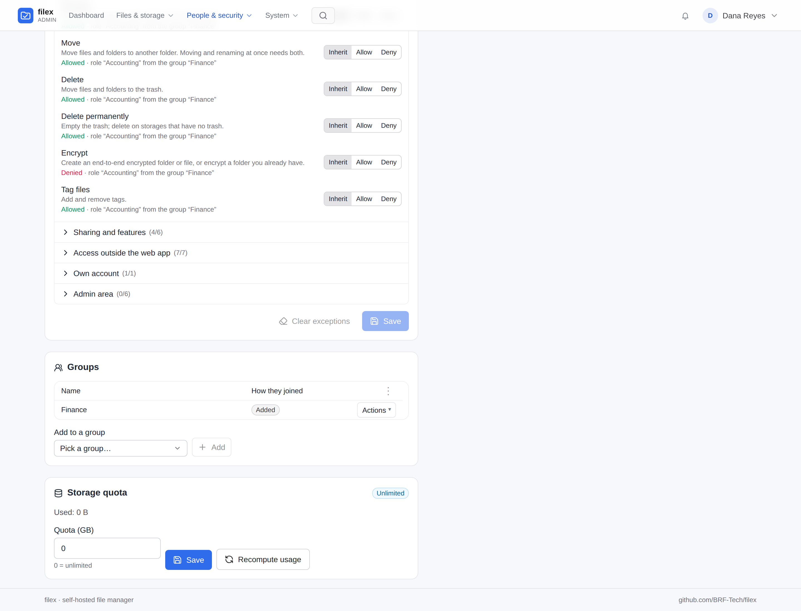
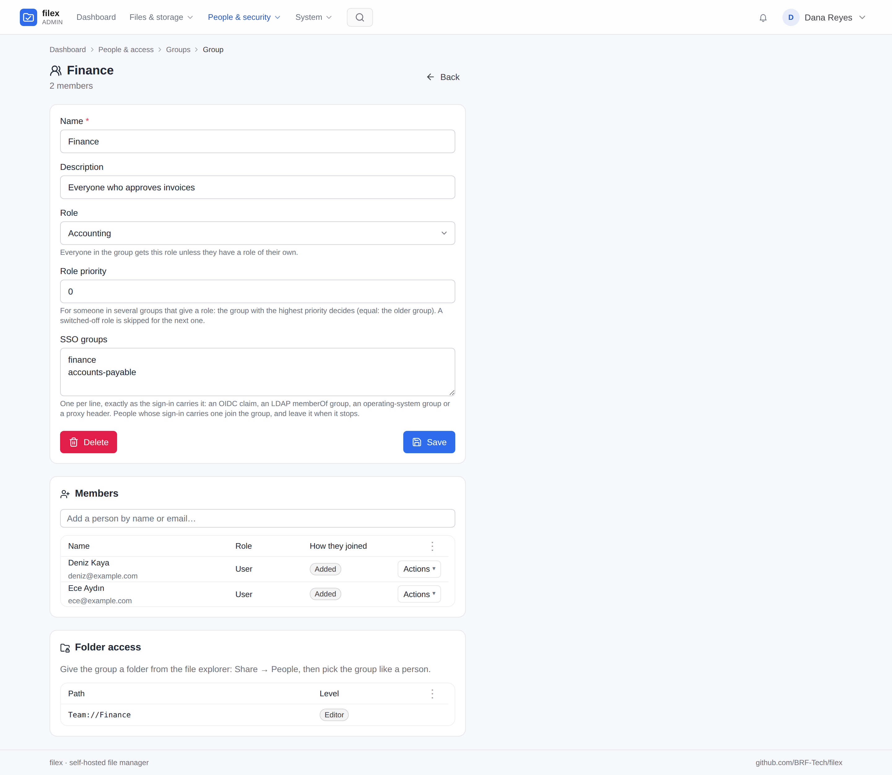

# filex - groups

Backend `internal/group`. A **group** is a named set of people in one tenant.
It can be given the two things a person can be given:

- **Folder access** - share a folder or a whole storage with the group in the
  explorer's sharing panel (Share → People), exactly as with a person. Every
  member reaches it at the level the group was given
  ([RBAC.md](RBAC.md)).
- **A role** - a custom role ([PERMISSIONS.md](PERMISSIONS.md)) that every
  member with **no role of their own** holds.

People are in a group because an administrator **added them**, or because the
group is **linked to an SSO or LDAP group** their sign-in carries.

Nothing changes on upgrade: migration 00074 only adds tables, and
migrations 00081 and 00083 a table, a label and a switch, off; until an
administrator makes a group nobody is in one.

- [Folder access](#folder-access)
- [The role](#the-role)
- [Members and SSO links](#members-and-sso-links)
- [LDAP links](#ldap-links)
- [Where people come from](#where-people-come-from)
- [Tenants](#tenants)
- [Who may manage groups](#who-may-manage-groups)
- [API](#api)
- [Audit](#audit)
- [Things to know](#things-to-know)


## Folder access


A group's grant counts exactly as the same grant to each member would:

- the **highest** level covering a path wins - a person's own grant, or any
  of their groups';
- the account's ceiling still caps it - a **Viewer** account in a group
  granted Editor reaches the folder as a viewer (so, unlike a person's grant,
  any level can be given to a group);
- grants apply on storages with RBAC on only, like a person's;
- the item appears under **Shared with me** for every member - once, at the
  highest level they hold there (their own grant or a group's), capped by
  their account as the folder itself is.

Leaving the group ends the reach at once (the next request); deleting the
group deletes its grants. Protocol sessions (WebDAV, SFTP, …) see the change
when they reconnect, as for a person's grant.

## The role



Every person has **one** role ([PERMISSIONS.md](PERMISSIONS.md#custom-roles)).
Groups only fill it in for someone who has none of their own:

1. The person's **own custom role**, picked on their page, wins - whatever
   their groups hold.
2. Otherwise, the role of the group they are in with the **highest role
   priority** (a number on the group's page, 0 by default; equal priorities:
   the older group). A group whose role is **switched off** is skipped for
   the next one - but if every role their groups hold is switched off, they
   get the first of them, which gives nothing, never the built-in User role.
3. Otherwise, their built-in role - User or Viewer.

A person whose Role field shows a **built-in** role (User or Viewer) has no
role of their own, so a group's role applies to them - picking User or Viewer
there does not replace it. The page says so before saving, and after. To
override a group's role for one person, give them a custom role on their
page, or take them out of the group. Administrators are bound by no role,
from a group or otherwise - and a group can make its members administrators
(below).

Everything else is as if the role were given on the person's page: a
switched-off role gives nothing, "different in some folders" applies per path,
and the **level underneath** (User or Viewer, see
[PERMISSIONS.md](PERMISSIONS.md#custom-roles)) follows the role - joining a
group whose role is read-only makes the account a Viewer, and while it is
one its own Editor and Owner folder shares count as Viewer too (the person's
page says so). filex keeps the level the account had **before** a group's
role first moved it, and puts it back when no group role applies any more:
leaving a read-only group gives back User; leaving a group whose role made a
Viewer account a User gives back Viewer - never the full built-in User role
the account never had.

The person's page, the Users list and the Roles page's counts say where a
role comes from ("through the group Contractors"), and so does every
refusal:

```json
{
  "error": "permission_denied",
  "permission": "files.delete",
  "source": { "kind": "rule", "rule_id": 3, "rule_name": "No delete", "group_id": 2, "group_name": "Contractors" },
  "message": "The role “No delete”, which you have through the group “Contractors”, does not allow you to delete files."
}
```

Deleting a role groups hold asks, like one people hold, what they get
instead: another role, or - for `?to=user` / `?to=viewer` - none, with their
members left on that built-in level. Another role must be one every holder
can hold: a tenant's role is refused for a group or a person of another
tenant (`400`), before anything moves.

### Administrators

A group can make its members **administrators** - the built-in
Administrator role, full access - instead of giving a role: pick
**Administrator (full access)** as the group's role (`gives_admin` in the
API). Linked to an LDAP or SSO group, the directory then decides who
administers filex: put `cn=it-admins` on the group, and whoever the
directory lists there is an administrator at their next sign-in or
directory sync. A company that signs everyone in through LDAP can then
delete the local administrator from setup.

- Its LDAP links are **full DNs** (`cn=it-admins,ou=groups,dc=example,dc=com`)
  - a name alone is refused - and count only for people of the group's own
  directory: the main directory for a group made here, the directory that
  brought it in for an imported one. Another directory (a partner's) can
  name its groups, DNs included, as it likes; it never makes administrators
  here.
- It comes before any role, the person's own included.
- **Leaving the group** - taken out here, or out of the LDAP / SSO group -
  gives back the level they had before (User or Viewer, or the role their
  other groups give), at their next sign-in or sync.
- The **last administrator** of a tenant still switched on is never
  demoted - and never switched off by directory sync - they stay one, and
  the log (or the sync report) says so. Make sure another administrator exists before
  taking the last one out of the directory group.
- An administrator **made by hand** on the person's page stays one whatever
  their groups do. One made by a group cannot be demoted on their page
  (`409`): who is in the group decides.
- Only a **full administrator** turns it on, changes or deletes such a
  group, or changes who is in it - and turning it on, new links, or adding
  people asks for a signed-in session, as promoting one person does.
- Such a group gives no other role and has no role priority.

Anyone who can change that directory group can make filex administrators -
keep it, and who may edit it, as tight as the directory's own admin groups.

## Members and SSO links



A membership is either:

| Source | How | Kept until |
|---|---|---|
| **Added** (`manual`) | An administrator, on the group's page or the person's | Someone removes it |
| **SSO** (`sso`) | The group names an SSO group the sign-in carried | The next sign-in that no longer carries it |
| **LDAP** (`ldap`) | The group names an LDAP group the directory shows at sign-in | The next sign-in where it no longer does |

A group's **SSO groups** are names of the groups a sign-in carries - the same
values a role's starting-role targets and the first sign-in rule's
`allowed_groups` read, from whichever identity provider the person signs in
with ([LDAP.md](LDAP.md#the-first-sign-in-rule-who-gets-an-account)):

| Provider | Where the groups come from |
|---|---|
| OIDC | the claim named by `role_claim`, in the ID or the access token, dotted paths such as `realm_access.roles` included ([SSO.md](SSO.md)) |
| LDAP | the entry's `group_attr` (`memberOf`): `CN=Editors,OU=Groups,DC=corp` counts as the whole value and as `Editors` |
| Linux (`pam`) | the login's groups (`id -Gn`) ([OS-LOGIN.md](OS-LOGIN.md#linux-pam)) |
| Windows | the token's groups, `CORP\Editors` and `Editors` ([OS-LOGIN.md](OS-LOGIN.md#windows)) |
| Header proxy | the roles header (`header_roles`, every line of it) - recorded whenever the request carries it, `allowed_groups` set or not ([LDAP.md](LDAP.md#groups-from-the-roles-header)) |

Compared exactly, one per line on the group's page. At **every** sign-in that
reads groups the account joins each group of its tenant that names one of
them and leaves each group it was in **only** through such a link that no
longer does - the identity provider is the authority. It is one rule for
every provider (`auth.RecordSignInGroups`): the groups are recorded, a new
account gets its starting role, the linked groups follow, and the level their
role sets is checked. A person added by hand stays whatever the provider
says; adding by hand someone who is in through a link makes the membership
manual.

Adding, changing or removing a group's SSO links takes effect **at once**,
from the groups each person's last sign-in carried (filex keeps them) - not
only at their next sign-in.

Removing an SSO member by hand is allowed, but they join again at their next
sign-in while the provider still puts them in the group - the page says so
before it does it. The header proxy signs a person in on every request, so it
writes their groups only when the set it sends differs from the one recorded:
someone removed by hand there joins again at the first request whose roles
header has changed since.

A provider with nowhere to read groups from records none: OIDC without a
`role_claim` (or a token without it) is no groups, and the account leaves
every group it was in through a link; LDAP without `group_attr` and
`allowed_groups` records nothing and leaves the memberships as the last
recorded groups made them. The header proxy tells two cases apart: a request
with **no** roles header says nothing about groups, and the last recorded ones
stay; a roles header that is there and **empty** is no groups, and the account
leaves every group it was in through a link.

## LDAP links

A group's **LDAP groups** name groups of the LDAP / Active Directory server
([LDAP.md → Groups](LDAP.md#groups)), one per line on the group's page, either
way:

- the group's **DN** - `cn=finance,ou=groups,dc=example,dc=com`;
- its **common name** alone - `finance` - which matches that name under any
  OU.

Both are compared **without case**, and a DN without the spaces around its
commas and equals signs (`CN=Finance, OU=Groups` is `cn=finance,ou=groups`);
the page stores a link in that form. At **every** LDAP sign-in to the web UI
the account joins each group of its tenant that names one of its directory
groups and leaves each group it was in **only** through LDAP that no longer
does - the directory is the authority. Members added by hand stay, as with
SSO, and SSO and LDAP memberships never touch each other: a group may carry
both kinds of link.

Adding, changing or removing a group's LDAP links takes effect **at once**,
from the groups each person's last LDAP sign-in showed (filex keeps them,
`user_ldap_groups`).

- **Sign-in and directory sync read groups.** WebDAV, SFTP, FTPS, S3 and NFS
  present the directory password on every request; they sign in, but they do
  not move memberships. [Directory sync](LDAP.md#directory-sync) brings
  everyone's groups in step without waiting for them to sign in - and makes
  accounts for people who never have.
- **A directory that cannot answer changes nothing.** If the group search
  fails, the sign-in still succeeds (the password was right) and every
  membership stays as it was, until a sign-in that can read the groups.
- **Nested groups** are not followed: a person is in the groups their entry
  (or the group search) names. On Active Directory,
  `group_filter: (member:1.2.840.113556.1.4.1941:=%s)` asks the server to
  follow them.

### Groups from directory sync

[Directory sync](LDAP.md#groups-from-the-directory) brings every LDAP group
in as a filex group linked to it (`sync_groups`, on by default). Such a
group follows its directory group - renamed with it, flagged **Removed from LDAP** when it is gone (never deleted by sync: an administrator
deletes it or keeps it as a filex group) - and its LDAP link is the
directory's. Which groups exist is managed on the directory: one deleted
here while the directory still has it comes back at the next sync. The
Groups page shows 60 groups a page, three across, and filters by source:
**Local**, **SSO**, **LDAP**, **Synced from LDAP**, **Removed from LDAP**.

## Where people come from

Every account says where it comes from, on the Users page (the **Source**
column), on the person's page and in a group's member list
(`users.auth_source`, migration 00081):

| Source | The account was made |
|---|---|
| **Local** (`local`) | Here - on the Users page, by an invitation, at first run |
| **SSO** (`sso`) | By an OpenID Connect sign-in |
| **LDAP** (`ldap`) | By an LDAP / Active Directory sign-in |
| **Proxy** (`proxy`) | By a trusted reverse proxy's headers |

It is a label: it gates nothing. An account made here that later signs in
through a directory stays **Local**. Accounts from before migration 00081:
one with an OIDC subject is **SSO**; a directory account with no password
here takes its directory's label at its next sign-in.

On the Groups page each group says where its members come from: **Local**
(added by hand only), **SSO** and/or **LDAP** (the kinds of its links); on a
group's page each member row shows both the account's source and the
membership's (**Added**, **SSO** or **LDAP**).

The Users page also has a **Groups** column - each person's groups, coloured
by how they are in them (added, SSO, LDAP) and linked to the group's page -
and a filter that narrows the list to one group.

## Tenants

A group belongs to **one tenant**, like a custom role
([MULTI-TENANCY.md](MULTI-TENANCY.md)):

- A tenant administrator's group is its tenant's, whatever the request says;
  they see and change only their tenant's groups, and anything of another
  tenant reads as not found.
- Only people of the group's tenant can be members - by hand, through SSO or
  through LDAP. So the same SSO group name (`finance`) in two tenants fills two separate
  groups. An account moved to another tenant leaves its old tenant's groups,
  and the role and level they gave it.
- Its role must be install-wide or of the same tenant; it can be given
  folders only on its tenant's storages, and only its tenant's people see it
  in the sharing panel.
- The supertenant, or an install without tenants, can make an
  **install-wide** group. Its SSO and LDAP links match only the supertenant's
  sign-ins - another tenant's identity provider sending the same value does
  not put its people in it; the supertenant adds them by hand if it means
  to. On a single-tenant install every group is one. On
  a multi-tenant install such a group can hold people of every tenant, so a
  tenant's owners are never offered it for their folders.

## Who may manage groups

Groups are managing people, so Admin → Groups is **`admin.users`**
([delegated administration](PERMISSIONS.md#delegated-administration)). A
delegated administrator:

- gives a group only a role whose every *allow* they hold - and cannot add
  people to a group whose role they could not give them directly;
- never changes **their own** memberships (a group can carry folders and a
  role) - nor deletes a group they are in, or changes its role or priority,
  which would change their own role the same way;
- never changes a group's **SSO or LDAP links**, which decide membership at sign-in -
  theirs included - nor its **role priority**, which decides whose role a
  member of several groups gets. Both are an administrator's;
- is judged by the result, as on a person's page: taking someone out of a
  group, deleting a group, changing its role, or adding people (which can end
  a stricter role they had through another group) is refused (`403`, with the
  `permissions` it would hand out) when a member would afterwards hold a
  permission the delegated administrator does not.

A group whose role has administration rights (any `admin.*` permission) makes
its members delegated administrators, so giving a group such a role, changing
its priority or links, or adding people to it needs an administrator
signed in to the admin panel - an API key is refused with `403
{"error":"session_required"}`, as when the role is given to one person
([PERMISSIONS.md](PERMISSIONS.md#handing-out-administration-takes-a-session)).

Giving a group folder access is done by the folder's **owner** in the
sharing panel (`share.users`), like sharing with a person. Giving a group
**Owner** lets every member manage who has access there, so the panel asks
first.

> ⚠ **Whoever holds `admin.users` is trusted with every folder your groups
> hold.** A delegated administrator cannot grant a folder directly, but they
> manage who is in a group, and every member reaches the group's folders. So
> they can hand out access to those folders by adding people, including an
> account they opened themselves and know the password of, which lets them
> reach the folders too. filex does not refuse it: the result check judges
> permissions, not folder access
> ([PERMISSIONS.md](PERMISSIONS.md#delegated-administration)). Give
> `admin.users` only to someone you would trust with those folders.

## API

| Method & path | Who | |
|---|---|---|
| `GET /api/admin/groups` | `admin.users` | the tenant's groups, with `member_count`, `grant_count` |
| `POST /api/admin/groups` | `admin.users` | `{name, description, role_id, priority, links, provider_id?}` → `201 {group, members, grants}`. `provider_id` only from an unconfined caller; a name the tenant has → `409` |
| `GET /api/admin/groups/{id}` | `admin.users` | `{group, members[{user_id, email, name, role, source, added_at}], grants[{id, path, level, …}]}` |
| `PUT /api/admin/groups/{id}` | `admin.users` | name, description, role, priority (absent keeps it), links (the tenant never changes) |
| `DELETE /api/admin/groups/{id}` | `admin.users` | the group, its memberships and its grants → `204` |
| `POST /api/admin/groups/{id}/members` | `admin.users` | `{"user_ids":[3,4]}` |
| `DELETE /api/admin/groups/{id}/members/{user_id}` | `admin.users` | |
| `GET /api/admin/users/{id}/groups` | `admin.users` | `{groups[{id, name, role_id, source}]}` |
| `POST /api/admin/groups/{id}/detach` | administrator | Keep a group whose directory group was removed as a filex group (drops its LDAP link); 409 while the directory has it |
| `GET /api/admin/groups/memberships` | `admin.users` | `{memberships{"<user id>":[{id, name, source}]}}` - every person's groups the caller may see, for the Users list |
| `GET` / `PUT /api/admin/users/{id}/roles` | `admin.users` | now also `group_role: {role_id, group_id, group_name}` when the person has none of their own - on a `PUT` of a built-in role, the group role that still decides |
| `GET /api/admin/roles` | `admin.users` | now also `group_assignments`: user id → `{role_id, group_id, group_name}`; `builtin_members` no longer counts them |
| `GET /api/files/permissions/groups?q=` | signed in | groups the caller could share with (names only) |
| `POST /api/files/permissions` | owner + `share.users` | `{path, group_id, level}` - a group instead of `user_id` |
| `PATCH` / `DELETE /api/files/permissions/groups/{id}` | owner + `share.users` | a group's grant (its own id space) |
| `DELETE /api/admin/grants/groups/{id}` | `admin.grants` | |

`GET /api/files/permissions` lists group grants beside people's, each with
`kind: "user" | "group"` (a group's with `group_id` and `group_name`);
`GET /api/admin/grants` does the same.

On the admin API-key surface ([MCP.md](MCP.md#tool-set)) a group's grant is
revoked by its own route and tool - `DELETE /api/ai/admin/grants/groups/{id}`,
`admin_group_grant_revoke {id}` - never by `admin_grant_revoke`, which takes
a person's grant: the two kinds are numbered apart, so a group row's id can
be a person's grant too. `admin_grant_set` takes `group_id` in place of
`user_id`. Groups themselves have no `admin_*` tool; they are managed in the
admin panel or through `/api/admin/groups` (a signed-in session, or an
administrator's admin-scoped API key).

A group body:

```json
{
  "name": "Finance",
  "description": "Everyone who approves invoices",
  "role_id": 3,
  "priority": 0,
  "links": [
    { "kind": "sso", "value": "finance" },
    { "kind": "ldap", "value": "cn=finance,ou=groups,dc=example,dc=com" }
  ]
}
```

Names are unique within a tenant - the database holds it (install-wide
groups count as one tenant), so two saves at once cannot both win. A name is
at most 100 characters and a description 1000; a group names at most 50 SSO
groups. `links`
kinds other than `sso` and `ldap` are refused; an `ldap` value is stored lower
case, without the spaces around a DN's separators. `priority` is between
-1000 and 1000.

## Audit

| Action | Details |
|---|---|
| `group.create` / `group.delete` | the group (`name`, `role_id`, `links`); delete also `members` |
| `group.update` | `before` / `after` |
| `group.members_add` | `user_ids` |
| `group.member_remove` | `user_id` |
| `group_grant.delete` | a group's folder grant revoked on Admin → Folder access (`ai.group_grant.delete` through the API-key surface); a person's stays `grants.delete` |

Deleting a role groups hold adds `groups` (how many) to its
`permission_rule.delete` row.

## Things to know

- **Storage.** `user_groups` (with `priority` and `tenant_key`, the unique
  name's scope), `user_group_members` (with `source`), `group_file_grants` -
  a separate table with its own ids, so nothing that reads a person's grants
  ever meets a row without a person - and `user_group_levels`, the level to
  give back. `user_ldap_groups` keeps each person's last LDAP groups, as
  `user_sso_groups` does their SSO ones; `users.auth_source` is where the
  account comes from (migration 00081).
- **Several processes** on one database see a membership or role change
  within 3 seconds (the permissions snapshot); folder access is read per
  request.
- **Starting role or group?** A role's *Starting role for SSO groups*
  ([PERMISSIONS.md](PERMISSIONS.md#starting-role-for-sso-groups)) sets a new
  account's role once, at its first sign-in. A group linked to the SSO group
  and holding the role follows the provider at every sign-in - use that.
