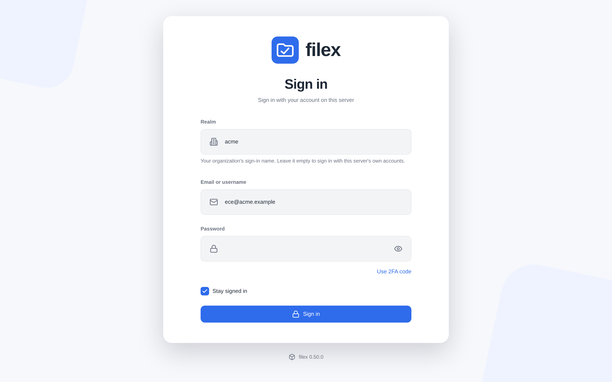
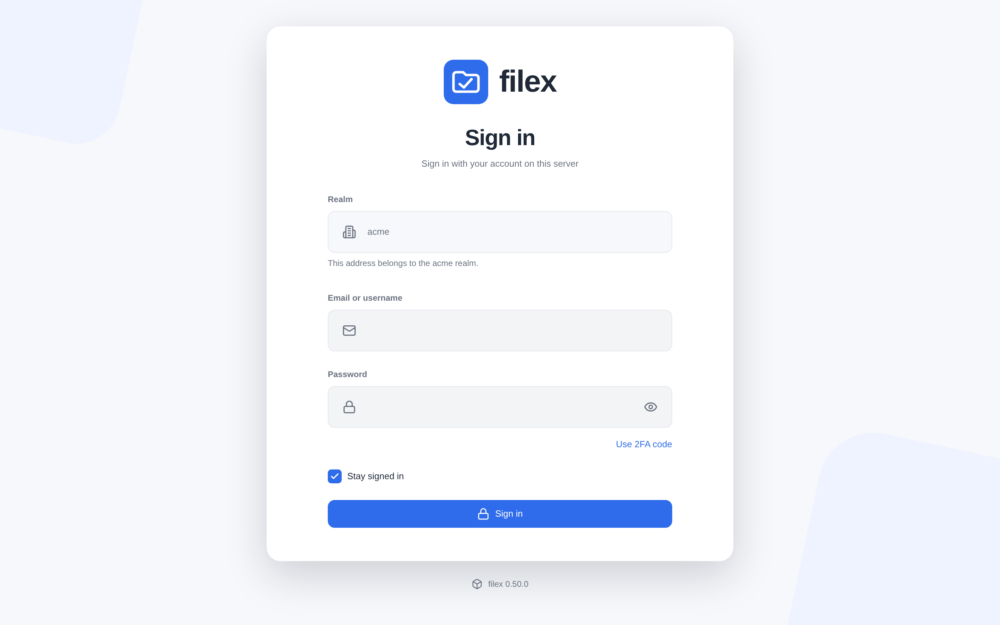

# Multi-tenancy (native)

> Status: **shipped and in production use.** Native multi-tenancy landed in
> **v0.1.61** (5 July 2026) and has been maintained since - per-tenant OIDC
> redirect and cookie domain in v0.1.66, and a round of cross-tenant isolation
> fixes in **v0.9.0** filed by a live ten-provider deployment. Every phase below
> has its core artefacts on `main`; `feat/multi-tenant` is long gone.
>
> A full isolation pass landed after this line was first written; §10 and §16
> are the current record. ⚠ **§16 is not a formality** - it names gaps that are
> open today, including one that is not a tenancy bug at all but an
> unauthenticated content disclosure. Read it before deciding this feature is
> finished.
>
> **0.50 adds tenant self-service** ([TENANT-ADMIN.md](TENANT-ADMIN.md)): the
> Tenants screen and its MCP tools, sign-in providers bound to tenants (1-1 or
> 1-n, a tenant's own OIDC and LDAP), a platform subdomain per tenant and own
> domains proven by a CNAME, with TLS from the proxy, from filex itself or a
> tenant's own certificate. ⚠ The upgrade binds every sign-in provider that
> exists to every tenant that exists (what happened before); review the
> bindings on Admin → Identity providers.
>
> Longer-standing gaps: **one email address still cannot exist in two tenants** (§4 - what realms
> solve is the other half: two tenants' `alex` with no e-mail get two different
> addresses, `alex@acme.local` and `alex@beta.local`), no
> per-tenant SMTP identity, and no live multi-realm OIDC end-to-end run. (The
> postgres/mysql CI job landed in v0.38.0 - `test:go:engines` - so the
> migrations, the schema comparison and the write paths now run on all three
> engines on every change.)
>
> This document is both the design rationale and the record of what was built.
> It stayed on "Phase 1 landed" for two months after the feature shipped, which
> is the failure mode worth naming: a status line that lies in the modest
> direction reads as caution, so nobody corrects it, and a reader concludes the
> feature is not ready when it is carrying real tenants.

## 1. Goal & shape

Serve **N independent tenants from one filex install**. A tenant = an **auth
realm (OIDC or local) bound to a host, linked to one or more storages**. Someone
who signs in through realm X sees only storage X - *even an admin*. Sharing works
between users of the same realm; users of other realms are invisible.

This is **not** built from scratch - filex already owns the hard isolation
primitives:

- `confine.Root` - server-side path jail, cannot be bypassed by the client.
- per-storage RBAC + item grants.
- scoped API tokens - a downstream application already runs a hand-rolled
  version of this, confining each of its projects to its own prefix.

Native multi-tenancy makes that a first-class, host-resolved layer.

### The provider = tenant collapse

A **provider** row *is* the tenant. We do not add a separate `tenants` table:
the auth realm, the host binding, the storage links and the branding all hang off
the provider. (If a tenant ever needs two IdPs or local+OIDC, split provider from
tenant later - YAGNI while every tenant = one Keycloak realm.)

## 2. Two isolation layers (the de-risking argument)

Isolation is enforced in **two independent circuits**. Keep them separate in your
head and in the code:

1. **File data → storage confinement.** A request can only reach the storages
   its provider is linked to; every path is confined server-side (`confine.Root`,
   node→storage derivation). This is the *only* circuit that can leak file bytes.
2. **Directory → provider_id scoping.** User lists, share-pickers, grants, audit,
   search results are filtered by the requester's `provider_id`.

⚠⚠ **This section used to end with a reassurance that was not true, and the
correction is the most important sentence in the document.**

It said: *"a bug in layer 2 leaks at most a user's name, never file data,
because layer 1 is a separate circuit - the worst realistic outcome is a name
leak, small blast radius. Say this explicitly in user docs; it is the reason to
trust the feature."* It also said layer 1 holds because the *"client never
supplies a storage id it doesn't own"*.

Both were falsified by measurement. The client **did** supply a raw `storage_id`
and a raw `node_id` on a number of `/api/files` endpoints, and those are layer-1
surfaces: `read`, `stat`, the manager listing, share creation, version restore,
the ops queue. The two circuits were only independent where somebody had written
the check; there was no structural separation making layer 1 safe from a layer-2
mistake, because most of these endpoints had no layer-1 check at all - their only
gate was RBAC, which is tenant-blind and, on a default install, open to any
authenticated user (see §16.6).

The reassurance was also self-reinforcing in the worst way: it told the reader
this was "not the scary kind" of tenancy and instructed them to repeat that to
customers, which is exactly the sentence nobody re-derives.

What is true now: both circuits are enforced, endpoint by endpoint, and the
ownership predicate (`handlers/tenantown.go`) is shared so a new by-id endpoint
has one obvious thing to call. What remains untrue is any claim that the
architecture makes byte leaks *impossible* - it does not. It makes them
checkable. §16 lists what is still open.

## 3. Mode gating (backward-compat is non-negotiable)

`FILEX_MULTI_TENANT` (config `multi_tenant`, env `FILEX_MULTI_TENANT=1|true`).

- **OFF (default):** on a plain single-tenant install (only the `default`
  provider, which is the supertenant) it behaves **exactly** as today - the
  scoped-store wrapper is a no-op, host resolution is skipped, admins see
  everything, `provider_id` is inert. A CI test asserts this is byte-identical to
  the pre-feature build - the trust anchor for OSS.
- **OFF with tenants present = maintenance mode.** If you turn the flag off on an
  install that already grew tenant providers, **no data is touched** and it is
  fully reversible; the flag just gates *login*: only the **supertenant**
  provider's users may authenticate, every tenant is locked out until you flip it
  back on. (This is why single-tenant is unchanged: there the only provider *is*
  the supertenant, so nobody is locked out.) Turning the mode off is therefore a
  safe operation, not a one-way door.
- **ON:** host resolution, per-provider confinement and directory scoping engage.

This lets the OSS product sell both postures: isolation-maximalists run
one-container-per-tenant (mode off, zero shared-process risk); scale-seekers run
one install, mode on.

### Activation / migration

Flipping the flag on must not require surgery:

1. There must be a super-admin. If a pre-existing OIDC provider exists, mark it
   `is_supertenant`; if the install is local-auth only, the local bootstrap
   admin is the super-admin.
2. All existing users get `provider_id` = the default provider.
3. Existing storages link to the default provider.

Migration 00014 already creates the `default` provider (with `is_supertenant=1`,
the "original org = owner") and backfills `users.provider_id`, so the invariant
"every user has a provider" holds from the first upgrade - inertly while mode is
off. **"Existing OIDC becomes supertenant" is a migration-time default (an
editable row), not a hard code rule.** Turning the mode back off never corrupts
data - it drops to the maintenance mode above (supertenant-only login), so it is
always reversible; no guard needed.

## 4. Data model

New in migration `00014_multi_tenant` (3 dialects, additive only):

- **`providers`** - the tenant/provider registry: `slug`, `name`, `host`,
  `auth_type` (`oidc|local`), `oidc_*` (issuer/client_id/client_secret/redirect),
  `role_claim`, `admin_group`, `is_supertenant`, `enabled`. Migration
  `00015` adds the optional `cookie_domain` (see §Session cookie below), and
  migration `00073` the tenant's **`realm`** - its sign-in name, unique, set
  when the tenant is created and never changed; the supertenant has none
  ([§7 Realms](#realms-which-tenant-a-sign-in-is-for)).
- **`provider_storages`** - M:N link (behaviour 1:1 in the first UI; join table
  from day 1 so 1:N is a UI change, not a migration).
- **`users.provider_id`** (nullable FK) + **`users.oidc_subject`**.
- A `default` provider row + `users.provider_id` backfill.
- Migration `00079` (0.50): **`users.oidc_issuer`** - with `oidc_subject`, the
  SSO identity an account is bound to - and the unique index
  **`(provider_id, oidc_issuer, oidc_subject)`**: one identity, one account per
  tenant ([§7](#7-auth--identity-jit)). Every issuer was NULL when it arrived,
  so no existing data could break it. Also `users.disabled_reason` (an account
  the server opened switched off, waiting for approval) and
  `providers.oidc_trust_email` (a tenant's own OIDC's "trust this provider's
  email addresses").

Placement rationale - **scope by ownership, not a column on every table.**
Everything reachable *only through a storage* (nodes, shares, grants, sync_runs,
thumbs, conflicts) inherits tenancy through `storage_id` → `provider_storages`;
it needs **no** `tenant_id`. Everything reachable through a user
(sessions, api_tokens, notifications) inherits through `user_id` → `provider_id`.
So the tenant tag lives on just **providers, users** (+ per-tenant `settings`
later). `api_tokens` need **no** column - a token's tenant is its user's tenant.

### Still to schema (later phases, deliberately deferred here)

- **users email uniqueness** → swap global `UNIQUE(email)` to
  `UNIQUE(provider_id, email)`. Needs a sqlite table-rebuild and a mysql index
  swap; lands with the JIT/login code that actually needs per-provider emails.
  ⚠ **Still not done, and it is the one deferral a reader can trip over.**
  `users.email` is globally unique today, so an address that exists in tenant A
  cannot be created in tenant B - the account creation simply fails. (Through
  SSO the person is told only "SSO sign-in failed", on purpose: naming the
  reason would say that tenant A exists; the log says it,
  [SSO.md](SSO.md#when-an-sso-sign-in-is-refused).) Isolation
  does not depend on this (it is a convenience, not a boundary), which is why it
  was deferred; but the migration number this document once claimed for it
  (`00015`) went to `provider_cookie_domain` instead, so there is no gated file
  waiting anywhere. It has to be written.
- **`oidc_client_secret`** should be encrypted at rest, reusing the
  `external_services.secret_enc` pattern.
- ~~**`settings.provider_id`** (nullable = global) for per-tenant branding.~~
  Superseded: per-tenant branding shipped **without a schema change**.
  `handlers/branding.go` stores a tenant's values under prefixed keys
  (`tenant.<providerID>.branding.<leaf>`) in the existing global `settings`
  table and overlays them on the instance defaults, and `handlers/settings.go`
  rewrites reads and writes for a non-supertenant admin transparently. Covered:
  `name`, `logo_url`, `accent`, `footer_text`, `hide_powered_by`.

## 5. Tenant resolution

- **UI / browser → by Host.** `files.globex.com.tr` → provider `globex` →
  authenticate with that realm's OIDC. Each tenant keeps its own domain, no extra
  login page. Behind a proxy, resolve from a **trusted** `X-Forwarded-Host` only
  (untrusted host header must not select a tenant).
- **API / agents → by token.** `api_tokens` → `user_id` → `provider_id`. The
  MCP/agent path is tenant-scoped without any host.
- **A sign-in → by host, or by realm.** Before an account can be looked up, a
  sign-in has to say which tenant it is for: the tenant's own address (web
  page, WebDAV `Host`, FTPS SNI), or its **realm** typed on the platform's
  page or as `realm/name` in a protocol user name (SFTP, WebDAV, FTPS). When
  neither names one, the sign-in is the platform's own tenant. See
  [§7 Realms](#realms-which-tenant-a-sign-in-is-for).

Both feed a single `TenantID`/`ProviderID` into the request context.

## 6. Enforcement - one choke point, fail-closed

Do **not** sprinkle `WHERE provider_id = ?` across handlers (miss one → leak).
Put `provider_id` in the request context and wrap `db.Store` in a **scoped
store** that injects the tenant filter into every tenant-scoped query, and
**fails closed** (no tenant in context in mode-on → error). filex's small,
hand-rolled `Store` interface makes this a single wrapper instead of dozens of
edits.

**Background work is storage-scoped, not request-scoped.** Sync, the queue
(thumbs, ops, replica, content extraction and **antivirus scans** - including
the two producers added in v0.34.0: a scan for every file the storage walk
newly catalogues or finds drifted, enqueued one priority step below anything a
person asked for, and the editor's delayed save-scan, which is an `ops_queue`
row with a `not_before` rather than a timer in the process) and cron run
outside any HTTP request - no host, no session.
They already operate *on a storage/node*, so they derive tenancy from that
storage, not from a context. The scoped-store wrapper is for the HTTP/API path;
workers are storage-native and already isolated. Do not thread request-tenant
context through workers.

## 7. Auth & identity (JIT)

- **Every OIDC sign-in is for ONE tenant**: the one its flow was started for
  (realm, address), else the platform's own. Every OIDC driver is bound to a
  tenant when it is built - a tenant's own OIDC (on its row, or its own
  instance) is pinned to its tenant and serves no other; a shared one is the
  platform's own tenant's until a flow names another. No OIDC lookup ever
  leaves the tenant, and the account it finds is checked against the tenant
  once more before a session is opened: an account of another tenant is
  refused with the generic answer, as a password sign-in's realm refuses it
  ([SSO.md](SSO.md#which-account-an-sso-sign-in-opens)). On a multi-tenant
  install a callback without its flow cookie is refused.
- **First OIDC login → JIT-create** the user with `provider_id` = the sign-in's
  tenant and the SSO identity it signed in with, `(oidc_issuer, oidc_subject)`.
  The tag is **immutable** (a user can't hop tenants).
- Uniqueness is **`(provider_id, oidc_issuer, oidc_subject)`** (migration
  `00079`), and an account is found by that identity first, by its address
  (inside the tenant) only when it is bound to none yet - and then only with
  `email_verified: true` or a provider whose addresses the operator trusts.
  ⚠ Before 0.50 this section said the lookup was scoped. It was not, for the
  platform's OIDC: the driver no tenant pinned looked accounts up by address
  across the platform, so an identity provider could sign a person in to another
  tenant's account (the 0.50 security fix,
  [changelog](../CHANGELOG.md)).
- ⚠ Email is still **globally unique** (§4), so two tenants may NOT both have
  `admin@` yet: an address that exists in tenant A cannot be created in tenant
  B, and that refusal is the generic one.
- Role/scope: reuse the existing OIDC claim→role logic (roles read from *both*
  id_token and access_token, dotted-path `admin_group`). `scope = platform if
  provider.is_supertenant else tenant`.

### Realms: which tenant a sign-in is for

Two tenants can each have a person called `alex`. A login name alone cannot
tell them apart, and before this there was a sharper edge: a directory or
operating-system account with no e-mail got the address `alex@local` in every
tenant, and addresses are unique across the platform - so the second tenant's
`alex` could never get an account at all. A **realm** is a tenant's sign-in
name, and it settles both.

(Not the same thing as an identity provider's realm - a Keycloak realm, say,
which this document also calls "realm" where it means the tenant's OIDC login.
A tenant realm is filex's own name for the tenant, used where filex itself asks
for a password. The two are often spelled the same, and nothing requires it.)

**What a realm is.** A column on the tenant (`providers.realm`, migration
`00073`): lower-case letters, digits and dashes, at most 63 characters, starting
and ending with a letter or a digit; a handful of names are reserved (`admin`,
`default`, `local`, `root`, `filex`, the protocol names). It is **given when the
tenant is created** - the slug by default, or `realm` in the create request -
and existing tenants got their slug of the day of the upgrade, lower-cased.

⚠ On SQLite and PostgreSQL a slug is case-sensitive, so an older install can
hold two tenants whose slugs differ only in case (`Acme`, `acme`). They cannot
both have that realm: the migration stops on the unique index and the server
does not start until one of the two is renamed. Look before upgrading:
`SELECT LOWER(slug), COUNT(*) FROM providers GROUP BY LOWER(slug) HAVING
COUNT(*) > 1;`. (MySQL's default collation compares slugs without case, so
such a pair could not be created there.)

⚠ **A realm never changes**, not even when the slug does. It is written into
the addresses of the tenant's directory and operating-system accounts
(`alex@acme.local`) and into every client configuration its people saved
(`acme/alex` in an SFTP bookmark); renaming it would strand both. The API
refuses a different realm on an update (`400 realm_immutable`; sending the same
one back is fine), and the store never writes the column after creation.

**The platform's own tenant (the supertenant) has no realm.** An empty realm is
how the platform operator - and every account of the platform's own tenant -
signs in. (A tenant that becomes the supertenant by a flag transfer keeps the
realm it had as a second name; the one that lost the flag keeps none and is then
reached only on its own address.)

**Which tenant a sign-in is for** (`auth.ResolveLoginRealm`, one rule for the
web and every protocol):

| The client reached… | …and named the realm | Tenant |
|---|---|---|
| a tenant's own address | nothing, or that tenant's realm | that tenant |
| a tenant's own address | another realm (or the platform's, `/name`) | **refused** |
| the platform's address, or no address | a realm | that realm's tenant |
| the platform's address, or no address | nothing | the platform's own tenant |
| anywhere | a realm nobody has | **refused** |

The platform's address is any host that is not a tenant's (the supertenant's
own `host`, an IP, a host no row claims). A refusal is **the one answer a wrong
password gets** - same status, same body, counted by the sign-in limit - so the
form never tells a stranger which realms exist.

**The account lookup never leaves the tenant.** In a realm the identifier is
looked up inside that tenant only (`identity.ResolveIn`): an identifier that is
an e-mail address as typed and nothing else; a bare name first as the address a
provider would have derived for it in this realm (`alex` → `alex@acme.local`),
then as a username. An account of another tenant is skipped, not found. And
whatever a provider returns, the realm checks it once more
(`LoginRealm.Admits`) before a session is opened: an account of another tenant
is never signed in to, however the realm and the address are played against
each other. ⚠ A password in the platform's own realm is the platform's
accounts' only: a tenant's person on the platform's page types their realm (a
behaviour change for installs that used to let them in by e-mail alone). The
one exception is a directory provider's `provider` pin: a sign-in that names no
realm and reaches no tenant's address, and that the pinned provider signs in,
is admitted into the pinned tenant.

⚠ **Usernames stay unique across the whole platform** (`users_username_uidx`).
Acme's `alex` may hold the username `alex` and beta's `alex2`; each still signs
in as `alex` in their own realm, because the derived address is looked up first.

**Derived addresses carry the realm.** A provider that knows only a login name
(LDAP with no mail attribute, Linux PAM, Windows) gives the account
`<name>@<realm>.<token>` in a tenant's realm and `<name>@<token>` for the
platform's own tenant - `alex@acme.local`, `alex@local` with the default token
(`FILEX_OS_LOGIN_EMAIL_TOKEN`; [OS-LOGIN.md](OS-LOGIN.md),
[LDAP.md](LDAP.md#e-mail-address-for-an-account-that-has-only-a-login-name)). The realm is the tenant the
account belongs to: the realm the sign-in named, else the login host's, else the
provider's `provider` pin. A real domain (a mail attribute, `email_domain`,
`CORP\name`) is the same in every realm, and an account at such an address that
belongs to another tenant is refused before anything is written to it.

**The sign-in form.** On a multi-tenant install `/api/capabilities` carries
`realm: {enabled: true, locked_realm}` (a single-tenant answer carries no
`realm` at all, and the form has no field):

- on the **platform's page** the Realm field is empty and free - empty is the
  platform's own accounts, `acme` is acme's;
- on a **tenant's own page** it arrives filled with that tenant's realm and
  read-only, with a line saying why: the address already names the tenant.

| The platform's page: the Realm field empty and free | A tenant's own address: the field filled in and read-only |
|---|---|
|  |  |

**The handoff to a tenant's own address.** The session cookie belongs to the
host it was set on. A realm typed on the platform's page for a tenant that has
an address of its own therefore does not open a session there: the answer is
`{"handoff": {"origin", "code"}}` - no cookie, no token - and the page goes to
the tenant's sign-in page - the same front door it started from, `/drive/login`
or `/admin/login`, with the same query - with the code in the URL **fragment**
(`https://files.acme.example/drive/login#handoff=…`). That page takes it out of
the address bar and redeems it (`POST /api/auth/handoff`), and the session is
opened on the tenant's address. The ticket:

- is bound to the **one account** that just signed in (password and second
  factor both checked on the platform's page);
- lives **60 seconds** and is **spent by its first use**;
- is honoured on **the tenant's host only** - shown anywhere else it is refused
  and spent all the same - and only for an account that is still that host's
  tenant's and may still sign in;
- travels in a fragment, which a browser never sends to a server, so it appears
  in no access log, proxy log or `Referer`; the server never logs it.

The ticket is a general primitive (`auth.HandoffStore`), not a sign-in
special case: it carries a **purpose** (`login_handoff` today), an **actor** -
the account that caused it - and a **subject** - the account the session is
for (the same account for a sign-in), the target **host** and the tenant that
host must name. A ticket is never accepted for another purpose; the first
redeem spends it whatever it answers; at the target the actor and the subject
are checked again (they exist, may still sign in, and the subject is the host's
tenant's). Its life is in the audit log - `auth.handoff_issued`,
`auth.handoff_used`, `auth.handoff_refused` with the reason (`expired`,
`wrong_host`, `wrong_purpose`, `wrong_tenant`, …), filed under the actor with
the subject as the target - and never the code: the store keeps only the
code's SHA-256. A code that is unknown or already spent is not audited (anybody
can send one to a public endpoint), only logged at debug. Tickets are held in
memory, like every short-lived ticket here: behind several replicas the redeem
needs sticky routing.

⚠ The primitive is shaped for what comes next and does not do it yet: an
administrator's **"sign in as this account"** (impersonation - actor ≠ subject)
and a platform operator's **"switch to this tenant"** will issue tickets of
their own purposes, and each will add its own rule at redeem (who may act for
whom) on top of the shared checks. Neither exists today.

A tenant with **no** address of its own is signed in to on the platform's
address: sessions are scoped by the account's tenant, not by the host
(`auth.TenantResolver`).

**Protocols.** WebDAV reads the tenant from `Host`, FTPS from the TLS SNI, and
SFTP - which never learns the address the client dialled - from `realm/name` in
the user name. WebDAV and FTPS take `realm/name` too, where the address names no
tenant (the platform's address, FTPS without SNI). API tokens and registered
SSH keys need no realm (the credential names its account), but a realm that is
named must be theirs. See
[PROTOCOLS.md → Multi-tenant installs](PROTOCOLS.md#multi-tenant-installs-the-realm).

**The command line.** `filex client login` takes the realm as `--realm` on the
platform's address (none is needed at a tenant's own) and saves it with the
address for the next login there. It follows a handoff as the web page does:
it redeems the code at the tenant's address and keeps that address for the
commands that follow - `filex sync` and `filex mount` included
([CLI.md](CLI.md#multi-tenant-servers-the-realm)).

**The sign-in limit** counts `<realm>/<name>`: `acme/alex`, `alex` on acme's
address and the web form's `alex` in realm acme are one counter; beta's `alex`
and the platform's are others ([CONFIGURATION.md](CONFIGURATION.md#sign-in-attempt-limits)).

### Absolute URLs (multi-tenant)

**Every absolute URL filex hands out is built on the tenant's host, not on
`FILEX_PUBLIC_URL`.** One resolver - `internal/tenanturl` - answers that
question for the whole server, and a new absolute-URL builder belongs on it
rather than on `PublicURL`:

| Surface | URL |
|---|---|
| Share / file-request links | `/s/{token}`, `/d/{token}` |
| Realtime | the `wss://…/api/ws` endpoint advertised with a ticket |
| Email | drop-received notice, item-grant notice, **account-created (temp password + login link)**, invite share link |
| Integrations | the `/s/{token}` and `/u/{ticket}` URLs returned to AI / MCP / ShareX |

Two ways in, because not every URL is minted while a browser waits:

- **From the request** - the host it asked for, and only when that host
  resolves to an **enabled provider row** (same trusted-host model as tenant
  resolution, §13). Anything else falls back to `PublicURL`, so a forged
  `Host:` header can never appear in a minted link or an email. The origin is
  assembled from the provider row's own `host` column, not from the request
  string.
- **From the data** - where there is no `*http.Request` (an MCP tool call, an
  async op, a queue worker), the tenant comes from the node's **storage** →
  provider link. A storage linked to no provider falls back to `PublicURL`.

Scheme is `https` (TLS-terminating proxy assumed) unless the proxy sends
`X-Forwarded-Proto: http`, or `FILEX_PUBLIC_URL` itself is `http://` (a
TLS-less dev install). **Single-tenant installs are unchanged**: the request is
never consulted and `PublicURL` is always the answer.

### Callback redirects & session cookie (multi-tenant)

- **OIDC callback redirects target the TENANT's host, not `FILEX_PUBLIC_URL`.**
  Each realm's `redirect_uri` points at the tenant's own host, so after the
  IdP round-trip the success (`/admin/`), error (`/admin/login?error=oidc`)
  and maintenance (`?maintenance=1`) redirects all derive their base from the
  request host - **only when that host resolves to an enabled provider row**
  (same trusted-host model as tenant resolution, §13); any other host falls
  back to `PublicURL`. Scheme is `https` (TLS-terminating proxy assumed, as
  for the per-tenant OIDC redirect default) unless the proxy sends
  `X-Forwarded-Proto: http`. Single-tenant behaviour is unchanged.
- **Session-cookie `Domain` resolves per tenant** so each tenant can share
  its session across its own subdomains (`files.` / `webmail.` / `portal.`):
  1. the provider's explicit **`cookie_domain`** (e.g. `.example.com`) -
     always wins, set it via `/api/admin/providers`;
  2. else **derived from `provider.host`** by dropping the first label
     (`files.example.com` → `.example.com`); skipped when nothing dotted
     remains (`files.localhost`);
  3. else the global **`FILEX_COOKIE_DOMAIN`** (may be empty = host-only).
  Applied on set AND clear (logout removes the same cookie it created).
  ⚠ Derivation assumes the `files.<apex>` layout. A tenant served on its
  bare apex - or one whose derived value would be a **public suffix**
  (`tenant.com.tr` → `.com.tr`, which browsers silently reject, breaking
  login) - must set `cookie_domain` explicitly.

## 8. Supertenant & super-admin

Super-admin is **not** a special mechanism - it's a provider flag:

- `providers.is_supertenant = true` → its admins are **platform-scoped** (see all
  tenants). Same JIT/admin_group path; the flag only changes what "admin" *means*.
- **Guardrails:**
  - Supertenant is **confine-exempt + platform-scoped**; it may optionally have
    its own storage (owner-org that is also ops), but that is orthogonal.
  - **At most one** supertenant (enforced).
  - Keep a **local bootstrap super-admin** (bcrypt) - chicken-and-egg (you need
    super-admin to configure the supertenant provider) + break-glass if the realm
    is down. Supertenant realm = daily ops; local admin = setup + emergency.
  - Supertenant realm should be a hardened, separate Keycloak realm; whoever owns
    it owns the platform. Tight `admin_group`.
  - Every cross-tenant super-admin action is **loudly audited**.

## 9. Admin scoping change (biggest behaviour delta)

Today `admin` is RBAC-exempt and sees **all** storages. In mode-on, a
**tenant-admin sees only their linked storages/users/audit**; only the
supertenant sees all. So `storages.list`, the user directory, audit, etc. filter
by the requester's provider. Gate this behind the mode so single-tenant admins
are unchanged.

## 10. Isolation checklist (the periphery that leaks if forgotten)

- [x] **Search (bleve + `tag:` filters)** - hits are filtered to the requester's
      accessible `storage_id`s in `handlers/search.go`, and the second search
      box (`/api/files/manager?action=search`, which had its own unfiltered
      cross-storage path) now shares that rule. The tag listings
      (`/manager/tagged`, `/manager/tags*`) were a third door into the same
      catalogue and are filtered too.
- [x] **Tags themselves** (v0.43.0) - until then a tag was one label per file
      with no owner and no tenant, so `tags/all` told every tenant the tag
      NAMES every other tenant used (measured: bravo's panel listed alpha's
      "müşteri teklifi"). Tags are now personal (one user) or team (one
      tenant: `tags.tenant_id`), a team tag is never shown to another tenant -
      not even on a storage both tenants are linked to - and tenant 0 means
      "the instance" (a single-tenant install, or a storage linked to no
      tenant). See [Tags - personal and team](SEARCH.md#tags---personal-and-team).
- [x] **All pickers server-filtered** - user directory, storage-picker,
      share-picker, grant-picker (RBAC), audit, notifications, search. The
      picker that was NOT filtered was
      `GET /api/files/permissions/resolve?email=`: it calls `GetUserByEmail`,
      which is not one of the three methods `tenantstore` confines, so one
      query per address made it a membership oracle over the whole platform. It
      now answers `found:false` for a foreign account - the same shape as an
      address nobody has registered, so the refusal carries no signal.
- [x] **Shared sidecars (OnlyOffice/convert)** - this bullet used to say the
      storage is "derived server-side from the node (not client-supplied)".
      That was true and beside the point: the **node id** is client-supplied, so
      deriving the storage from it derived nothing. The `node_id` form of
      `/api/files/onlyoffice/config` now checks ownership; the `path` form was
      always safe, because it resolves through the confined storage list.
- [ ] **`/api/capabilities`** (pre-auth, host-resolved) - the `tenant` block is
      correctly host-derived, but the endpoint is built on the **raw** store and
      its snapshot is process-global, so the enabled storage **ids** it returns
      are instance-wide. Named in section 16.
- [x] **Instance-wide admin surfaces are gated on the supertenant.** See
      [Instance-wide admin surfaces](#instance-wide-admin-surfaces) below.
- [x] **Row-level ownership on every admin route that takes an `{id}`.** See
      [Ownership, not supertenancy](#ownership-not-supertenancy) below.
- [x] **Public shares (`/s/{token}`) are intentionally host-agnostic to
      *serve*** - a link is a link; the file stays confined via
      token to node to storage, and the uploader supplies none of it for
      `/d/{token}` either. Host-agnostic *serving* is not host-agnostic
      *minting*: the link filex hands out names the tenant's host (see
      "Absolute URLs" above). Share **creation** was the gap, not serving: the
      `{node_id}` body shape accepted any node on the instance while the
      `{path}` shape resolved through the confined list. Both shapes now agree.

### Ownership, not supertenancy

A second class, and the more dangerous one. These routes are legitimate tenant
features - a tenant admin may reset **their own** user's password, revoke
**their own** share, empty **their own** trash - so a supertenant gate would be
a regression rather than a fix. The question is not "may you touch this
surface" but "do you own the row you just named", and `tenantstore` answers it
for exactly three list queries and nothing else. Every route taking an `{id}`
looked the row up directly.

Measured, not assumed: `TestOwnership_ForeignIdsAreRefused` runs an admin of one
tenant at another tenant's ids over real HTTP. On the pre-fix build **fifteen of
sixteen crossings succeeded.**

| Route | What a foreign tenant admin could do | Now |
|---|---|---|
| `POST /users/{id}/reset-password` | **200, with the victim's new cleartext password in the response body.** One request, one other customer's account, credential included. `GET`/`PATCH`/`DELETE` on `/users/{id}` were gated; this sibling lives on a different handler type and was missed. | 404 |
| `GET /storages/{id}` | Returned the storage's whole `config` blob - for an S3 or SFTP storage, the access key and secret | 404 |
| `PATCH` / `DELETE` / `{id}/sync` on storages | Repoint, or **delete** (cascading the node rows), another tenant's storage | 404 |
| `{id}/sync-runs`, `{id}/drift`, `sync-runs/{id}` | Another tenant's sync history and conflicting paths | 404 |
| `quota/{user_id}` and the nested `users/{id}/quota` | Read, and clamp to one byte, another tenant's user | 404 |
| `versions/{id}`, `trash/{id}`, `grants/{id}`, `shares/{id}` revoke + delete | Destroy another tenant's version history, trashed files, RBAC grants and live share links | 404 |
| `ai-tokens` - `POST` with any `user_id`, plus list/patch/delete by id | **Identity takeover.** A token authenticates AS its bound user, with that user's scope, so an unchecked `user_id` mints a credential over another tenant's whole storage set - needing no password and no login | 404 |

**Groups** ([GROUPS.md](GROUPS.md#tenants)) are built on this rule from the
start rather than fixed into it. A tenant admin's group is stamped with their
tenant whatever the body says, and every group route - read, edit, delete,
members, the sharing panel's group picker and a group's folder grants -
answers another tenant's group, and an **install-wide** one, as unknown (404).
An install-wide group is the supertenant's: only an unconfined caller makes or
changes one, its SSO links match only the supertenant's sign-ins, and a
tenant's role can be given only to that tenant's groups. Pinned by
`TestGroups_TenantIsolation` and `TestGroups_InstallWideIsTheSupertenants`.

The refusal is **404, not 403**. A 403 confirms the row exists; repeated over an
id range it becomes a census of the platform's other customers. The
instance-wide gate below answers 403 because there the *surface* is refused and
the operator needs to read why.

The predicate is `handlers/tenantown.go` - `ownsStorage`, `ownsNode`,
`ownsUser`, `userInTenant`. Same reasoning as `supertenant.go` for why it lives
in the handler rather than on the chi route.

### Instance-wide admin surfaces

Everything under `/api/admin` has already passed `auth.RequireAdmin`, and in
mode-on that means **an admin of some tenant** - the resolver labels the
request, it does not deny anything. Surfaces whose effect is one global row or
one global process ask `requireSupertenant`
(`backend/internal/api/handlers/supertenant.go`).

The check is inside the HANDLER and not on the chi route, because the route is
not the only door: `/api/ai/admin` mounts the same handler instances behind an
`admin`-scoped API token, and the MCP admin tools drive those same methods
in-process.

**Single-tenant installs are unaffected by construction.** `TenantResolver`
attaches no scope when mode is off, absence means "unscoped", and unscoped
passes. There is no flag to set and nothing to configure. Each change below has
an explicit single-tenant test, and those pass on the pre-fix build too - which
is the honest form of that proof.

**Gated (403 `supertenant_only`):**

| Surface | What one tenant admin could otherwise do to everyone |
|---|---|
| `/api/admin/protection` | Turn antivirus **off** for the instance, or point clamd at a host they control. The READ is gated too: it returns the clamd address and a live reachability probe. |
| `/api/admin/external` | Repoint the shared OnlyOffice / converter at their own host **and overwrite the shared JWT secret** - every tenant's documents in transit. |
| `/api/admin/auth-providers` | Rewrite the global `auth.*` rows (OIDC issuer + client secret, LDAP bind) - who can sign in at all. |
| `/api/admin/login-security` | The [sign-in attempt limits](CONFIGURATION.md#sign-in-attempt-limits): switch them off, allow-list an address so it is never limited and may enter any locked account, choose which proxy's forwarded address is believed, unlock other tenants' accounts. Every verb is gated, reads included (the lock list names accounts and addresses). |
| `/api/admin/update` | Replace the binary every tenant is served by. |
| `/api/admin/providers` | Tenant lifecycle. |
| `/api/admin/plugins` | Install a process filex runs. The tenancy check runs **before** the `plugins_disabled` 503, so the refusal does not disclose whether plugins are switched on. |
| `/api/admin/app-plugins` | Apps are instance-wide (the table has no tenant column): install one into every tenant's file menu, change its grants and settings, or force-lift the file locks it holds. |
| `/api/admin/plugin-requests` | An [install request](APP-PLUGINS.md#install-requests) asks for an instance-wide plugin: leaving, reading, approving and rejecting one are the platform operator's, like the plugins themselves. |
| `PUT /api/admin/roles/builtin` | The built-in User and Viewer roles are one row each, held by every account of every tenant without a custom role: take downloads away from everyone, or put `admin.*` into the User role and make every account on the platform a delegated administrator of its own tenant. Reading stays open - a tenant's admin needs to see what their people start from - and a tenant's own roles are custom roles (`permission_rules.provider_id`). |
| `/api/admin/themes` | Themes are instance-wide too: a theme one tenant's admin wrote would paint every other tenant's users. The instance default is the `ui.default_theme` setting, which the per-key classification below already refuses to a tenant admin. |
| `/api/admin/webhooks`, `/api/admin/notifications/webhook-config` | One target list receives **every tenant's** event stream, so a tenant admin adding a target subscribes to other customers' file paths. Per-tenant targets are a feature - the rows must carry a provider and the emitter must filter by it - not something a gate approximates. Same 503-ordering note as plugins. |
| `/api/admin/replication-targets`, `/api/admin/replica/*` | Fan every tenant's writes at a backup sink of the caller's choosing. |
| `/api/admin/search/stats`, `/api/admin/search/rebuild` | One instance-wide index: `stats` discloses other customers' document counts, `rebuild` re-enqueues extraction for every node of every tenant. The rebuild ITSELF must stay unscoped - it runs on a background context, and a scoped rebuild would silently evict every other tenant from the index. |
| `/api/admin/queue` plus retry/cancel by id | Job payloads carry node ids and paths from every tenant. |
| `/metrics` | One instance-wide series set - storage names, per-storage byte and file counts, user totals. Wrapped at the route because it is a plain `http.Handler`; answers 404 so a misaimed scraper sees no hint that a richer endpoint exists. |

**Scoped rather than gated** - legitimate tenant features that were merely
unfiltered. Gating these would have taken a real capability away:

| Surface | Was | Now |
|---|---|---|
| `/api/admin/duplicates` | Walked every storage and returned path, name, size **and etag** - a content fingerprint, so it confirmed that a file you already hold exists in another tenant | Own storages only |
| `/api/admin/sync-runs` (list) | A timeline of every tenant's sync activity | Own storages only |
| `/api/admin/dashboard` | Storage rows were confined, but `total_users`, `active_sessions` and `recent_activity` were instance-wide aggregates | Own users. `active_sessions` is **zeroed** for a tenant rather than reported wrong: there is no count-by-provider query, and a zero is honest where the platform total is not |
| `POST /api/admin/trash/empty` | Permanent, irreversible destruction of **every** tenant's trashed files, by an admin of any one of them, answering 200. The most damaging single request in the admin surface | Own storages only. Scoped inside the service sweep, because the handler has no list to filter; the nightly retention worker carries no scope and so still sweeps everything. The run is an ops job stored with the scope it was asked with, and it is its tenant's: another tenant neither lists, reads, follows nor cancels it |

**Classified per key** - `/api/admin/settings` (`PATCH`, `PUT /{key}`):

One flat, global, unrestricted key/value table holds both the instance's OIDC
issuer and a tenant's own logo, so neither a blanket gate nor a blanket pass is
right. `allowSettingWrite` is an **allowlist**: a key is tenant-writable only if
writing it lands somewhere that belongs to the tenant, which today means the
bare `branding.*` namespace, because that is the only one `tenantBrandingKey`
rewrites under a `tenant.<id>.` prefix.

The direction of the default is the point. A denylist would make every key added
after today silently tenant-writable until somebody remembered to list it. The
failure mode of an allowlist is a supertenant having to make a change for a
tenant; the failure mode of a denylist is a tenant rewriting the instance's OIDC
issuer.

Three details worth keeping:

- The already-prefixed `tenant.<id>.branding.*` spelling is **refused**, because
  `tenantBrandingKey` passes an already-prefixed key through unchanged - so
  accepting it would let one tenant rebrand another's login page by typing their
  id.
- `PATCH` classifies the **whole batch before writing any of it**. Refusing
  halfway would leave the allowed keys written and the rest not: a partial apply
  the caller cannot distinguish from success.
- This also closes `installation.pinned`, the escrow-adoption record, which is
  boot-fatal if corrupted and is deliberately an environment decision rather
  than one taken behind an HTTP session.

The settings **read** is not restricted: a tenant admin still lists the global
map, with secrets redacted and other tenants' branding stripped. Named in
section 16.

## 11. Tenant lifecycle

- **Create (provisioning):** `POST /api/admin/providers` (platform operator
  only) makes the provider row and nothing else. The first administrator is
  `POST /api/admin/users` with the tenant's `provider_id`; a storage is linked
  with `POST /api/admin/providers/{id}/storages` (`{"storage_id"}`).
  `POST /api/admin/providers` takes the tenant's **`realm`** here and only
  here - the slug when none is given ([Realms](#realms-which-tenant-a-sign-in-is-for)).
  Refused: `400 realm_invalid` (not `a-z 0-9 -`, 63 characters, a letter or
  digit at both ends - also a slug that cannot be one when no realm is given),
  `400 realm_reserved`, `400 realm_empty`, `409 realm_taken`. A provider created
  as the supertenant (`is_supertenant: true`) gets no realm. Every provider
  object the API returns carries `realm` (`""` for a provider created as the
  supertenant; one that got the flag by a transfer keeps the realm it had).
- **Update:** `PATCH /api/admin/providers/{id}` may send the tenant's own realm
  back (a client round-tripping the object); any other realm is
  `400 realm_immutable`, and a slug change leaves the realm as it was.
- **Suspend:** disable login, keep data (billing/hold).
- **Delete:** `DELETE /api/admin/providers/{id}` answers `409` (with
  `user_count`) while the tenant has users, unless `?force=1`, which deletes
  them too - each with what an account deletion takes along (sessions, tokens,
  the links it opened; [BACKEND.md](BACKEND.md#delete-apiadminusersid-)). The
  tenant's storage **links** are removed; the storages and their files are never
  touched, and the audit log is not deleted. The supertenant cannot be deleted.

## 12. Per-tenant settings & branding

Each tenant on its own host wants its own `site_name`, logo, default locale,
external-service URLs, and mail sender identity. Branding shipped without a
schema change ([§4](#4-data-model)): a tenant's values are kept under
`tenant.<id>.branding.*` keys in the global `settings` table, and
`GET /api/public/branding` answers them on the tenant's host. The rest of this
list is still the instance's. Ties into `FILEX_DEFAULT_LOCALE` (already shipped).

## 13. Deploy (Compose & Helm)

- **Compose:** `deploy/compose/docker-compose.multi-tenant.yml` - a worked
  2-tenant example (per-host proxy vhosts + provisioning steps in the header).
- **Helm:** `ingress.extraHosts: [{host, tlsSecretName}]` in
  `deploy/helm/filex/values.yaml` - one Ingress rule + TLS cert per tenant
  host (cert-manager per host / SNI), all routed to the same filex.
- **Trusted Host (security):** filex resolves the tenant from the `Host` header
  the proxy forwards (Caddy/nginx/Ingress pass it through by default). Route
  only trusted hosts to filex; don't expose it directly to arbitrary Host
  values. (Even a spoofed host only reaches that tenant's login page - OIDC
  creds + storage confinement are separate layers - but keep the front door
  strict anyway.)

## 14. Test matrix

- **Negative isolation** (run in **both** modes): realm A user cannot see realm
  B's users / storages / nodes / shares / search hits - one case per picker in
  the §10 checklist.
- **Mode-off byte-identical**: mode-off behaviour equals the pre-feature build.

## 15. v2 / open

- Per-tenant quota (extend per-user `user_quota` to a tenant total).
- Per-tenant SMTP / webhook (v1 does per-tenant *sender identity* via branding).
- DB-per-tenant option (stronger isolation, N× migrations/backups) vs the
  shared-DB default here.

## 16. Audit findings - what is closed, what is open

⚠ This section exists because a gap that is named is worth more than a gap that
is silent. Everything here was found by measurement. ⚠⚠ Read the status column
before you quote any of it to a customer: three of these were open when the
section was written and are closed now, and the ones that are still open say so.

| # | Finding | Status |
|---|---|---|
| 16.1 | `GET /api/files/thumb/{id}` served previews to unauthenticated callers | **closed** |
| 16.2 | LDAP / proxy-header logins provisioned into the supertenant | **closed** (existing rows are an operator action, see below) |
| 16.3 | Cross-tenant reads that remain (`/api/admin/settings`, `/api/capabilities`, `active_sessions`) | open |
| 16.4 | Scope is frozen for the life of a protocol session | open |
| 16.5 | Test coverage is uneven across the protocol servers | open |
| 16.6 | RBAC is not a tenant boundary, and on a default install not a boundary at all | open (by design; recorded as context) |
| 16.7 | `/api/files/versions` had no ownership or ACL check | **closed** |

### 16.1 `GET /api/files/thumb/{id}` - CLOSED (was: unauthenticated on every install)

**Was the single most severe finding of the isolation pass. It is fixed.**

The route was registered at the top level, outside every auth group, and
`Thumb.checkSig` returned `true` when the `sig` parameter was **absent** - while
`manager.go` emitted `thumb_url` with no signature at all, so no deployment was
ever on the signed path. Worse, nothing in the codebase ever wrote
`settings.thumb_signing_key`, so the `key == ""` branch waved a supplied
signature through too: `?sig=deadbeef` answered 200 with the JPEG.

Measured then: an anonymous `curl` with no cookie and no token received **HTTP
200, `Content-Type: image/jpeg` and the full body**, on the same server where an
anonymous `GET /api/files/quota/me` correctly answered 401. Node ids are dense
integers, so that was "anyone on the internet can walk the id range and collect
the rendered first page of every file on the instance" - and it was equally true
of a **single-tenant** install. Measured now: **401**, with no image bytes.

**What it takes now.** One of exactly two proofs:

1. **A live stamp on the URL** - `?exp=<unix>&sig=<hmac>`, an HMAC-SHA256 over
   (node id, expiry) under `settings.thumb_signing_key`, which is generated on
   first use instead of never. The listing stamps every `thumb_url` it emits,
   and it can only do that for nodes the caller has already cleared tenancy and
   ACL for - so the URL carries that decision forward.
2. **An authenticated caller** - session cookie or bearer/API token - who passes
   the node's tenancy scope, the token's `root:` confinement and an ACL check at
   viewer level. This is the path every in-repo consumer actually takes: the
   admin SPA, the desktop app and the embedded explorer all fetch thumbnails
   through `useThumbs`, i.e. `fetch()` with credentials and auth headers.

Neither proof → **401**.

⚠ **Why "require auth" could not be the whole answer.** Thumbnails render into
``, which carries no `Authorization` header, and the session cookie is
`SameSite=Lax` so it is not sent by an `` inside a third-party embed
either. A blunt auth requirement would have closed the hole and blanked every
embedded explorer in production. The stamp is what an `` can carry.

⚠ The stamp is a **capability, not an identity**: whoever holds the URL can
fetch that one node's preview until it expires - the same trade a share link
makes. `FILEX_THUMBS_URL_TTL` (default `24h`, matching the endpoint's
`Cache-Control: private, max-age=86400`) bounds it. The expiry is quantized to
the hour so the URL string - the cache key for both the browser and
`useThumbs` - is stable within a window.

⚠ The public folder-share page never came through this endpoint and still does
not: it serves the same cached artefact via `/s/{token}/f/<path>?thumb=1`,
scoped to the share token. An anonymous share viewer is unaffected.

### 16.2 Directory logins - CLOSED (was: provisioned into the supertenant)

`db.Store.CreateUser` hard-codes `provider_id` to the `default` provider, and
`default` is seeded `is_supertenant = 1`. A supertenant scope is confine-exempt -
`CanAccessStorage` returns true for every storage - so any code path that
created a user without immediately re-homing it minted a **cross-tenant**
account.

Measured then, on a multi-tenant install with two tenants: a header-trust login
arriving on `globex.local` created `ayse@globex.local` with
`provider_id = 1` (the supertenant), and that account's own storage listing came
back as **both** tenants' storages. Measured now: `provider_id = 2` (its own
tenant), and the listing is its own storage alone.

**How the tenant is decided.** A login has no caller whose tenant could be
inherited - the account being created *is* the caller. What it does have is the
request **Host**, the same signal `multioidc.Dispatcher` already uses to pick a
realm:

- `handlers.Auth.Login` stamps the request Host onto the context
  (`auth.WithLoginHost`), because `auth.LoginDriver.Login` takes only a `ctx` and
  a driver in the login chain cannot see the request. The proxy-header driver
  runs inside an `*http.Request` and stamps its own.
- `auth.ProvisionUser` resolves that host to a provider row and homes the new
  account there, deleting the half-created row if homing fails - the three beats
  the invite path established.

**The realm decides it first.** Since tenant realms
([§7](#realms-which-tenant-a-sign-in-is-for)) a sign-in that names a realm - the
form's Realm field, `realm/name` over SFTP, FTPS and WebDAV, a tenant's own
address over WebDAV (`Host`) and FTPS (SNI) - homes a new directory account in
that tenant, host or no host. What follows is the case where nothing names one.

**Where nothing can decide it.** A protocol login that names no realm on a
socket with no address: SFTP with a bare name, FTPS without SNI, NFS. They reach
`ldap.VerifyPassword` through `internal/protocolauth`, which presents a password
on a socket and has no Host at all. There, on a multi-tenant install,
the driver **refuses to create** rather than falling back to `default` - the only
fallback available is the supertenant, so "provision anyway" is the bug rather
than a convenience. An account that already exists authenticates over every
protocol exactly as before; what it cannot do is come into existence with no
tenant. An operator who needs JIT provisioning there names the tenant explicitly
with `auth.ldap.provider` / `FILEX_LDAP_PROVIDER` (and
`auth.header_proxy.provider` / `FILEX_HEADER_PROVIDER` for the header driver).

⚠ Homing happens at **CREATE only**. An account that already belongs to a tenant
is never moved by where it logged in - otherwise a login on the wrong host would
migrate somebody between customers.

⚠⚠ **Accounts an earlier build already stranded are NOT migrated.** Rows created
before this change are still in the supertenant, and no migration can safely move
them: nothing records which driver created a row, so there is no column that
separates a mis-homed LDAP user from the platform operator, and the break-glass
admin (`firstrun.go`) is deliberately in the supertenant. A blanket re-home would
take an operator's own account away from them. Instead, a multi-tenant install
with either directory driver enabled logs **one WARN at boot** naming every
non-admin account homed in the supertenant, and the operator decides:

```sql
SELECT id, email FROM users WHERE provider_id = (SELECT id FROM providers WHERE is_supertenant = 1);
```

```
PATCH /api/admin/users/{id}   {"provider_id": <tenant>}     # supertenant admin only
```

### 16.3 Cross-tenant reads that remain

- **`/api/admin/settings` (read)** - a tenant admin still lists the global
  settings map. Secrets are redacted and other tenants' branding is stripped,
  but instance configuration (SMTP host, `public_url`, retention limits) is
  visible. Restricting the read would blank the tenant admin's Settings page
  without giving them a replacement, which is a UI decision rather than a
  security one; the **writes** are what mattered and those are closed.
- **`/api/capabilities`** - built on the raw store with a process-global
  snapshot, so its enabled storage **ids** are instance-wide. The `tenant` block
  itself is correctly host-derived. Per-request scoping is not expressible while
  the snapshot is process-global.
- **`active_sessions`** on the dashboard is zeroed for a tenant rather than
  counted, because no count-by-provider query exists.

### 16.4 Scope is frozen for the life of a protocol session

`protocolauth.Recheck` refreshes the user, token, key and export on a live
SFTP/FTPS/NFS session, but does **not** recompute `Scope` - and the context was
built once and holds the original pointer. So unlinking a storage from a
provider, or re-homing a user, does not reach an already-open session. NFS is
the worst case: one filesystem is cached per export for the life of the process.
WebDAV and S3 are unaffected - both re-derive the principal per request.

### 16.5 Test coverage is uneven

`internal/dav/tenant_test.go` is the only protocol-level tenant isolation test.
`internal/s3api` has a `newHarness(t, multiTenant bool)` whose multi-tenant
branch is never exercised - every call site passes `false`. SFTP, FTPS and NFS
harnesses never set the flag at all. The protocol servers were verified by
reading (each calls `CanAccessStorage` on the by-name path, and all five are
constructed with the scoped store), but nothing pins that.

⚠ Related, and fixed in this pass: `testutil.NewTestServerWith` was building the
handler store **without** the `tenantstore` wrapper that `internal/server.New`
applies, so every multi-tenant handler test in the package had been measuring an
unscoped store. It was found by a dashboard assertion that expected another
tenant's storage to be absent and watched it come back - the harness was wrong,
not the product. A harness that quietly differs from production reports safety
it never measured.

### 16.6 RBAC is not a tenant boundary, and on a default install it is not a boundary at all

Recorded here because it is the reason so many of the fixes above could not
simply lean on the existing ACL check. `storages.rbac_enabled` defaults to
**false**, and with RBAC off `acl.Set.Effective` returns `roleBase(role)` for
every path in every storage - Editor for a plain `user`, Owner for any admin.
So an `aclAllowID` / `aclAllowName` check satisfies *any authenticated caller*
against *any storage on the box*. Wherever an endpoint's only gate was RBAC, it
had no tenant boundary whatsoever.

### 16.7 `/api/files/versions` - CLOSED (was: tenancy, but no ownership or ACL check)

Found while closing the tenancy hole, and it was a **separate bug in the same
place**: the `Versions` handler had no `ACL *acl.Resolver` field at all - the
only file surface in `routes.go` with no `AttachACL` call - and the file
contained no ACL reference. `versioning.Service` verifies only that the version
belongs to the node it names, and then overwrites live bytes.

Measured then, on a **single-tenant** install with a `viewer`-role account:
`POST /api/files/versions/restore` answered **200** and the file's bytes were
replaced; `POST /api/files/versions/snapshot` answered **200** and wrote a new
version row. A read-only account could roll back, and force snapshots of, any
file whose node id it could name. Measured now: **403 `insufficient permission`**
with the bytes on disk unchanged.

Every route in the file resolves the node first and applies four gates in order -
existence, tenancy, `root:` confinement, then RBAC:

| Route | Level required | Refusal |
|---|---|---|
| `GET /api/files/versions?node_id=N` | viewer | 404 (unreachable) / 403 |
| `POST /api/files/versions/snapshot` | **editor** | 404 / 403 |
| `POST /api/files/versions/restore` | **editor** | 404 / 403 |
| `DELETE /api/admin/versions/{id}` | admin + editor | 404 `version not found` / 403 |

⚠ A viewer keeps the **read**: they can already read the file, so refusing them
its history would be a regression dressed up as a fix. Only the two writes moved.

⚠ 404 and 403 are chosen deliberately. Existence, tenancy and confinement all
answer the same 404 as a genuine miss, so the endpoint is not an enumeration
oracle; the ACL refusal is a 403, because "this file exists and you may not write
to it" is not a secret from somebody who can already read the folder.

⚠⚠ Restore is a destructive **write**, and it was the one write surface in filex
that went through neither half of `writehook`. It now calls
`writehook.BeforeOverwrite` first - so the bytes it is about to destroy are
snapshotted, and a snapshot that fails refuses the write with 503
`SNAPSHOT_FAILED` instead of destroying them unrecoverably - and
`writehook.OnFileWritten` after, which is also what finally makes a restore emit
`file.updated` to webhook subscribers. `snapshot_current` is honoured only when
the guard is switched off (`FILEX_VERSIONS_ON_OVERWRITE=0`), so the same bytes
are never recorded twice.

⚠ The admin hard-delete's RBAC check is redundant today: the route is behind
`auth.RequireAdmin` and an admin's ceiling is Owner. It is there so the day that
route stops being admin-only it cannot silently become unauthorized the way its
`/api/files` siblings were.

---

## Phased roadmap

Kept as the build record - it says how the feature was assembled and, at the
bottom, exactly what is still open. `[x]` means shipped and on `main`; `[~]`
means the phase's core landed and a named piece did not.

- [x] **Phase 1 - schema foundation.** `providers` + `provider_storages` tables,
      `users.provider_id`/`oidc_subject`, default-provider backfill (00014 ×3),
      `model.Provider`, `config.MultiTenant` flag. Additive, inert, mode-off
      unchanged. *(verified: sqlite migration applies, backend builds, tests green.)*
- [x] **Phase 2 - provider store + resolver.** Provider CRUD (sqlite+postgres,
      mysql inherits) + `provider_storages` links + `GetProviderIDForStorage`;
      `auth.TenantResolver` (user.provider_id → context Scope) wired into the
      authed/admin/AI groups; `model.User` reads `provider_id`/`oidc_subject`.
      *(verified: `provider_test.go` - CRUD, host resolution, links, reverse lookup.)*
- [x] **Phase 3 - scoped store.** `tenantstore.Store` confines storage listings
      to the scope; resolver fails CLOSED (`tenant.DenyAll`); handlers get the
      scoped store, workers keep raw. *(verified: `store_test.go`.)*
- [x] **Phase 4 - auth/JIT.** (4a) every user auto-joins the default
      (supertenant) provider; `SetUserProvider` (JIT re-home) +
      `GetUserByProviderEmail`; **maintenance mode** + **suspend** in
      `auth.LoginAllowed`, wired into local + OIDC login. (4b)
      `multioidc.Dispatcher`: request host → provider row → lazily-initialised,
      config-cached per-realm `oidc.Driver` (`SetProviderID`); JIT lookup is
      provider-scoped, new users are stamped with the tenant + subject, the tag
      is immutable (cross-tenant email cannot hop realms), unknown hosts fall
      back to the config-file realm. *(verified: `user_provider_test.go`;
      ⚠ live multi-realm Keycloak E2E still to be exercised on a real deploy.)*
      ⚠ The `(provider_id,email)` unique swap was described here as "a
      review-gated migration (00015)". It is not: **no such migration exists**,
      and `00015` went to `provider_cookie_domain`. Email is still globally
      unique (§4). Not required for isolation - only for the same address in two
      tenants - but a reader should not be told a file is waiting when none is.
- [x] **Phase 5 - supertenant + admin scoping.** Confine-exempt platform scope;
      at-most-one flag enforced by TRANSFER semantics (setting it on another
      provider un-flags the old holder; direct un-flag/disable/delete of the
      supertenant refused); local bootstrap admin (first-run) = break-glass.
      Tenant-admin sees only its own storages/users/lists.
- [x] **Phase 6 - isolation close-out.** User directory (permission/grant
      picker), search hits, browse-adapter gate, admin shares/audit/grants
      lists, per-tenant capabilities - all scope-filtered; sidecar doc keys were
      already server-derived from the node. Negative tests: tenant A ≠ tenant B
      for users + storages; DenyAll sees nothing.
- [x] **Phase 7 - lifecycle API.** `/api/admin/providers`: provision, suspend
      (enabled=false ⇒ login refused both modes), delete (+`?force=1` user
      cascade; storage rows/files never touched), storage link/unlink;
      supertenant-only management gate in multi-tenant mode. The admin SPA
      page (Admin → Tenants) and the `admin_tenants_*` MCP tools came in 0.50
      ([TENANT-ADMIN.md](TENANT-ADMIN.md#the-tenant-screen)).
- [~] **Phase 8 - settings/branding.** Host-resolved `/api/capabilities` carries
      `tenant {slug,name}` and never reveals other tenants. Per-tenant branding
      shipped after this line was written - `name`, `logo_url`, `accent`,
      `footer_text`, `hide_powered_by`, overlaid from prefixed `settings` keys
      rather than the `settings.provider_id` column this predicted (§4).
      PENDING: per-tenant **mail identity** (sender/SMTP is still instance-wide,
      §15).
- [x] **Phase 9 - deploy + docs.** `docker-compose.multi-tenant.yml`, Helm
      `ingress.extraHosts` (per-host TLS), trusted-host note (§13).
- [~] **Phase 10 - test matrix & CI.** Negative isolation green across nine test
      files - provider CRUD/host resolution, scoped storage + user directory,
      lifecycle guards, suspend, maintenance mode, tenant-admin user gate,
      tenant-host OIDC redirect and cookie domain, WebDAV scoping, branding
      overlay; mode-off = the full pre-existing suite green. The
      postgres/mysql migration job exists since v0.38.0 (`test:go:engines`,
      with real service containers). PENDING: a live multi-realm Keycloak E2E -
      `e2e/` has no tenant spec.
