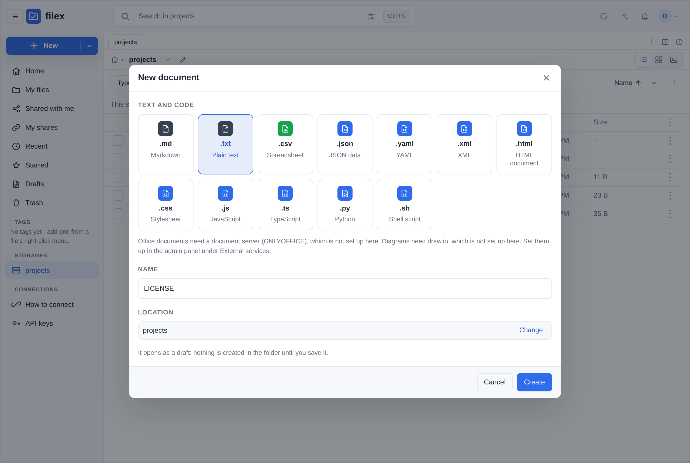
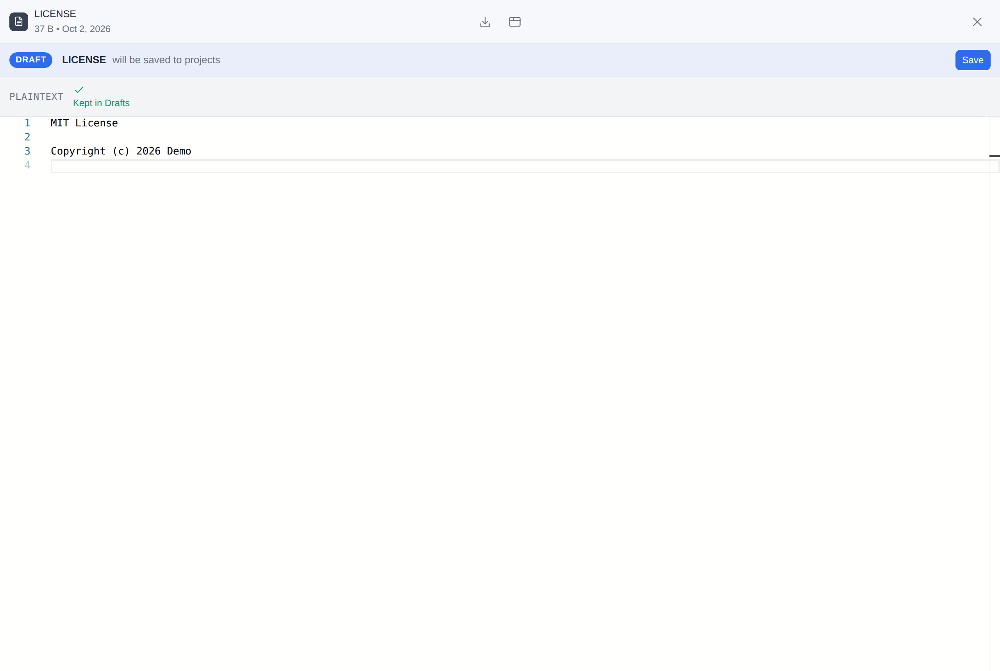
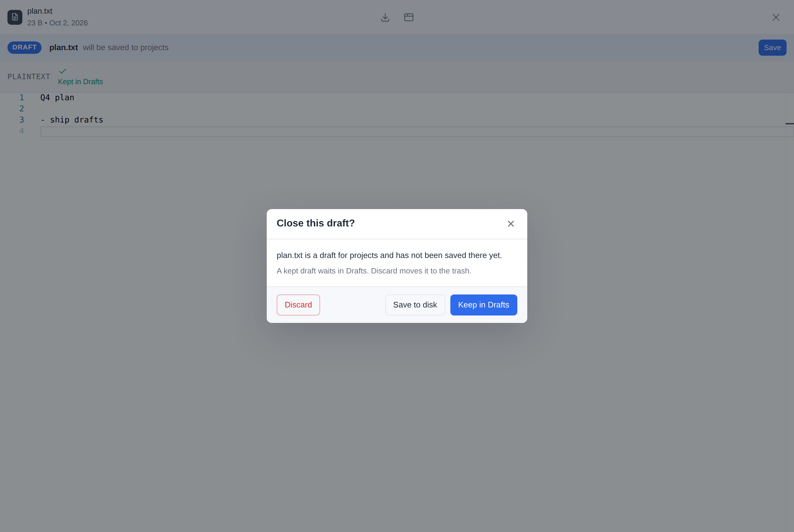
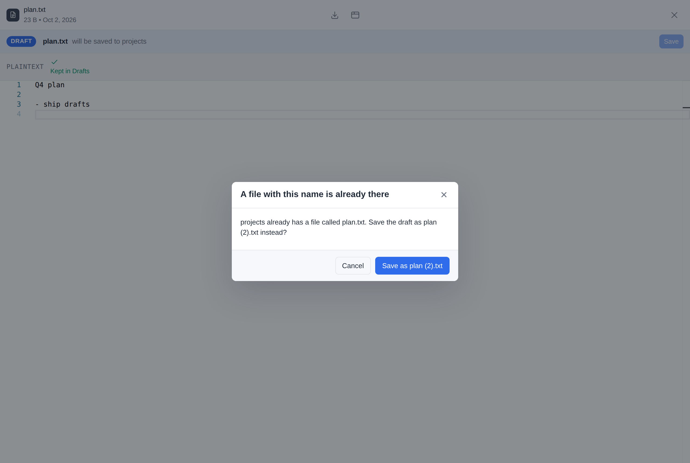
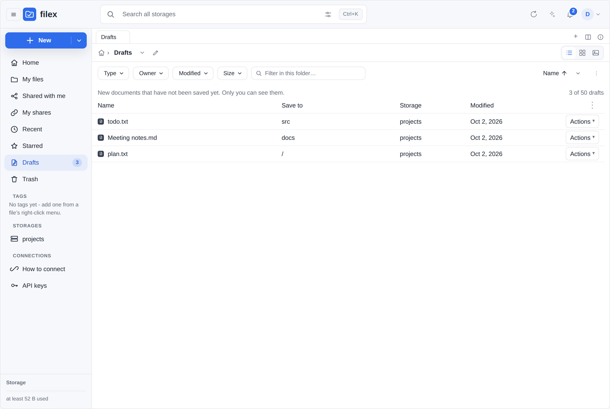

# OnlyOffice integration

filex can open Word/Excel/PowerPoint documents (and PDF, ODF, etc.) for
**in-browser editing and co-authoring** by embedding a self-hosted
[OnlyOffice Document Server](https://www.onlyoffice.com/). Edits are saved
straight back into the storage backend the file came from.

This integration is **optional**. If you don't configure it, filex works
normally - Office files just open in the built-in read-only preview instead of
an editor (see [What happens if it isn't configured](#what-happens-if-its-not-configured)).

Since 0.50 the same Document Server also draws the **thumbnails** of office
documents - a picture of the first page - and nothing else does: filex ships
no office suite (see [Thumbnails](#thumbnails)).

It works in every surface that embeds the explorer - the web app, the
[desktop app](DESKTOP.md), and any host page using `<filex-explorer>` - because
they all open the same editor component against the same endpoints. The desktop
app also feeds it documents that are **not** on the server yet: double-click an
Office file on your own disk and it is opened here and written back to that path
([Opening documents from your computer](DESKTOP.md#opening-documents-from-your-computer)).
That is the case where configuring this is worth the most - a machine with no
Office installed gets an editor for the documents already sitting on it. There is
one thing to know about token-authenticated hosts: the editor config is fetched
with the host's credentials, and a host that supplies its token as a *function*
(the desktop app does, because the token changes when you switch accounts) was
dropped before the request, which answered `401` and left the editor blank.
Fixed after v0.13.4 - see [Releases](RELEASES.md).

---

## Three machines, three addresses

⚠ **Read this before you fill in the Document Server URL.** Almost every
"it tests fine and then does not work" report is this and only this:

| Address | Who has to reach it | How it is checked |
|---|---|---|
| the **Document Server URL** | your **browser** - it loads the editor's JavaScript straight from there | the admin page probes it **from your browser** |
| the same **Document Server URL** | the **filex process** - it polls `/healthcheck` | the **Test** button |
| the **callback URL** (or `FILEX_PUBLIC_URL` when it is empty) | the **Document Server** - it fetches the document and POSTs the save back | the **Test** button asks the Document Server to download a one-shot URL through filex's signed document fetch endpoint and reports whether it arrived and was served |
| the Document Server's **converted copy** (`<document-server>/cache/files/.../Editor.bin`) | your **browser** again - after the Document Server has fetched and converted the document, the editor loads the converted copy from this address | not by the Test. The Document Server builds this address from the `Host`, `X-Forwarded-Host` and `X-Forwarded-Proto` headers it receives, so the reverse proxy in front of it has to pass them (see [The browser leg after the download](#the-browser-leg-after-the-download)). When the editor says "Download failed", filex says whether it got this far |

These are three different machines, and an address that works for one can be
useless to another. The classic case: on Docker or podman you type the
container name, `http://onlyoffice`. filex reaches it, **Test goes green**, and
your browser cannot resolve that name at all - so the editor fails with the
same message as a missing configuration.

**A green Test means "the filex process reached that URL". Nothing more.**
Since v0.37 the admin page says so, and probes the browser leg itself: it
reports *From the filex server: …* and *From this browser: …* as two separate
lines, and warns next to the field when the address is one a browser cannot
load (a bare container name, or `localhost` on an install published elsewhere).

Since v0.38 the third leg is measured too. filex hands the Document Server's
conversion endpoint a one-shot URL of its own and watches for the request to
arrive, so the admin page answers *the document server reached filex* or *it
did not* instead of declining to say. A Document Server that refuses the
request's signature is reported as **unmeasured**, not as a broken route - that
is a JWT problem, and sending you to the wrong address would be worse than
saying nothing.

Since 0.50.0 that URL is the **document fetch endpoint itself**
(`/api/files/onlyoffice/fetch`), signed the way a document's URL is and
checked by the same signature check, with filex's configuration in force. A
reverse proxy that forwards some other path but not this one, or a fetch filex
refuses, now fails the Test as it fails every document; the line then says
*filex refused the request* and why. Only the storage read is left out,
because there is no document behind a probe (the editor's own diagnosis covers
that - see [Failure: editor shows "Download failed"](#failure-editor-shows-download-failed)).

The Test also asks the Document Server a **second time, without a token**. One
that enforces JWT refuses it (error -8); one that takes it has JWT off, and the
card shows a warning: with JWT off the Document Server still checks the token
in filex's editor configuration, against its own secret, and refuses it, so no
document opens ("The document security token is not correctly formed"); it
refuses to download from private addresses, and posts its save callbacks
unsigned, which filex refuses. Measured with Docs 9.4 (`e2e/realenv`, the
S2 case of issue #80): the Document Server's log says `checkJwt error ...
invalid signature` for the editor and `... is not allowed. Because, It is
private IP address` for the download.

filex still warns about the shapes that certainly cannot work before you press
anything: a callback address of `localhost`, `127.0.0.1` or `0.0.0.0`, or a
hostname filex itself cannot resolve.

### Two commands that say which half is wrong

```bash
# the browser leg - run this from a workstation, not from the server
curl -I <document-server-url>/web-apps/apps/api/documents/api.js

# the callback leg - run this from INSIDE the document server container
podman exec -it onlyoffice curl -I "$FILEX_PUBLIC_URL/healthz"
```

Both must answer `200`. The first failing while filex's own Test passes is
exactly the container-name case above. The second failing means saves will be
lost even though the editor opens.

### When the Document Server needs a different address from your users

`FILEX_PUBLIC_URL` builds two different things: every share link a person
clicks, and the document URL the Document Server fetches. Those usually want
the same address, and sometimes they cannot be the same - a Document Server on
a container network may only reach filex as `http://filex:5212`, while your
users need `https://files.example.com`.

Set the **callback URL** for that. It is the address the Document Server uses,
and nothing else reads it:

```bash
FILEX_PUBLIC_URL=https://files.example.com      # people, share links, emails
FILEX_ONLYOFFICE_CALLBACK_URL=http://filex:5212 # the Document Server alone
```

The same field is in the admin page under the Document Server URL, and applies
live. Leave it empty - which is the default and what every single-address
install wants - and the public URL is used, exactly as before.

## How it works

Three pieces cooperate, all signed with one shared secret (HS256 / HMAC-SHA256):

```
 Browser                 filex                         OnlyOffice Document Server
   │  open doc  ───────────►│                                       │
   │  ◄── JWT-signed editor config (documentServerUrl + doc url)     │
   │  load iframe ──────────────────────────────────────────────────►│
   │                        │◄── GET signed fetch URL (source bytes) │  (1) fetch
   │                        │      /api/files/onlyoffice/fetch        │
   │      …user edits…      │                                        │
   │                        │◄── POST callback (JWT) on save ────────│  (2) save
   │                        │      /api/files/onlyoffice/callback     │
   │                        │──► write revision back to storage      │
```

1. **Config** - filex builds a JSON editor descriptor, signs it with the shared
   secret, and hands it to the embedded iframe. It contains a **signed, short-lived
   fetch URL** the Document Server uses to pull the current bytes.
2. **Fetch** - `GET /api/files/onlyoffice/fetch?...&sig=...` streams the source
   to the Document Server. Public but unguessable (HMAC over node id + expiry)
   and time-limited - no filex session needed, because the Document Server is a
   server, not the user's browser.
3. **Callback** - on save the Document Server POSTs to
   `POST /api/files/onlyoffice/callback?node=<id>` with a JWT; filex verifies the
   JWT, downloads the saved revision, and writes it back through the storage
   driver.

The shared secret configured in filex - on *Settings → External services*, or
seeded from `FILEX_ONLYOFFICE_JWT` - **must equal** the Document Server's JWT
secret. That is the entire trust relationship.

### Thumbnails

Office thumbnails (0.50) are made by the same Document Server, through its
**conversion service** (`ConvertService.ashx`) rather than the editor; the
whole design is in [thumbnails.md → Office through OnlyOffice](thumbnails.md#office-through-onlyoffice).
What it means for the Document Server:

- **What is sent.** One request per document: where to download it, its type,
  `png`, a `thumbnail` box of 320 x 320 pixels (a spreadsheet also a
  `spreadsheetLayout`), and a key, all inside the signed token. The Document
  Server downloads the document from the same fetch endpoint the editor uses,
  with an address signed **for that purpose** (`p=thumb`, part of the HMAC,
  10 minutes; an app's office conversion uses `p=convert`), so a thumbnail's
  address is never an editor's, nor the other way round. filex downloads the
  picture **only from the Document Server's own address**; an answer naming
  any other address is refused and that address is never fetched.
- **What is never sent.** An end-to-end encrypted file: the thumbnail
  pipeline does not ask for one, and the fetch endpoint refuses ciphertext for
  a conversion (415).
- **The editors go first.** A Community Edition Document Server runs one
  converter, shared with the editors; an editor opening a document has the
  higher priority, a conversion waits. filex therefore sends it one document
  at a time per process (`thumbs.office_slots`, 1 to 4), at most
  `thumbs.office_max_mb` (25 MB), 60 seconds each, and asks again after a
  back-off (2, 8, 32 minutes, about 2 and about 8 hours) when it did not
  answer. Enabling OnlyOffice on an install that has many office documents
  therefore draws them gradually, as they are listed, and an editor is never
  queued behind a folder of thumbnails for long.
- **Its cache.** The Document Server keeps a conversion's result about a day
  under the request's key; filex's keys name the file, its content, the
  parameters and the try, so nothing stale or failed is answered from it.
- **The editor's diagnosis is not touched.** What the fetch endpoint answers a
  thumbnail's download is kept apart from the record behind the editor's
  "Download failed" explanation (`GET /api/files/onlyoffice/diagnose`).
- **Several replicas.** The address is checked by any replica (it carries its
  own signature); the one-at-a-time limit is per process.

Without a Document Server, office documents get no thumbnail: they show their
type icon, and *Admin → Tools → Thumbnail repair* lists them as "OnlyOffice is
not configured". Configure it (no restart) and they are drawn as they are
listed.

### What a save does

A save-back is a write like any other write in filex, and since **v0.34.0** it
goes through the same shared post-write gate every other surface does. In
order, the callback:

1. takes a **version snapshot**, so the revision it is about to replace stays
   recoverable from the file's history - and **refuses the save** if that
   snapshot cannot be taken, because losing history is not a reason to also
   lose the file;
2. writes the revision through the storage driver;
3. refreshes the node row's size, mime, etag and mtime from the driver;
4. runs the post-write gate: **re-index** (so content search returns the new
   text, not the old), **thumbnail**, a **realtime change frame** so a browser
   with the folder open updates instead of finding out on its next navigation,
   the canonical **`file.updated`** webhook event stamped
   `meta.origin: "onlyoffice"`, and an **antivirus scan**
   ([PROTECTION.md](PROTECTION.md#antivirus-clamav)).

⚠ The event is `file.updated` and never `file.uploaded`: a save-back replaces
a document that was already there. A subscriber that watched `file.uploaded`
for edits needs to subscribe to `file.updated` as well.

⚠ The event carries **no actor**, and the in-app notification is therefore
admin-visible rather than scoped to one person's bell. The callback is a public
route - the document server posts it, not a signed-in browser - so there is no
request user to attribute it to. It is the same treatment every other actorless
write gets (the sync walk, the async ops worker). The **webhook** delivery is
unaffected either way.

#### When the scan runs, and why the status code decides it

The document server tells filex which kind of save this is, and the two kinds
get different answers:

| Callback status | What it means | Scan |
|---|---|---|
| **2** - ready for saving | Every editor **closed** the document and the server assembled the final revision. It arrives once per editing session, roughly **10 s after the last editor disconnects**. | **Immediately**, like an upload. The bytes are final and nobody is still typing. |
| **6** - force save | An **interim** save with the document still open. filex never asks for one and the document server does not send them by default (`autoAssembly` is off); an operator can switch them on, and then they repeat for as long as somebody keeps the document open. | **Debounced** - one scan per file per save window, the same treatment a Ctrl+S burst gets in the built-in text editor. |

Statuses 1, 3, 4 and 7 write nothing, so they announce nothing.

⚠ On a default install this means exactly **one scan per editing session**,
and it is not deferred: scanning a finished document on a timer would buy no
coalescing (there is only one save to coalesce) and would leave it unscanned
for up to a full window. The window is only worth paying for where saves
actually repeat. With force-save switched on, a long session costs one scan
per window while it is open **plus** the immediate scan of the final revision
when it closes - deliberately, because a document server that dies mid-session
never sends status 2 at all, and then the debounced scan of the interim bytes
is the only one there will ever be.

The window itself is the setting on **Admin → Protection**
(`antivirus.save_scan_window_minutes`, default 30 min) - it is one window, shared
with the text editor, not a second knob.

---

## Prerequisites

- A reachable **OnlyOffice Document Server** (Community Edition is fine).
- Three addresses that each work from the machine that needs them - read
  [Three machines, three addresses](#three-machines-three-addresses) first. It
  is the single most common cause of "it tested fine and then did not work".

---

## Setup

### 1. Run the Document Server with a JWT secret

```yaml
# docker-compose.yml (excerpt)
services:
  onlyoffice:
    image: onlyoffice/documentserver:latest
    environment:
      JWT_ENABLED: "true"
      JWT_SECRET: "a-long-random-shared-secret"   # keep this
      JWT_HEADER: "Authorization"
    ports:
      - "8080:80"
```

Pick a long random `JWT_SECRET` and keep it - filex needs the **same** value.

⚠⚠ **Always set one.** The save callback route is public, and filex can only
tell a genuine save from a forged one by its signature. With a secret, an
unsigned callback is refused (since v0.43.0). **Without** one there would be
nothing to check a callback against, so filex does not run ONLYOFFICE at all:
a URL with no secret leaves opening and saving off, and the admin Panel and
*External services* show a red warning - it cannot be dismissed - until a
secret is set.

### 2. Point filex at it

Two ways, and either is complete on its own.

**In the admin UI** - *Settings → External services*. Fill in the URL and the JWT
secret, press **Test now**, save. Since 0.50.0 **Test now** tests the values in
the form as they are, before you save them, and saves nothing - the card says
so - so a wrong address never reaches the editors that are already open.
**Saving applies immediately; filex does not need a restart.** This is the right route when the Document Server lives in a
separate compose file or you would rather not hand filex a secret through the
environment.

**In the environment** (or the equivalent `external_services.onlyoffice` block
in `config.yaml`):

```bash
FILEX_ONLYOFFICE_URL=https://office.example.com   # Document Server base URL
FILEX_ONLYOFFICE_JWT=a-long-random-shared-secret  # MUST match JWT_SECRET above
```

Both are required. filex treats OnlyOffice as **enabled only when both are set**.

⚠ **The environment wins on every restart.** A service configured through env or
`config.yaml` is re-asserted onto its stored row each time filex starts, because
compose is declarative: editing `FILEX_ONLYOFFICE_URL` and restarting has to take
effect. So an edit made in the admin UI to an env-pinned service applies now and
is reverted at the next boot - the card in the UI is labelled **"Set by the
environment"** when that is the case. That includes switching it off there:
OnlyOffice is then off for the editor, the office thumbnails and the apps'
office engine alike, until the next start switches it on again from
`FILEX_ONLYOFFICE_URL`; remove the variable to switch it off for good (the card
and the `PATCH` answer say so). Leave the variables unset if you want the
UI to own the setting.

### 3. Make sure all three addresses work

The full picture is [Three machines, three
addresses](#three-machines-three-addresses); the short version:

- Serve both filex and the Document Server over **HTTPS** in production. Browsers
  block an HTTPS page from loading an HTTP iframe (mixed content), so an HTTP
  Document Server behind an HTTPS filex will silently fail to load. The admin
  page names this case rather than reporting it as "unreachable".
- The Document Server URL must be one **a browser** can open - not only one
  filex can reach from inside the container network.
- `FILEX_PUBLIC_URL` must be resolvable **from the Document Server container/host**
  (it fetches source + posts callbacks there). In Docker, that usually means a
  real hostname or the compose service name - never `http://localhost`.

Then press **Test** on *Settings → External services* and read **both** lines it
prints. *From the filex server: reachable* and *From this browser: not
reachable* together mean the address is container-internal: the editor loads in
the browser, so it will fail there.

That's it - reopen an Office file in filex and it should launch the editor.

---

## Configuration reference

| Env var | `config.yaml` | Required | Description |
|---|---|---|---|
| `FILEX_ONLYOFFICE_URL` | `external_services.onlyoffice.url` | yes | Document Server base URL (e.g. `https://office.example.com`) |
| `FILEX_ONLYOFFICE_JWT` | `external_services.onlyoffice.jwt_secret` | yes | Shared HS256 secret - identical to the Document Server's `JWT_SECRET` |
| `FILEX_ONLYOFFICE_CALLBACK_URL` | `external_services.onlyoffice.callback_url` | no | The address the **Document Server** uses to reach filex. Empty (the default) means `FILEX_PUBLIC_URL`. Set it only when those two must differ - see [When the Document Server needs a different address](#when-the-document-server-needs-a-different-address-from-your-users) |

Both are optional in the sense that the **admin UI** can supply them instead -
whichever way they arrive, the value the running process uses is the one in the
`external_services` table, read on every request. `GET /api/admin/external`
returns `env_managed: true` for a service the environment pins.

The signed fetch URL is valid for **1 hour** by default.

---

## Supported file types

The editor opens the standard OnlyOffice set, grouped into three document types:

- **Documents (word):** `doc, docx, docm, dot, dotx, dotm, odt, ott, rtf, txt, html, htm, epub, fodt, mht, xml, xps, pdf, wps, …`
- **Spreadsheets (cell):** `xls, xlsx, xlsm, xlt, xltx, xltm, xlsb, csv, ods, ots, fods, et, ett, …`
- **Presentations (slide):** `ppt, pptx, pptm, pot, potx, potm, pps, ppsx, ppsm, odp, otp, fodp, dps, dpt, …`

An unknown extension returns **415 Unsupported Media Type** - filex falls back to
preview/download for those.

---

## Creating new documents

**+ New → New document** makes an empty Word, Excel, PowerPoint or OpenDocument
file and opens it in the editor that handles it.

⚠ The bytes do **not** come from the Document Server, and they do not come from
LibreOffice either. They are minimal valid documents embedded in the filex
binary (`backend/internal/newdoc` - XML parts zipped in memory), because `:slim`
and the bare binary deliberately carry no external tools and a feature that
works on one image and 500s on another is worse than one with a narrower
promise. So a `.docx` can be created on an install with no LibreOffice
anywhere near it.

What OnlyOffice decides is whether the type is **offered at all**.
`GET /api/files/capabilities` publishes `newdoc_types` - every type this build
can create, each as `{ext, group, mime, requires}` - and `requires` names the
service the *editor* needs: `"onlyoffice"`, `"drawio"`, or empty for the
built-in code and markdown editors. The client crosses that against the
`external` block, so with no Document Server configured the six office formats
(`docx`, `xlsx`, `pptx`, `odt`, `ods`, `odp`) are not in the picker and the
dialog says why - *"Office documents need a document server (OnlyOffice), which
is not configured here."* - rather than creating a file nobody on this install
could then open.

An installed app may add rows of its own (`new_documents` - draw.io's
**draw.io diagram**, say): they are listed under **Apps**, in the app's own
words, while the app runs, and the new file - empty, or a copy of the app's
template - opens in the app's interface, a draft like any other
([APP-PLUGINS.md](APP-PLUGINS.md#what-a-person-sees)).

⚠ The server states the dependency and the client resolves it, deliberately:
an embedder may point at a document server this process cannot reach, so the
client is the only place that knows the true answer. What it must not do is
re-derive the dependency from an extension list of its own - that list rots the
moment the registry grows a type.

### Naming the file

The name field holds the **whole file name**. Choosing a type fills it in with
that type's extension - `Untitled.txt`, `Untitled.docx` - and clicking into the
field selects the name part only, the way a rename does, so typing replaces
`Untitled` and keeps the extension. After that the name is yours:

- **Text and code types take any name.** `LICENSE`, `NOTICE`, `Makefile`,
  `Dockerfile`, `.gitignore`, `test.conf` and `example.custom` can all be made
  as Plain text; `README` can be made as Markdown. The type decides what the
  file is - its contents and the editor it opens in straight after - not what
  it is called, so `LICENSE` opens in the text editor. Opened again later, a
  file whose name says nothing (no extension, or one filex does not know) opens
  as plain text when the server says its bytes are text, and saves like any
  other text file.
- **Office documents and diagrams keep their extension.** Their editors find
  them by it - OnlyOffice picks Word, Excel or PowerPoint from the extension,
  and `report` with none is a ZIP nothing opens - so if you remove it the dialog
  says *"This type keeps its extension, so the file will be created as
  report.docx"* and the server adds it back.
- **A text type cannot borrow a document's extension.** `x.docx` made as Plain
  text would be an empty `.docx` that no editor opens, so the dialog refuses it
  and asks for the Word document type (or another extension).
- **Switching the type keeps what you typed.** Only the previous type's default
  extension is swapped (`notes.txt` → `notes.md`); a name with no extension, or
  one you chose (`test.conf`), stays as it is.



The create itself is `POST /api/files/manager?action=newfile` with
`{path, name, type, exact_name}`, where `type` is one of the `newdoc_types`
keys and `exact_name: true` says `name` is the whole file name. Without
`exact_name` the server appends the type's extension when the name lacks it -
the contract a client from before #56 relies on - and with it only a type whose
row says `ext_required: true` still gains its extension. A text type asked for
under another type's `ext_required` extension answers `400 EXT_NEEDS_TYPE`.
Where the server keeps drafts (below), the explorer sends the same body to
`POST /api/files/drafts` instead.

### Drafts: nothing is in the folder until you save

Choosing New document, naming it and closing the editor used to leave an empty
file behind (#71). Now **Create makes a draft**: a real file, with the name and
type you chose, kept in your own drafts area of that storage - and the folder
you were in gets nothing until you save it.

- **The editor opens on the draft**, with a bar above it that says where it
  will go ("will be saved to projects / docs") and a **Save** button. The
  built-in editors write into the draft as you type (every few seconds); the
  document server saves into it through its own autosave, and draw.io when
  you press its Save. While there are changes not yet written, the browser's own
  "leave this page?" question stands between you and a closed tab.
- **Save** puts the draft in its folder under its name. If a file has taken the
  name in the meantime, filex asks first - *"projects / docs already has a file
  called report.txt. Save the draft as report (2).txt instead?"* - and nothing
  moves before you answer. If the folder itself is gone, Save says so and the
  draft stays in Drafts.
- **Closing a draft you never saved** asks three things: **Save to disk**,
  **Keep in Drafts** (the default) or **Discard**. A discarded draft goes to
  the [Trash](TRASH-VERSIONING.md#discarded-drafts), where the usual retention
  deletes it; restoring it puts it back in Drafts.
- **Drafts**, in the navigation panel beside Recent, Starred and Trash, lists
  your drafts from every storage - name, where it will be saved, storage,
  modified - with **Open**, **Save to disk** and **Delete** on each row. The
  panel shows how many you have; a draft never raises a notification.
- **A draft is yours alone.** Nobody else sees it, an administrator included:
  it is not in any listing, search, share, WebDAV, S3, SFTP, FTPS or NFS view,
  desktop sync or storage usage figure, and no version history is kept of it.
  On disk it is `.filex-drafts/<your user id>/<key>/<name>` - one of the
  [names filex keeps for itself](BACKEND.md#names-filex-keeps-for-itself).
- **At most 50 drafts per person**, by default. An administrator changes the
  number under *Admin → Protection → Drafts*
  ([PROTECTION.md](PROTECTION.md#drafts)); at the limit, New document says so
  and offers to open Drafts - it never creates the file in the folder instead.

| What Create opens - a draft, under the bar that says where Save puts it | Closing a draft that was never saved |
|---|---|
|  |  |

| Save, when a file has taken the name meanwhile | Drafts, in the navigation panel |
|---|---|
|  |  |

Drafts belong to a person, so a caller that is not one creates the file
directly, as before: an app token, and an embed confined to one folder by its
host (one proxy token shared by all its users). `GET /api/files/capabilities`
carries `drafts: { limit }` exactly when the caller's New document makes
drafts. The endpoints are in [BACKEND.md → Drafts](BACKEND.md#drafts).

---

## Office conversions for apps (the office engine)

Since 0.50 the Document Server is also the apps' **office engine**: when an app
converts an office document - the Convert app's Word, Excel, PowerPoint and
OpenDocument targets, PDF and PDF/A from any of them - filex hands the file to
the Document Server's conversion API. filex ships and runs no LibreOffice, not
even one installed next to a bare binary, so this is the only way office
documents are converted.

- **Nothing more to set up.** The engine uses the URL, the JWT secret and the
  callback address configured above, and the Document Server downloads the file
  through the same door as an editor's document
  (`/api/files/onlyoffice/fetch`, with an address made for that one conversion
  and withdrawn when it ends). A setup where documents open in the editor
  converts too.
- **Live.** Connecting or removing the Document Server under External services
  turns the engine on or off at once; no restart.
- **Not connected:** an app's office targets say so ("Office documents are
  converted by ONLYOFFICE, and none is connected"), an administrator sees the
  greyed action and the install review say "connect it under External
  services", and a job that tries anyway fails with that sentence - never a
  silent error.
- **What it does not do that LibreOffice did** (measured on Document Server
  9.4): HTML from a spreadsheet or a presentation, and one CSV file per sheet
  (the first sheet is written). PDF/A comes out as PDF/A-2a. Text and CSV
  results are UTF-8 and start with a byte order mark; a CSV takes the
  separator asked for. `.odg` drawings and EPUB books are read.

For app authors: [PLUGIN-KIT → The office engine](PLUGIN-KIT.md#the-office-engine).

---

## What happens if it's not configured

Nothing breaks. With no URL and secret - from either source:

- filex reports OnlyOffice as **disabled** in its capabilities.
- Office files open in the **read-only preview** (or download), not an editor.
- **+ New → New document** offers only the types a built-in editor opens -
  Markdown, plain text, CSV, JSON, YAML, XML, HTML and the code formats - and
  names the missing service for the rest (see
  [Creating new documents](#creating-new-documents)).
- The editor endpoint returns `onlyoffice: not configured` if called directly.
- Apps cannot convert office documents (the office engine is unavailable; see
  [Office conversions for apps](#office-conversions-for-apps-the-office-engine)).
- Office documents have **no thumbnail** (0.50): their type icon, and the
  reason on the Thumbnail repair tab ([Thumbnails](#thumbnails)).

You can add OnlyOffice later at any time - it's purely additive.

---

## Failure modes & troubleshooting

### Failure: "OnlyOffice not configured" / no Edit option
Only one (or neither) of URL and secret is set. Set **both** - in *Settings →
External services*, which takes effect immediately, or as
`FILEX_ONLYOFFICE_URL` + `FILEX_ONLYOFFICE_JWT` followed by a restart.

⚠ A **URL with no secret** is the usual cause, and it is easy to miss: the Test
button probes `/healthcheck` and answers "reachable" for a Document Server that
is perfectly healthy, while the editor still refuses because filex has nothing to
sign the descriptor with. Reachable is not the same as configured.

### Failure: editor shows "Download failed"

"Download failed." is **one message for two different failures**:

1. the Document Server could not download the document **from filex**, or
2. your **browser** could not load the converted copy back **from the Document
   Server** (`<document-server>/cache/files/.../Editor.bin`).

**Since 0.50.0 the editor says which.** Under the Document Server's "Download
failed." it adds one of three sentences, from what filex's fetch endpoint saw
for that document:

| The editor says | What filex saw | Where to look |
|---|---|---|
| *The document server downloaded this file from filex, but your browser could not load the converted copy from the document server…* | the Document Server fetched the document after it was opened, and filex served it | [The browser leg after the download](#the-browser-leg-after-the-download) |
| *The document server never asked filex for this file. If the file was opened before, the document server may be using its own copy of it.* | no fetch for this document since filex last opened it | the third leg of the Test, and the Document Server's own log (below) |
| *filex refused the document server's request for this file: …* | the fetch arrived and filex refused it; the reason is named | the reason table below |

The editor asks `GET /api/files/onlyoffice/diagnose?path=<storage>://<path>`
(or `?id=<node id>`), which answers only a person who may open the document -
the same tenant, root and viewer checks as the editor configuration, and the
same `404` for a document they cannot see:

```json
{ "verdict": "served", "opened_at": "2026-10-01T10:00:00Z",
  "fetch": { "at": "2026-10-01T10:00:01Z", "status": 200 },
  "scope": "this_process" }
```

`verdict` is `served`, `not_requested` or `refused`; a refusal's `fetch` carries
`reason_code` and the English `reason`. There is no MCP tool for it on
purpose: it explains a failure of the in-browser editor, which an agent never
opens, and every refusal is in the server log with the same reason. ⚠ This is **one filex process's
memory**: it keeps the last answer for up to 512 documents (the least recently
touched one goes first) and is empty after a restart. With **several replicas**
behind a load balancer, each one knows only the requests it served, so the
Document Server's download may have reached another replica than the one the
editor asks - `not_requested` from one replica is then not the whole story;
read the logs of all of them. A request whose signature does not check out
(not the Document Server's) only annotates a document filex opened, so a
stranger cannot fill this memory or invent entries in it.

The Test only covers the first. To tell them apart from the logs, open a
document the Document Server has **not** seen before (or create a new one): it
keeps a converted copy of every document it has already processed, keyed by
the document's version, and does not ask filex for it again - so an old document
can hide the answer. Then, within a minute:

```bash
podman logs --since 3m filex 2>&1 | grep -E 'onlyoffice/(config|fetch)|could not download'
```

- `msg=http method=GET path=/api/files/onlyoffice/fetch status=200`: filex
  served the document. It is failure 2 - read
  [The browser leg after the download](#the-browser-leg-after-the-download).
- `msg="onlyoffice: the document server could not download this file" ... reason=...`:
  filex refused the request, and `reason` names why (table below).
- only the `config` line and no `fetch` line: the Document Server never asked
  filex. Read the third leg of the Test (below), and the Document Server's own
  download errors:

  ```bash
  podman exec onlyoffice sh -c "grep -E 'downloadFile|private IP' /var/log/onlyoffice/documentserver/converter/out.log | tail -n 20"
  ```

⚠ A **successful** download writes no `WARN` line. Only a refusal does; a
fetch filex served shows up only as the `msg=http` access line with
`status=200`. So "no WARN" does not mean "no request" - look for the access line.

A refusal is logged with its reason:

```
level=WARN msg="onlyoffice: the document server could not download this file"
      node=42 storage=3 reason="..." err="..."
```

| `reason` (log) | `reason_code` (diagnosis) | What it means |
|---|---|---|
| `the link is malformed` | `bad_link` | The address the Document Server sent was cut or rewritten on the way. |
| `signature refused` | `signature_expired`, `signature_bad` | The link expired, or the JWT secret changed under a running editor (or the address was altered). See the token section below. |
| `no catalogue row for this document` | `not_found` | The node was deleted between opening the editor and the download. |
| `the storage could not be opened` | `storage_unavailable` | Wrong endpoint, wrong credentials, or the backend is down - this is about the **storage**, not about OnlyOffice. |
| `the document body could not be located` | `body_unavailable` | The document is still being uploaded and its staged bytes are gone, or filex could not tell where its bytes are. |
| `the object is not on the storage` | `object_missing` | The catalogue has the row, the bucket does not have the object. Run a sync. |
| `reading the object failed` | `read_failed` | The storage answered, then failed mid-read. `err` carries the driver's own message. |

**No `fetch` line at all** means the request never arrived, and the problem is
the third address - the route from the Document Server back to filex. Press
**Test** in *Settings → External services* and read the third leg: it reports
*reached*, *did not reach*, or *could not be measured*, and the last of those
is **not** a pass. See [Three machines, three addresses](#three-machines-three-addresses).

⚠ **Check JWT before the private-address setting.** When the Test reports
error -4 for a container address such as `http://filex:5212`, the first thing
to check is that JWT is **enabled on the Document Server with the same secret
filex has**. By default a Document Server fetches an address that arrives
inside a signed (JWT) request without its private-address filter (the table
below says where each release sets that) - so with JWT on, a container
address works, and a -4 means the Document Server really cannot reach filex at
that address (try it from inside its container, below). This command prints
the three switches without printing the secret; all three must be `true`:

```bash
podman exec onlyoffice /var/www/onlyoffice/documentserver/npm/json \
  -f /etc/onlyoffice/documentserver/local.json services.CoAuthoring.token.enable
```

If they are not, set `JWT_ENABLED=true` and `JWT_SECRET=<the secret filex has>`
on the Document Server container and recreate it. With JWT off the Document
Server refuses filex's editor token (it checks it against its own secret, so
no document opens), and filex refuses its save callbacks because they arrive
unsigned.

The **private-address filter** matters when JWT is off on the Document Server
(no token is verified, so no request counts as signed), or when its exemption
for signed requests has been turned off:

| ONLYOFFICE Docs | Private addresses refused by default | A signed request skips the filter |
|---|---|---|
| 7.3 and earlier | no | - |
| 7.4 | yes | yes, always |
| 7.5 to 8.0 | yes | yes, unless `services.CoAuthoring.server.allowPrivateIPAddressForSignedRequests` is `false` |
| 8.1 and later | yes | yes, unless `externalRequest.directIfIn.jwtToken` is `false` or `externalRequest.directIfIn.allowList` is not empty |

Read from the ONLYOFFICE server source: 7.4.0 changed
`request-filtering-agent.allowPrivateIPAddress` from `true` to `false`
([e0aaeee6](https://github.com/ONLYOFFICE/server/commit/e0aaeee64331aff30270251bba1d830c65568346)),
7.5.0 added `allowPrivateIPAddressForSignedRequests`, default `true`
([1deefe3e](https://github.com/ONLYOFFICE/server/commit/1deefe3ee2b4483f0ad717172352508fcb39877e)),
and 8.1.0 replaced it with `externalRequest`
([446245c0](https://github.com/ONLYOFFICE/server/commit/446245c0aa3282e8b3c8999170cee03303f55d3c);
defaults in the [server configuration reference](https://api.onlyoffice.com/docs/docs-api/get-started/configuration/server-config/)).

When the filter applies, the Document Server refuses to download from a
private IP address (a docker or podman network, RFC 1918) and gives up before
sending anything: filex logs nothing, the editor says "Download failed", and
the Test reports error -4. Its own log shows:

```
... is not allowed. Because, It is private IP address
```

If that line is there and JWT has to stay off (or the exemption for signed
requests is off), allow private addresses on the Document Server and restart
it - either the environment variable on its container:

```bash
ALLOW_PRIVATE_IP_ADDRESS=true
```

or, in its `local.json`:

```json
{ "services": { "CoAuthoring": { "request-filtering-agent": { "allowPrivateIPAddress": true } } } }
```

#### The browser leg after the download

When filex served the document (`status=200`) and the editor still says
"Download failed", the Document Server did its part: it converted the document
and told the editor where to load the converted copy. That address is
`<document-server>/cache/files/<key>/Editor.bin`, and the Document Server
builds it from the request it received - the `Host`, `X-Forwarded-Host` and
`X-Forwarded-Proto` headers. A reverse proxy that does not pass them makes it
build the wrong address: `http://` behind an HTTPS page (the browser blocks it
as mixed content), an internal host name, or a link its own web server then
refuses (403).

To see it: press F12, open **Network**, tick **Preserve log**, open the
document and type `Editor.bin` in the filter. Look at the request URL and its
status, and at the **Console** for a "Mixed Content" error. If the URL starts
with `http://`, has a host other than the Document Server's public one, or
answers 403, fix the proxy in front of the Document Server. With nginx:

```nginx
proxy_set_header Host $host;
proxy_set_header X-Forwarded-Host $host;
proxy_set_header X-Forwarded-Proto $scheme;
```

Caddy and Traefik send these by default. ONLYOFFICE's own guide:
<https://helpcenter.onlyoffice.com/installation/docs-community-proxy.aspx>.

### Failure: "token" error on open
The two JWT secrets don't match. The secret filex holds - the `external_services`
row, whatever put it there - **must** equal the Document Server's `JWT_SECRET`.
A mismatch makes the Document Server reject the config (or filex reject the
callback) with a token error. ⚠ Correct it on whichever side is wrong: an edit
in *Settings → External services* takes effect on the next request with no
filex restart, while `FILEX_ONLYOFFICE_JWT` is re-asserted onto the row at boot
and therefore needs one. The Document Server needs a restart either way.

A save callback that carries **no** token is refused as long as filex holds a
secret: the callback route is public, and an unsigned one would let anybody
who can reach it overwrite a file. If saves fail with `the callback is not
signed`, the Document Server is running with `JWT_ENABLED` off - turn it on
with the same secret.

### Failure: document won't load or save
Almost always a **reachability / URL** problem - and which of the three
addresses is wrong is the whole diagnosis. Open *Settings → External services*
and read the two probe lines plus any warning next to the URL field; the
[two commands](#two-commands-that-say-which-half-is-wrong) answer the same
question from a shell.

- **Won't load** (blank iframe / "editor cannot connect"): the browser can't
  reach `FILEX_ONLYOFFICE_URL`, or it's HTTP behind an HTTPS filex (mixed
  content). Serve the Document Server over HTTPS on a real hostname.
- **Won't fetch source** ("Download failed", and filex logged no
  `path=/api/files/onlyoffice/fetch` access line): the Document Server can't
  reach the callback address (`FILEX_ONLYOFFICE_CALLBACK_URL`, or
  `FILEX_PUBLIC_URL` when it is empty). Press **Test**: the third line now says
  whether the Document Server managed to download a probe file from filex, and
  prints the exact URL it was given. Make that URL resolve from the Document
  Server's network - or, when it cannot, set the callback URL to one that does -
  and check that a reverse proxy forwards `/api/files/onlyoffice/fetch` to
  filex. ⚠ A filex log with **no** `GET /api/files/onlyoffice/fetch` access line
  after the editor opened is this failure: the request never arrived. A
  document the Document Server converted before is not fetched again, so test
  with a new one.
- **Won't load the converted copy** ("Download failed", and filex logged
  `path=/api/files/onlyoffice/fetch status=200`): filex and the Document
  Server did their part, and the browser could not load
  `<document-server>/cache/files/.../Editor.bin`. That is the proxy in front of
  the Document Server - [The browser leg after the download](#the-browser-leg-after-the-download).
- **Edits aren't saved**: the Document Server can't POST the callback to
  `/api/files/onlyoffice/callback`. Same address and same fix - the save goes
  where the fetch came from. Check the filex logs for callback errors
  (`onlyoffice: ...`).
- **Test says the server leg is not reachable, but `curl` to the Document
  Server works**: read the line printed under it. `/healthcheck returned HTTP
  502` (or 503/504) means the Document Server's own nginx answered and the
  **docservice** process behind it did not - the network between the two
  machines is fine. The welcome page (`/welcome/`) is a static file nginx
  serves by itself, so it loads either way. Run `supervisorctl status` inside
  the Document Server container (`ds:docservice` and `ds:converter` must be
  `RUNNING`) and read `/var/log/onlyoffice/documentserver/docservice/err.log`.
  Its own log shows the same thing as `connect() failed (111: Connection
  refused) while connecting to upstream … :8000`. `no answer within 3s` is a
  different problem: filex gives up at three seconds, so a slow route or TLS
  handshake fails the check even when the service is up.

### Failure: 415 on open
Unsupported extension (see the type list above). Expected - use preview/download.

### Failure: "signature expired"
The signed fetch URL is older than its TTL (1h). Reopen the document to mint a
fresh URL. (This only appears if the Document Server retries a stale fetch much
later.)

---

## Security notes

- The **fetch URL is public but signed** (HMAC over node id + expiry) and
  **expires** - a leaked URL only exposes one node for a short window. A
  conversion's address (a thumbnail, an app's conversion) also signs its
  purpose and lives 10 minutes, and an end-to-end encrypted file is never
  served through one.
- The **callback is authenticated by JWT** - filex validates the Document
  Server's token before writing anything back, and only acts on the
  "ready to save" / "force save" statuses.
- The shared secret is the whole trust boundary. Treat it as one wherever it
  lives - an env file with `chmod 600` and not committed, or the stored row,
  which `GET /api/admin/external` redacts to `"***"` and never returns.
- ⚠ **You trust the Document Server as much as filex's own pages.** To open
  the editor, the explorer loads the server's `web-apps/apps/api/documents/api.js`
  as a script *into the filex page itself* - that is how the Document Server's
  editor API works - so that script runs with everything the page can do, in
  the signed-in person's session. Point filex only at a Document Server you run
  or trust as fully as filex, reach it over HTTPS, and keep its host as closely
  guarded as filex's. (draw.io is different: it runs in its own frame, and
  filex only exchanges messages with that frame at its configured origin.)

---

## See also

- [CONFIGURATION.md](CONFIGURATION.md) - full config/env reference
- [INSTALLATION.md](INSTALLATION.md) - running filex
- [DOCKER.md](DOCKER.md) - container deployment
