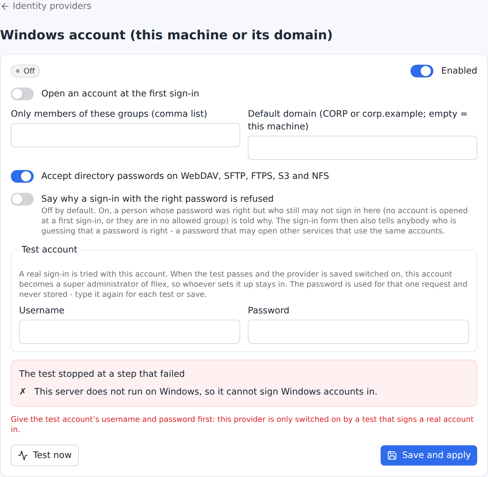
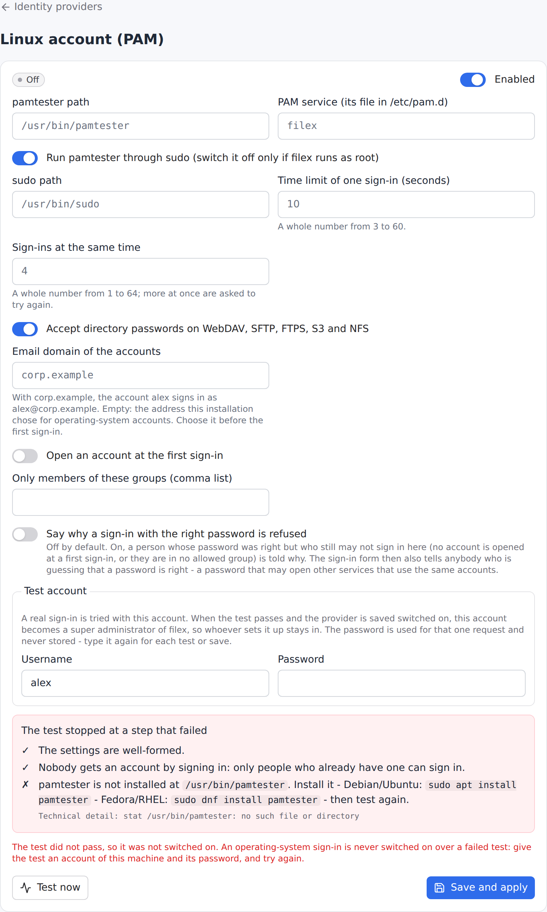

# Operating-system accounts

Let people sign in to filex with the login they already use on the machine
filex runs on - no second password, no directory to run. The provider **asks the
operating system whether the password is right** - filex never stores it - and
then treats the person like any other account: storage permissions, shares,
quotas and roles are filex's own.

There is one provider per operating system. Each is a page provider on
**Admin → Identity providers**, switched on there without a restart (see
[SSO.md → Managing providers](SSO.md#managing-providers-on-the-identity-providers-page)),
and each is **tested for real before it can be switched on**: an operating-system
provider can only be tested by signing somebody in, so the test takes a real
account. There is no "switch on anyway".

**Not from the environment.** `windows` and `pam` are switched on on the page
and nowhere else: the environment has no place for the test that switches them
on. Written into `FILEX_AUTH_DRIVERS` (or `auth.drivers` in `config.yaml`), the
entry is refused at start with a warning of its own - *windows/pam is switched on
from Admin → Identity providers, where its setup is checked; it cannot be set
from the environment* (with the provider's `name` and where it was written,
`from`) - and the start goes on: every other provider in the list runs as usual.

| Provider | Operating system | How it judges a password |
|---|---|---|
| `windows` | Windows (local accounts and the domain the machine is joined to) | `LogonUserW` - [Windows](#windows) |
| `pam` | Linux | PAM, through the `pamtester` command - [Linux (PAM)](#linux-pam) |

This page opens with what both share; the setup of each follows under its own
heading.

- [How an account comes to exist](#how-an-account-comes-to-exist)
- [The e-mail token - choose it once](#the-e-mail-token---choose-it-once)
- [Accounts that never sign in](#accounts-that-never-sign-in)
- [Groups and roles](#groups-and-roles)
- [What this is not](#what-this-is-not)
- [Windows](#windows)
- [Linux (PAM)](#linux-pam)

## How an account comes to exist

A person types their machine login (`alex`) and password on the sign-in form -
or as the user and password of WebDAV, SFTP or FTPS. (S3 and NFS never receive a
password - they use the access keys and exports the account mints in the web
app.) filex asks the operating system whether the password is right. What
happens next is the same **first-login rule** as for OIDC, LDAP and the header
proxy ([LDAP.md → The first sign-in rule](LDAP.md#the-first-sign-in-rule-who-gets-an-account)):

```
the account exists (same e-mail address)    → it signs in
auto_create is off                          → refused
allowed_groups is set, no group matches     → refused
otherwise                                   → the account is created
```

⚠ **`auto_create` is OFF by default for the operating-system providers**
(it is on for the others). Having a login on the machine does not make anybody a
filex user; an administrator creates their account, or turns `auto_create` on
(optionally with `allowed_groups`, so only members of a group get one). The one
exception is deliberate: the **test account** you give when you switch the
provider on becomes a **super administrator** - see the setup below. (If that
promotion itself fails after the provider was saved, the request answers `500`
and can simply be repeated; a disabled account, or one that belongs to a tenant,
is refused *before* anything is saved.)

The person is always told the same thing when they are refused - *wrong
credentials* - whether the password was wrong, the account does not exist here,
or the rule said no. Only the operator sees why: a log line and an audit row
(`auth.first_login_refused`, with the reason and the login name; never a
password or a group list).

The [sign-in attempt limits](CONFIGURATION.md#sign-in-attempt-limits) apply
above every provider: wrong attempts are counted per login name and per address,
and a locked account refuses even the right password.

## The e-mail token - choose it once

filex accounts are keyed by e-mail address. A machine login has none, so it gets
one made from its name:

| Setting | `alex` becomes |
|---|---|
| nothing set | `alex@local` |
| `FILEX_OS_LOGIN_EMAIL_TOKEN=evim` | `alex@evim` |
| the provider's `email_domain` = `corp.example` | `alex@corp.example` |
| a sign-in in tenant realm `acme` (multi-tenant) | `alex@acme.local` (`alex@acme.evim` with the token above) |

> ⚠⚠ **Set `FILEX_OS_LOGIN_EMAIL_TOKEN` once, at installation, and never change
> it.** The address *is* the account. Change the token later and `alex` signs in
> as `alex@evim` while the `alex@local` account - its files, shares, quota - sits
> beside it: **one person, two accounts.** That is why the token is read from the
> environment only; nothing on the page or in the API edits it. (`email_domain`
> is the same kind of choice: pick it before the first person signs in.)

The same address is what the file protocols hand to the provider, so a login typed
as `alex` or as `alex@local` reaches the same account. An address of another
domain is never treated as a machine login.

The token is the installation's, not the OS providers' alone: an LDAP entry with
no e-mail attribute is `alex@local` too
([LDAP.md](LDAP.md#e-mail-address-for-an-account-that-has-only-a-login-name)).

**Multi-tenant installs: the realm goes in the address.** Two tenants can each
have an `alex`, and addresses are unique across the platform - so a tenant's
machine account is `<name>@<realm>.<token>`: `alex@acme.local` in realm `acme`,
`alex@beta.local` in realm `beta`, and `alex@local` only for the platform's own
tenant. The realm is the tenant the account belongs to: the realm the sign-in
named (the form's Realm field, `acme/alex` over SFTP, the tenant's own address).
An operating-system provider has no `provider` pin (it is configured on the page
only), so on a multi-tenant install a sign-in that names no tenant is the
platform's own, where no account is created
([MULTI-TENANCY.md → Realms](MULTI-TENANCY.md#realms-which-tenant-a-sign-in-is-for)).
The file protocols' `alex@acme.local` is read back as `alex` in realm `acme`
only. With `email_domain` set the address is `alex@<email_domain>` in every
realm - so one provider with `email_domain` should not serve two tenants that
may share a login name: the second one's person would find the first one's
account, and is refused (another tenant's account is never signed in to).

## Accounts that never sign in

System and service accounts are refused **in every case** - even with the right
password, even if an administrator created a filex account for them:

- by name: `root`, `Administrator`, `daemon`, `www-data`, `systemd-*`,
  underscore accounts and the other names filex reserves;
- by what the operating system says: a UID below 1000, or a `nologin` / `false`
  shell (Linux - asked with `getent passwd`, so sssd and LDAP-backed users are
  seen too);
- Windows: the built-in Administrator **by SID** as well as by name (a renamed
  or translated one has no forbidden *name*), Guest and the other built-in
  accounts, machine accounts (`WORKSTATION$`), everything under `NT AUTHORITY\`,
  `NT SERVICE\` and `IIS APPPOOL\`; only ordinary accounts (`S-1-5-21-…` with a RID
  of 1000 or more, or a Microsoft Entra ID account) sign in;
- a name filex cannot carry as a username (fewer than 3 characters, a leading
  digit, characters outside `a-z 0-9 . - _`): refused as `invalid_name`.

The operating system is never asked about a refused account. If it cannot be
asked at all (no `getent`), the sign-in is answered as *could not decide*, never
as a wrong password.

## Groups and roles

The operating-system groups of a person (on Linux `id -Gn`; on Windows the
groups of the logon token) are recorded on their account at every sign-in,
replacing the previous list, exactly as an OIDC or LDAP group claim is. Use
them three ways:

- `allowed_groups` - a comma list; with `auto_create` on, only members of at
  least one of them get an account;
- **roles** - a custom role that targets an SSO group is the role a new account
  in that group starts with
  ([PERMISSIONS.md](PERMISSIONS.md#starting-role-for-sso-groups)). There is no
  second group-to-role table;
- **filex groups** - a [group](GROUPS.md#members-and-sso-links) whose SSO
  links name one of them has the person as a member from their next sign-in,
  and loses them at the first sign-in that no longer carries it, with the
  group's folders and role - the same rule as for OIDC and LDAP.

## What this is not

filex does **not** run file operations as the operating-system user. Signing in
with a machine login means filex knows who you are; what you can reach is decided
by filex's own permissions and storages, not by file ownership on the disk.
(Impersonation is a separate, larger design and is out of scope.)

---

## Windows

The `windows` provider calls the operating system's own sign-in
(`LogonUserW`, a *network* logon: it judges the password and starts no session,
loads no profile). It is written in plain Go - no cgo, no helper program, nothing
to install beside filex.

### What it needs

- filex running on **Windows**. On any other operating system the provider is
  listed but cannot start: it says *"works only on Windows"* on its card and
  in its test, and can never be switched on.
- For **domain** accounts, a machine joined to the domain (or able to reach a
  domain controller). Local accounts need nothing more.
- filex may run as any account - a network logon needs no special privilege. The
  machine's policy *Access this computer from the network* must let the account
  in (it does by default); when it does not, the operator's log says
  `network_logon_not_granted`.

### Names people can type

| Typed | Means |
|---|---|
| `alex` | an account of this machine - or of the **default domain**, when one is set |
| `.\alex` | this machine, said outright |
| `CORP\alex` | the domain `CORP` (NetBIOS name) |
| `alex@corp.example` | the user principal name (UPN) |

The filex **username is the account name in lower case** (`alex`), whichever
way it was typed; the `DOMAIN\` part is not part of it. Names are never
repaired: a name filex cannot use (too short, starts with a digit, a character
SFTP or S3 cannot carry) is refused, not quietly turned into another one.

The account's **e-mail** - its identity in filex - is derived once, so every way
of typing a name finds the same account:

| Account | E-mail |
|---|---|
| `alex`, `.\alex` (this machine) | `alex@local` - the installation's token, `FILEX_OS_LOGIN_EMAIL_TOKEN`; in tenant realm `acme` (multi-tenant) `alex@acme.local` |
| `CORP\alex` | `alex@corp` |
| `alex@corp.example` (UPN), or `alex` with default domain `corp.example` | `alex@corp.example` |

⚠ **Choose the token before the first sign-in and leave it.** It is part of every
machine account's address; changing it later makes `alex@evim` a second account
of the same person, next to the old `alex@local`. That is why it is an
environment setting and not a field on the page.

### Who gets an account

The [first sign-in rule](LDAP.md#the-first-sign-in-rule-who-gets-an-account):

1. the account exists (same e-mail) → signs in;
2. `auto_create` is off (the default) → refused;
3. `allowed_groups` is set and none of the person's Windows groups is in it →
   refused;
4. otherwise the account is created (in the tenant the login arrived for, on a
   multi-tenant install) and starts with the role its groups name - the same
   *SSO group* permission rules OIDC and LDAP use
   ([PERMISSIONS.md](PERMISSIONS.md#starting-role-for-sso-groups)).

The groups are read from the **token Windows issues** at each sign-in, and
recorded (replacing the previous set): `CORP\Editors` and `Editors` both count,
so either can be written in `allowed_groups` and in a role's SSO-group target.
Built-in groups are included (`BUILTIN\Administrators`, `Users`, `Everyone`…), so
a rule can target them. Deny-only groups and the logon-session SID are left out.

### Windows settings

| Field | Default | Meaning |
|---|---|---|
| `auto_create` | `false` | Open an account at the first sign-in. |
| `allowed_groups` | empty | Comma list; only members of one of them get an account. |
| `domain` | empty | Default domain for a name typed with none: a NetBIOS name (`CORP`) or a DNS name (`corp.example`). Empty = this machine's own accounts. |
| `protocol_login` | `true` | Accept Windows passwords on WebDAV, SFTP and FTPS too, exactly as LDAP does. S3 and NFS never receive a password - they use the access keys and exports the account mints in the web app. |
| `show_refusal_reason` | `false` | Tell a person whose password was right why they still may not sign in (no account at a first sign-in, no allowed group, a system account the SID named). Off, that is the wrong-password answer; on, the form also confirms the password to anybody guessing ([why it is off](LDAP.md#the-first-sign-in-rule-who-gets-an-account)). |

There is no field for a test account: it is sent with the test request and used
once.

### Switching it on



**Admin → Identity providers → Windows account → Test now** signs a real account
in. Give it an account of this machine (or the domain) and its password in the
card's **Test account** box - the password is used for that one call: it is
**never stored, logged, audited or sent back**, and the page empties its box as
soon as the call is answered (type it again for the next test or save). The steps:

| Step | Says |
|---|---|
| `platform` | this machine can ask Windows (fails with `unsupported_os` anywhere else) |
| `test_account` | an account and a password were given |
| `logon` | the account signed in - or why it did not (`credentials`, `account_locked_out`, `account_disabled`, `password_expired`, `network_logon_not_granted`, …) |
| `account` | it is an ordinary account filex accepts (not a system, service or built-in one) |
| `first_login_*` | what the first sign-in rule comes to |

Saving the provider **on** needs that test to pass - `confirm_failed_test` does
nothing for it. And the account that passed **becomes a super administrator** of
filex (created if it does not exist, promoted if it does): the one deliberate
exception to "`auto_create` is off", so whoever sets this up is never locked out
of the instance they are setting up. It signs in through Windows, with no
password of its own. Two safeguards: a **disabled** account is not switched back
on, and an account that belongs to a **tenant** is not promoted (`409
test_account_disabled` / `test_account_not_platform`, and nothing is saved).
Choose the account you want as administrator - nobody else gets this.

Since 0.50 only the **first** switch-on in a scope promotes: a later test, after
the provider was on there before, promotes nobody. On a multi-tenant install
the scope is the tenant the test signs in in (`test_account.realm`, default the
platform's own tenant when the provider serves it): there the account becomes
a **super administrator**, in any other tenant **that tenant's administrator**
(an account of another tenant is refused, `409 test_account_other_tenant`).
A provider that was already on before the upgrade counts as having promoted in
the platform's tenant. [TENANT-ADMIN.md](TENANT-ADMIN.md#the-operating-system-test-account-in-a-tenant).

Switching a provider **off** needs no test.

### If the machine can no longer run it

The provider is checked again every time it is loaded - at boot, on every save.
If it cannot start (the data directory was copied to another operating system,
the domain setting is invalid), **only that provider is left out** of the running
set: its card says why, every other way in keeps working, and the administrators
are told **once** per reason (a notification, `auth_provider_down`).

### Locking accounts: filex first

filex counts wrong passwords itself, in front of every provider
([CONFIGURATION.md → Sign-in attempt limits](CONFIGURATION.md#sign-in-attempt-limits)):
5 wrong attempts per account and 10 per address within 10 minutes, then a
lock that doubles. That is **lower than the lockout threshold Windows and Active
Directory usually have (commonly 10)**, on purpose: filex's limit trips first, so
somebody guessing passwords through filex is slowed down long before they could
lock the person out of the machine or the domain. Raise filex's limits (or use
the IP allow-list) only if your Windows threshold is higher still. When Windows
itself has locked an account, the person hears the ordinary "invalid
credentials" and the operator's log says `account_locked_out`.

### What people hear, and what the operator hears

Every refusal is **one answer** to the person - the same as a wrong password:
wrong password, unknown account, locked, disabled, expired, must change password,
forbidden account, an account the first sign-in rule turned away. The one
choice the operator has is `show_refusal_reason` (off by default): on, the two
refusals that come only **after** Windows accepted the password - the first
sign-in rule, and a system account only the SID gave away - tell the person why
on the sign-in form ([the first sign-in rule](LDAP.md#the-first-sign-in-rule-who-gets-an-account)
says what that costs). Everything else stays the one answer. The operator
sees the reason in the log (`windows: sign-in refused by the operating system …
reason=account_disabled`) and, for the name and first-sign-in rules, in an audit
row. The one exception is when Windows **could not be asked** at all (no domain
controller, access denied to the call itself): that is not a wrong password, so
the login chain logs it as *could not judge* and reports it, and nobody is told
their password is wrong.

The built-in Administrator is refused by **SID** as well as by name: a Windows in
another language, or a renamed account, has no forbidden *name* - its SID ends in
`-500`. Only ordinary accounts (`S-1-5-21-…` with a RID of 1000 or more, or a
Microsoft Entra ID account) can sign in. This also closes Windows' "unknown user
→ Guest" fallback, which on some machines signs a made-up name in as Guest.

### Limits

- **No impersonation.** filex does not perform file operations *as* the Windows
  user; the person is a filex account, and filex's storage permissions decide
  what they can touch. (Mapping a Windows sign-in onto file-system access is
  deliberately out of scope.)
- **Passwords only.** Windows Hello PINs and biometrics are not passwords and
  cannot be used; an account whose password has expired or *must be changed* at
  the next sign-in cannot sign in until it is changed in Windows.
- Two-factor (TOTP) is filex's own: an account with it enabled is asked for the
  code after the Windows password, as any account is.

### API

`GET /api/admin/auth-providers` lists `windows` with `fields`,
`testable: true` and `test_account_required: true`.
`PATCH /api/admin/auth-providers/windows` takes `{enabled, config: {auto_create,
allowed_groups, domain, protocol_login, show_refusal_reason}, test_account:
{username, password}}` and
answers `200 {ok, provider, checks, test_ok, super_admin}`, or `409 test_failed`
(`confirm_allowed: false`, `checks`, `failed`), `409 test_account_disabled`,
`409 test_account_not_platform`. `POST
/api/admin/auth-providers/windows/test` takes `{config?, test_account}` and
changes nothing. The same bodies work on `/api/ai/admin/...` and through the
`admin_auth_providers_update` / `admin_auth_providers_test` MCP tools.

---

## Linux (PAM)

`pam` runs on a **Linux server that runs filex directly** - a package install, a
systemd service, a VM. Inside Docker it is meaningless (the container has no PAM
of the host, and no access to its users); use LDAP or OIDC there.

### How it works

filex is not root and has no cgo. It runs a command you set up, with **no shell**:

```
sudo -n /usr/bin/pamtester filex <user> authenticate acct_mgmt
```

- the **password is written to the command's standard input**, one line - never
  on the command line (visible in `ps`), never in the environment, never in a log;
- `authenticate` checks the password; `acct_mgmt` checks the account (expired,
  locked, not permitted to log in);
- the command runs in a session of its own, with no terminal, so `pamtester`
  reads the pipe and not an operator's terminal;
- its environment is `PATH`, `LC_ALL=C` and nothing else - filex's own secrets
  (`FILEX_SECRET_KEY`, database URLs) never reach a process that runs as root;
- the user name is one argument, checked to be plain (starts with a letter, then
  `a-z 0-9 . - _`; never a dash), the command path and the PAM service name are
  configuration checked to be plain too. The **argument vector has a fixed shape**:
  the only part you can change is the pieces listed under [Settings](#linux-settings).
  There is no template string, so nobody's text can become a shell command.

Every sign-in has a **time limit** (10 seconds by default; PAM itself waits a
couple of seconds after a wrong password on purpose, which fits) and a **limit on
simultaneous attempts** (4). A fifth attempt while four are running is answered at
once with *busy - try again* (`503`, `Retry-After`), which is **not** counted as a
wrong password.

Three answers are kept apart:

| Answer | Meaning | What filex does |
|---|---|---|
| yes | PAM accepted the password and the account | signs in |
| no | wrong password, unknown user, locked or expired account | `401`, like any wrong password |
| could not decide | `pamtester` missing, sudo wants a password, PAM itself failing, a timeout | **not** a wrong password: logged with the reason for the operator (`Admin → Identity providers → Linux account (PAM) → Test now` shows which step) |

A password containing a line break or a NUL is refused up front: the password
goes to a pipe one line at a time, and a second line would answer a prompt the
person was never shown.

### Set it up



The provider will not switch on until every step below is true, and **Test now**
says which one is not, with the command that fixes it.

**0. The account filex runs as.** filex runs as a system account of its own,
never as root, and the sudoers line of step 3 names it. If you installed filex as
a systemd service ([INSTALLATION.md](INSTALLATION.md#binary)), it is there already
(`filex`). Otherwise create one - it needs no home and no shell (give filex its
`FILEX_DATA_DIR`):

```bash
sudo useradd --system --no-create-home --shell /usr/sbin/nologin filex
```

`filex` is one of the [accounts that never sign in](#accounts-that-never-sign-in):
the account can ask PAM about other people's passwords, and can never sign in to
filex itself.

**1. Install `pamtester`.**

```bash
# Debian / Ubuntu
sudo apt install pamtester

# Fedora
sudo dnf install pamtester

# RHEL / Rocky / Alma (EPEL)
sudo dnf install epel-release && sudo dnf install pamtester
```

It installs to `/usr/bin/pamtester`. If yours is elsewhere, set `pamtester_path`.

**2. Write the PAM service file `/etc/pam.d/filex`.** The name is the `service`
setting. It decides what a filex sign-in means; keep it separate from `login` and
`sshd` so you can change one without the other.

*Local Unix passwords* (`/etc/shadow`):

```
auth    required pam_unix.so
account required pam_unix.so
```

*The system's own stack* (Debian / Ubuntu):

```
@include common-auth
@include common-account
```

*A domain or directory through sssd:*

```
auth    required pam_sss.so
account required pam_sss.so
```

*Two-factor (Google Authenticator / TOTP):* the person types their password
**immediately followed by the six-digit code** in the one password box.

```
auth    required pam_google_authenticator.so forward_pass
auth    required pam_unix.so use_first_pass
account required pam_unix.so
```

⚠ The file must end in a real check. A stack that accepts anybody (`pam_permit`
alone) is caught by the test - see step 4 below - and cannot be switched on.

⚠ Do not put `pam_faillock` / `pam_tally2` in this file unless you mean it: a
filex sign-in counts as an attempt against the *machine* account, so anyone who
can reach the filex form could lock a person out of `ssh` too. filex's own
[attempt limits](CONFIGURATION.md#sign-in-attempt-limits) already sit in front of
this provider.

**3. Let filex run that one command through sudo, without a password.** Create
`/etc/sudoers.d/filex` with `sudo visudo -f /etc/sudoers.d/filex` and put in it
(replace `filex` with the account filex runs as, if it is another):

```
filex ALL=(root) NOPASSWD: /usr/bin/pamtester filex *
```

**Classic sudo only** - `sudo --version` prints `Sudo version …` - add this line
above it. It matters on Red Hat family systems, where sudo otherwise insists on a
terminal and a service has none:

```
Defaults:filex !requiretty
```

⚠ **Not with sudo-rs** - `sudo --version` prints `sudo-rs …`; it is the default
`sudo` from Ubuntu 25.10 on. sudo-rs has no `requiretty` and never asks for a
terminal. Its `visudo` rejects a file that holds that line (`unknown setting:
'requiretty'`, `invalid sudoers file`), and while the file is there every `sudo`
on the machine prints that complaint.

Check the syntax with `sudo visudo -cf /etc/sudoers.d/filex` (the `visudo` of
either sudo takes it).

**4. Test it by hand** (as root, or as the account filex runs as). A wrong password
must answer `Authentication failure` - a clean no, not `sudo: a password is
required` (sudo-rs: `sudo: interactive authentication is required`):

```bash
printf '%s\n' 'wrong-password' | sudo -u filex sudo -n /usr/bin/pamtester filex alex authenticate acct_mgmt
```

Checked with `pamtester 0.1.2` on Ubuntu 24.04, and on Ubuntu 26.04 with both
sudo-rs 0.2.13 (the default `sudo`) and classic sudo (`sudo.ws`): typed in a
terminal or with none (`setsid`), it reads the password from the pipe. A wrong one
prints `Password: pamtester: Authentication failure` and exits 1; the right one
prints `pamtester: successfully authenticated` and exits 0.

**5. Switch it on.** In **Admin → Identity providers → Linux account (PAM)** fill
in the settings you need and give a **test account** - the username and password
of a real account on this machine, in the card's **Test account** box (its
password box is emptied once each test or save is answered). **Test now** runs,
in order:

| Step (`id`) | Checks | Fails when |
|---|---|---|
| `config` | the settings are well-formed | a path is relative or has odd characters |
| `first_login_…` | what happens to a person with no account | `allowed_groups` with nothing to read groups from |
| `pamtester` | the tool is installed and runnable | not at `pamtester_path` → `apt install pamtester` |
| `pam_service` | `/etc/pam.d/<service>` exists | missing → create it (step 2) |
| `sudo` | sudo may run that one command without a password | password required / `requiretty` (classic sudo) / not in sudoers → the sudoers line (step 3) |
| `unknown_user` | a login that does not exist is a **clean "no"** | sudo/PAM error → fix it; **accepts anyone** → your PAM file lets everybody in |
| `test_account` | the account you gave really signs in | wrong password, locked or expired account, a system account (`root`, UID < 1000, `nologin`) |

Every failing step carries a `reason` and a `hint` - the sentence, in your
language, that names the fix and the command. What is to be typed (a command, a
path, a line for a file) is between backticks in the `hint`; the page shows it
as code you can select and copy whole. The test **stops at the first
failure** and **the provider cannot be switched on until it passes**: for this
provider `confirm_failed_test` ("switch on anyway") is **not** honoured. A provider
saved *off* saves whatever the test says.

When the test passes and you save it on, the **test account becomes a super
administrator** of this filex - created if it has no account, raised if it has
one. That is the one place `auto_create: false` is overridden, and it applies only
to the account whose password just passed a real PAM sign-in in that very request.

**6. Every start re-checks.** When filex starts (and whenever the page reloads
providers) steps `pamtester`, `pam_service`, `sudo` and `unknown_user` run again.
If the setup has broken since - the package was removed, `sudoers` was edited -
**only this provider stays out of the running set**: its card says *failed* with the
reason, the log says why, and an audit row (`auth.provider_unavailable`, with the
step and reason) is written, and the administrators are told **once** per reason
(a notification, `auth_provider_down` - the same as for Windows). Every other way
of signing in keeps working. Fix the cause and it comes up on the next reload.

### Linux settings

| Field | Default | Meaning |
|---|---|---|
| `pamtester_path` | `/usr/bin/pamtester` | Absolute path of the tool. |
| `service` | `filex` | PAM service name = file in `/etc/pam.d`. |
| `use_sudo` | `true` | Run it through `sudo -n`. Off only if filex runs as root (not recommended). |
| `sudo_path` | `/usr/bin/sudo` | Absolute path of sudo. |
| `timeout_seconds` | `10` | Time limit of one sign-in (3-60). |
| `max_concurrent` | `4` | Simultaneous sign-ins (1-64); more get *busy*. |
| `protocol_login` | `true` | Also judge passwords on WebDAV, SFTP and FTPS. S3 and NFS never receive a password - they use the access keys and exports the account mints in the web app. |
| `email_domain` | *(empty)* | Give accounts `<name>@<email_domain>`; empty = `<name>@<token>`. **Choose before the first sign-in.** |
| `auto_create` | `false` | Open an account at a first sign-in ([above](#how-an-account-comes-to-exist)). |
| `allowed_groups` | *(empty)* | With `auto_create`: only members of these groups get an account. |
| `show_refusal_reason` | `false` | Tell a person whose password PAM accepted why the first sign-in rule still refuses them. Off, that is the wrong-password answer; on, the form also confirms the password to anybody guessing. A system account is refused before PAM is asked and is never told. |

Not a field on purpose: the **e-mail token** (`FILEX_OS_LOGIN_EMAIL_TOKEN`,
[above](#the-e-mail-token---choose-it-once)).

With `protocol_login` on and LDAP also running, the file protocols ask each
directory in turn: the first to vouch for the password wins; one that is down is
logged and the next is asked.

### Through the API

The page, the REST API, `/api/ai/admin` and the `admin_auth_providers_*` MCP
tools take the same request. The test account travels **beside** the settings,
for that one request only - it is never stored, logged, audited or returned
(only its username is audited):

```bash
curl -X PATCH https://files.example/api/admin/auth-providers/pam \
  -H 'Content-Type: application/json' -b cookies.txt \
  -d '{"enabled": true,
       "config": {"service": "filex", "auto_create": false},
       "test_account": {"username": "alex", "password": "…"}}'
```

`409 test_failed` (with `"strict": true` and `"confirm_allowed": false`) when the test does not pass, with the
`checks` - each failing one has `params.reason` and `params.hint`. `POST
/api/admin/auth-providers/pam/test` takes the same body (`config` as an unsaved
draft, `test_account`) and changes nothing.

### Security notes

- **`sudoers` gives filex one root-run command.** `pamtester filex *` lets the
  `filex` account ask PAM about *any* user's password as root. That is inherent to
  a password check done as root, and it is why the rule names the tool, the
  service and nothing else. Do not widen it; keep `/etc/pam.d/filex` yours.
- filex being compromised means an attacker can *guess* machine passwords through
  it, just as through `ssh`. The [attempt limits](CONFIGURATION.md#sign-in-attempt-limits)
  bound that; leave them on.
- A machine account with a weak password is now a filex login too. Use
  `allowed_groups` (with `auto_create`) or leave `auto_create` off.
- The password is in filex's memory for the length of the sign-in and on a local
  pipe. It is not in `argv`, the environment, the logs, the audit trail, the
  provider list or any answer.

### Troubleshooting

| You see | Cause | Fix |
|---|---|---|
| Every sign-in fails, log says `could not decide … password_required` | sudo wants a password: the rule has no `NOPASSWD:` (classic sudo: `a password is required`; sudo-rs: `interactive authentication is required`) | the sudoers line (step 3) |
| … `not_allowed` | sudoers has no rule for this command (classic sudo: `is not allowed to execute`; sudo-rs: `may not run sudo`, `I'm afraid I can't do that`) | the sudoers line (step 3); the account, the path of `pamtester` and the service name must match |
| … `requiretty` | classic sudo insists on a terminal (`you must have a tty to run sudo`) | `Defaults:filex !requiretty` - classic sudo only (step 3) |
| Every `sudo` on the machine prints `unknown setting: 'requiretty'` | a `Defaults:filex !requiretty` line with sudo-rs | remove that line (step 3); the test's `detail` shows the complaint after sudo's own answer |
| … `pam_error` | PAM itself is failing (`pamtester: System error`, sssd down) | `/etc/pam.d/filex`, the system log |
| … `timeout` | PAM or a directory behind it is slow | check the backend; raise `timeout_seconds` |
| Right password, still refused | the account is expired or locked (`acct_mgmt`), or a service account, or `auto_create` is off | `chage -l alex`; the audit row `auth.first_login_refused` names the reason |
| Right password, still refused, `429` with `Retry-After` on the web form | filex's sign-in limit has locked the account or the address | **Admin → Sign-in security** lists the locks and unlocks them ([sign-in attempt limits](CONFIGURATION.md#sign-in-attempt-limits)) |
| `503 busy` | more simultaneous sign-ins than `max_concurrent` | raise it, or look for a client hammering the form |
| Card says *failed* after an upgrade of the OS | a package was removed, sudoers changed | **Test now** names the step |
