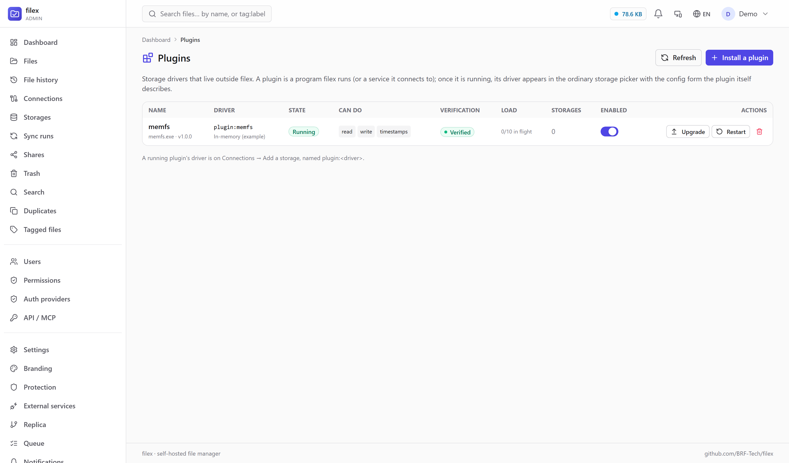

# Storage plugins

filex speaks local disk, S3, SFTP, FTP, WebDAV and SMB out of the box. A
**plugin** is how it speaks to something it has never heard of: your appliance,
your company's object store, a research archive with its own API — anything
that can list, read and (optionally) write files.

A plugin is **a separate program**. filex starts it and talks to it over a small
HTTP/JSON protocol, so a plugin can be written in any language, ships on its own
schedule, and cannot take filex down when it crashes. Once it is running, its
driver appears in the ordinary storage picker with the config form the plugin
itself describes — nothing about filex's frontend or its release cycle is
involved.

What a plugin *claims* is not taken on trust. Every capability it declares is
**probed** before anybody can build a storage on it, and again against the
configuration an operator types — see [Conformance](#conformance-a-plugin-has-to-prove-its-claims).
A plugin that fails its own claims is refused, because a half-working driver
produces failures the user reads as *filex* being broken.

```
Admin → Plugins → Install          Connections → Add a storage
        ┌──────────────┐                  ┌────────────────────┐
        │ your program │◀── HTTP/JSON ────│ filex              │
        │  (any lang)  │   unix socket    │  storage.Driver    │
        └──────────────┘   or loopback    └────────────────────┘
```

---

## Install one

**Admin → Plugins → Install a plugin**, in one of three ways:

| Source | What happens | When to use it |
|---|---|---|
| **Upload a binary** | The file is stored under `<data-dir>/plugins/<name>/`, hashed, and launched. | The normal case. |
| **From a URL** | Downloaded, checked against a **required** SHA256, then as above. | Unattended installs, scripted setups. |
| **Remote service** | Nothing is launched: filex connects to an address you give it with a bearer token you give it. | A sidecar container, a plugin on another host, or a plugin you are developing. |



> ⚠ **A plugin runs with filex's own privileges** and is handed the credentials
> of every storage created on it. Install only plugins you trust — the same
> judgement you would apply to a package you install on the server.

> ⚠ The binary has to be built **for the server**, not for your laptop:
> `GOOS=linux GOARCH=amd64` for the usual Docker image. A binary for the wrong
> platform fails to start, and the Plugins page shows the exec error.

Installing does not end at "the file is on disk". filex starts the plugin, asks
it to describe itself, and then **probes every capability it declared** against
a throwaway area the plugin opens for exactly that (`POST /v1/selftest`). Only
then is the driver registered. A plugin that fails a probe never reaches
`running` — it lands in **Refused**, and the page shows the report: which probe
failed, what was expected, what happened.

> ⚠ The install call answers **201 before any of that has happened** — describe
> and the probes run after the row exists. A script that treats the 201 as
> success will happily report a plugin installed that filex has already refused;
> read the *state* from `GET /api/admin/plugins`.

A plugin that offers no `/v1/selftest` is still installed, but it is
**unverified**: nothing was proven at install, and the same probes run when
somebody saves the first storage on it. The Plugins page says which of the two
you are looking at, because "verified" and "not yet probed" are different
statements and only one of them is a promise.

The **name** you choose (`[a-z0-9][a-z0-9_-]{0,31}`) names the plugin's folder
and appears in logs. The **driver** name comes from the plugin itself, and the
storage driver is always `plugin:<driver>` — a plugin can never shadow a
built-in driver, and two plugins cannot claim the same one (the second is
refused, naming the first).

To turn the subsystem off entirely: **`FILEX_PLUGINS_DISABLED=1`**. Nothing is
launched, no remote is contacted, and the admin API answers 503 saying so. In
multi-tenant mode the page is **supertenant-only**: a tenant admin gets a 403
that says whose surface it is.

### States

| State | Meaning |
|---|---|
| **Running** | Described itself, driver registered, storages can open. |
| **Starting…** | Launched; the handshake or describe has not finished. |
| **Failed** | Exited or became unreachable. A binary is restarted with backoff; a remote is re-checked every few seconds. |
| **Refused** | filex will not use it: protocol mismatch, an invalid describe, a driver-name collision, a binary whose SHA256 no longer matches what was installed, a missing or bad signature where one is required, or **conformance failure** — it declared a capability it could not perform. `state_error` carries the reason. Fix it and press **Restart**. |
| **Off** | Disabled by the toggle. The driver is unregistered, and storages on it stop opening. |

**Removing** a plugin deletes its files and its registration. Storages created
on it are **left alone** — they simply cannot open until the plugin is back.
Deleting somebody's storages is not a decision this button makes; the page shows
how many will be affected before you confirm.

**Upgrading** replaces the binary and keeps everything else — see
[Upgrade in place](#upgrade-in-place). Do not remove-then-install to get a new
version: removing takes the registration with it, and a storage whose driver has
gone is a storage that cannot open.

---

## Conformance: a plugin has to prove its claims

A plugin declares its capabilities and filex acts on them — it registers a
driver whose method set matches, and every surface then offers those operations.
If the plugin declared `write` and its write is broken, the user meets an upload
button that fails, a trash move that fails and a version snapshot that fails,
and reads all three as **filex** being broken. The plugin is the faulty part;
the product wears the fault.

So each declared capability is measured, in **two places**:

| Gate | When | Against what |
|---|---|---|
| **Self-test** | at install, and every time the plugin starts | a throwaway instance the plugin opens for `POST /v1/selftest` |
| **Storage save** | when a storage on the plugin is created or edited | that storage's **real** configuration, in a scratch folder that is removed afterwards |

The second gate exists because the first cannot cover it. A self-test proves the
plugin's *code* works; it cannot prove that these credentials reach that bucket,
that this path exists, or that the account may write there. Finding that out
when the storage is **saved** costs one error message; finding out later costs a
user who uploads a file into a storage that cannot hold it.

What runs, in order: `list` · `not_found` · `write` · `read` (bytes compared) ·
`stat` (size and kind must agree with what was written) · `list_after_write` ·
`range` (bytes 8–17 must be *those* bytes) · `set_mtime` (set, then re-stat —
a timestamp that is accepted and dropped makes every sync run copy everything
again) · `copy` · `move` (the source must be gone afterwards) · `mkdir` ·
`delete` · `delete_idempotent` (deleting what is already gone must be a no-op —
trash purge, sync and the ops worker all rely on that) · `presign` · `multipart`
(one part, uploaded, completed, read back and compared) · `watch`. A capability
that was not declared is reported as **skipped**, not passed.

⚠ `list` short-circuits: a backend that cannot list is not probed further,
because every later probe would fail with the same cause and bury it.

⚠⚠ **What conformance cannot check** is worth knowing before you rely on it:

- `presign` is verified to return an **absolute URL that parses**, not one a
  browser on another network can reach. filex may not share the client's
  network, so it deliberately does not fetch it — a plugin that hands back a
  loopback URL passes the probe and fails in every browser.
- `watch` is verified to **open a stream**, not to deliver an event for every
  change. Requiring an event would mean requiring the plugin to notice a change
  filex made inside a ten-second window, which a polling backend legitimately
  cannot.
- Nothing here separates a slow backend from a broken one beyond the timeout
  (90 s for a whole run; the storage-save gate gives the whole check 2 minutes).

⚠ The storage-side probes **write into your storage**: a folder named
`.filex-conformance-<random>` at the storage root, removed when the run
finishes. If you find one left behind, that is the report — a plugin whose
delete is broken is exactly what the delete probe catches. A read-only plugin
creates nothing: its probes list and stat at the root and say plainly that the
write half was not exercised.

### Modes

`FILEX_PLUGIN_CONFORMANCE` — `enforce` (default) · `warn` · `off`.

| Mode | A plugin that fails its own claims |
|---|---|
| `enforce` | is **refused**, and a storage cannot be saved on it. |
| `warn` | is registered anyway; the report is kept and shown. For somebody *writing* a plugin — never the default, because the cost of a broken claim is paid by the user. |
| `off` | is not probed at all. Both gates are skipped. |

The mode is reported by the admin API and shown on the page, so nobody has to
discover that the safety net is down by meeting a broken storage.

> ⚠ Built-in drivers are **not** put through this. They are compiled in, covered
> by the repository's own tests, and already have a connection test; probing
> every storage save would change behaviour for paths that never had this
> problem.

---

## Upgrade in place

`POST /api/admin/plugins/{id}/upgrade` — multipart, `file` (and `signature` when
this instance requires one). Admin → Plugins → **Upgrade** does the same thing.

The row, the name, the driver and every storage built on it survive. What
happens, in order: stop the plugin, put the new file in place, start it, run the
conformance gate. If the new binary does not come up — a bad build, a wrong
architecture, a capability it can no longer perform — **the previous binary is
restored and started again**, and the call answers `400` with both the failure
and the plugin's current status. A failed upgrade costs an error message, not a
plugin.

> ⚠ The plugin is **stopped first, deliberately**. A running executable cannot
> be replaced on Linux (`ETXTBSY`), and a plugin serving requests should not
> have the ground moved under it. Storages on it fail for the length of the
> swap; they recover on their own when it comes back.

> ⚠ Only a **binary** plugin can be upgraded this way. A remote plugin is
> upgraded where it runs — filex only holds its address.

---

## Signed plugins

filex can require that a plugin binary is **signed** before it will accept it.
Configure trusted ed25519 public keys (hex or standard base64) in
`FILEX_PLUGIN_TRUSTED_KEYS` (comma-separated), or on the plugin manager's
`Options.TrustedKeys` if you embed filex; when at least one key is present, install and
upgrade both refuse an unsigned or badly signed binary, and the admin API
reports `requires_signature: true` so the UI can ask for the signature up front
rather than after a rejection.

What is signed is the binary's **sha256, hex-encoded and lower-cased** — not the
file itself. That keeps verification cheap and lets you sign the same digest you
already publish:

```bash
sha256sum myfs | cut -d' ' -f1 | tr -d '\n' > myfs.sha256
# sign the CONTENTS of myfs.sha256 with your ed25519 key; send the detached
# signature (hex or base64) as the `signature` field alongside the upload
```

> ⚠ A checksum and a signature answer different questions. The SHA256 an install
> already requires only proves the file has not changed since it arrived; it
> says nothing about **who** it came from. That is the whole reason this exists.

```bash
FILEX_PLUGIN_TRUSTED_KEYS=3d40…e91b,7ac2… filex serve
```

> ⚠ Enforcement is **off until a key is set** — which is the honest default for
> a single-admin instance, and the wrong one for a shared server where "admin"
> is several people. Setting one key changes nothing about plugins already
> installed; it applies from the next install or upgrade.

> ⚠ Rotation is why the setting takes a list: any one trusted key verifying is
> enough, so a new key can be added before the old one is retired.

---

## ⚠⚠ A public demo must not offer this

An instance running with `FILEX_DEMO_MODE` publishes an **admin** login. The
plugin API is admin-only, so on that one instance "admin-only" means *anybody*
— and installing a plugin makes filex execute an uploaded program on the host.

So demo mode turns the subsystem **off** by default. `FILEX_PLUGINS_DISABLED=0`
overrides it, deliberately, for somebody who knows what they are handing out.

> This default came from a measurement rather than a worry. On 2026-08-19 the
> project's own public demo was checked: the credentials printed on its landing
> page logged in as `role=admin`, and `GET /api/admin/plugins` answered `200`.
> Nothing had been installed — and nothing was stopping it. A safe state that
> depends on the operator noticing is not a default.

The same reasoning is why the surface is **supertenant-only** in multi-tenant
mode: a tenant admin administers their tenant, not the machine.

## What a plugin may cost filex

A plugin is somebody else's program in filex's request path. Without ceilings,
one slow plugin is one slow filex.

| Bound | Value | Why |
|---|---|---|
| Concurrent operations, **per plugin** | 10, `FILEX_PLUGIN_MAX_INFLIGHT` | Comfortably above what a browsing user generates; low enough that a stuck plugin cannot consume the server. |
| Waiting for a slot | 5 s, then refused | If every slot is busy the honest answer is "this storage is overloaded", not a request that hangs for a minute and fails anyway. |
| Metadata operations | 60 s | `list`, `stat`, `delete`, `mkdir`, `move`, `copy`, `set_mtime`. Slowness there means trouble. |
| Reads and writes | **no timeout** | A 20 GB upload is legitimately slow; a deadline would turn a working transfer into a failed one. |
| Plugin stdout/stderr | 50 lines/s, burst 200 | A chatty debug build or a tight retry loop is otherwise filex filling the disk. Dropped lines are reported, once per window, rather than silently lost. |

A refusal is counted separately from a failure (`outcome="busy"`, see
[METRICS.md](METRICS.md#storage-plugins)): saturation is a sizing problem, not a
bug to chase. Conformance probes are exempt from the ceiling — a probe must not
be refused because users are keeping the plugin busy.

> ⚠⚠ **filex is not a sandbox, and does not pretend to be one.** A plugin runs
> as filex's own user with filex's own privileges. On Linux and macOS it is put
> in its own **process group**, so a helper it spawned (an `rclone`, a mount, an
> `ssh`) is killed with it instead of surviving to hold the socket — which is
> the failure that looks like "the plugin is stopped but the next start says
> address already in use". Memory and file-descriptor limits are **not** set:
> Go cannot apply an rlimit to a child between fork and exec, and setting one in
> the parent would cap filex itself. On Windows there is no process group in the
> POSIX sense either, so a plugin's children survive it there. Real isolation
> means namespaces, seccomp or a container runtime — run the plugin as a
> **remote** service in its own container if you need that.

---

## A plugin storage is a storage everywhere

A plugin driver is not a second-class mount. The same storage is served over
**WebDAV**, **SFTP**, **FTPS**, **NFS** and the **S3 endpoint**
([PROTOCOLS.md](PROTOCOLS.md)), gets thumbnails, is walked by the sync worker,
and counts against [quota](QUOTAS.md) — each of those has its own test against a
live plugin in this repository, so none of it is an assumption.

Two behaviours are worth stating because they are the ones that would hurt:

- ⚠⚠ **An unavailable plugin is an error, never an empty listing.** A
  `PROPFIND` against a storage whose plugin is down answers a failure, not
  `200 OK` with nothing in it — a mirroring client that saw the second one would
  delete the user's local copy. The storage recovers on its own when the plugin
  answers again: no filex restart, no re-saving the connection.
- ⚠⚠ **A plugin outage does not wipe the index.** The sync run fails, is
  recorded as `failed`, and the nodes stay; the next healthy pass adds nothing
  because nothing was lost. A read-only plugin refuses writes on every one of
  those surfaces, not just in the web UI.

---

## Write one (Go)

The SDK makes a plugin three methods and a `Serve` call. Everything else —
handshake, routing, streaming, error codes, instance bookkeeping — is done for
you.

```go
package main

import (
	"context"
	"io"
	"os"

	"github.com/brf-tech/filex/backend/pkg/pluginsdk"
)

type myFS struct{ root string }

func (m *myFS) List(ctx context.Context, path string) ([]pluginsdk.Object, error) { /* … */ }
func (m *myFS) Stat(ctx context.Context, path string) (pluginsdk.Object, error)   { /* … */ }
func (m *myFS) Read(ctx context.Context, path string) (io.ReadCloser, error)      { /* … */ }

func main() {
	pluginsdk.Serve(pluginsdk.Plugin[*myFS]{
		Name:    "myfs",
		Version: "1.0.0",
		Label:   "My storage",
		Fields: []pluginsdk.Field{
			{Key: "root", Type: pluginsdk.FieldString, Label: "Root", Required: true, Root: true},
			{Key: "token", Type: pluginsdk.FieldPassword, Label: "API token", Secret: true},
		},
		Open: func(ctx context.Context, cfg map[string]any) (*myFS, error) {
			return &myFS{root: pluginsdk.String(cfg, "root")}, nil
		},
		// Scratch space filex may write to and delete, for the conformance
		// probes. Without it the plugin is registered UNVERIFIED and the
		// probes fall on somebody's first real storage instead.
		SelfTest: func(ctx context.Context) (*myFS, error) {
			dir, err := os.MkdirTemp("", "myfs-selftest-")
			if err != nil {
				return nil, err
			}
			return &myFS{root: dir}, nil
		},
	})
}
```

Two complete, working examples live in the repository, and filex's own tests
install and drive them, so neither can rot:

- [`backend/examples/plugin-memfs`](../backend/examples/plugin-memfs/main.go) —
  the Go SDK, about a hundred lines, in-memory, with a `SelfTest` area.
- [`backend/examples/plugin-diskfs/plugin.py`](../backend/examples/plugin-diskfs/plugin.py) —
  **Python, standard library only, no SDK**: the same protocol implemented by
  hand, backed by a real directory, with every optional capability (ranged
  reads, move, copy, mkdir, mtimes, the change stream, `/v1/selftest` and
  multipart). It exists because “any language” is a claim worth proving rather
  than repeating; its [`acceptance.sh`](../backend/examples/plugin-diskfs/README.md)
  drives the whole subsystem — conformance, a plugin that lies, multipart,
  upgrade and rollback — through filex's own admin API.

```bash
go build -o myfs ./cmd/myfs      # for the SERVER's platform
# Admin → Plugins → Install → upload `myfs`
```

### Capabilities are your method set

Add a method, gain a capability. There is no list to keep in step:

| Implement | filex gains | If you don't |
|---|---|---|
| `Write` **and** `Delete` | uploads, rename, trash, versions | the storage is read-only everywhere in the UI |
| `RangeReader` | ranged reads (video seek, partial downloads) | filex reads from the start and discards — correct, just slower |
| `Mover` / `Copier` | server-side move / copy | emulated as copy+delete / read+write |
| `Mkdirer` | real directories | treated like an object store: a no-op |
| `Toucher` | a file's own mtime survives a sync | filex does not offer it (better than pretending) |
| `Watcher` | event-driven sync instead of a poll, on a storage set to `fsnotify` | filex polls on its sync interval |
| `Presigner` | share downloads redirect the visitor to your URL — the bytes never pass through filex | filex streams them from your plugin |
| `Multipart` (needs `Writer`) | resumable uploads: the staged-upload commit pushes parts instead of one long `PUT` | filex writes the whole object in one `Write` |

> ⚠ `Write` and `Delete` travel **together**. A driver that can create files it
> cannot remove breaks trash and versioning, so filex refuses the pair split at
> registration — and the SDK reports the pair honestly rather than letting you
> discover it later. `multipart` without the pair is refused for the same
> reason: a resumable upload is still an upload.

> ⚠ Exactly one field should be marked **`Root: true`** — the field that scopes
> a storage inside your backend (a path, a prefix, a bucket). filex refuses to
> mount a backend's root, so a plugin without one has every storage rejected.

> ⚠ `SelfTest` is optional and you want it. It is a backend over scratch space
> you are happy to have written to and deleted (a temp directory, a throwaway
> prefix, an in-memory area); filex releases it with `DELETE /v1/instances/{id}`
> when the probes are done. Skip it and your plugin is installed **unverified**,
> and the first person to save a storage on it runs the probes for you.

> ⚠⚠ **Only declare `presign` when the URL works from the client's network.**
> Conformance can only check that a URL comes back and parses — filex may sit on
> a network the browser cannot see, so it will not fetch it for you. A plugin
> that returns a loopback URL passes the probe and then breaks every share
> download on that storage.

> ⚠ `Watcher` is now **consumed**, on a storage whose sync mode is `fsnotify`
> and whose driver is not local (see [below](#watch-what-filex-does-with-your-change-stream)).
> The previous release's docs said "nothing yet" and were right at the time;
> the endpoint is no longer decoration.

> ⚠ Return the SDK's errors — `pluginsdk.ErrNotFound`, `ErrReadOnly`,
> `ErrUnsupported`. They become filex's own `storage.ErrNotFound` and friends, so
> a missing file answers 404 rather than 500. **The conformance run tests this
> directly**: `Stat` on a path that does not exist must map to `not_found`, or
> the probe fails and the plugin is refused — a 500 where a 404 belongs is how a
> missing file turns into "filex is broken".

### `watch`: what filex does with your change stream

A storage set to **`sync_mode: fsnotify`** uses, in this order:

1. **inotify**, when the driver is local — cheaper, and it sees changes made
   outside filex on the same disk;
2. **your stream**, when the driver implements `Watcher` — filex subscribes to
   `/v1/instances/{id}/watch` and re-scans on your events;
3. **polling**, when there is neither.

Events are **coalesced** (2 s debounce, the same as the inotify loop, so an
unpacking archive is one scan rather than one per file) and each batch triggers
the same full run a poll would. A missed or duplicated event therefore costs a
scan, never a wrong index: your stream is a **hint about when**, not a ledger of
what.

> ⚠ A stream that **ends** is not the end of the storage. When your plugin
> restarts or the connection drops, filex logs it and falls back to polling
> rather than leaving the storage frozen with a stale index — the failure that
> would otherwise look like "filex stopped seeing my files".

> ⚠ The initial scan still happens. The stream makes the index *current sooner*;
> the scan is what makes it *true*.

### Developing against a running filex

Run the plugin yourself and register it as a **remote** plugin, so a rebuild is
a restart of your own process:

```bash
FILEX_PLUGIN_TOKEN=dev-token FILEX_PLUGIN_LISTEN=127.0.0.1:9099 go run ./cmd/myfs
# Admin → Plugins → Install → Remote service
#   Address: http://127.0.0.1:9099   Token: dev-token
```

While a capability is half-finished, run **that** filex with
`FILEX_PLUGIN_CONFORMANCE=warn`: the probes still run and the report still
appears, but a failure no longer refuses the plugin. Put it back to `enforce`
before anyone else uses the instance — the point of the gate is that the person
who pays for a broken claim is the user, not you.

---

## The protocol (any language)

filex sets two environment variables and reads **one line** on stdout:

```
FILEX_PLUGIN_TOKEN=<32-byte hex>     the bearer token on every request
FILEX_PLUGIN_SOCKET_DIR=<dir>        a private directory you may create a socket in

→ stdout: FILEX-PLUGIN/1 unix:/path/to.sock
      or: FILEX-PLUGIN/1 tcp:127.0.0.1:PORT
```

Everything after that is HTTP with `Authorization: Bearer <token>`:

| Method | Path | Body / notes |
|---|---|---|
| `GET` | `/v1/describe` | `{protocol, name, version, label, fields[], capabilities{}}` |
| `POST` | `/v1/instances` | `{config}` → `{instance}` — one per storage row |
| `DELETE` | `/v1/instances/{id}` | release it |
| `GET` | `/v1/instances/{id}/list?path=` | `{objects: [...]}` |
| `GET` | `/v1/instances/{id}/stat?path=` | one object |
| `GET` | `/v1/instances/{id}/read?path=` | the bytes; honours `Range` when you declare `range` |
| `PUT` | `/v1/instances/{id}/write?path=` | the bytes; `X-Filex-Size` carries the length (`-1` = unknown) |
| `POST` | `/v1/instances/{id}/move` · `/copy` | `{src, dst}` |
| `POST` | `/v1/instances/{id}/delete` · `/mkdir` | `{path}` |
| `POST` | `/v1/instances/{id}/set-mtime` | `{path, mtime}` (RFC 3339) |
| `GET` | `/v1/instances/{id}/watch` | `text/event-stream` of `{op, path, from}`, when you declare `watch` |
| `POST` | `/v1/selftest` | → `{instance}` — a **throwaway** instance for the conformance probes. No config; back it with scratch space you are happy to lose. Answer `404`/`unsupported` if you have none: the plugin is then registered *unverified*. |
| `POST` | `/v1/instances/{id}/presign-upload` | `{path, size}` → `{url, method?, headers?, expires_at}` (`presign`) |
| `POST` | `/v1/instances/{id}/presign-download` | `{path, ttl_s}` → `{url, expires_at}` (`presign`) |
| `POST` | `/v1/instances/{id}/multipart/init` | `{path, total_size, part_count}` → `{upload_id, part_urls?}` (`multipart`) |
| `PUT` | `/v1/instances/{id}/multipart/part?upload_id=&part=N&path=` | the part's bytes (`X-Filex-Size`) → `{etag}` |
| `POST` | `/v1/instances/{id}/multipart/complete` | `{path, upload_id, parts:[{part_number, etag}]}` |
| `POST` | `/v1/instances/{id}/multipart/abort` | `{path, upload_id}` |

> ⚠ `multipart/part` is **one route with a slash in it**, not `multipart` with a
> sub-resource. Splitting the path and switching on the first segment alone
> makes every multipart call answer 404 — which is what the Python example did
> until conformance caught it.

> ⚠ `part_urls` is for the browser-chunked upload endpoint
> (`POST /api/files/upload/init`), which hands them straight to the client. The
> path that actually exercises a plugin's multipart today is the **staged
> upload commit**, and it holds the bytes itself, so it pushes each part through
> `multipart/part` and ignores `part_urls`. Returning none is normal.

Errors are `{"error": <code>, "message": <text>}`. Codes filex understands:
`not_found`, `read_only`, `unsupported`, `invalid`, and **`no_instance`** —
answer that one for an id you do not recognise and filex re-creates the instance
from the saved config and retries the call once. That is what makes a plugin
restart invisible to the person using the file manager.

> ⚠ **`multipart/part` is the one call that is not retried.** A part body can be
> read only once, and a plugin that lost its instance has also lost the upload
> the part belongs to — retrying would land a part in a different upload. The
> caller starts the upload again instead.

> ⚠ If you serve `/watch`, **flush the response headers immediately**. Written
> but unflushed headers leave filex waiting for a response that has already been
> produced — a watch that appears to hang on an idle backend.

> ⚠ A plugin that listens on TCP must bind **loopback**. The token is the only
> thing between the world and the storage credentials filex sends you; filex
> refuses a handshake that advertises a non-loopback address.

---

## Where things live

| What | Where |
|---|---|
| Installed binaries | `<data-dir>/plugins/<name>/` |
| Sockets a plugin creates | `<data-dir>/plugins/<name>/run/` (mode 0600) |
| Registration | the `plugins` table (migration 00029) |
| A remote plugin's token | sealed with `FILEX_SECRET_KEY` — registering one without that key is refused rather than stored in plaintext |
| The previous binary, during an upgrade | `<data-dir>/plugins/<name>/<binary>.previous`, removed once the new one is up (and used to roll back when it is not) |
| Conformance probe leftovers | `.filex-conformance-<random>/` at a storage's root — named so an operator who finds one knows what made it |
| Host implementation | [`backend/internal/plugin`](../backend/internal/plugin) |
| Driver shapes | `internal/plugin/driver_shapes.go` — **generated**, 20 combinations: `go run ./internal/plugin/gen > internal/plugin/driver_shapes.go`. ⚠ Regenerate it by hand after touching the generator; nothing in CI compares the two today |
| SDK | [`backend/pkg/pluginsdk`](../backend/pkg/pluginsdk) |
| Metrics | `filex_plugin_*` — see [METRICS.md](METRICS.md#storage-plugins) |

> ⚠ Why the shapes are generated rather than written: filex decides what a
> storage can do by **type-asserting** optional interfaces at forty-odd call
> sites, so a plugin that cannot write must be handed to filex as a value with
> **no** `Write` method — not one that returns an error, or the UI offers an
> upload button that fails at the last moment. With five optional axes (write,
> mtime, watch, presign, multipart) that is twenty structs, and twenty
> hand-written structs is where somebody eventually embeds the wrong thing and a
> read-only plugin quietly becomes writable.

Related: [STORAGE.md](STORAGE.md) for the built-in drivers,
[CONFIGURATION.md](CONFIGURATION.md#storage-plugins) for the environment
variables, [METRICS.md](METRICS.md#storage-plugins) for what to watch,
[BACKEND.md](BACKEND.md#admin-plugins) for the admin API, and
[PROTOCOLS.md](PROTOCOLS.md) for reaching filex *from* other clients (the
opposite direction).
