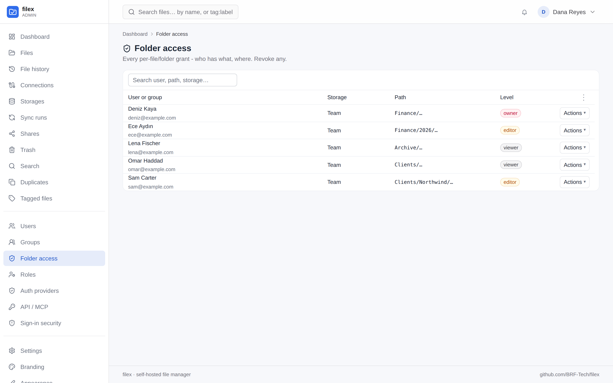

# filex - RBAC & per-file/folder permissions (API + MCP reference)

Added in v0.1.41+ (backend `internal/acl`). This documents the access model and
every endpoint / MCP tool the feature exposes. Backwards compatible: RBAC is
**off per storage by default**, so an untouched deployment behaves exactly as
before.

> **What an account may *do*** - delete, share, download, use SFTP, manage users -
> is the roles and per-user permission layer on top of this, in
> [PERMISSIONS.md](PERMISSIONS.md). A file action needs both: the grant level
> described here, and the permission.
>
> In the admin panel the grants are **Admin → Folder access** (*Klasör
> erişimi*) - every per-file and per-folder grant, who has what, where - and
> the roles are **Admin → Roles**. (Before 0.49 the grants page was called
> *Permissions*.)

> A grant can also be given to a **group** - every member holds it, the
> highest covering level still wins and the account ceiling still caps it.
> See [GROUPS.md](GROUPS.md#folder-access). In the panel routes below, `POST`
> takes a `group_id` in place of `user_id`; a group's grant is numbered apart
> from people's and is changed and revoked at
> `/api/files/permissions/groups/{id}`.

## Model

Two layers combine, then a ceiling is applied:

1. **Account role** (`users.role`): `admin` (full panel, exempt from all ACL),
   `user` (explorer only; read+write; can hold owner grants), `viewer`
   (explorer only; read-only - view/download, no edit/convert/mutate). For an
   account with no custom role of its own, `user` or `viewer` follows the role
   its groups give it ([GROUPS.md → The role](GROUPS.md#the-role)).

   "Explorer only" is a URL as well as a permission: give a `user` or `viewer`
   account the address `…/drive` and they land on their Home page - their
   storages, what they opened last, what they starred - one click from the file
   manager itself (uploads, sharing, search and the editor), with no admin
   chrome and nothing extra to deploy. `…/admin` is the same application served
   under the operator's prefix; a non-admin who follows an old `/admin/...` link
   is handed on to `/drive/` (and the backend re-checks the role on every
   `/api/admin/*` call regardless of which URL asked).
2. **Per-storage RBAC toggle** (`storages.rbac_enabled`, default `false`):
   - OFF → storage visible to every authenticated user; capability = account
     role (user→editor, viewer→viewer, admin→owner). No grants needed.
   - ON → storage hidden; a non-admin sees only paths granted to them (directly
     or inherited from a parent folder).
3. **Item grant level** (`file_grants`): `viewer` < `editor` < `owner`.
   - Inheritance: a folder grant cascades to descendants. Effective level =
     highest covering grant (direct or inherited), then **capped by the account
     role** (a viewer account stays viewer even if granted higher).
   - Only an `owner` of an item (or an admin) may see/manage its permissions.

⚠ One surface was missing until the release this note ships in:
`/api/files/versions` had no ACL check
at all, so a `viewer` account could restore an old version over any file's live
bytes. Restore and snapshot now require **editor**; listing the timeline stays at
**viewer**. See [TRASH-VERSIONING.md](TRASH-VERSIONING.md#versioning-endpoints).

Enforcement is server-side at every `/api/files/*` chokepoint AND the `/api/ai`
(REST + MCP) surface, keyed off the authenticated user - so cookie sessions are
filtered too, not just tokens. `internal/confine` (the token `root:` scope hard
ceiling) still composes on top.

### API tokens: verbs on every surface

A request authenticated by an API token is limited by the token's **verbs** as
well as by the account's grants, on every surface a token can use:
`/api/files`, `/api/shares`, `/api/notifications`, `/api/me`, `/api/ai` (REST
and MCP), WebDAV, SFTP, FTPS, and the S3 access keys and NFS exports minted
from a token (they inherit its verbs).

| Verb | Needed for |
|------|------------|
| `read` | every request on these surfaces - listing, downloading, searching |
| `write` | creating, changing, moving and renaming; public links and item permissions; uploads, archives, versions, restoring from the trash; team tags; app actions that need edit rights; **changing the account itself** - `PATCH /api/auth/profile`, `POST /api/auth/password` and `POST /api/auth/totp/enroll`, `…/verify`, `…/disable`. Without it the document editor opens read-only. |
| `delete` | deleting (to the trash), discarding a draft, dropping versions or trash entries |

Without `write` a token keeps what a **viewer** keeps: its preferences, stars,
recently opened, personal tags, comments and notifications. It can read its own
account (`GET /api/auth/me`) but not change its profile, its password or its
two-factor setup - a token that may only read must not be able to take the
account over. A refused request answers
`403 {"error":"token missing scope: <verb>"}`. A browser session is judged by
the account alone, as before. A token's list is exactly what it grants - an
empty list grants nothing; tokens from before v0.43.0 carry the explicit full
list. The desktop app's token carries `write` for every account - a **viewer's**
too (`read,write`, never `delete`) - so its account dialog saves the profile,
the password and two-factor as the web app does. `write` opens no file change
for a viewer: the viewer role still refuses every write, link and grant, with
the role's answer rather than the token's. A viewer's own API keys stay `read`.

On each surface:

| Surface | How the verbs apply |
|---|---|
| `/api/files`, `/api/shares`, `/api/notifications`, `/api/me` (the explorer, `filex client`, an embed's proxy) | every route asks `read`; the routes that change files add `write`, those that remove files add `delete`. Two routes decide by the request: the manager's `?action=` (`delete` asks `delete`, `allowed` - the question the explorer asks before it offers an action - asks `read`, every other action `write`) and the operations queue's job kind |
| `/api/ai` REST and MCP | each route and each `file_*` tool asks the verb of its REST twin; `tools/list` leaves out the tools the token cannot use ([MCP.md](MCP.md#mcp-endpoint-apiaimcp)) |
| WebDAV, SFTP, FTPS (a token as the password) | `read` to list and download, `write` to create, change, rename and move, `delete` to remove |
| S3 access keys and NFS exports **minted from a token** | carry that token's verbs the same way; one minted from a browser session carries every verb, as before |

### Public links need edit rights on every surface

A public link - a download link or a file-drop link - hands the item to people
who have no account, so it needs **editor** on the item, and the account's
`share.links` permission (`share.upload_links` for a file drop), whichever door
makes it: the explorer (`POST /api/files/share`), `POST /api/ai/share`, or the
MCP `file_share` tool - and a token making it needs `write`. filex's own
folders (the trash, open-with copies) are never linked.

The link keeps needing them: it answers only while its creator still holds
that permission at the editor level on the item, and answers `404` from the
moment they do not - revoking a person's grant on a folder closes the links
they made in it, and giving it back opens them again. Links an app opened, and
links whose creator's account was deleted, are not affected
([PERMISSIONS.md → Public links follow their creator](PERMISSIONS.md#public-links-follow-their-creator)).

### Administration and plugins need a session

Some acts are a signed-in administrator's only. An API token - even an
administrator's own admin-scoped one - gets `403 {"error":"session_required",
"message": …}` on every door that reaches them (`/api/admin`, `/api/ai/admin`
and the `admin_*` MCP tools alike):

- creating an administrator, promoting an account to administrator, changing
  an administrator's role, and setting or resetting an administrator's
  password;
- allowing an admin-area permission (`admin.*`) - as a person's exception, in
  a custom role, or in a built-in role
  ([PERMISSIONS.md](PERMISSIONS.md#handing-out-administration-takes-a-session));
- installing, upgrading, going back, switching, removing and re-permissioning
  an app or a storage plugin, and approving or rejecting an install request -
  the refusal names `request_endpoint`, where a token leaves a request
  instead ([APP-PLUGINS.md → Install requests](APP-PLUGINS.md#install-requests)).
- changing who may encrypt - a tenant's policy, the operator's ceiling for a
  tenant, answering an encryption request, and the `e2e.policy` setting by
  whichever door reaches it
  ([E2E-ENCRYPTION.md → Who may encrypt](E2E-ENCRYPTION.md#who-may-encrypt)).

An administrator signed in to the admin panel does all of them as before.
Managing accounts that are not administrators, taking a permission away, and
reading plugins stay open to an admin-scoped token.

## Endpoints - permissions panel (`/api/files/permissions`)

Mounted in the authenticated group. Every write requires the caller to be admin
**or** hold `owner` on the target path.

| Method | Path | Body / query | Notes |
|--------|------|--------------|-------|
| GET | `/api/files/permissions?path=<adapter>://<rel>` | - | `{direct[], inherited[], storage_rbac, effective}`; each grant carries `kind`: `user` or `group`. Owner/admin only. |
| POST | `/api/files/permissions` | `{path, user_id \| group_id, level, is_dir?}` | Upsert a grant, to a person or to a group. 409 if storage RBAC off; 400 if granting a viewer account >viewer (a group takes any level; each member's account still caps it). |
| PATCH | `/api/files/permissions/{id}` | `{level}` | Change a person's grant's level. |
| DELETE | `/api/files/permissions/{id}` | - | Revoke a person's grant. |
| PATCH | `/api/files/permissions/groups/{id}` | `{level}` | Change a group's grant's level (a `kind: "group"` row; its own id space). |
| DELETE | `/api/files/permissions/groups/{id}` | - | Revoke a group's grant. |
| GET | `/api/files/permissions/resolve?email=` | - | `{found, user?}` - existing account or not. |
| GET | `/api/files/permissions/users?q=` | - | `{users[]}` autocomplete of existing accounts. |
| GET | `/api/files/permissions/groups?q=` | - | `{groups[]}` - up to 10 groups, matched by name, that the caller could grant to. |
| POST | `/api/files/permissions/invite` | `{path, email, level, create_user?, role?}` | Existing user → grant; admin+`create_user` → new account+grant (temp password); else public share link. `{mode, url?, temp_password?, emailed}`. Mail sent only when SMTP is verified, else the link/password is returned for on-screen display. |

## Endpoint - "shared with me" (`/api/files/manager/shared-with-me`)

The permissions panel answers "who can see *this* folder". The reverse question -
"what has been shared with *me*" - has its own endpoint, and it is what the
explorer's navigation panel lists under **Shared with me**.

| Method | Path | Query | Notes |
|--------|------|-------|-------|
| GET | `/api/files/manager/shared-with-me` | `limit` (100, max 500), `offset` | `{files[], storages[], total, limit, offset}`. Any authenticated caller; no admin or owner requirement - you are asking about your own grants. |

Three rules decide what is in it:

- **Grants only.** A storage with RBAC **off** is reached by every authenticated
  account through their role, so a grant row there is inert and its files are
  the caller's own, not "shared with them". Only RBAC-enabled storages are
  consulted.
- **The item, not its contents.** A grant on a folder lists the folder.
- **A whole-storage grant is a drive, not an item.** It has no name to render,
  so it is reported in `storages[]` - the shared drives the UI marks in its
  storage list - instead of as a file row.

Tenant scope is applied explicitly here, not inherited: `tenantstore` wraps only
the storage/user *listing* methods, so a per-grant read like this one has to gate
itself or it hands one tenant the paths of another's shared folders.

## Endpoints - self-service tokens (`/api/tokens`)

Any authenticated user (incl. non-admin) mints tokens **bound to themselves**,
capped server-side:

| Method | Path | Notes |
|--------|------|-------|
| GET | `/api/tokens` | The caller's own tokens (no secrets). |
| POST | `/api/tokens` | `{label, scopes, expires_in_days?}`. Always minted as `kind: "user"`. Verb-scope ceiling: viewer→`read`/`mcp` only; user→`read,write,delete,mcp`; **never `admin`**. At least one verb is required - an empty list is refused with `400 scopes_required` (the rule every token door shares; an empty list grants nothing). A `root:<adapter>://<rel>` scope must be ⊆ the caller's own grants. Plaintext returned once. |
| PATCH | `/api/tokens/{id}` | Ownership-checked; label / usernames only. `kind` is admin-only. |
| DELETE | `/api/tokens/{id}` | Ownership-checked. |

⚠⚠ **Since v0.43.0 the calling credential is a second ceiling.** When the
caller is a token, whatever it mints here - a token, an S3 access key, an SSH
key or an NFS export - must hold a subset of that token's verbs, a confinement
root inside its `root:`, and an expiry no later than its own; a narrow caller
cannot borrow a wider parent token either. Otherwise: **`403`,
`reason: "token_ceiling"`**, naming what was too wide. Browser sessions are
unaffected, and credentials that already exist are untouched.

⚠ **This surface - and the other self-service credential surfaces,
`/api/auth/s3-keys`, `/api/auth/ssh-keys`, `/api/auth/nfs-exports`, and reading
a share link's PIN back (`GET /api/shares/{id}/pin`) - answer 403 to an `app`
token** (`reason: "app_token"`, from one shared middleware,
`handlers.RequirePersonalCaller`). A token acts AS its owner, so a shared
integration token - the one a host app's proxy injects in front of many
visitors - would otherwise let any of them list and revoke the credential that
embed runs on, or mint a new S3 key bound to its owner. Cookie/OIDC sessions
and `user` tokens are unaffected. See [MCP.md → Token kinds](MCP.md#token-kinds---user-vs-app);
the escape hatch for a personal token that migration `00030` defaulted to `app`
is `PATCH /api/admin/ai-tokens/{id}` `{"kind":"user"}`.

⚠ Kind is a **different axis from role and from confinement**. It does not widen
or narrow what a caller may do - every check on this page still applies - it only
decides whether the surfaces that belong to one identity are drawn at all.

## Endpoints - admin (`/api/admin`)

| Method | Path | Notes |
|--------|------|-------|
| GET | `/api/admin/grants` | Global overview - the **Folder access** page: every grant enriched with `storage_name`, `user_email` and `user_name` (the person as every screen names them). Admin, or a delegated administrator holding `admin.grants`. |
| DELETE | `/api/admin/grants/{id}` | Admin override revoke (admin or `admin.grants`). |
| DELETE | `/api/admin/grants/groups/{id}` | The same for a group's grant ([GROUPS.md](GROUPS.md#folder-access)). A group's grants are numbered apart from people's, so the rows of `GET /api/admin/grants` carry `kind: "user" \| "group"` and each kind is revoked by its own route. |
| POST | `/api/admin/settings/smtp-test` | Admin only. `{to?}` → `{ok, error?, sent?}`. Verifies the SMTP config (auth handshake) and, with `to`, sends a real test mail. SMTP config lives in the `smtp.*` settings keys (`host/port/tls/from/username/password`). |

`storages.rbac_enabled` is set via the normal storage create/update payloads
(`POST/PATCH /api/admin/storages`, field `rbac_enabled`).

## MCP admin tools

Exposed on `/api/ai/mcp` for an API token carrying the `admin` scope (alongside
the other `admin_*` tools - [MCP.md → Tool set](MCP.md#tool-set)):

| Tool | Input | Effect |
|------|-------|--------|
| `admin_grants_list` | - | List every grant (who/where/level), each row with `kind`: `user` or `group`. |
| `admin_grant_set` | `{body:{path, user_id \| group_id, level}}` | Grant/upsert, to a person or to a group. Storage must have RBAC on; viewer accounts capped to viewer. |
| `admin_grant_revoke` | `{id}` | Revoke a person's grant (a `kind: "user"` row) by id. |
| `admin_group_grant_revoke` | `{id}` | Revoke a group's grant (a `kind: "group"` row) by id. The two kinds are numbered apart: the same id can name a person's grant and a group's. |

The AI file surface (`file_*` tools + `/api/ai/files|read|upload|...`) is already
gated by the bound user's grants + role ceiling via `aiOps` - a confined,
non-admin token only sees/mutates what its user was granted.

An item's **owner** manages its grants from the AI surface too (since 0.50):
`file_permissions`, `file_permission_users`, `file_permission_set` and
`file_permission_revoke`, with their REST twins under `/api/ai/permissions`.
They run the handlers of `/api/files/permissions` above, so the rules are these
ones - owner level on the item, the account's `share.users`, a viewer account
capped to viewer ([MCP.md](MCP.md#the-bell-stars-comments-permissions)).

## Tests

`backend/internal/acl/acl_test.go` (resolution: Effective/CanSee/ceiling/prefix),
`backend/internal/api/handlers/tokens_self_test.go` (scope-ceiling / escalation),
`backend/internal/api/handlers/grants_test.go` (end-to-end: owner grant, viewer
ceiling, owner-only panel, self-token limits, admin overview, non-admin 403).
