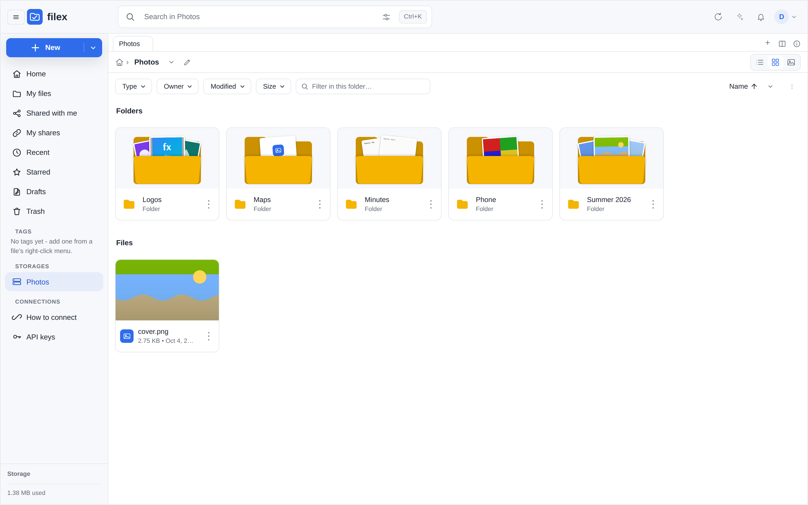
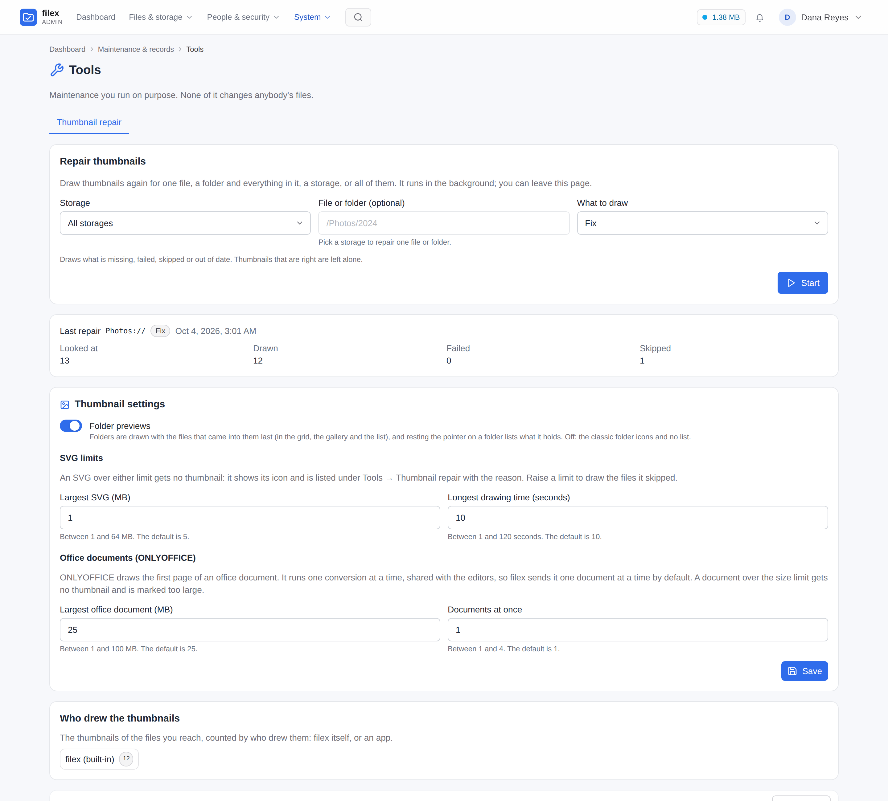

# Thumbnails

filex renders preview thumbnails **server-side** for images (HEIC and AVIF
included), video, audio, PDFs, office documents, SVGs, text files (their first
lines) and archives (the list of what is in them), and a coloured placeholder
card for everything else.
Thumbnails are **on by default** - the grid, the list and the gallery all show
a real preview where one exists and fall back to a per-type icon where it
doesn't. (Thumbnails were a grid-only feature for a long time; the list drew a
type glyph for every row, including a photograph.)

In the list a thumbnail is 24 pixels, and a page drawn that small is a white
square on a white row. So every thumbnail that is not a picture of its own
carries a small badge in its inline-end corner naming the kind (`DOCX`, `PDF`,
`ZIP`, `JAR`), in the colour of the type's icon; right to left it sits in the
other corner. That is an office document or a PDF's first page, a text or
Markdown file's first lines, an archive's list, and whatever an app draws for
its kinds (Admin → Plugins → Default apps); a kind with no type icon of its
own wears the neutral grey of the unknown-type icon. Packages (`.jar`,
`.apk`, `.whl`, `.vsix`, `.nupkg`, `.xpi` and the like) count as archives:
the archive icon and colour, with their own name in the Type column.
Photographs and video frames carry no badge, and a row without a thumbnail
shows its coloured type icon as before. The list a folder shows when the
pointer rests on it uses the same badge. The grid and the gallery draw their
thumbnails large enough to read and have no badge.

The image, SVG and placeholder generators are built in and always work (SVG
since 0.50: resvg, compiled to WebAssembly and run in-process). The richer
kinds (video, audio, PDF, HEIC/AVIF) each shell out to an **external tool**
that filex **auto-detects on `PATH`** at startup. If the tool is missing, a
file of that kind is recorded as *skipped* with the tool named, and **Admin →
Tools → Thumbnail repair** lists it with the reason; install the tool, restart,
and the next listing (or a *Fix* repair) draws it. **Office documents** are
drawn by the **OnlyOffice document server** filex is configured with, and by
nothing else (0.50, [Office through OnlyOffice](#office-through-onlyoffice)):
without OnlyOffice they get no thumbnail, and the repair tab says so.

A file whose thumbnail will not come because of the file itself (it is
damaged, encrypted or too large) keeps its type icon with a small marker in
its corner, and a resting pointer or a tap on the marker says why
([Why a file has no thumbnail](#why-a-file-has-no-thumbnail)).

A thumbnail follows its file (0.50): a file changed outside filex, or one that
never had a picture, is drawn again the next time a listing or the storage sync
sees it, and **Admin → Tools → Thumbnail repair** redraws one file, a folder, a
storage or all of them on demand. A folder shows the files that came into it
last, drawn with the folder in all three views, and what it holds when the
pointer rests on it; an administrator can turn that off.

- [Folder previews](#folder-previews)
- [Design notes (0.50): freshness, repair, folders, SVG](#design-notes-050-freshness-repair-folders-svg)
- [Office through OnlyOffice](#office-through-onlyoffice)
- [Why a file has no thumbnail](#why-a-file-has-no-thumbnail)
- [How it works](#how-it-works)
- [Generators & required tools](#generators--required-tools)
- [Configuration](#configuration)
- [Reclaiming the cache](#reclaiming-the-cache)
- [The Docker image & bundled tools](#the-docker-image--bundled-tools)
- [Serving](#serving)
- [Repair: catching up existing files](#repair-catching-up-existing-files)
- [What happens if it isn't configured / a tool is missing](#what-happens-if-it-isnt-configured--a-tool-is-missing)
- [Failure modes & troubleshooting](#failure-modes--troubleshooting)
- [See also](#see-also)

---

## Folder previews

A folder is drawn with the files that came into it last, the way a desktop
draws a folder with something in it. The three views draw the same files, each
in its own shape:

| View | The folder |
|---|---|
| **Grid** | The folder large, its back with the tab, up to three files rising out of it like prints, each turned a little, and its front over their lower half. Pointing at the card lifts them a little. |
| **Gallery** | The same folder large behind, and up to three prints fanned out in front of it from their foot. |
| **List** | The row's small folder, with the newest file rising out of its mouth. |



**Which files.** The three files directly in the folder that came in last:
for each file, the later of when it entered the catalogue and its own
modification time, newest first (the newest is the middle print, on top).
Only the folder's own files: its subfolders are never looked into, so a folder
that holds only folders is drawn empty, like an empty one. A file with a
thumbnail is its picture; a text file is its first lines and an archive the
list of what is in it (see [Generators](#generators--required-tools)); a file
with no thumbnail yet, or none at all, is its type icon on the print.

As soon as one folder in the view has files to show, every folder in that view
is drawn so, an empty one empty and an encrypted one with its padlock, and the
cards and rows keep one size and one look. A view where no folder has files to
show keeps the classic folder icons. The files are read from the catalogue and
from their own thumbnails when the folder is listed, so they follow them: a
file that comes in or changes is shown at the next listing, drawn again first
if it has to be.

Resting the mouse on a folder, in the grid or the list, shows a quiet list of
what is inside: how many things, and the first eight (folders first), each
with its thumbnail or type tile. It is not a menu: it takes no clicks, and goes
away when the pointer leaves, a button is pressed, the page scrolls or a drag
starts. On a touch screen it does not appear.

Both are part of the explorer package, so the web app, the desktop app and
every embed draw the same thing.

**Turning them off.** *Folder previews* is a switch on the thumbnail settings
card (**Settings**, and **Admin → Tools → Thumbnail repair**; setting
`thumbs.folder_previews`, on by default, seeded once from
`FILEX_THUMBS_FOLDER_PREVIEWS`). Off, listings send no folder files, the three
views keep their classic folder icons (the grid its compact folder cards), and
a resting pointer shows nothing. An explorer that is already open follows the switch the next time it
loads (it reads `folder_previews` from the capabilities).

---

## Design notes (0.50): freshness, repair, folders, SVG

This section records why the 0.50 pipeline looks the way it does. It starts
from what 0.49 did, measured, because every change below answers one of those
findings. (Issue [#79](https://github.com/BRF-Tech/filex/issues/79): SVGs
without a preview, and older JPEGs that never got one.)

### What 0.49 did

| Finding | Where |
|---|---|
| A thumbnail row did not record **which content** it was drawn from. The storage sync updated a drifted file's size, date and etag and left its `ready` thumbnail alone, so a file replaced on the backend kept its old picture for good. | `sync/poll.go` refreshEntry, `thumbnails` table |
| Two write paths drew nothing at all: saving in the text editor (an SVG edited in place kept its old preview) and restoring a version. | `save_text.go`, `versions.go` |
| `GET /api/files/thumb/{id}` answered `Cache-Control: private, max-age=86400` on a URL that never changed, so even a re-rendered thumbnail reached the grid a day later. | `thumb.go`, `thumb_url.go` |
| Files the catalogue found by syncing (not by upload) never got a thumbnail until an operator ran `filex thumb backfill`. `failed` and `skipped` rows were never retried by anything else. | `server/thumb_backfill.go` |
| An SVG was drawn only when `rsvg-convert` was on `PATH`. The `:slim` image and the bare binary do not ship it, so every SVG there was `skipped`, and stayed skipped after the tool was installed. | `thumb/svg.go` |
| The pipeline went by the type the catalogue recorded, a content sniff that names a handful of formats. An uploaded or synced SVG (`text/xml`), a Word 97, Excel 97 or PowerPoint 97 file, a HEIC photo and a QuickTime movie (`application/octet-stream`) all got the extension's placeholder card, with every tool installed. | `thumb/pipeline.go` |
| A kind whose tool was missing got the placeholder card as `ready`: nothing said why, and it was never drawn once the tool arrived. HEIC and AVIF ended `failed`. | `thumb/pipeline.go` |
| A transparent picture was drawn on black (the JPEG encoder's reading of "no alpha"). | `thumb/image.go` |
| The only way to repair anything was the CLI. | `cmd/filex` |
| A folder was a flat glyph. | `GridView.vue`, `ListView.vue` |
| Every listing asked the database for each file's thumbnail row separately (N+1 queries). | `manager.go`, `lazy_listing.go` |

### Freshness: one signature, checked where the catalogue already is

A thumbnail row now stores the **source signature** of the content it was
drawn from (`thumbnails.source_sig`) and when the latest render was
**attempted** (`thumbnails.attempted_at`). The signature is the node's
`ContentFingerprint`. It is the same value the search index already uses to
decide whether to extract a file's text again: the backend's **etag** when it
reports one, otherwise **size + modification time**. There is one definition
of "the content changed", and the thumbnail does not get a second, different
one.

Why metadata and not a hash of the bytes: the fingerprint costs nothing. It is
already in the catalogue row the listing just read, so no byte is read and no
request is made to the backend. Hashing would mean reading every file a folder
listing shows. What each driver gives the fingerprint:

| Driver | What the fingerprint compares |
|---|---|
| S3 | the object's ETag (content MD5, or the multipart form `<md5>-<parts>`) |
| WebDAV | `getetag` |
| Local, SFTP, FTP/FTPS, SMB | size + modification time |

The size + time fallback misses a replacement that keeps **both** the size and
the modification time (`cp -p` of a same-size file). That is the same gap the
storage sync documents, for the same reason.

The check (`thumb.Assess`) runs in two places that already hold the
catalogue's view of a file:

- **every listing** (folder, search, recent, starred, tags, shared with me):
  one batched thumbnail query per listing, compared in memory;
- **the storage sync**, for each row it just found drifted.

| Row | Verdict |
|---|---|
| none | render |
| `pending`, attempted over 10 minutes ago (or never) | render: a crash left it |
| `ready`, signature differs | serve the old picture, render the new one |
| `ready`, no signature (drawn before 0.50) and the file's modification time is later than the render | serve the old picture, render the new one |
| `failed` / `skipped`, signature differs | render: it is different content now |
| `skipped` because an engine was missing, and that engine is available now | render |
| an SVG's `ready` row with no signature (drawn before 0.50, most of them as the placeholder card) | render, once |
| anything attempted in the last 60 seconds | leave it (loop guard) |
| a kind whose thumbnail is only the placeholder card (code, 3D models, …) | leave it: the card shows the extension, not the content, and the views draw the type tile or the file's first lines instead; an upload and the repair tool still draw it. A text file (txt, md) and an archive are drawn: their thumbnails show their content |
| otherwise | leave it |

A render the listing asks for goes to a **bounded in-memory refresher**, not
into the request: at most one entry per node, a fixed number of workers, and
dropped when full. The catalogue is already the durable record of what is
stale, so the next listing asks again. Writing each nudge to the persistent
queue would add a database write per file to the listing path and make it no
more durable. After a render the refresher sends the folder a *derived* change
event. Every explorer showing that folder reloads and gets the new picture;
the desktop sync engine ignores derived events.

`thumb_url` now carries `v=<render time>`, and the explorer's thumbnail cache
key includes it, so a new render is a new URL. The one-day browser cache
stays correct.

### Repair: Admin, Tools, Thumbnail repair

The repair is not a context-menu entry. That menu is for actions on files, and
this is maintenance. It lives under a new **Tools** menu in administration,
where each tool opens as a tab (Thumbnail repair is the first). Its scope is
one file, one folder with everything in it, or a whole storage. There are two
modes:

- **Fix** renders what is missing, failed, skipped or stale;
- **Rebuild** renders everything in scope.

It runs as an operations job (`thumb-repair`), like *Empty trash*. That gives
it live progress, cancellation, a place in the operations tray, a result
(ready / failed / skipped), an audit entry, a tenant boundary (a tenant
administrator reaches their own storages only), and it carries on after a
restart. `filex thumb backfill` walks the same code: the CLI and the tab are
two front ends of one repair function.

### Folder previews

A folder is drawn with the files that came into it last, the way a desktop
file manager does, in each view's own shape: rising out of the folder in the
grid, fanned out in front of it in the gallery, the newest one rising out of
the row's small folder in the list. One core component (`FolderMosaic`) draws
all three, so the views cannot disagree about which files a folder shows, and
the web app, the desktop app and every embed draw the same thing. A folder
with nothing to show is the same drawing, empty, so each view keeps one size
and one look. (A flat mosaic of four pictures, tried first, read as a photo
rather than a folder; four variants were drawn in the real explorer and the
three shapes chosen from them.)

"Came in last" is the later of the row's `created_at` (when the file entered
the catalogue: an upload, a copy, a sync that found it) and the file's own
`backend_mtime`, newest first, then by name; only the folder's own files,
never its subfolders. It is **one query per listing** for all the folders
shown (a window function per parent), filtered by the caller's permissions,
and one batched query for the thumbnail rows. A file shown without a
thumbnail is sent to the refresher like any other, so a folder nobody opened
gets its pictures without anybody opening it; a file not shown is not.

⚠ On SQLite the two times are stored in two spellings: `created_at` is
`CURRENT_TIMESTAMP`'s `YYYY-MM-DD HH:MM:SS` in UTC, and `backend_mtime` is a
Go time as the driver writes it, with the zone of the clock that read it
(`2026-10-01 04:09:47.036622866 +0300 +03`). As text they do not compare, and
`julianday()` cannot read the second: measured, it answered NULL and every
folder showed its files by catalogue time alone. The query takes the first 19
characters and subtracts the offset (`sqliteMtimeJD`); MySQL and PostgreSQL
compare their own datetime columns (`GREATEST`).

Hovering a folder shows a quiet list of what is inside. An administrator can
turn both off (`thumbs.folder_previews`): the listing then does not compute
them at all, and the explorer does not peek.

### SVG: a built-in engine

SVG thumbnails no longer depend on `rsvg-convert`. filex carries
**[resvg](https://github.com/linebender/resvg)** (Apache-2.0 OR MIT),
compiled to WebAssembly, and runs it in the pure-Go
[wazero](https://wazero.io) runtime that app plugins already use. The binary
stays `CGO_ENABLED=0`, and every install draws SVGs the same way: the full
image, `:slim`, and the bare binary. `rsvg-convert` is used only as a
fallback, when it is on `PATH` and the built-in engine could not draw a file.

Four engines were measured against 54 real-world SVGs (W3C samples,
Wikimedia, Inkscape, exports from draw.io, mermaid, Figma, Illustrator and
matplotlib, and the badges in this repository), with `rsvg-convert` as the
reference. The difference is the mean absolute pixel difference at 160 px,
from 0 to 100:

| Engine | Pure Go | Failed or wrong | Notes |
|---|---|---|---|
| srwiley/oksvg | yes | 5 errors, 14 files above 15 | Unmaintained since 2022. Draws the Turkish flag blank. The use-bomb probe took 5 GB of RAM. |
| tdewolff/canvas | yes | 3 panics, 1 error, gradients and `<use>` wrong | Needs Go 1.26. |
| resvg → wasm (built-in) | host yes | **0**: every file ≤ 2.7, except one text file at 6.0 (a font difference) | median ~10 ms per file once compiled; the heaviest file takes 0.9 s |
| rsvg-convert | no (C, a process per file) | reference | 25 to 250 ms per file, most of it starting the process |

How the built-in engine is contained:

- **No imports.** The module is built for `wasm32-unknown-unknown` and imports
  nothing from the host. It cannot open a file, a socket or a clock. The SVG
  bytes and the fonts go in through its memory, and the pixels come out the
  same way.
- An `<image>` whose `href` is a path or a URL draws nothing. Embedded `data:`
  images do draw. XML entities that are not defined in the file, entity loops
  and `<use>` bombs are refused by the parser.
- **A fresh module instance per file.** A file that crashes the engine or runs
  it out of memory cannot touch the next file.
- **Limits.** A memory ceiling (linear-memory pages), a per-file time limit
  (the context closes the instance), and an input size ceiling.
- The module is compiled once per process, the first time an SVG is drawn
  (about 2 s).

Text is drawn with the Go fonts, which are embedded. SVG files seldom depend
on a particular typeface at thumbnail size.

⚠ **Which files are SVGs.** An upload, and the local driver's sync, record a
file's type by sniffing its first bytes, and the sniff has no signature for
SVG: it records `text/xml` (with an XML declaration) or `text/plain`. 0.49
went by that type, so every uploaded or synced SVG got the placeholder card,
with or without `rsvg-convert`. The pipeline now takes an `.svg` whose
recorded type is one of those generic ones for an SVG; a file that is not one
after all fails in the engine and says so. The name overrides the sniff for
SVG only: a text file named `.png` is still a text.

The engine source (the resvg glue, `Cargo.toml`, a pinned `Cargo.lock`) and the
Docker build that reproduces the committed `.wasm` live in
`backend/internal/thumb/svgwasm/`.

### Types, missing tools, HEIC, transparency

**Which generator a file reaches.** The catalogue's type is a content sniff,
and it names a handful of formats; what it cannot name it calls
`application/octet-stream` or `text/plain`, and a container it does name
(`video/mp4`, `application/ogg`) says nothing about what is inside. The
pipeline used to believe it, so every uploaded SVG, every Word 97 document,
every HEIC photo and every QuickTime movie got the placeholder card. Now, when
the recorded type is one of those and the extension is one the pipeline knows,
the extension decides (`routeMime`). A file named for a kind it is not fails in
that generator and says so, which is the honest answer.

**A missing tool is a reason, not a card.** A file whose kind needs a program
this install lacks is recorded `skipped` with `no_tool:<kind>`. The repair tab
names the program; the next listing after the program is installed (and filex
restarted, since the probe runs at boot) asks for the file again, and so does a
*Fix* repair. The placeholder card it used to get as `ready` looked finished,
said nothing, and was never redrawn.

**HEIC, HEIF and AVIF through ImageMagick.** Go cannot decode them. Measured on
alpine:3.24 (the full image's base): ImageMagick 7.1.2 with `imagemagick-heic`
(libheif 1.23, +3 MB, decoders only) reads all three and composes a phone's
tiled photos (the test photo is a 2x2 grid of 512 px tiles, a colour per
quarter). ffmpeg 8.1 decoded a single-tile HEIC too, but whether its command
line composes tile grids could not be shown, so ImageMagick it is.

**HEIC is measured, not assumed from ImageMagick.** ImageMagick reads HEIC
through libheif, and libheif decodes the HEVC picture inside it through a
plugin. Ubuntu 24.04's `libheif1` (1.17.6) only *suggests* that plugin
(`libheif-plugin-libde265`), so `apt install imagemagick` never brings it:
ImageMagick lists HEIC as a format and every phone photo fails with
"Unsupported feature: Unsupported codec". The first 0.50 build took ImageMagick
on PATH to mean HEIC could be drawn, and every HEIC ended `failed` in a repair.
Now the server decodes a sample HEIC compiled into the binary (64x64, one
colour, 406 bytes, made for this with `heif-enc`) through the very command the
thumbnails use, and HEIC counts only when ImageMagick hands back that picture
at its size and in its colour. It runs once, when the server starts (bounded
at 15 s; a run that times out is tried again a minute later), and again only
when the ImageMagick binary changes; every HEIC thumbnail reads the cached
answer. Without a decoder a HEIC is `skipped` with `no_tool:heic_codec`, and
About shows **HEIC photos** as a row of its own. AVIF is not part of it: its
AV1 decoder is another plugin, which `libheif1` depends on (on Alpine,
`libheif` depends on both decoders).

**Transparency on a checkerboard.** The JPEG cache has no alpha. 0.49 let the
encoder turn transparent pixels black; white, the first fix, hides a white
logo. A grey checkerboard (`#cccccc` / `#999999`, 8 px) is what an image editor
shows for "no background", and both greys sit in the middle, so a black logo
and a white one stay legible on the light theme and the dark one.

### Thumbnails drawn by apps: one chain per kind

An [app](APP-PLUGINS.md) may draw thumbnails: a `thumbnails` block in its
manifest names the kinds it draws (extensions and media types) and its module
answers a `thumbnail` export. filex itself is one more drawer, **built-in**,
for the kinds it draws (images, SVG, video, audio, PDF, HEIC/AVIF, text, the
archives it lists), and the **OnlyOffice** document server another, for office
documents while OnlyOffice is configured
([Office through OnlyOffice](#office-through-onlyoffice)). So every kind of
file has an ordered list of
**handlers** that can draw it, and the administrator decides that list
(**Admin → Plugins → Default apps**, the same screen that decides which app
opens a file: [APP-PLUGINS.md → Default apps](APP-PLUGINS.md#default-apps-which-app-opens-a-file-and-which-draws-its-thumbnail)).
The person has no say here: a thumbnail is the same picture for everybody.

**The chain.** For one file the handlers are OnlyOffice (for an office kind,
while it is configured), the built-in one (when filex draws that kind) and
every running app whose `thumbnails` rule matches the file (its extension, or
its recorded type), in this default order: OnlyOffice first, then built-in,
then the apps by name. An administrator's rule for the file's extension reorders
that list and switches handlers off. The pipeline tries them in order; the
**first that draws** wins. A handler that fails or skips (a missing tool, an
app that errored, ran out of time, or was not given a file that large) passes
the file to the next one. Nobody in the list drew it: the row keeps the
**first** handler's state and reason (that is what *Fix* and the freshness
rules below read: a tool that comes back, a limit that is raised).

| Chain for the kind | What the file gets |
|---|---|
| no handler at all (no built-in drawer, no app) | the placeholder card, as before |
| handlers exist, but the administrator switched every one off | `skipped`, `no_handler` |
| handlers in order | the first one's picture; the rest are not asked |

**What the row records.** Besides `state`, `error`, `source_sig` and
`attempted_at`, a row says **who drew it** (`generator`: `builtin`, or
`app:<name>@<version>`) and **who was asked** (`attempts`: each handler with
its version and what it answered, in order, up to the one that drew). The
repair tab shows both: *drawn by e-Pack 1.2 after the built-in drawer had no
tool*, *skipped: e-Pack ran out of time (10 s)*.

**Freshness follows the chain.** A picture is out of date not only when the
file changed, but when the answer would now come from somebody else:

| The row | Stale when |
|---|---|
| `ready` | any handler up to and including the one that drew it is now different: another one in front of it, it was switched off, removed, or upgraded (its version is part of what was recorded). A handler added **after** it changes nothing. |
| `failed` / `skipped` | the chain is different in any way (a new handler may draw it), or an app's limit it hit was raised (`app_too_large`, `app_timeout`, like the SVG limits) |
| drawn before 0.50 (no `attempts`) | as if the built-in drawer had drawn it: stale when the built-in drawer is no longer first for its kind. An office document's page (LibreOffice drew it) is therefore stale once OnlyOffice is configured, and kept while nobody here can draw office documents |

It is the same check as the rest of [Freshness](#freshness-one-signature-checked-where-the-catalogue-already-is):
a listing compares what it holds, in memory, and a *Fix* repair renders the
same set. Changing the order for `.png` makes every `.png` thumbnail stale at
once; they are drawn again as they are listed, or all of them by a repair.

**The app's call.** filex hands the app **the bytes of that one file**, its
name, size and type, and the size it will be shown at (320 px). Nothing else:
no path, no storage, no person, no other file. In the call the app may read
that file (`file_open` on the reference it was given), read its own settings,
fetch its pinned assets and, only with an `http:` permission the administrator
approved at install, make HTTP requests; every other host function answers
`permission_denied`. It answers a PNG or a JPEG of at most 4 MiB and 4096 x
4096 pixels (checked from the header before a pixel is decoded); filex scales
it to 320 px, lays it on the transparency checkerboard and writes its own
JPEG. An app never writes the cache.

**Limits, per app, set by the administrator** (the app's page, *Thumbnails*):

| Limit | Default | Range | When it is hit |
|---|---|---|---|
| Largest file sent | 32 MB | 1 to the instance's input ceiling (`FILEX_APP_PLUGIN_MAX_INPUT_MB`, 256) | not sent: `app_too_large:<app>:<bytes>` |
| Time per file | 10 s | 1 to 60 s | the instance is closed: `app_timeout:<app>:<ms>` |
| Memory | the manifest's (64 MB unless it asks) | 16 to 256 MB | the call fails: `app_failed:<app>` |
| Files drawn at once | 2 | 1 to 8 | the next file waits for a slot |

Anything else that goes wrong (the module errored, crashed, answered no
picture, or a picture filex refuses) is `app_failed:<app>`, and the app's log
says what.

**Sending the file out.** An app with no `http:` permission cannot reach the
network, so the file never leaves the server. An app that holds one may send
the file to that host (a conversion service, say); the install review already
says which host. Each thumbnail call that made a request writes one audit row,
`app_plugin.thumbnail_sent` (the app, the hosts, the file).

**Encrypted files never reach an app.** The end-to-end checks run before the
chain (an encrypted folder, an encrypted file by its name or its first bytes),
so ciphertext is skipped before any handler is asked.

### Office through OnlyOffice

Since 0.50 the thumbnail of an office document (Word, Excel, PowerPoint,
OpenDocument, RTF, EPUB, Apple's Pages, Numbers and Keynote, Visio, OpenDocument
drawings) is a picture of its first page made by the **OnlyOffice document
server** filex is configured with ([ONLYOFFICE.md](ONLYOFFICE.md)), and by
nothing else. filex ships no office suite: LibreOffice left the image, and with
it the path that converted a document to PDF and rasterised its first page.
Without OnlyOffice an office document gets no thumbnail and says why: `skipped`,
`no_tool:office`, "ONLYOFFICE is not configured" on the repair tab, its type
icon in the views. Configure OnlyOffice (no restart: the setting is read live)
and the next listing draws it.

**What is sent.** For one document filex asks the document server's conversion
service (`ConvertService.ashx`) for a PNG of the first page, at most 320 x 320
pixels with the page's proportions kept, and polls until it is done. The
document server downloads the document from filex through the same fetch
endpoint an editor uses, with an address signed for this purpose (`p=thumb`,
part of the HMAC, good for 10 minutes); filex then downloads the picture, only
from the document server's own address, at most 4 MiB, at most 4096 pixels on
a side checked from the header, scales it and writes its own JPEG. A
spreadsheet is laid out before it is drawn (`spreadsheetLayout`: as wide as its
used columns, any height, gridlines, a 120 mm square page with 2 mm margins);
without it the page is an A4 cut after the first columns and the picture is a
few cells in a white margin. Every parameter is inside the signed token,
because a document server with `tokenRequiredParams` (the default) ignores
what is outside it.

**What is never sent.** An end-to-end encrypted file. The pipeline skips an
encrypted folder's files and an `.fxe` by name before any handler is asked,
reads the first bytes of every office document before the document server is
asked to download it, and the fetch endpoint refuses ciphertext for a
conversion (415) as a second defence. Such a file is marked *Encrypted*.

**Gently.** A Community Edition document server runs one converter, shared
with the editors: an editor opening a document goes first, a conversion waits.
So each filex process sends it **one document at a time** by default
(`thumbs.office_slots`, 1 to 4), gives each **60 seconds** (the request, the
polling and the picture), and sends nothing larger than
`thumbs.office_max_mb` (**25 MB**, 1 to 100; the document server's own
download limit is 100 MB by default). Measured on Docs 9.4: a page takes 0.4
to 0.9 s, a 13 MB CSV sheet 15 s; four or eight at once took as long in total
as one after another, each waiting its turn inside the document server.

**The key, and the document server's cache.** The document server keeps every
result for about a day under the request's `key`, and the size and layout are
not part of that name: asked again with the same key for a larger picture, it
answered the old one in 53 ms. A failure is cached too (-3 and the others it
calls `Err`; a download failure, a size limit, a dead-lettered task and a
password are not). So the key is made of the filex instance, the file, its
content fingerprint, a version of the parameters and the try: a new version of
the file, new parameters or a retry is never answered from the cache.

**What an answer means on the row.**

| The document server answered | The row | Asked again |
|---|---|---|
| a picture | `ready`, `generator` `onlyoffice` | when the file changes, or the chain does |
| -3, -7, -9 (the file could not be read) | `failed`, `oo_corrupt:<what>`, marked *Damaged* | when the file changes, or a repair asks |
| -5 (a password) | `skipped`, `oo_password`, marked *Encrypted* | when the file changes, or a repair asks |
| -10 (its own size limit) | `skipped`, `oo_too_large:0`, marked *Too large* | when the file changes, or a repair asks |
| over `thumbs.office_max_mb` (not sent) | `skipped`, `oo_too_large:<bytes>`, marked *Too large* | when the setting is raised past the file |
| -4 refused by filex (the file is encrypted) | `skipped`, `e2e-encrypted content`, marked *Encrypted* | never for this content |
| OnlyOffice not configured | `skipped`, `no_tool:office` | once it is configured |
| anything else: -1, -2, -6, -8, a -4 that never reached filex, the network, an HTTP error, a timeout, a busy slot, a picture it could not fetch or read | `failed`, `oo_retry:<tries>:<what>`, no mark | after a back-off (below) |

Not every damaged file is refused: the document server draws an empty, a
truncated or a mislabeled `.docx` as a blank page (measured on Docs 9.4), and
that blank page is its thumbnail.

**Retries.** A failure that may pass is asked again after **2 minutes**, then
**8**, **32**, about **2 hours** and about **8 hours** (four times longer
each time): six tries in all, each with its try in the key. After the sixth
the row is left alone until the file changes, the chain changes or a repair
asks for it. The repair tab says how many tries were made and what failed
(`ds-4`, `http-502`, `net`, `timeout`, `busy`, ...). The retries are driven by
the same listings and storage syncs that keep every thumbnail fresh, so a file
nobody looks at is not asked for.

**The pictures LibreOffice drew** before 0.50 stay where they are while no
OnlyOffice is configured: nobody here could draw a better one, and drawing
again would only replace a picture with "ONLYOFFICE is not configured". Once
OnlyOffice is configured the chain names it first for the office kinds, so
those pictures are stale and are drawn again as they are listed, one document
at a time (or all at once with a *Fix* repair).

**Default apps.** OnlyOffice is a thumbnail handler of filex's own, named
**ONLYOFFICE** on the Default apps screen and in the repair tab's chain and
"Who drew the thumbnails": first for the office kinds while it is configured,
then filex's built-in drawer (for a kind it also draws), then the apps. An
administrator reorders it or switches it off per kind like any other handler.

**Several replicas.** The fetch address is signed with the JWT secret and
checked by any replica (no state), so the document server may download from
another replica than the one that asked. The slots are per process: three
replicas with one slot each send at most three documents at a time.

### Why a file has no thumbnail

A file whose thumbnail will not come because of the **file itself** says so:
the list, the grid and the gallery keep its type icon and put a small marker
with an icon in its corner. Resting the pointer on the marker, or tapping it,
shows a sentence. The listing carries the reason as `thumb_note`; one table
(`thumb/notes.go`) decides which recorded reason gets which marker:

| Marker | Reasons |
|---|---|
| *Damaged* (a page with a cross) | `oo_corrupt` (the document server could not read it) |
| *Encrypted* (a padlock) | `oo_password`, `archive_encrypted`, `e2e-encrypted ...` (filex's end-to-end encryption: a file of an encrypted folder, an `.fxe`, or its content) |
| *Too large* (arrows apart) | `oo_too_large`, `svg_too_large`, `archive_too_large`, `app_too_large` |

Nothing else is marked: a failure that may pass (`oo_retry`, which is asked
again), a missing program (`no_tool`), an administrator's choice
(`no_handler`), a limit of time (`svg_timeout`, `app_timeout`) or a generator's
own error (`failed`). Those say nothing wrong about the file; the repair tab
lists them with the reason. A file with a picture has no marker, and the
list's type badge is drawn only on a picture, so the two never meet.

---

## How it works

The pipeline (`backend/internal/thumb/`) is a **dispatcher**: it inspects each
file node's MIME type - falling back to the file extension when the MIME is
empty, which is the common case for files discovered by a storage sync - and
routes it to exactly one generator.

Every generator writes a **JPEG** to the cache directory as
`<cache_dir>/<nodeID>.jpg` (regardless of source kind, the cache file is always
`<id>.jpg`, roughly **320 px** on the long edge) and updates a row in the
`thumbnails` table with a **state**:

| State | Meaning |
|---|---|
| `pending` | Dispatched, not finished yet (or left over from a crash). |
| `ready` | A JPEG is cached and servable. |
| `skipped` | Nothing to draw, by design: an end-to-end encrypted file, an SVG over the [SVG limits](#svg-limits), a kind whose program is missing (or an office document with no OnlyOffice configured), a kind whose handlers are all switched off, an app that could not draw it ([Thumbnails drawn by apps](#thumbnails-drawn-by-apps-one-chain-per-kind)), or an office document OnlyOffice will not draw: a password, a size limit. Not an error; the row records why. |
| `failed` | A generator ran but errored (broken file, tool crash), or OnlyOffice could not read the document (`oo_corrupt`) or did not answer (`oo_retry`, asked again later: [Office through OnlyOffice](#office-through-onlyoffice)). Logged at WARN with the error stored on the row. |

Every row also records the **source signature** of the content it was drawn
from (`source_sig`: the backend etag, else size + modification time) and when
the render was **attempted**, so filex can tell a picture of this content from
a picture of some earlier one (see [Design notes](#design-notes-050-freshness-repair-folders-svg)),
and (0.50) **who drew it** (`generator`: `builtin`, `onlyoffice` or `app:<name>@<version>`)
and **who was asked** (`attempts`), so a change of who draws a kind makes its
pictures stale ([Thumbnails drawn by apps](#thumbnails-drawn-by-apps-one-chain-per-kind)).

Generation is triggered four ways:

1. **After a write.** The moment an upload, a public file-drop, a document
   created from **+ New**, a save in the built-in editor or a version restore
   commits, filex dispatches the pipeline in a **detached background goroutine**
   with its own timeout (**90 s** on the browser upload path, **2 min** on the
   staged, AI/REST and protocol paths; a large office document waiting for the
   document server's one converter is the reason the longer ones exist). The HTTP request returns immediately; a
   client disconnect can't abort an in-flight conversion. Errors are swallowed
   (the pipeline logs its own).
2. **When a listing or the storage sync sees a file whose thumbnail is missing
   or stale**, a bounded background refresher draws it; the folder's open
   explorers reload when it is ready. A picture that is only out of date keeps
   being served until the new one replaces it.
3. **Admin → Tools → Thumbnail repair**: see [Repair](#repair-catching-up-existing-files).
4. **`filex thumb backfill`** and `FILEX_THUMB_BACKFILL_ON_BOOT`: the same walk
   the repair tool runs, from the command line.

Cached JPEGs are released two ways, both described in
[Reclaiming the cache](#reclaiming-the-cache).

---

## Generators & required tools

| Kind | Source types | Generator | External binary (auto-detected on `PATH`) |
|---|---|---|---|
| **Image** | `image/*` - jpg, png, gif, bmp, tiff, webp | Built-in Go (stdlib + `x/image`) | **none** |
| **HEIC / AVIF** | heic, heif, avif | ImageMagick (libheif), scaled into the 320 box; a phone's tiled photos are composed whole, and their rotation honoured | `magick` (or `convert`) **with** libheif, and for HEIC libheif's HEVC decoder (`libheif-plugin-libde265` on Debian/Ubuntu, `libheif-libde265` on Alpine), checked at boot by decoding a sample |
| **Video** | `video/*` - mp4, webm, mov, mkv, avi, … | `ffmpeg` - the first frame that is **not black**, searched over the opening 10 s, scaled to 320 wide | `ffmpeg` |
| **Audio** | `audio/*` - mp3, wav, ogg, flac, m4a, aac, opus | `ffmpeg` - a 320×120 waveform image (`showwavespic`) | `ffmpeg` |
| **PDF** | `application/pdf` | Ghostscript renders page 1 at 96 dpi (falls back to poppler), then the page is scaled down to thumbnail size | `gs` **or** `pdftoppm` |
| **Office** | doc, docx, docm, dot, dotx, dotm, odt, ott, rtf, epub, pages; xls, xlsx, xlsm, xlsb, xlt, xltx, xltm, ods, ots, numbers; ppt, pptx, pptm, pps, ppsx, ppsm, pot, potx, potm, odp, otp, key (a Keynote package only, never a key file); odg, vsdx | The **OnlyOffice document server**: a PNG of the first page, at most 320 px, a spreadsheet laid out as wide as its columns with gridlines ([Office through OnlyOffice](#office-through-onlyoffice)) | **none here**: OnlyOffice configured (*Settings → External services*) |
| **SVG** | `image/svg+xml` | Built-in: resvg compiled to WebAssembly, run in-process by wazero, under the [SVG limits](#svg-limits); `rsvg-convert` only when the built-in engine could not draw a file | **none** (`rsvg-convert` optional, as a fallback) |
| **Text** | txt, md, markdown, text | Built-in Go: the first lines (at most 8 KiB read, 16 lines) on a light page in the embedded Go Mono, a Markdown heading bold without its `#` | **none** |
| **Archive** | zip, tar, tar.gz / tgz, tar.bz2 | Built-in Go: the top-level names (a folder bold, with its slash) under a strip with the kind and the number of entries. A ZIP's central directory only; a tar's headers in order, until the list is full. Nothing is unpacked, and every read is bounded (below) | **none** |
| **Placeholder** | everything else - 3D models, code, raw docs, … | Built-in Go - a tinted card with the extension centred (colour hashed from the extension) | **none** |

Notes:

- **Images** decode with the Go standard library plus `golang.org/x/image`
  (BMP / TIFF / WebP), capped at **~50 MB** of decoded input, and are downscaled
  to fit **320×320** (aspect preserved; larger sources only) and encoded at JPEG
  quality **80**. HEIC, HEIF and AVIF, which Go can't decode, go to ImageMagick
  (0.50; before, they ended `failed`).
- **The type a file is drawn as** (0.50). The catalogue records a file's type
  by sniffing its first bytes, and the sniff names only a handful of formats:
  an SVG comes out `text/xml` or `text/plain`; a Word 97, Excel 97 or
  PowerPoint 97 file, a HEIC photo and a QuickTime movie come out
  `application/octet-stream`; an `.m4a` comes out `video/mp4`, an `.ogg` and an
  `.ogv` both `application/ogg`. When the recorded type is one of those
  generic or container types and the extension is one this table knows, the
  extension decides. A file that is not what its name says fails in its
  generator and says so; before 0.50 all of these got the placeholder card.
- **SVG is checked before the generic `image/*` branch**, because Go's decoder
  can't parse SVG. The built-in engine imports nothing from the host: an
  `<image>` that names a path or a URL draws nothing, an XML entity from outside
  the file is refused, and each file gets a fresh engine instance with a memory
  ceiling. Text is drawn with the embedded Go fonts.
- **Transparency shows a checkerboard.** A JPEG has no alpha channel, and the
  encoder alone turns a transparent pixel black (a logo on a black slab, 0.49).
  Every Go-drawn thumbnail (images, SVG, HEIC/AVIF, placeholder cards) is drawn
  over a grey checkerboard first (`#cccccc` and `#999999`, 8 px squares): the
  pattern an image editor shows for "no background", so the thumbnail says the
  picture is transparent there, and its two mid greys keep a black logo and a
  white one legible on the light theme and the dark one alike. An opaque
  picture covers it entirely.
- **Office** (0.50) is the OnlyOffice document server's: filex asks it for a
  picture of the first page and nothing on this machine is involved. One
  document at a time per process, 60 s each, at most 25 MB (both settings);
  a failure that may pass is asked again after a back-off, and a damaged, a
  protected or a too large document is marked so. Before 0.50 LibreOffice made
  a PDF and Ghostscript/poppler drew its first page; that path is gone with
  LibreOffice. See [Office through OnlyOffice](#office-through-onlyoffice).
- **Video: "first frame" means the first one with something in it.** A great
  many real clips open on black - a fade-in, a slate, a camera's leader - so
  filex asks ffmpeg for the first frame whose average luma clears **24** (video
  black is 16, not 0) within the opening **10 seconds**, and falls back to the
  literal first frame when the whole opening is dark, because then black really
  is what the video looks like. This replaced a single `-ss 1` seek that failed
  two measured ways: a clip **shorter than a second** decoded no frame at all
  while ffmpeg exited **zero** (the row said `ready` and the card 404ed), and a
  1.6 s fade-in produced a 581-byte pure-black JPEG. Every ffmpeg and
  Ghostscript run is now followed by a check that a file actually came out - an
  exit code does not tell you whether a frame did.
- **One PDF renderer** (`renderPDFPage1`). Until 0.50 the LibreOffice office
  path drew its PDF's first page through it as well; office.go once carried
  its own transcription of the gs/pdftoppm block, which is how it kept bugs
  the PDF path had already been fixed for - the missing downscale,
  the zero-exit-but-no-file case, and pdftoppm's zero-padded output name (page 1
  of a 120-page file is `-001.jpg`, not `-1.jpg`, so the old rename silently
  missed on any PDF with ten or more pages).
- **A rasterised page is downscaled like everything else.** `gs -r96` renders A4
  at 816×1056, and that used to be what the cache handed out: a 358 KB JPEG
  drawn inside a 184×108 card, for every PDF and office document in a folder.
  Pages now go through the same fit-to-320 step the image generator uses. In the
  card a page is anchored to its **top** rather than centre-cropped, so the
  letterhead and title - the only part that says *which* document it is - stay
  visible.
- **Text, code and CSV never reach the placeholder in the explorer.** The
  grid, list and gallery draw a text file's card from the file's **own first
  lines** in the browser: a ranged read of at most 8 KiB, only once the card
  is on screen, only for files under 4 MB, cached per path and version. The
  server draws txt and md the same way (0.50) for where the browser cannot: a
  folder's prints, and every other client of the thumbnail URL. Code files
  are left to the browser: a source tree has thousands of them.
- **An archive is listed, never unpacked** (0.50). A ZIP is read from its
  central directory, the index at the end of the file, through ranged reads
  where the storage has them (a normal archive in one request); where it has
  none, a ZIP up to 64 MB is copied to a temporary file first and a larger
  one is skipped. A tar has no index, so its headers are read in order and
  reading stops as soon as the list is full. An archive is hostile input, so
  every read is bounded: **8 MB** of ZIP directory, **64 MB** of tar stream
  on either side of the decompression, **200,000** entries, **5 s** in all.
  Past any of them the file is `skipped` as `archive_too_large`; an encrypted
  ZIP is `skipped` as `archive_encrypted`; a damaged one `failed` with the
  reader's own words. All three keep their type icon and are listed on the
  repair tab with the reason.

---

## Configuration

| Setting | Default | Where | Meaning |
|---|---|---|---|
| `FILEX_THUMBS_ENABLED` | `true` | env | Master switch. Accepts `1` or `true` (case-insensitive) as **on**; any other value is off. Off, listings and the sync draw nothing in the background. |
| `thumbs.folder_previews` | `true` | **Settings** or **Admin → Tools → Thumbnail repair** (seed: `FILEX_THUMBS_FOLDER_PREVIEWS`) | Folder cards show up to three pictures from inside, and a resting pointer lists what a folder holds. Off: classic folder cards, no list. See [Folder previews](#folder-previews). |
| `thumbs.svg_max_mb` | `5` | **Settings** or **Admin → Tools → Thumbnail repair** (seed: `FILEX_THUMBS_SVG_MAX_MB`) | The largest SVG drawn, in MB (1-64). See [SVG limits](#svg-limits). |
| `thumbs.svg_timeout_seconds` | `10` | same (seed: `FILEX_THUMBS_SVG_TIMEOUT`) | The longest time one SVG may take to draw, in seconds (1-120). |
| `thumbs.office_max_mb` | `25` | same (seed: `FILEX_THUMBS_OFFICE_MAX_MB`) | The largest office document sent to OnlyOffice for a thumbnail, in MB (1-100). Larger ones are marked *Too large*; raising it draws them. See [Office limits](#office-limits). |
| `thumbs.office_slots` | `1` | same (seed: `FILEX_THUMBS_OFFICE_SLOTS`) | How many office documents one filex process has OnlyOffice draw at once (1-4). |
| `FILEX_THUMB_BACKFILL_ON_BOOT` | *(unset)* | env | Set `once` (or `true` / `1`) to run one background backfill on startup. See [Repair](#repair-catching-up-existing-files). |
| `thumbs.cache_dir` | `<data_dir>/thumbs` | **config.yaml only** | Directory the cached `<id>.jpg` files live in. No env override. |
| `thumbs.formats` | `[image, video, pdf, office]` | **config.yaml only** | Read by nothing: it still loads, and changes nothing. Which kinds are drawn follows the tools installed ([Generators](#generators--required-tools)) and, for an app's kinds, **Default apps**. |
| `FILEX_THUMBS_SWEEP_INTERVAL` | `6h` | env / `thumbs.sweep_interval` | How often the cache is reconciled against the node catalogue (and, once per boot, pages cached at full size before 0.41.0 are scaled down). `0` disables both. See [Reclaiming the cache](#reclaiming-the-cache). |
| `FILEX_THUMBS_URL_TTL` | `24h` | env / `thumbs.url_ttl` | How long a stamped `thumb_url` stays valid - see [Serving](#serving). Matches the endpoint's `Cache-Control: private, max-age=86400`. ⚠ `0` means *use the default*, **not** "never expires"; an unbounded stamp would be a permanent bearer capability for that preview. Shortening it never locks out the SPA, the desktop app or an embedded explorer - all three fetch with credentials and are authorized per request. |

There is **no env var or config key for the external tools** - filex probes
`PATH` at boot (`ffmpeg`, `gs`, `pdftoppm`, ImageMagick, and `rsvg-convert` as
the SVG fallback) and enables each kind accordingly. In practice a kind renders
when its MIME type matches **and** its tool is present (SVG needs no tool;
office documents need OnlyOffice configured, read live, no restart);
`cache_dir` is the `thumbs.*` value read at runtime.

⚠ The folder switch, the two SVG limits and the two office settings are
settings, not environment variables: the variables **seed** the setting on the
first boot where it has no value, and are inert after that. Change them on the
**Thumbnail settings** card (**Settings**, or the repair tab).

### SVG limits

An SVG larger than `thumbs.svg_max_mb`, or one that takes longer than
`thumbs.svg_timeout_seconds` to draw, gets no thumbnail. It is recorded as
`skipped` with the limit it was over (`svg_too_large:<bytes>` or
`svg_timeout:<milliseconds>`), keeps its SVG icon in every view, and is listed
with the reason under **Admin → Tools → Thumbnail repair → Files without a
thumbnail**. A file over the size limit is skipped before a byte of it is read
and without the engine ever running; one over the time limit is cut off and
does not hold up the next file.

**Raise a limit to draw them.** The next listing that shows such a file, and
any repair in *Fix* mode, sees that the limit in force would now let it
through and draws it. The limits are the instance's: in a multi-tenant install
only the platform's administrators change them, and tenant administrators see
them read-only.

Why 5 MB and 10 s: of 54 real-world SVGs measured, the largest was 1.1 MB and
the slowest took 0.93 s to draw; machine-made files of 10 MB and more take
tens of seconds (GitHub #79). 5 MB is over four times the largest and 10 s
over ten times the slowest, so neither limit stops a drawing a person made,
and a machine-made file gives back its engine slot (the engine draws two SVGs
at a time) after 10 seconds.

### Office limits

An office document larger than `thumbs.office_max_mb` (25 MB) is not sent to
OnlyOffice: it is `skipped` as `oo_too_large:<bytes>`, keeps its type icon
with the *Too large* marker, and is listed on the repair tab. Raise the limit
and the next listing (or a *Fix* repair) draws it. `thumbs.office_slots` (1)
is how many documents one filex process has OnlyOffice draw at once: a
Community Edition document server has one converter, shared with the editors,
so more slots only make each document wait inside it. Each document has 60
seconds. Like the SVG limits, both are the instance's.

---

## Reclaiming the cache

A thumbnail outlives nothing: when its file is gone for good, so are its bytes.

**At the moment of deletion.** Purging a file - emptying the trash, a retention
expiry, or "delete permanently" - removes its `<id>.jpg` and its `thumbnails`
row there and then, so the space comes back when the user asks for it.

⚠ **Trashing a file does not.** A trashed file is restorable and keeps its
thumbnail, so it is on screen the instant it comes back.

**The sweeper.** Every `FILEX_THUMBS_SWEEP_INTERVAL` (and once at boot) filex
walks the cache directory and deletes files whose node no longer exists. This is
what repairs an install that has been accumulating orphans - from a removed
storage, a sync tombstone, or simply from a version of filex that never cleaned
up at all - and it logs one line per pass, including the passes that delete
nothing:

```
thumb cache sweep dir=/data/thumbs scanned=20412 removed=317 freed_bytes=6114233 kept=20095 skipped=0 interval=6h0m0s
```

A file is deleted only when **all** of the following hold, which is what makes
the sweeper safe to run unattended:

1. its name is exactly `<digits>.jpg` - nothing else in the directory is ever a
   candidate, so a file you put there yourself is left alone;
2. the database **positively reports** that node id absent from `nodes`. A
   trashed node still has a row. If the query fails, the pass is abandoned and
   nothing is deleted - "I could not ask" is never read as "it is gone";
3. node ids are never reused (`AUTOINCREMENT` on SQLite, `BIGSERIAL` on
   Postgres), so an id that is absent today cannot acquire a file tomorrow;
4. the file has not been written within the last 10 minutes, so a thumbnail
   still being generated is never judged mid-flight.

**Pages cached at full size are scaled down, once per boot** (since v0.43.0,
[#37](https://github.com/BRF-Tech/filex/pull/37)). Before 0.41.0 PDF and office
thumbnails were written at page size - 794×1123 for A4 - and 0.41.0 changed
only new renders, so an upgraded install kept serving the old ones at full
size. Every generator bounds the width at 320 px, so a cached `<id>.jpg` wider
than that can only be one of those: after the boot sweep, the same worker
rewrites each at the size a new render gets, through a temporary file renamed
over it. It deletes nothing and regenerates nothing, and it leaves alone
anything written in the last 10 minutes, anything that is not a readable JPEG,
a header claiming more than 50 megapixels, and a file that changes while it
works. One line says what it did:

```
thumb cache re-fit dir=/data/thumbs scanned=43467 refitted=14706 freed_bytes=1527318528 failed=0 skipped=0
```

Set `FILEX_THUMBS_SWEEP_INTERVAL=0` to turn both off; nothing else in filex
removes or rewrites a cached thumbnail on a schedule.

---

## The Docker image & bundled tools

Image thumbnails and placeholder cards work on **any** image, including the
smaller **`:slim`** image, because they need no external binary.

The default **`ghcr.io/brf-tech/filex:latest`** image bundles the tools that
unlock the richer kinds:

```
ffmpeg           → video + audio thumbnails
ghostscript      → PDF (page 1)
poppler-utils    → PDF fallback
rsvg-convert     → SVG fallback (the built-in engine draws SVGs everywhere)
imagemagick      → HEIC/HEIF/AVIF photos (with imagemagick-heic); reported as
                   `thumbs.imagemagick` in the capabilities probe
imagemagick-heic → libheif for ImageMagick (0.50, +3 MB, decoders only)
libheif-libde265 → libheif's HEVC decoder, which a HEIC needs (libheif depends
                   on it; named so it cannot go missing); whether HEIC really
                   decodes is `thumbs.heic`
fonts (noto/liberation/dejavu)  → so PDF text isn't rendered as boxes
```

Office documents need nothing in the image: the OnlyOffice document server
draws them ([Office through OnlyOffice](#office-through-onlyoffice)), on the
full image, on `:slim` and on the bare binary alike, once OnlyOffice is
configured.

The **`:slim`** image deliberately ships none of them (together they are most
of the full image's size, and they are the reason two images exist). SVG thumbnails need none
of them since 0.50: the engine is built in, on every image and on the bare
binary; `rsvg-convert` in the full image is only a fallback. Whatever image you run, the
definitive check for what is actually present is the
[capabilities probe](#serving) (`thumbs.svg`, `thumbs.video`, …) - and the boot
log, which now names every tool that is missing (see
[What happens if it isn't configured](#what-happens-if-it-isnt-configured--a-tool-is-missing)).

If you build your own leaner image, drop tools from the install list - the
capability probe will report `video=false` / `pdf=false` / etc. and the pipeline
routes around the missing generators automatically.

---

## Serving

```
GET /api/files/thumb/{id}
```

- Returns **404** unless the node's thumbnail state is **`ready`** and the cached
  JPEG exists on disk.
- On success: `Content-Type: image/jpeg` and `Cache-Control: private, max-age=86400`
  (cache for **1 day**).
- **Authorized, by one of two proofs.** A bad id returns **400**; no proof at all
  returns **401**.

  1. **A live stamp on the URL** - `?exp=<unix seconds>&sig=<hex hmac>`, an
     HMAC-SHA256 over `"<id>.<exp>"` under the `thumb_signing_key` setting
     (generated on first use). This is what a bare `` can carry: it
     sends no `Authorization` header, and the session cookie is `SameSite=Lax`
     so it is not sent by an `` inside a third-party embed either.
  2. **An authenticated caller** - session cookie or bearer/API token - who
     passes the node's tenancy scope, the token's `root:` confinement and an
     ACL check at **viewer** level. A node the caller cannot reach answers
     **404** (the same answer as a node that does not exist, so the endpoint is
     not an enumeration oracle); a node they can see but not read answers
     **403**.

- File listings include a `thumb_url` per node, already stamped - the listing is
  the only place that knows the caller was allowed to see that node, so it
  carries the decision forward into the URL. It also carries `v=<render time>`
  (0.50): a thumbnail drawn again is a new URL, so the one-day browser cache
  never keeps the old picture. The signature does not cover `v`.
- A folder row carries `preview` (0.50): up to three `{name, thumb_url}` of
  the pictures inside it whose thumbnail is ready (none while folder previews
  are off); see [Folder previews](#folder-previews).

> ⚠ Before the release this note ships in, the `sig` parameter was **optional**
> and the signing key was
> never written, so `GET /api/files/thumb/{id}` served a rendered preview of any
> file on the instance to any anonymous caller who could guess a node id - on
> single-tenant installs too. If you run an older build, put it behind
> authentication at the reverse proxy or upgrade.

> ⚠ The stamp is a **capability, not an identity**: whoever holds the URL can
> fetch that one node's preview until `exp`. That is the same trade a share link
> makes, and it is what makes a header-less `` possible at all.
> `FILEX_THUMBS_URL_TTL` bounds it.

> ⚠ The public folder-share page does **not** use this endpoint. It serves the
> same cached artefact through `/s/{token}/f/<path>?thumb=1`, scoped to the share
> token, so an anonymous share viewer needs no stamp and no session.

Capabilities (used by the UI and handy for debugging) are exposed at
`GET /api/files/capabilities` (legacy alias `GET /api/capabilities`) under
`thumbs`:

```bash
curl https://files.example.com/api/files/capabilities | jq .thumbs
```
```json
{ "image": true, "imagemagick": true, "heic": true, "video": true,
  "audio": true, "pdf": true, "office": true, "svg": true }
```

(Every one of them is `true` on the stock full image with OnlyOffice
configured. On `:slim` and the bare binary `image` and `svg` are `true` and the
tools' kinds `false`: SVG is built in since 0.50. `office` is OnlyOffice being
configured (a URL and a secret), on any image: office documents are drawn by
it and nothing else since 0.50; it follows the configuration without a
restart, within the capabilities cache. `heic` is not `imagemagick` again: it says that ImageMagick decoded a
sample HEIC when the server started, so `"imagemagick": true, "heic": false`
is an ImageMagick whose libheif has no HEVC decoder - see
[HEIC / AVIF photos have no thumbnail](#heic--avif-photos-have-no-thumbnail).
The admin panel's flat aliases carry it as `heic` too.)

(The capabilities answer is cached for an hour, but the `thumbs` values in it
are fixed when filex starts: since v0.43.0 the engines - ffmpeg, ImageMagick,
Ghostscript, poppler, rsvg - are looked for **once per process**,
so **About**, **Apps** and the converter all agree. Install a tool, then
**restart filex**; waiting for the cache to lapse does nothing. After the
restart the files that tool can now draw are drawn as listings show them, or
all at once with a repair. The HEIC decode check follows the same rule: it is
made at start, and again only when the ImageMagick binary itself changes, so
a libheif plugin installed beside an unchanged ImageMagick needs the restart
too.)

---

## Repair: catching up existing files

Since 0.50 a file that has no thumbnail, or whose thumbnail is of other
content, is drawn when a listing or the storage sync sees it. To catch up a
whole folder or storage at once (after installing ffmpeg, after raising an
SVG limit, after restoring the cache from elsewhere), use the repair.

### Admin → Tools → Thumbnail repair



Pick **all storages**, one storage, or a file or folder inside a storage (the
folder with everything in it), and a mode:

- **Fix** draws what is missing, left pending, failed, skipped or out of date;
  thumbnails that are right are left alone.
- **Rebuild** draws every file in scope again.

It runs as an operations job: it shows its progress, is in the operations
tray, can be stopped, carries on after a restart, and ends with how many files
it looked at, drew, failed and skipped, and which storages it left out (a
storage whose sync is running, was interrupted, or never ran). One repair runs
per tenant at a time; a second press is told so and follows the first. A tenant
administrator repairs the tenant's own storages only. Every repair is in the
audit log as `thumbnail.repair`.

Below it, the **Thumbnail settings** card (folder previews, SVG limits; the
same card as in Settings), **Who drew the thumbnails** (0.50: the thumbnails
in your reach counted by who drew them - filex itself, each app with its
version, and those from before 0.50) and **Files without a thumbnail**: the
files whose thumbnail failed or was skipped, with the reason (too large, took
too long, the program this kind needs is not installed, every handler of the
kind is switched off, an app failed, ran out of time or was not sent a file
that large, or the generator's own error), and the files that were drawn only
after an earlier handler failed (*drawn by … after … failed*). Each row shows
the handlers that were asked, in order, and what each answered; **Try again**
repairs one of them.

API: `POST /api/admin/tools/thumbnails/repair` `{path, mode}` (`path` is
`storage://folder`, `storage://file`, `storage://` or `""` for every storage;
`mode` is `fix` or `rebuild`), `GET` the same path for the latest run,
`GET /api/admin/tools/thumbnails/problems` (each row's `code`:
`svg_too_large` / `svg_timeout` with `limit`, `no_tool` with `tool` = `video`,
`audio`, `pdf`, `heif`, `heic_codec` or `office` (OnlyOffice is not
configured), `archive_encrypted`, `archive_too_large`, `no_engine`,
`no_handler`, `app_failed` with `app`, `app_timeout` / `app_too_large` with
`app` and `limit` (milliseconds / bytes), the OnlyOffice document server's
`oo_corrupt` (`detail`: what failed), `oo_password`, `oo_too_large` (`limit`
in bytes, 0 for the document server's own) and `oo_retry` (`tries`, `detail`),
`fell_back` (a ready row: `generator` drew it after the first handler failed),
or `failed` with `detail`; `note` is the marker the explorer shows on the file,
`corrupt`, `encrypted` or `too_large`; `attempts` lists every handler asked:
`{handler, app?, version?, ok, code?, limit?, tool?, detail?, tries?}`),
`GET /api/admin/tools/thumbnails/generators` (`{generators: [{generator, app?,
version?, count}]}`, the most first), and
`GET`/`PATCH /api/admin/tools/thumbnails/settings` for `folder_previews`, the
[SVG limits](#svg-limits) and the [office limits](#office-limits)
(`office_max_mb`, `office_slots`; platform administrators only; audited as
`thumbnail.settings_update`). A run is cancelled with
`POST /api/files/ops/{op_id}/cancel`.

### `filex thumb backfill`

The same walk from the command line:

```bash
filex thumb backfill                          # every enabled storage
filex thumb backfill --storage local          # one storage, by name
filex thumb backfill --storage 2              # one storage, by id
filex thumb backfill --storage 2 --path /Pics # one folder and everything in it, or one file
filex thumb backfill --limit 100              # stop after 100 files (across all storages)
filex thumb backfill --retry-failed           # also re-run rows in state=failed
filex thumb backfill --retry-skipped          # also re-run rows in state=skipped
filex thumb backfill --stale=false            # leave out-of-date thumbnails alone
filex thumb backfill --rebuild                # every file, whatever its row says
filex thumb backfill --concurrency 8          # worker pool size (default 4)
filex thumb backfill --progress-every 50      # progress line every N files (default 25)
```

Which files are (re)processed:

| Existing state | Re-run? |
|---|---|
| *(no row)* / `pending` | Always. |
| `ready` | When it is of other content (the default; `--stale=false` leaves it), or with `--rebuild`. |
| `skipped` | With `--retry-skipped`; without it, when the content changed, or when what stopped it is gone (an SVG engine, or an SVG limit that was raised). |
| `failed` | With `--retry-failed`; without it, when the content changed. |

The walk skips trashed and soft-deleted nodes. It ends with a summary line -
`{processed: N, ok: M, failed: K, skipped: S}` - and exits **non-zero only on
infrastructure errors** (DB unreachable, unknown `--storage`, …); per-file
failures are counted into `failed` but don't abort the run.

> ⚠ **Search index lock.** A running `filex serve` holds an exclusive lock on the
> Bleve (boltdb) search index. Backfill never touches search, so it **disables
> the index for its run** (sets `FILEX_SEARCH_ENABLED=false` unless you've
> already set it) - otherwise it would block indefinitely acquiring that lock.
> Only override `FILEX_SEARCH_ENABLED=true` when running backfill on a stopped
> node.

### Boot-time backfill

For containers where you want each restart to make sure the grid is painted:

```
FILEX_THUMB_BACKFILL_ON_BOOT=once
```

(values `once`, `true`, `1` are equivalent; anything else leaves it off). When
set, `serve` launches **one** background backfill a couple of seconds **after**
the HTTP listener is up - so the boot path stays fast - and logs progress at INFO
via `slog` (`thumb backfill (boot): starting one-shot backfill`). It's off by
default; most operators prefer to trigger backfills explicitly.

---

## What happens if it isn't configured / a tool is missing

- **Thumbnails are on by default.** With zero external tools you still get real
  image previews plus placeholder cards for everything else.
- **A missing tool says so at boot**, by name. A grid of coloured rectangles
  looks like a design choice rather than a missing package, so nobody goes
  looking for the package - and two of the three ways filex ships (`:slim`, the
  bare binary) arrive with none of these tools. With everything present the line
  is INFO (`thumbs: every preview kind available …`); otherwise it is a **WARN**
  naming each unavailable kind and what would install it:
  ```
  WARN thumbs: some previews will fall back to a plain type tile; the tool that
       draws them is not installed  unavailable=audio,heic/avif,video
       install="audio needs ffmpeg; heic/avif needs imagemagick (with libheif); video needs ffmpeg"
  ```
  Office documents have a line of their own, naming the engine: INFO
  `thumbs: office documents are drawn by OnlyOffice engine=onlyoffice
  document_server=…` when it is configured, otherwise a WARN `thumbs: office
  documents get no thumbnail: OnlyOffice is not configured` with where to
  configure it.
  An ImageMagick that is installed and cannot decode the sample HEIC is named
  the same way: `unavailable=heic`, with `install` saying "heic needs libheif's
  HEVC decoder under imagemagick (libheif-plugin-libde265 on Debian/Ubuntu,
  libheif-libde265 on Alpine), then a restart" and quoting what ImageMagick
  said about the sample.
- **Missing tool for video / audio / PDF / HEIC, or no OnlyOffice for an
  office document** (0.50) → state **`skipped`** with the reason
  `no_tool:<kind>` (`video`, `audio`, `pdf`, `heif`, `heic_codec` for a HEIC
  when ImageMagick is there and cannot decode HEVC, and `office` when
  OnlyOffice is not configured), *not* `failed` and not a placeholder card. The
  views show the type tile, and **Admin → Tools → Thumbnail repair → Files
  without a thumbnail** lists the file with what it needs ("FFmpeg is not
  installed", "ONLYOFFICE is not configured", "libheif's HEVC decoder is not
  installed (libheif-plugin-libde265)", …). Install the program and restart
  (the probe runs at boot), or configure OnlyOffice (no restart): the next
  listing that shows the file, or a *Fix* repair, draws it. (Before 0.50 these
  files got the extension's placeholder card as `ready`, which said nothing
  about why and was never drawn again once the tool arrived.)
- **SVG** needs no tool since 0.50. A row an older filex left `skipped` because
  `rsvg-convert` was missing is drawn on its own after the upgrade.
- **A generator that runs but errors** (tool present, but the file is broken /
  truncated / unsupported) → state **`failed`**, a WARN is logged, and the error
  text is stored on the row.
- **Unsupported / other kinds** (3D models, raw docs, …) always
  get the placeholder card (`ready`). Text, code and CSV files get one too, but
  the explorer does not fetch it - it draws their first lines instead (see
  [Generators](#generators--required-tools)).

---

## Failure modes & troubleshooting

### The grid shows icons, not previews
The thumbnail isn't `ready`. Inspect the `thumbnails` table:

```bash
sqlite3 <data_dir>/instance.sqlite \
  "SELECT node_id, state, error FROM thumbnails ORDER BY node_id DESC LIMIT 20;"
```

`ready` rows serve a JPEG; `failed` rows carry the generator error in `error`;
`skipped`/absent rows fall back to the per-type icon.

### Existing files never got thumbnails after I added the tools
Since 0.50 they are drawn as listings show them. To draw them all at once, run
**Admin → Tools → Thumbnail repair** (or `filex thumb backfill`). If a whole
storage is empty, run a **sync** first: the repair only walks nodes already in
the catalogue, and says so for a storage that was never synced.

### Office documents have no thumbnail
Office documents are drawn by OnlyOffice (0.50), so look there first:

- **About** shows *Office documents (ONLYOFFICE)*: *Not found* means OnlyOffice
  is not configured (*Settings → External services*). The repair tab says
  "ONLYOFFICE is not configured".
- *ONLYOFFICE did not answer (ds-4)*: the document server could not download
  the document from filex. That is the editor's third leg, the address the
  document server reaches filex at; **Test now** on the OnlyOffice card checks
  it ([ONLYOFFICE.md](ONLYOFFICE.md)). *(ds-8)*: the JWT secrets differ.
  *(net)*, *(http-502)*, *(timeout)*: the document server itself. These are
  asked again after a back-off, six times in all; a *Fix* repair asks at once.
- A marker on the file: *Damaged* (OnlyOffice could not read it), *Encrypted*
  (a password, or filex's own encryption), *Too large* (over
  `thumbs.office_max_mb`, or the document server's own limit). Those are the
  file's; they are not asked again until it changes.
- A thumbnail that is a blank page: the document server drew a damaged
  document as an empty page rather than refusing it.
- Upgraded from 0.49 and the office pictures did not change: they are
  LibreOffice's, kept while OnlyOffice is not configured, and redrawn by
  OnlyOffice as they are listed once it is.

### An archive shows its icon, not its list
Look it up under **Admin → Tools → Thumbnail repair → Files without a
thumbnail**. *Encrypted archive*: a ZIP whose entries are encrypted is not
listed. *Archive too large to list*: past one of the listing limits (8 MB of
directory, 64 MB of tar stream, 200,000 entries, 5 s; see
[Generators](#generators--required-tools)). *Could not be drawn*: the archive
is damaged, and the tooltip carries the reader's words. Formats other than
ZIP and tar (7z, rar) keep the placeholder card - unless an app draws them
([Thumbnails drawn by apps](#thumbnails-drawn-by-apps-one-chain-per-kind)).

### An app should draw a kind, and the grid shows its icon
**Admin → Plugins → Default apps** says who draws the kind, in order, and
whether the app is switched off for it; the app must be **running** (Apps
tab). **Files without a thumbnail** says what each handler answered:
*every handler of this kind is switched off* (`no_handler`), *the app failed*
(its log says why), *ran out of time* or *was not sent a file this large* -
raise its limits on the app's page (*Thumbnails*), and the files are drawn
again. A kind filex draws itself asks the app only after filex failed, unless
the app is put first.

### An SVG has no thumbnail
Look it up under **Admin → Tools → Thumbnail repair → Files without a
thumbnail**. *Larger than the SVG size limit* or *Took longer than the SVG time
limit*: raise the limit (see [SVG limits](#svg-limits)) and the file is drawn
the next time it is listed, or press **Try again**. *Could not be drawn*: the
file is not valid SVG; the tooltip carries the engine's own words. Rows an older
filex left `skipped` because `rsvg-convert` was missing are drawn again on their
own after the upgrade, and so are SVGs it drew as the green `SVG` placeholder
card (it went by the type the upload recorded, which for an SVG is `text/xml`
or `text/plain`).

### PDF or video previews are blank / missing
If the tool is entirely absent the row is **`skipped`** with `no_tool:pdf` (or
`video`, `audio`, `office`), and the repair tab says which program to install.
If the tool is present but the row is **`failed`**, read the stored
error - a broken PDF, an unreadable codec, or a permissions issue on the temp
dir. A run that exits zero without producing an image is now caught rather than
stored as `ready`: the error names it (`ffmpeg exited 0 but wrote no frame`,
`pdftoppm exited 0 but wrote no page`) and carries both renderers' own output,
because gs and pdftoppm fail for different reasons and only one of them usually
prints why.

### HEIC / AVIF photos have no thumbnail
Go's decoder only handles JPEG, PNG, GIF, BMP, TIFF and WebP, so HEIC, HEIF and
AVIF are drawn through **ImageMagick** with **libheif** (0.50). The full image
ships both (`imagemagick-heic` on Alpine); on `:slim` and the bare binary the
rows are `skipped` with `no_tool:heif`. Install ImageMagick with HEIC support
(`apk add imagemagick imagemagick-heic`,
`apt install imagemagick libheif1 libheif-plugin-libde265`,
`brew install imagemagick`) and restart. An AVIF row that is `failed` with "no
decode delegate" means ImageMagick is there but was built without libheif.

⚠ Where libheif ships its decoders as separate plugins (Ubuntu 24.04, libheif
1.17), `libheif1` alone reads the HEIC container but cannot decode the HEVC
picture in it: ImageMagick lists HEIC as a format and every phone photo fails
with "Unsupported feature: Unsupported codec". `libheif-plugin-libde265` is the
decoder, and `libheif1` only *suggests* it, so apt does not install it, with or
without recommends. filex finds this out for itself: at start it decodes a
small HEIC compiled into the binary, and when that fails **About** shows
**HEIC photos: Not found** next to **ImageMagick: Found** with what to
install, `thumbs.heic` is `false`, the boot log names the plugin, and HEIC rows
are `skipped` with `no_tool:heic_codec` ("libheif's HEVC decoder is not
installed") instead of `failed`. Install the plugin, restart filex, and run
a *Fix* repair on the storage (rows an earlier build left `failed` with
"Unsupported codec" are redrawn by it too).

### Backfill seems to hang
It's almost certainly the search-index lock - see the callout above. Backfill
disables search for its run by design; don't force `FILEX_SEARCH_ENABLED=true`
while `filex serve` is live.

### A changed file shows the old thumbnail
Since 0.50 this fixes itself: a file replaced on the backing storage is noticed
by the storage sync (or by a listing of a lazily catalogued folder), its
thumbnail is drawn again in the background, and the open explorers reload. The
new picture has a new URL, so no browser cache holds on to the old one. What
filex cannot notice is a replacement that keeps both the size and the
modification time on a storage that reports no etag (`cp -p` of a same-size
file onto a local, SFTP, FTP or SMB storage); run a repair in *Rebuild* mode
over that folder.

---

## See also

- [CONFIGURATION.md](CONFIGURATION.md) - full config/env reference
- [DOCKER.md](DOCKER.md) - image variants (slim vs full) and compose profiles
- [STORAGE.md](STORAGE.md) - storages and sync (where uploaded/synced files come from)
- [INSTALLATION.md](INSTALLATION.md) - running filex
