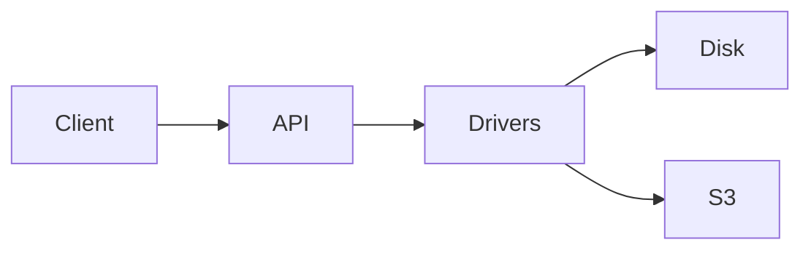

# filex — demo notes

**filex** is a self-hosted file manager built for the example.com stack. This
fixture exercises a broad markdown surface: headings, lists, code fences,
tables, links, blockquotes, and the optional mermaid + math extensions.

## Highlights

- Multi-driver storage (local, s3, ftp, sftp, webdav)
- Persistent queue (sqlite / redis / postgres)
- Live thumbnails (ffmpeg + gs + libreoffice + audio waveform + generic fallback)
- Replica + reconcile with path-glob rules
- Bleve full-text search
- OIDC / LDAP / local auth + per-user TOTP

## Code

```ts
import { mountFileExplorer } from '@brftech/filex-core';

const app = mountFileExplorer('#root', {
  api: {
    baseURL: '/api/files',
    credentials: 'include',
  },
  i18n: { locale: 'tr' },
  openPageBase: '/admin/files/edit',
});

window.addEventListener('beforeunload', () => app.unmount());
```

## Architecture quick-table

| Module    | Owner    | Status |
|-----------|----------|--------|
| Storage   | core     | stable |
| Search    | platform | stable |
| Replica   | infra    | beta   |
| Thumbs    | platform | stable |
| Onlyoffice| platform | beta   |

## Mermaid diagram



## Quote

> "filex is the answer to the question we never asked, but always needed."
> — anonymous operator

See <https://github.com/brf-tech/filex> for source.
